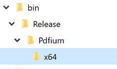

# PDF Rendering Engines in WPF Pdf Viewer

Syncfusion WPF PDF Viewer renders the PDF pages through 2 different rendering engines.

* PDFium (Google Chrome’s PDF rendering engine)
* SfPdf (Syncfusion’s Own PDF rendering engine)

## PDFium

PDFium is used in Google Chrome for rendering PDF files. It provides accurate and robust PDF rendering. It is the recommended PDF rendering engine. 

N> From v16.3.0.x onwards, this PDFium rendering engine is the default rendering engine of Syncfusion WPF PDF Viewer.

### How PDFium works with Syncfusion’s PDF Viewer

* On running your WPF application, Syncfusion PDF Viewer control generates a folder named `PDFium` in the application output path folder (for example: bin/release or bin/debug) at runtime. 
* Syncfusion PDF Viewer control detects the architecture of the running machine automatically.
* Next, it creates another subfolder named “x64” or “x86” based on the machine architecture.
* Extracts the PDFium binary (PDFium.dll) into the subfolder (x64 or x86) and consumes it to render PDF files.

N> PDFium rendering is not supported in Windows XP operating system.

### How to run PDFium in a restricted access environment

If there is any access restriction applied to the application output folder, then the Syncfusion PDF Viewer  control cannot able to extract and consume the PDFium engine as mentioned above.

In that situation, you need to add the following steps to consume the PDFium rendering engine.

* Create a folder where your application can access, create & read files. For example, <b>"d:\ThirdPartyBinaries\"</b>.
* Update the path of this folder to the [ReferencePath](https://help.syncfusion.com/cr/wpf/Syncfusion.Windows.PdfViewer.PdfViewerControl.html#Syncfusion_Windows_PdfViewer_PdfViewerControl_ReferencePath) property of PDF Viewer control, like shown in the following code sample.
* If [ReferencePath](https://help.syncfusion.com/cr/wpf/Syncfusion.Windows.PdfViewer.PdfViewerControl.html#Syncfusion_Windows_PdfViewer_PdfViewerControl_ReferencePath) is set, then PDF Viewer control extracts the PDFium binary inside that specified folder and consume the PDFium rendering engine.



using System.Windows;
namespace PdfViewerDemo
{
    /// 

    /// Interaction logic for Window1.xaml
    /// 

    public partial class MainWindow : Window
    {
        # region Constructor
        public MainWindow()
        {
            InitializeComponent();
            pdfViewer.ReferencePath = @"D:\ThirdPartyBinaries\";
            pdfViewer.Load("Sample.pdf");
        }
        #endregion
    }
}



N>In the run time, the PDF viewer will check the custom folder path provided in the [ReferencePath](https://help.syncfusion.com/cr/wpf/Syncfusion.Windows.PdfViewer.PdfViewerControl.html#Syncfusion_Windows_PdfViewer_PdfViewerControl_ReferencePath) property. If you already placed the Pdfium assemblies in the custom folder path, it will refer to the already available assemblies from the location. It won’t generate the assemblies in the folder again.
N>You need to place the PDFium assembly in the correct folder structure as mentioned below.
N>* ThirdPartyBinaries
N>	* Pdfium
N>		* x86
N>			* Pdfium.dll
N>		* x64
N>			* Pdfium.dll

## SfPdf

`SfPdf` is the Syncfusion’s own PDF rendering engine. Before v16.3.0.x, PDF Viewer control has used this rendering engine as default to rendering the PDF pages. If you wish to use `SfPdf` rendering engine or face any compatibility issues with `Pdfium` rendering engine in your environment, you may set the [RenderingEngine](https://help.syncfusion.com/cr/wpf/Syncfusion.Windows.PdfViewer.PdfViewerControl.html#Syncfusion_Windows_PdfViewer_PdfViewerControl_RenderingEngine) property to `SfPdf` as shown in the following code sample.

N> The recommended PDF rendering engine is PDFium.



using System.Windows;
using Syncfusion.Windows.PdfViewer;

namespace PdfViewerDemo
{
    /// 

    /// Interaction logic for Window1.xaml
    /// 

    public partial class MainWindow : Window
    {
        # region Constructor
        public MainWindow()
        {
            InitializeComponent();
            pdfViewer.RenderingEngine = PdfRenderingEngine.SfPdf;
            pdfViewer.Load("Sample.pdf");
        }
        #endregion
    }
}


