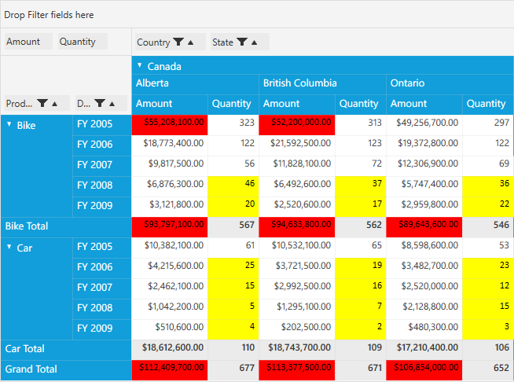

# Formatting using data conditions in WPF Pivot Grid

Conditional formatting is a process of applying customized styles to any object based on specified conditions.

It can be defined by using the `PivotGridControl.ConditionalFormats`, which is an observable collection of *PivotGridDataConditionalFormat* type. The criteria for filtering the cells are specified by using the `PivotGridDataConditionalFormat.Conditions` property, which is a collection of *PivotGridDataCondition* objects. The style for each *ConditionalFormat* can be specified by using the `PivotGridDataConditionalFormat.CellStyle` property, which should be the *PivotGridCellStyle* type. It can be defined in XAML or code-behind.

For **XAML**, refer to the following code snippet.



    <Grid>
        <syncfusion:PivotGridControl HorizontalAlignment="Left" Name="pivotGrid" VerticalAlignment="Top" VisualStyle="Metro" ItemSource="{Binding   Source={StaticResource data}}">

            <syncfusion:PivotGridControl.PivotRows>
                <syncfusion:PivotItem FieldHeader="Product" FieldMappingName="Product" TotalHeader="Total" />
                <syncfusion:PivotItem FieldHeader="Date" FieldMappingName="Date" TotalHeader="Total" />
            </syncfusion:PivotGridControl.PivotRows>
            <syncfusion:PivotGridControl.PivotColumns>
                <syncfusion:PivotItem FieldHeader="Country" FieldMappingName="Country" TotalHeader="Total" />
                <syncfusion:PivotItem FieldHeader="State" FieldMappingName="State" TotalHeader="Total" />
            </syncfusion:PivotGridControl.PivotColumns>
            <syncfusion:PivotGridControl.PivotCalculations>
                <syncfusion:PivotComputationInfo CalculationName="Total" FieldName="Amount" Format="C" SummaryType="DoubleTotalSum" />
                <syncfusion:PivotComputationInfo CalculationName="Total" FieldName="Quantity" SummaryType="Count" />
            </syncfusion:PivotGridControl.PivotCalculations>

            <syncfusion:PivotGridControl.ConditionalFormats>
                <!-- Adding Conditions. -->
                <syncfusion:PivotGridDataConditionalFormat Name="C1">
                    <!-- Specifying the Cell Style. -->
                    <syncfusion:PivotGridDataConditionalFormat.CellStyle>
                        <syncfusion:PivotGridCellStyle Background="Red" FontFamily="Calibri" FontSize="12" />
                    </syncfusion:PivotGridDataConditionalFormat.CellStyle>
                    <!-- Specifying Conditions. -->
                    <syncfusion:PivotGridDataConditionalFormat.Conditions>
                        <syncfusion:PivotGridDataCondition ConditionType="GreaterThan" Value="50000000" SummaryElement="Amount" PredicateType="And" />
                    </syncfusion:PivotGridDataConditionalFormat.Conditions>
                </syncfusion:PivotGridDataConditionalFormat>

                <syncfusion:PivotGridDataConditionalFormat Name="C2">
                    <!-- Specifying the Cell Style. -->
                    <syncfusion:PivotGridDataConditionalFormat.CellStyle>
                        <syncfusion:PivotGridCellStyle Background="Yellow" FontFamily="Calibri" FontSize="12" />
                    </syncfusion:PivotGridDataConditionalFormat.CellStyle>
                    <!-- Specifying Conditions. -->
                    <syncfusion:PivotGridDataConditionalFormat.Conditions>
                        <syncfusion:PivotGridDataCondition ConditionType="LessThan" Value="50" SummaryElement="Quantity" PredicateType="And" />
                    </syncfusion:PivotGridDataConditionalFormat.Conditions>
                </syncfusion:PivotGridDataConditionalFormat>
            </syncfusion:PivotGridControl.ConditionalFormats>

        </syncfusion:PivotGridControl>
    </Grid>



For code-behind, refer to the following code snippet.



public partial class MainWindow: Window {
    PivotGridControl pivotGrid = new PivotGridControl();
    public MainWindow() {
        InitializeComponent();
        grid1.Children.Add(pivotGrid);
        pivotGrid.ItemSource = ProductSales.GetSalesData();
        PivotItem m_PivotItem = new PivotItem() {
            FieldHeader = "Product", FieldMappingName = "Product", TotalHeader = "Total"
        };
        PivotItem m_PivotItem1 = new PivotItem() {
            FieldHeader = "Date", FieldMappingName = "Date", TotalHeader = "Total"
        };
        PivotItem n_PivotItem = new PivotItem() {
            FieldHeader = "Country", FieldMappingName = "Country", TotalHeader = "Total"
        };
        PivotItem n_PivotItem1 = new PivotItem() {
            FieldHeader = "State", FieldMappingName = "State", TotalHeader = "Total"
        };
        // Adding PivotItem to PivotRows
        pivotGrid.PivotRows.Add(m_PivotItem);
        pivotGrid.PivotRows.Add(m_PivotItem1);
        // Adding PivotItem to PivotColumns
        pivotGrid.PivotColumns.Add(n_PivotItem);
        pivotGrid.PivotColumns.Add(n_PivotItem1);
        PivotComputationInfo m_PivotComputationInfo = new PivotComputationInfo() {
            CalculationName = "Amount", FieldName = "Amount", Format = "C", SummaryType = Syncfusion.PivotAnalysis.Base.SummaryType.DoubleTotalSum
        };
        PivotComputationInfo m_PivotComputationInfo1 = new PivotComputationInfo() {
            CalculationName = "Quantity", FieldName = "Quantity", SummaryType = Syncfusion.PivotAnalysis.Base.SummaryType.Count
        };
        pivotGrid.PivotCalculations.Add(m_PivotComputationInfo);
        pivotGrid.PivotCalculations.Add(m_PivotComputationInfo1);

        PivotGridDataConditionalFormat m_PivotGridDataConditionalFormat = new PivotGridDataConditionalFormat();
        //Adding Conditions
        m_PivotGridDataConditionalFormat.Conditions.Add(new PivotGridDataCondition() {
            ConditionType = PivotGridDataConditionType.GreaterThan,
                SummaryElement = "Amount",
                Value = "50000000",
                PredicateType = PredicateType.And
        });
        // Specifying the Cell Style.
        m_PivotGridDataConditionalFormat.CellStyle = new PivotGridCellStyle() {
            Background = Brushes.Red, FontFamily = new FontFamily("Calibri"), FontSize = 12
        };
        PivotGridDataConditionalFormat n_PivotGridDataConditionalFormat = new PivotGridDataConditionalFormat();
        //Adding Conditions
        n_PivotGridDataConditionalFormat.Conditions.Add(new PivotGridDataCondition() {
            ConditionType = PivotGridDataConditionType.GreaterThan,
                SummaryElement = "Quantity",
                Value = "50",
                PredicateType = PredicateType.And
        });
        // Specifying the Cell Style.
        n_PivotGridDataConditionalFormat.CellStyle = new PivotGridCellStyle() {
            Background = Brushes.Yellow, FontFamily = new FontFamily("Calibri"), FontSize = 12
        };
        //Adding Conditional Formats to PivotGrid
        pivotGrid.ConditionalFormats.Add(m_PivotGridDataConditionalFormat);
        pivotGrid.ConditionalFormats.Add(n_PivotGridDataConditionalFormat);
    }
}



