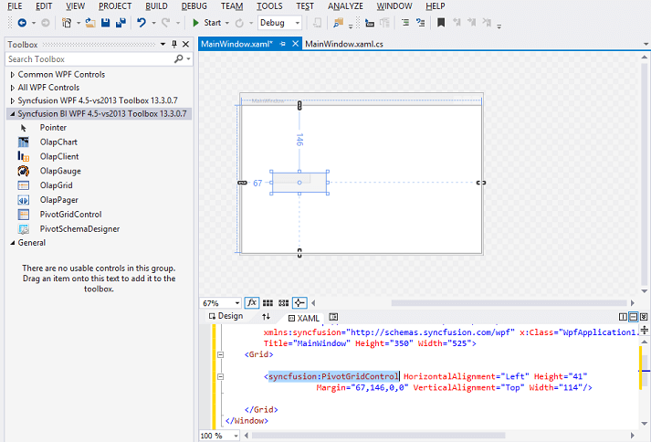
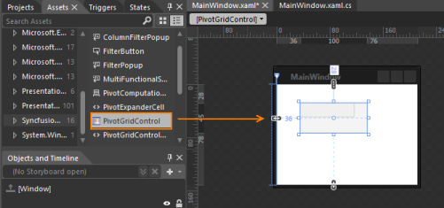
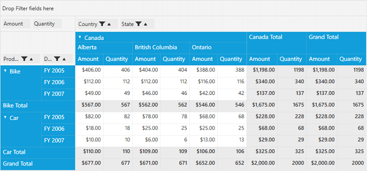

# Getting Started with WPF Pivot Grid

>**Important**
Starting with v16.2.0.x, if you refer to Syncfusion assemblies from trial setup or from the NuGet feed, include a license key in your projects. Refer to this [link](https://help.syncfusion.com/common/essential-studio/licensing/license-key) to learn about registering Syncfusion license key in your WPF application to use the components.

## Adding pivot grid through designer

Open Visual Studio IDE and navigate to File > New > Project > WPF Application (inside Visual C# Templates) to create a new WPF application.

After creating the WPF application, go to View menu and select Toolbox option. Now, the toolbox will appear inside the Visual Studio IDE. Drag the pivot grid control from **Syncfusion BI WPF** category in the toolbox to the designer page. The pivot grid control will be added along with the dependency assemblies automatically to the application.

## Adding pivot grid through XAML

Open Visual Studio IDE and navigate to File > New > Project > WPF Application (inside Visual C# Templates) to create a new WPF application.

Next, you should add the following dependency assemblies to your WPF application. To add them to your WPF application, right-click **References** in the Solution Explorer and select **Add Reference**. Now, in the **Reference Manager** dialog, under **Assemblies > Extension**, the following mentioned Syncfusion assemblies are found.

* Syncfusion.Grid.Wpf
* Syncfusion.GridCommon.Wpf
* Syncfusion.Linq.Base
* Syncfusion.PivotAnalysis.Base
* Syncfusion.PivotAnalysis.Wpf
* Syncfusion.Shared.Wpf

N> You can also get the assemblies by browsing to the default assembly location.
{System Drive}:\Program Files (x86)\Syncfusion\Essential Studio\\{version number}\precompiledassemblies\\{version number}

Then, define the pivot grid control in MainWindow.xaml as shown in the following code sample.



    <Window
        xmlns="http://schemas.microsoft.com/winfx/2006/xaml/presentation"
        xmlns:x="http://schemas.microsoft.com/winfx/2006/xaml"
        xmlns:syncfusion="http://schemas.syncfusion.com/wpf" x:Class="WpfApplication1.MainWindow"
        Title="MainWindow" Height="350" Width="525">
        <Grid>
            <syncfusion:PivotGridControl Name="pivotGrid" HorizontalAlignment="Left" Margin="5,0,0,0" VerticalAlignment="Top" Height="50" Width="100"/>
        </Grid>
    </Window>



## Adding pivot grid through code-behind

Open Visual Studio IDE and navigate to File > New > Project > WPF Application (inside Visual C# Templates) to create a new WPF application.

Add the following dependency assemblies to your WPF application. To add them to your WPF application, right-click **References** in the Solution Explorer and select **Add Reference**. Now, in the **Reference Manager** dialog, under **Assemblies > Extension**, the following mentioned Syncfusion assemblies are found.

* Syncfusion.Grid.Wpf
* Syncfusion.GridCommon.Wpf
* Syncfusion.Linq.Base
* Syncfusion.PivotAnalysis.Base
* Syncfusion.PivotAnalysis.Wpf
* Syncfusion.Shared.Wpf

N> You can also get the assemblies by browsing to the default assembly location
{System Drive}:\Program Files (x86)\Syncfusion\Essential Studio\\{version number}\precompiledassemblies\\{version number}

Then, add a grid container in MainWindow.xaml file to hold the pivot grid control created and added from code-behind.



    <Window
        xmlns="http://schemas.microsoft.com/winfx/2006/xaml/presentation"
        xmlns:x="http://schemas.microsoft.com/winfx/2006/xaml"
        xmlns:syncfusion="http://schemas.syncfusion.com/wpf" x:Class="WpfApplication1.MainWindow"
        Title="MainWindow" Height="350" Width="525">
        <Grid Name="grid1">
        </Grid>
    </Window>



Include the *Syncfusion.Windows.Controls.PivotGrid* namespace in the MainWindow.xaml.cs file to create a pivot grid control in code-behind.



    using System.Windows.Media.Imaging;
    using System.Windows.Navigation;
    using System.Windows.Shapes;
    using Syncfusion.Windows.Controls.PivotGrid;



Raise the **Loaded** event of the MainWindow and within that event, create a new instance of the PivotGridControl class. This instance should be added as a child of the grid present inside the MainWindow.



public MainWindow() {
    InitializeComponent();
    this.Loaded += MainWindow_Loaded;
}
void MainWindow_Loaded(object sender, RoutedEventArgs e) {
    PivotGridControl pivotGrid = new PivotGridControl();
    this.grid1.Children.Add(pivotGrid);
}



## Adding pivot grid through expression blend

Open Blend for Visual Studio and navigate to File > New Project > WPF > WPF Application to create a new WPF application.

Select the **Projects** tab available in the top-left corner of the Blend IDE, right-click the **References**, and select **Add Reference**. Now, browse and add the following assemblies to the project.

* Syncfusion.Grid.Wpf
* Syncfusion.GridCommon.Wpf
* Syncfusion.Linq.Base
* Syncfusion.PivotAnalysis.Base
* Syncfusion.PivotAnalysis.Wpf
* Syncfusion.Shared.Wpf

N> You can also get the assemblies by browsing to the default assembly location
{System Drive}:\Program Files (x86)\Syncfusion\Essential Studio\\{version number}\precompiledassemblies\\{version number}

After adding the above assemblies, the pivot grid control will be automatically added under **Assets** tab.
Now, choose the **Assets** tab and drag the pivot grid control from the toolbox to designer section.

## Binding a data source to pivot grid control

Right-click the project in the solution explorer and select **Add > New item**. In the **Add New Item** window, choose **Class** option and provide the name of the class as *ProductSales.cs* and click **OK**.

The ItemSource for the pivot grid control will be initialized in this file. Refer to the following code snippet.



public class ProductSales {
    public string Product {
        get;
        set;
    }
    public string Date {
        get;
        set;
    }
    public string Country {
        get;
        set;
    }
    public string State {
        get;
        set;
    }
    public int Quantity {
        get;
        set;
    }
    public double Amount {
        get;
        set;
    }
    public static ProductSalesCollection GetSalesData() {
        /// Geography
        string[] countries = new string[] {
            "Canada"
        };
        string[] canadaStates = new string[] {
            "Alberta",
            "British Columbia",
            "Ontario"
        };
        /// Time
        string[] dates = new string[] {
            "FY 2005",
            "FY 2006",
            "FY 2007"
        };
        /// Products
        string[] products = new string[] {
            "Bike",
            "Car"
        };
        Random r = new Random(123345345);
        int numberOfRecords = 2000;
        ProductSalesCollection listOfProductSales = new ProductSalesCollection();
        for (int i = 0; i < numberOfRecords; i++) {
            ProductSales sales = new ProductSales();
            sales.Country = countries[r.Next(0, countries.GetLength(0))];
            sales.Quantity = r.Next(1, 12);
            /// 1 percent discount for 1 quantity
            double discount = (30000*sales.Quantity)*(double.Parse(sales.Quantity.ToString()) / 100);
            sales.Amount = (30000 * sales.Quantity) - discount;
            sales.Date = dates[r.Next(r.Next(dates.GetLength(0) + 1))];
            sales.Product = products[r.Next(r.Next(products.GetLength(0) + 1))];
            sales.State = canadaStates[r.Next(canadaStates.GetLength(0))];
            listOfProductSales.Add(sales);
        }
        return listOfProductSales;
    }
    public override string ToString() {
        return string.Format("{0}-{1}-{2}", this.Country, this.State, this.Product);
    }
    public class ProductSalesCollection: List < ProductSales > {

    }
}



Above mentioned GetSalesData method is used to get the collection that needs to be populated in the pivot grid control. Now, bind the collection to the pivot grid control as its ItemSource. It can be done through XAML or code-behind.

To initialize the ItemSource through **XAML**, ObjectDataProvider is used. Refer to the following code.



    <Window xmlns="http://schemas.microsoft.com/winfx/2006/xaml/presentation" xmlns:x="http://schemas.microsoft.com/winfx/2006/xaml" xmlns:syncfusion="http://schemas.syncfusion.com/wpf" x:Class="WpfApplication1.MainWindow" Title="MainWindow" Height="350" Width="525" xmlns:local="clr-namespace:WpfApplication1">
        <Window.Resources>
            <ResourceDictionary>
                <ObjectDataProvider x:Key="data" ObjectType="{x:Type local:ProductSales}" MethodName="GetSalesData" />
            </ResourceDictionary>
        </Window.Resources>
        <Grid>
            <syncfusion:PivotGridControl Name="pivotGrid" HorizontalAlignment="Left" VerticalAlignment="Top" ItemSource="{Binding Source={StaticResource data}}" VisualStyle="Metro">
            </syncfusion:PivotGridControl>
        </Grid>
    </Window>



 To initialize the Itemsource through code-behind, refer to the following code snippet.



public MainWindow() {
    InitializeComponent();
    this.Loaded += MainWindow_Loaded;
}
void MainWindow_Loaded(object sender, RoutedEventArgs e) {
    PivotGridControl pivotGrid = new PivotGridControl();
    this.grid1.Children.Add(pivotGrid);
    pivotGrid.ItemSource = ProductSales.GetSalesData();
}



### Defining the PivotItems and PivotComputations

 **PivotItem** is a container for items in the pivot grid control, and an item can be either a **PivotRow** or **PivotColumn**. Refer to the topic *1.3.1 Pivot Item* for more details. **PivotComputationInfo** holds the value fields for the pivot grid control, and it does have different types of custom calculations. You can summarize the values depends on your requirement and refer to the topic *1.3.2 PivotComputationInfo* for more details. PivotItems and PivotComputations can be defined through XAML and code-behind.

To define the PivotItems and PivotComputations through XAML, refer to the following code snippet.



    <Grid>
        <syncfusion:PivotGridControl Name="pivotGrid" HorizontalAlignment="Left" VerticalAlignment="Top" ItemSource="{Binding Source={StaticResource data}}" VisualStyle="Metro">
            <syncfusion:PivotGridControl.PivotRows>
                <syncfusion:PivotItem FieldHeader="Product" FieldMappingName="Product" TotalHeader="Total" />
                <syncfusion:PivotItem FieldHeader="Date" FieldMappingName="Date" TotalHeader="Total" />
            </syncfusion:PivotGridControl.PivotRows>
            <syncfusion:PivotGridControl.PivotColumns>
                <syncfusion:PivotItem FieldHeader="Country" FieldMappingName="Country" TotalHeader="Total" />
                <syncfusion:PivotItem FieldHeader="State" FieldMappingName="State" TotalHeader="Total" />
            </syncfusion:PivotGridControl.PivotColumns>
            <syncfusion:PivotGridControl.PivotCalculations>
                <syncfusion:PivotComputationInfo CalculationName="Total" FieldName="Amount" Format="C" />
                <syncfusion:PivotComputationInfo CalculationName="Total" FieldName="Quantity" SummaryType="Count" />
            </syncfusion:PivotGridControl.PivotCalculations>
        </syncfusion:PivotGridControl>
    </Grid>



To define through code-behind, include the *Syncfusion.PivotAnalysis.Base*  namespace in MainWindow.xaml.cs. Refer to the following code snippet.



    using System.Windows.Media.Imaging;
    using System.Windows.Navigation;
    using System.Windows.Shapes;
    using Syncfusion.Windows.Controls.PivotGrid;
    using Syncfusion.PivotAnalysis.Base;





public MainWindow() {
    InitializeComponent();
    this.Loaded += MainWindow_Loaded;
}
void MainWindow_Loaded(object sender, RoutedEventArgs e) {
    PivotGridControl pivotGrid = new PivotGridControl();
    grid1.Children.Add(pivotGrid);
    PivotItem m_PivotItem = new PivotItem() {
        FieldHeader = "Product", FieldMappingName = "Product", TotalHeader = "Total"
    };
    PivotItem m_PivotItem1 = new PivotItem() {
        FieldHeader = "Date", FieldMappingName = "Date", TotalHeader = "Total"
    };
    PivotItem n_PivotItem = new PivotItem() {
        FieldHeader = "Country", FieldMappingName = "Country", TotalHeader = "Total"
    };
    PivotItem n_PivotItem1 = new PivotItem() {
        FieldHeader = "State", FieldMappingName = "State", TotalHeader = "Total"
    };
    // Adding PivotItem to PivotRows
    pivotGrid.PivotRows.Add(m_PivotItem);
    pivotGrid.PivotRows.Add(m_PivotItem1);
    // Adding PivotItem to PivotColumns
    pivotGrid.PivotColumns.Add(n_PivotItem);
    pivotGrid.PivotColumns.Add(n_PivotItem1);
    PivotComputationInfo m_PivotComputationInfo = new PivotComputationInfo() {
        CalculationName = "Amount", FieldName = "Amount", SummaryType = SummaryType.Count
    };
    PivotComputationInfo m_PivotComputationInfo1 = new PivotComputationInfo() {
        CalculationName = "Quantity", FieldName = "Quantity", SummaryType = SummaryType.Count
    };
    pivotGrid.PivotCalculations.Add(m_PivotComputationInfo);
    pivotGrid.PivotCalculations.Add(m_PivotComputationInfo1);
    pivotGrid.ItemSource = ProductSales.GetSalesData();
}



**Run** the application, the following output will be generated.

