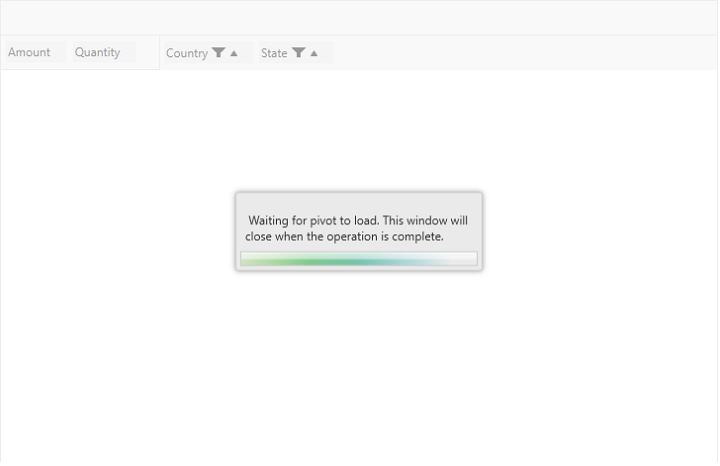
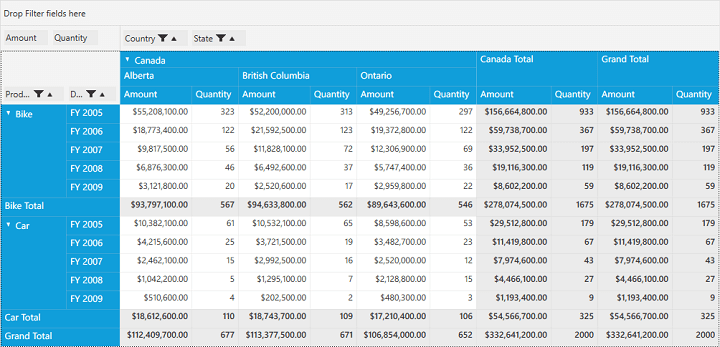

# Asynchronous Data Loading

The PivotGrid control provides support for loading data in a unique UI thread. That is, the PivotGrid control can perform long running operations asynchronously on a background thread.It also loads asynchronously for every layout change operation, such as filtering, sorting, drag and drop, manipulating the field list, or changing the Pivot Schema Designer. This can be achieved by setting the **LoadInBackground** property of PivotGrid control.

Property

* **LoadInBackground** - This property enables the PivotGrid control to perform loading operations asynchronously on a background thread.

##Defining the property in PivotGrid

The property **LoadInBackground** can be defined either in the *XAML* or in *Code-Behind*.

If through **XAML**, please refer the below code snippet.



<Grid>
    <syncfusion:PivotGridControl HorizontalAlignment="Left" Name="pivotGrid" VerticalAlignment="Top" VisualStyle="Metro" LoadInBackground="True" ItemSource="{Binding   Source={StaticResource data}}">

        <syncfusion:PivotGridControl.PivotRows>
            <syncfusion:PivotItem FieldHeader="Product" FieldMappingName="Product" TotalHeader="Total" />
            <syncfusion:PivotItem FieldHeader="Date" FieldMappingName="Date" TotalHeader="Total" />
        </syncfusion:PivotGridControl.PivotRows>
        <syncfusion:PivotGridControl.PivotColumns>
            <syncfusion:PivotItem FieldHeader="Country" FieldMappingName="Country" TotalHeader="Total" />
            <syncfusion:PivotItem FieldHeader="State" FieldMappingName="State" TotalHeader="Total" />
        </syncfusion:PivotGridControl.PivotColumns>
        <syncfusion:PivotGridControl.PivotCalculations>
            <syncfusion:PivotComputationInfo CalculationName="Total" FieldName="Amount" Format="C" SummaryType="DoubleTotalSum" />
            <syncfusion:PivotComputationInfo CalculationName="Total" FieldName="Quantity" SummaryType="Count" />
        </syncfusion:PivotGridControl.PivotCalculations>
    </syncfusion:PivotGridControl>
</Grid>



Else if through **Code-Behind**, please refer the below code snippet.



public partial class MainWindow: Window {
    PivotGridControl pivotGrid = new PivotGridControl();
    public MainWindow() {
        InitializeComponent();
        grid1.Children.Add(pivotGrid);
        pivotGrid.ItemSource = ProductSales.GetSalesData();
        PivotItem m_PivotItem = new PivotItem() {
            FieldHeader = "Product", FieldMappingName = "Product", TotalHeader = "Total"
        };
        PivotItem m_PivotItem1 = new PivotItem() {
            FieldHeader = "Date", FieldMappingName = "Date", TotalHeader = "Total"
        };
        PivotItem n_PivotItem = new PivotItem() {
            FieldHeader = "Country", FieldMappingName = "Country", TotalHeader = "Total"
        };
        PivotItem n_PivotItem1 = new PivotItem() {
            FieldHeader = "State", FieldMappingName = "State", TotalHeader = "Total"
        };
        // Adding PivotItem to PivotRows
        pivotGrid.PivotRows.Add(m_PivotItem);
        pivotGrid.PivotRows.Add(m_PivotItem1);
        // Adding PivotItem to PivotColumns
        pivotGrid.PivotColumns.Add(n_PivotItem);
        pivotGrid.PivotColumns.Add(n_PivotItem1);
        PivotComputationInfo m_PivotComputationInfo = new PivotComputationInfo() {
            CalculationName = "Amount", FieldName = "Amount", Format = "C", SummaryType = SummaryType.DoubleTotalSum
        };
        PivotComputationInfo m_PivotComputationInfo1 = new PivotComputationInfo() {
            CalculationName = "Quantity", FieldName = "Quantity", SummaryType = SummaryType.Count
        };
        pivotGrid.PivotCalculations.Add(m_PivotComputationInfo);
        pivotGrid.PivotCalculations.Add(m_PivotComputationInfo1);

        pivotGrid.LoadInBackground = true;
    }
}
	


_UI thread loading_

_Asynchronously loaded data_
