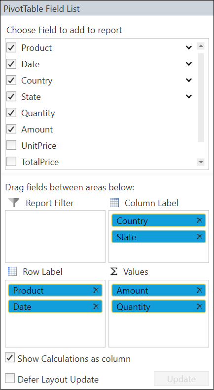

# Binding PivotSchemaDesigner to PivotGrid

PivotSchemaDesigner can be bound to the PivotGrid with the help of the `PivotControl` property. After creating a PivotGrid, a new PivotSchemaDesigner is created using the `PivotSchemaDesigner` class and bound to the PivotGrid control using `PivotControl` property of PivotSchemaDesigner. This can be achieved either in *XAML* or in *Code-behind*.

For *XAML*, refer to the following code sample.



      <Grid>
        <Grid.ColumnDefinitions>
            <ColumnDefinition Width="*"/>
            <ColumnDefinition Width=".35*"/>
        </Grid.ColumnDefinitions>
        <syncfusion:PivotGridControl HorizontalAlignment="Left" Name="pivotGrid" VerticalAlignment="Top" VisualStyle="Metro"
             EnableValueEditing="True" ItemSource="{Binding   Source={StaticResource data}}" >

            <syncfusion:PivotGridControl.PivotRows>
                <syncfusion:PivotItem FieldHeader="Product" FieldMappingName="Product" TotalHeader="Total" />
                <syncfusion:PivotItem FieldHeader="Date" FieldMappingName="Date" TotalHeader="Total"/>
            </syncfusion:PivotGridControl.PivotRows>
            <syncfusion:PivotGridControl.PivotColumns>
                <syncfusion:PivotItem FieldHeader="Country" FieldMappingName="Country" TotalHeader="Total" />
                <syncfusion:PivotItem FieldHeader="State" FieldMappingName="State" TotalHeader="Total"/>
            </syncfusion:PivotGridControl.PivotColumns>
            <syncfusion:PivotGridControl.PivotCalculations>
                <syncfusion:PivotComputationInfo CalculationName = "Total" FieldName = "Amount" Format="C" SummaryType="DoubleTotalSum" />
                <syncfusion:PivotComputationInfo CalculationName = "Total" FieldName = "Quantity" SummaryType="Count" />
            </syncfusion:PivotGridControl.PivotCalculations>

        </syncfusion:PivotGridControl>

        <syncfusion:PivotSchemaDesigner Grid.Column="1" Name="shemaDesginer" VisualStyle="Metro" PivotControl="{Binding ElementName=pivotGrid}"></syncfusion:PivotSchemaDesigner>
    </Grid>


For *Code-behind*, refer to the following code sample.



    public partial class MainWindow : Window
    {
        PivotGridControl pivotGrid = new PivotGridControl();
        PivotSchemaDesigner schemaDesigner = new PivotSchemaDesigner();
        public MainWindow()
        {
            InitializeComponent();
            grid1.Children.Add(pivotGrid);
            pivotGrid.ItemSource = ProductSales.GetSalesData();
            PivotItem m_PivotItem = new PivotItem() { FieldHeader = "Product", FieldMappingName = "Product", TotalHeader = "Total" };
            PivotItem m_PivotItem1 = new PivotItem() { FieldHeader = "Date", FieldMappingName = "Date", TotalHeader = "Total" };
            PivotItem n_PivotItem = new PivotItem() { FieldHeader = "Country", FieldMappingName = "Country", TotalHeader = "Total" };
            PivotItem n_PivotItem1 = new PivotItem() { FieldHeader = "State", FieldMappingName = "State", TotalHeader = "Total" };
            // Adding PivotItem to PivotRows
            pivotGrid.PivotRows.Add(m_PivotItem);
            pivotGrid.PivotRows.Add(m_PivotItem1);
            // Adding PivotItem to PivotColumns
            pivotGrid.PivotColumns.Add(n_PivotItem);
            pivotGrid.PivotColumns.Add(n_PivotItem1);
            PivotComputationInfo m_PivotComputationInfo = new PivotComputationInfo() { CalculationName = "Amount", FieldName = "Amount", Format = "C", SummaryType = Syncfusion.PivotAnalysis.Base.SummaryType.DoubleTotalSum };
            PivotComputationInfo m_PivotComputationInfo1 = new PivotComputationInfo() { CalculationName = "Quantity", FieldName = "Quantity", SummaryType = Syncfusion.PivotAnalysis.Base.SummaryType.Count };
            pivotGrid.PivotCalculations.Add(m_PivotComputationInfo);
            pivotGrid.PivotCalculations.Add(m_PivotComputationInfo1);

            schemaDesigner.PivotControl = pivotGrid;
            grid1.Children.Add(schemaDesigner);
            Grid.SetColumn(schemaDesigner, 1);
        }
     }



