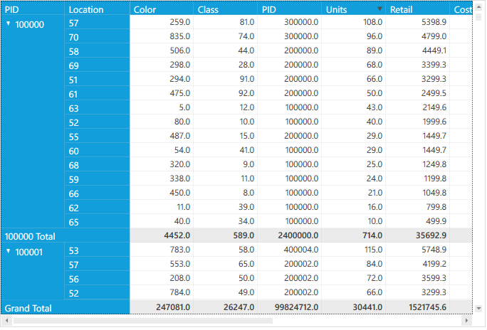

# Column Sorting

PivotGrid control provides the sorting option for the calculation columns in PivotGrid in RowPivotsOnly mode. This can be enabled or disabled using **AllowSort** property of **PivotComputationInfo** in PivotGrid control. 

                                                        Property Table

<table>
<tr>
<th>
Property </th><th>
Description </th><th>
Type </th><th>
Value It Accepts</th><th>
Reference Link</th></tr>
<tr>
<td>
AllowSort</td><td>
This property is used to enable or disable the sorting option for column pivots.</td><td>
bool</td><td>
True, False(Default)</td><td>
-</td></tr>
<tr>
</table>

                                                          Methods Table

<table>
<tr>
<th>
Method</th><th>
Description</th><th>
Parameters</th><th>
Return Type</th></tr>
<tr>
<td>
ApplySavedValueSorts</td><td>
When RowPivotsOnly is true, this method sorts the pivot based on the information furnished through the arguments.</td><td>
(List<(string)> sortedColumns, List<(ListSortDirection)> listSortDirections)</td><td>
void</td></tr>
</table>

## Defining the property in PivotGrid

After defining the PivotGrid control with PivotRows and PivotCalculations, set the **SortOption** property of PivotGrid control to **All** in order to sort all the value columns. Then, set the property **AllowSort** to true for the appropriate calculation items as per your requirement.

The property **AllowSort** can be mentioned either in the *XAML* or in *Code-Behind*. 

If through **XAML**, please refer the below code snippet.



<Grid>
    <syncfusion:PivotGridControl Name="pivotGrid" SortOption="True" RowPivotsOnly="True">

        <syncfusion:PivotGridControl.PivotRows>
            <syncfusion:PivotItem AllowFilter="False" FieldHeader="PID" FieldMappingName="PID" TotalHeader="Total" />
            <syncfusion:PivotItem AllowFilter="False" FieldHeader="Location" FieldMappingName="Location" TotalHeader="Total" />
        </syncfusion:PivotGridControl.PivotRows>
        <syncfusion:PivotGridControl.PivotCalculations>
            <syncfusion:PivotComputationInfo FieldHeader="Color" FieldName="Color" Format="0.0" SummaryType="DoubleTotalSum" AllowSort="True" />
            <syncfusion:PivotComputationInfo FieldHeader="Class" FieldName="Class" Format="0.0" SummaryType="DoubleTotalSum" AllowSort="True" />
            <syncfusion:PivotComputationInfo FieldHeader="PID" FieldName="PID" Format="0.0" SummaryType="DoubleTotalSum" AllowSort="True" />
            <syncfusion:PivotComputationInfo FieldHeader="Units" FieldName="Units" Format="0.0" SummaryType="DoubleTotalSum" AllowSort="True" />
            <syncfusion:PivotComputationInfo FieldHeader="Retail" FieldName="Retail" Format="0.0" SummaryType="DoubleTotalSum" AllowSort="True" />
            <syncfusion:PivotComputationInfo FieldHeader="Cost" FieldName="Cost" Format="0.0" SummaryType="DoubleTotalSum" AllowSort="True" />
            <syncfusion:PivotComputationInfo FieldHeader="TestStr" FieldName="TestStr" Format="0.0" PadString="***" SummaryType="DisplayIfDiscreteValuesEqual" AllowSort="True" />
            <syncfusion:PivotComputationInfo FieldHeader="TestInt" FieldName="TestInt" Format="0.0" PadString="***" SummaryType="DisplayIfDiscreteValuesEqual" AllowSort="True" />
            <syncfusion:PivotComputationInfo FieldHeader="TestDouble" FieldName="TestDouble" Format="0.00" PadString="***" SummaryType="DisplayIfDiscreteValuesEqual" AllowSort="True" />
        </syncfusion:PivotGridControl.PivotCalculations>

    </syncfusion:PivotGridControl>
</Grid>

	

Else if through **Code-behind**, please refer the below code snippet.



public partial class MainWindow: Window {
    public MainWindow() {
        InitializeComponent();
        pivotGrid.Loaded += pivotGrid_Loaded;

    }

    void pivotGrid_Loaded(object sender, RoutedEventArgs e) {
        // Define some pivot calculations
        // Setting the AllowSort value to true for all the calculations in PivotGrid
        for (int i = 0; i < pivotGrid.PivotCalculations.Count; i++)
            pivotGrid.PivotCalculations[i].AllowSort = true;
    }
}    

	

## Defining the Method in PivotGrid

After defining the PivotGrid control with PivotRows and PivotCalculations, set the **SortOption** property of PivotGrid control to **All** in order to sort all the value columns. Then, set the property **AllowSort** to true for the appropriate calculation items as per your requirement.

Create the list of column to be sorted along with its corresponding sorting direction and invoke the **ApplySavedValueSort()** method for applying sorting to those list of columns.

Please refer the below code snippet.



public partial class MainWindow: Window {
    public MainWindow() {
        InitializeComponent();
        pivotGrid.Loaded += pivotGrid_Loaded;
    }

    void pivotGrid1_Loaded(object sender, RoutedEventArgs e) {
        pivotGrid.PivotCalculations.Add(new PivotComputationInfo() {
            FieldName = "Cost", FieldHeader = "Cost", AllowFilter = true
        });
        List < string > sortedColumns = new List < string > () {
            "Cost",
            "Units"
        };
        List < System.ComponentModel.ListSortDirection > listSortDirections = new List < System.ComponentModel.ListSortDirection > () {
            System.ComponentModel.ListSortDirection.Descending, System.ComponentModel.ListSortDirection.Ascending
        };
        pivotGrid.InternalGrid.ApplySavedValueSorts(sortedColumns, listSortDirections);
    }
}    



## Multi-Column Sorting

Multi column sorting behavior has been created which allows you to sort the value columns by one field after another field. Please refer the *Multi-Column Sorting in RowPivotsOnly mode of PivotGrid control* topic for further references.
