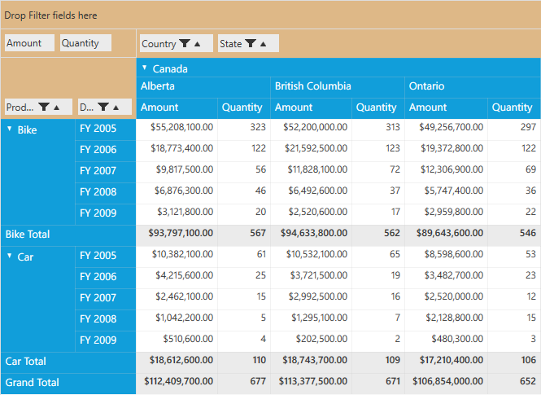
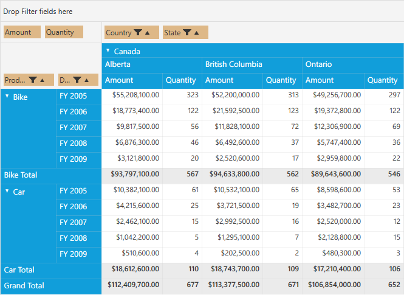
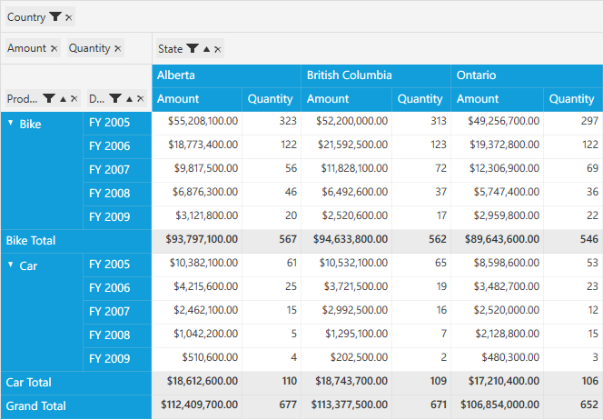

# Defining Grouping Bar properties for PivotGrid

Grouping bar also allows to perform sorting,filtering and summarize the data as they want at run time. Each Grouping Bar item contains:

* A **caption** string which identifies the field's content
* A **filter button** which end-users can use to filter field values
* A **sort indicator** which identifies the sort order applied to the field's values 
* A **remove button** which used for removing the corresponding item.

We cannot able to perform Sorting and Filtering for PivotCalculation items. Similarly, we cannot able to perform Sorting for Filter items.

Please refer the below which illustrates certain properties available in Grouping Bar.

**Properties**

* **Background** - Gets or sets the background color of Grouping Bar.
* **ItemsBackground** - Gets or sets the background color of Grouping Bar items.
* **AllowFiltering** - Gets or sets whether the filtering is enabled or not for Grouping Bar.
* **AllowSorting** - Gets or sets whether the sorting of Grouping Bar is enabled.
* **AllowRemove** - Gets or sets whether deleting the items are enabled in Grouping Bar
* **AllowMultiFunctionalSortFilter** - Gets or sets whether excel like filtering on Grouping Bar is enabled.

**Using the properties in PivotGrid:**

**Background**

We can customize the background color of the Grouping Bar by defining the color for its **Background** after Grouping Bar loaded. After defining the PivotGrid control, raise the Loaded event for PivotGrid. Inside the PivotGrid_Loaded() event, raise the Loaded event for Grouping Bar.

Include the *System.Windows.Media* namespace in MainWindow.xaml.cs and inside the GroupingBar_Loaded() event modify the **Background** color of the Grouping Bar.
   
Please refer the below code snippet.



public partial class MainWindow: Window {
    PivotGridControl pivotGrid = new PivotGridControl();
    public MainWindow() {
        InitializeComponent();
        grid1.Children.Add(pivotGrid);
        pivotGrid.ItemSource = ProductSales.GetSalesData();
        PivotItem m_PivotItem = new PivotItem() {
            FieldHeader = "Product", FieldMappingName = "Product", TotalHeader = "Total"
        };
        PivotItem m_PivotItem1 = new PivotItem() {
            FieldHeader = "Date", FieldMappingName = "Date", TotalHeader = "Total"
        };
        PivotItem n_PivotItem = new PivotItem() {
            FieldHeader = "Country", FieldMappingName = "Country", TotalHeader = "Total"
        };
        PivotItem n_PivotItem1 = new PivotItem() {
            FieldHeader = "State", FieldMappingName = "State", TotalHeader = "Total"
        };
        // Adding PivotItem to PivotRows
        pivotGrid.PivotRows.Add(m_PivotItem);
        pivotGrid.PivotRows.Add(m_PivotItem1);
        // Adding PivotItem to PivotColumns
        pivotGrid.PivotColumns.Add(n_PivotItem);
        pivotGrid.PivotColumns.Add(n_PivotItem1);
        PivotComputationInfo m_PivotComputationInfo = new PivotComputationInfo() {
            CalculationName = "Amount", FieldName = "Amount", Format = "C", SummaryType = SummaryType.DoubleTotalSum
        };
        PivotComputationInfo m_PivotComputationInfo1 = new PivotComputationInfo() {
            CalculationName = "Quanity", FieldName = "Quanity", SummaryType = SummaryType.Count
        };
        pivotGrid.PivotCalculations.Add(m_PivotComputationInfo);
        pivotGrid.PivotCalculations.Add(m_PivotComputationInfo1);
        pivotGrid.Loaded += pivotGrid_Loaded;
    }

    void pivotGrid_Loaded(object sender, RoutedEventArgs e) {
        pivotGrid.GroupingBar.Loaded += GroupingBar_Loaded;
    }

    void GroupingBar_Loaded(object sender, RoutedEventArgs e) {
        pivotGrid.GroupingBar.Background = Brushes.BurlyWood;
    }
}



**ItemsBackground**

We can customize the background color of the Grouping Bar Items by defining the color for **ItemsBackground** after Grouping Bar loaded. After defining the PivotGrid control, raise the Loaded event for PivotGrid. Inside the PivotGrid_Loaded() event, raise the Loaded event for Grouping Bar.

Include the *System.Windows.Media* namespace in MainWindow.xaml.cs and inside the GroupingBar_Loaded() event modify the **ItemsBackground** color of the Grouping Bar.
   
Please refer the below code snippet.



public partial class MainWindow: Window {
    PivotGridControl pivotGrid = new PivotGridControl();
    public MainWindow() {
        InitializeComponent();
        grid1.Children.Add(pivotGrid);
        pivotGrid.ItemSource = ProductSales.GetSalesData();
        PivotItem m_PivotItem = new PivotItem() {
            FieldHeader = "Product", FieldMappingName = "Product", TotalHeader = "Total"
        };
        PivotItem m_PivotItem1 = new PivotItem() {
            FieldHeader = "Date", FieldMappingName = "Date", TotalHeader = "Total"
        };
        PivotItem n_PivotItem = new PivotItem() {
            FieldHeader = "Country", FieldMappingName = "Country", TotalHeader = "Total"
        };
        PivotItem n_PivotItem1 = new PivotItem() {
            FieldHeader = "State", FieldMappingName = "State", TotalHeader = "Total"
        };
        // Adding PivotItem to PivotRows
        pivotGrid.PivotRows.Add(m_PivotItem);
        pivotGrid.PivotRows.Add(m_PivotItem1);
        // Adding PivotItem to PivotColumns
        pivotGrid.PivotColumns.Add(n_PivotItem);
        pivotGrid.PivotColumns.Add(n_PivotItem1);
        PivotComputationInfo m_PivotComputationInfo = new PivotComputationInfo() {
            CalculationName = "Amount", FieldName = "Amount", Format = "C", SummaryType = SummaryType.DoubleTotalSum
        };
        PivotComputationInfo m_PivotComputationInfo1 = new PivotComputationInfo() {
            CalculationName = "Quanity", FieldName = "Quanity", SummaryType = SummaryType.Count
        };
        pivotGrid.PivotCalculations.Add(m_PivotComputationInfo);
        pivotGrid.PivotCalculations.Add(m_PivotComputationInfo1);
        pivotGrid.Loaded += pivotGrid_Loaded;
    }

    void pivotGrid_Loaded(object sender, RoutedEventArgs e) {
        pivotGrid.GroupingBar.Loaded += GroupingBar_Loaded;
    }

    void GroupingBar_Loaded(object sender, RoutedEventArgs e) {
        pivotGrid.GroupingBar.ItemsBackground = Brushes.BurlyWood;
    }
}



**AllowFiltering**

We can able to show or hide the Filtering in PivotGrid by setting **AllowFiltering** property of Grouping Bar in PivotGrid control.After defining the PivotGrid control, raise the Loaded event for PivotGrid. Inside the PivotGrid_Loaded() event, raise the Loaded event for Grouping Bar.

Inside the GroupingBar_Loaded() event set the value for **AllowFiltering** property of the Grouping Bar.

Please refer the below code snippet.



public partial class MainWindow: Window {
    PivotGridControl pivotGrid = new PivotGridControl();
    public MainWindow() {
        InitializeComponent();
        grid1.Children.Add(pivotGrid);
        pivotGrid.ItemSource = ProductSales.GetSalesData();
        PivotItem m_PivotItem = new PivotItem() {
            FieldHeader = "Product", FieldMappingName = "Product", TotalHeader = "Total"
        };
        PivotItem m_PivotItem1 = new PivotItem() {
            FieldHeader = "Date", FieldMappingName = "Date", TotalHeader = "Total"
        };
        PivotItem n_PivotItem = new PivotItem() {
            FieldHeader = "Country", FieldMappingName = "Country", TotalHeader = "Total"
        };
        PivotItem n_PivotItem1 = new PivotItem() {
            FieldHeader = "State", FieldMappingName = "State", TotalHeader = "Total"
        };
        // Adding PivotItem to PivotRows
        pivotGrid.PivotRows.Add(m_PivotItem);
        pivotGrid.PivotRows.Add(m_PivotItem1);
        // Adding PivotItem to PivotColumns
        pivotGrid.PivotColumns.Add(n_PivotItem);
        pivotGrid.PivotColumns.Add(n_PivotItem1);
        PivotComputationInfo m_PivotComputationInfo = new PivotComputationInfo() {
            CalculationName = "Amount", FieldName = "Amount", Format = "C", SummaryType = SummaryType.DoubleTotalSum
        };
        PivotComputationInfo m_PivotComputationInfo1 = new PivotComputationInfo() {
            CalculationName = "Quanity", FieldName = "Quanity", SummaryType = SummaryType.Count
        };
        pivotGrid.PivotCalculations.Add(m_PivotComputationInfo);
        pivotGrid.PivotCalculations.Add(m_PivotComputationInfo1);
        pivotGrid.Loaded += pivotGrid_Loaded;
    }

    void pivotGrid_Loaded(object sender, RoutedEventArgs e) {
        pivotGrid.GroupingBar.Loaded += GroupingBar_Loaded;
    }

    void GroupingBar_Loaded(object sender, RoutedEventArgs e) {
        pivotGrid.GroupingBar.AllowFiltering = false;
    }
}



The following screen shots shows the PivotGrid without the filtering icons.

**AllowSorting**

We can able to show or hide the Sorting indicator in PivotGrid by setting **AllowSorting** property of Grouping Bar in PivotGrid control.After defining the PivotGrid control, raise the Loaded event for PivotGrid. Inside the PivotGrid_Loaded() event, raise the Loaded event for Grouping Bar.

Inside the GroupingBar_Loaded() event set the value for **AllowSorting** property of the Grouping Bar.

Please refer the below code snippet.



public partial class MainWindow: Window {
    PivotGridControl pivotGrid = new PivotGridControl();
    public MainWindow() {
        InitializeComponent();
        grid1.Children.Add(pivotGrid);
        pivotGrid.ItemSource = ProductSales.GetSalesData();
        PivotItem m_PivotItem = new PivotItem() {
            FieldHeader = "Product", FieldMappingName = "Product", TotalHeader = "Total"
        };
        PivotItem m_PivotItem1 = new PivotItem() {
            FieldHeader = "Date", FieldMappingName = "Date", TotalHeader = "Total"
        };
        PivotItem n_PivotItem = new PivotItem() {
            FieldHeader = "Country", FieldMappingName = "Country", TotalHeader = "Total"
        };
        PivotItem n_PivotItem1 = new PivotItem() {
            FieldHeader = "State", FieldMappingName = "State", TotalHeader = "Total"
        };
        // Adding PivotItem to PivotRows
        pivotGrid.PivotRows.Add(m_PivotItem);
        pivotGrid.PivotRows.Add(m_PivotItem1);
        // Adding PivotItem to PivotColumns
        pivotGrid.PivotColumns.Add(n_PivotItem);
        pivotGrid.PivotColumns.Add(n_PivotItem1);
        PivotComputationInfo m_PivotComputationInfo = new PivotComputationInfo() {
            CalculationName = "Amount", FieldName = "Amount", Format = "C", SummaryType = SummaryType.DoubleTotalSum
        };
        PivotComputationInfo m_PivotComputationInfo1 = new PivotComputationInfo() {
            CalculationName = "Quanity", FieldName = "Quanity", SummaryType = SummaryType.Count
        };
        pivotGrid.PivotCalculations.Add(m_PivotComputationInfo);
        pivotGrid.PivotCalculations.Add(m_PivotComputationInfo1);
        pivotGrid.Loaded += pivotGrid_Loaded;
    }

    void pivotGrid_Loaded(object sender, RoutedEventArgs e) {
        pivotGrid.GroupingBar.Loaded += GroupingBar_Loaded;
    }

    void GroupingBar_Loaded(object sender, RoutedEventArgs e) {
        pivotGrid.GroupingBar.AllowSorting = false;
    }
}



The following screen shots shows the PivotGrid without the sorting icons.

**AllowRemove**

We can able to show or hide the Removing icon in PivotGrid by setting **AllowRemove** property of Grouping Bar in PivotGrid control. After defining the PivotGrid control, raise the Loaded event for PivotGrid. Inside the PivotGrid_Loaded() event, raise the Loaded event for Grouping Bar.

Inside the GroupingBar_Loaded() event set the value for **AllowRemove** property of the Grouping Bar.

Please refer the below code snippet.



public partial class MainWindow: Window {
    PivotGridControl pivotGrid = new PivotGridControl();
    public MainWindow() {
        InitializeComponent();
        grid1.Children.Add(pivotGrid);
        pivotGrid.ItemSource = ProductSales.GetSalesData();
        PivotItem m_PivotItem = new PivotItem() {
            FieldHeader = "Product", FieldMappingName = "Product", TotalHeader = "Total"
        };
        PivotItem m_PivotItem1 = new PivotItem() {
            FieldHeader = "Date", FieldMappingName = "Date", TotalHeader = "Total"
        };
        PivotItem n_PivotItem = new PivotItem() {
            FieldHeader = "Country", FieldMappingName = "Country", TotalHeader = "Total"
        };
        PivotItem n_PivotItem1 = new PivotItem() {
            FieldHeader = "State", FieldMappingName = "State", TotalHeader = "Total"
        };
        // Adding PivotItem to PivotRows
        pivotGrid.PivotRows.Add(m_PivotItem);
        pivotGrid.PivotRows.Add(m_PivotItem1);
        // Adding PivotItem to PivotColumns
        pivotGrid.PivotColumns.Add(n_PivotItem);
        pivotGrid.PivotColumns.Add(n_PivotItem1);
        PivotComputationInfo m_PivotComputationInfo = new PivotComputationInfo() {
            CalculationName = "Amount", FieldName = "Amount", Format = "C", SummaryType = SummaryType.DoubleTotalSum
        };
        PivotComputationInfo m_PivotComputationInfo1 = new PivotComputationInfo() {
            CalculationName = "Quanity", FieldName = "Quanity", SummaryType = SummaryType.Count
        };
        pivotGrid.PivotCalculations.Add(m_PivotComputationInfo);
        pivotGrid.PivotCalculations.Add(m_PivotComputationInfo1);
        pivotGrid.Loaded += pivotGrid_Loaded;
    }

    void pivotGrid_Loaded(object sender, RoutedEventArgs e) {
        pivotGrid.GroupingBar.Loaded += GroupingBar_Loaded;
    }

    void GroupingBar_Loaded(object sender, RoutedEventArgs e) {
        pivotGrid.GroupingBar.AllowRemove = false;
    }
}



The following screenshot shows the PivotGrid with remove, filter, sort icons.

