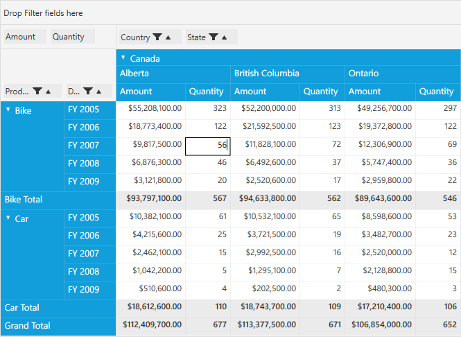
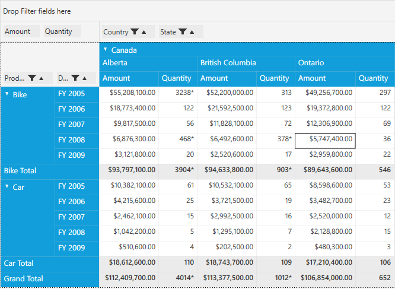

# Editing

PivotGrid provides support to edit the value and total cells and it can be achieved by using **EnableValueEditing** property. While handling the editing operations, the values will be calculated automatically and its total values will be adjusted according to the editing. This can be achieved using the **PivotEditingManager** of PivotGrid control.

Properties 

* **EnableValueEditing** - Gets or sets the value indication whether to enable editing in value cells.
* **AllowEditingOfTotalCells** - Gets/sets the Boolean value to enable editing in total cells.

## Defining the properties in PivotGrid

### Enable editing for value cells

The **EnableValueEditing** property of PivotGrid control can be used to achieve this requirement and it can be mentioned either in *XAML* or in *Code-Behind*.

If through **XAML**, please refer the below code snippet.



<Grid>
    <syncfusion:PivotGridControl HorizontalAlignment="Left" Name="pivotGrid" VerticalAlignment="Top" VisualStyle="Metro" EnableValueEditing="True" ItemSource="{Binding   Source={StaticResource data}}">

        <syncfusion:PivotGridControl.PivotRows>
            <syncfusion:PivotItem FieldHeader="Product" FieldMappingName="Product" TotalHeader="Total" />
            <syncfusion:PivotItem FieldHeader="Date" FieldMappingName="Date" TotalHeader="Total" />
        </syncfusion:PivotGridControl.PivotRows>
        <syncfusion:PivotGridControl.PivotColumns>
            <syncfusion:PivotItem FieldHeader="Country" FieldMappingName="Country" TotalHeader="Total" />
            <syncfusion:PivotItem FieldHeader="State" FieldMappingName="State" TotalHeader="Total" />
        </syncfusion:PivotGridControl.PivotColumns>
        <syncfusion:PivotGridControl.PivotCalculations>
            <syncfusion:PivotComputationInfo CalculationName="Total" FieldName="Amount" Format="C" SummaryType="DoubleTotalSum" />
            <syncfusion:PivotComputationInfo CalculationName="Total" FieldName="Quantity" SummaryType="Count" />
        </syncfusion:PivotGridControl.PivotCalculations>

    </syncfusion:PivotGridControl>
</Grid>



Else if through **Code-Behind**, please refer the below code snippet.



public partial class MainWindow: Window {
    PivotGridControl pivotGrid = new PivotGridControl();
    public MainWindow() {
        InitializeComponent();
        grid1.Children.Add(pivotGrid);
        pivotGrid.ItemSource = ProductSales.GetSalesData();
        PivotItem m_PivotItem = new PivotItem() {
            FieldHeader = "Product", FieldMappingName = "Product", TotalHeader = "Total"
        };
        PivotItem m_PivotItem1 = new PivotItem() {
            FieldHeader = "Date", FieldMappingName = "Date", TotalHeader = "Total"
        };
        PivotItem n_PivotItem = new PivotItem() {
            FieldHeader = "Country", FieldMappingName = "Country", TotalHeader = "Total"
        };
        PivotItem n_PivotItem1 = new PivotItem() {
            FieldHeader = "State", FieldMappingName = "State", TotalHeader = "Total"
        };
        // Adding PivotItem to PivotRows
        pivotGrid.PivotRows.Add(m_PivotItem);
        pivotGrid.PivotRows.Add(m_PivotItem1);
        // Adding PivotItem to PivotColumns
        pivotGrid.PivotColumns.Add(n_PivotItem);
        pivotGrid.PivotColumns.Add(n_PivotItem1);
        PivotComputationInfo m_PivotComputationInfo = new PivotComputationInfo() {
            CalculationName = "Amount", FieldName = "Amount", Format = "C", SummaryType = Syncfusion.PivotAnalysis.Base.SummaryType.DoubleTotalSum
        };
        PivotComputationInfo m_PivotComputationInfo1 = new PivotComputationInfo() {
            CalculationName = "Quantity", FieldName = "Quantity", SummaryType = Syncfusion.PivotAnalysis.Base.SummaryType.Count
        };
        pivotGrid.PivotCalculations.Add(m_PivotComputationInfo);
        pivotGrid.PivotCalculations.Add(m_PivotComputationInfo1);

        pivotGrid.EnableValueEditing = true;

    }
}    



### Enable editing for total cells

The **AllowEditingOfTotalCells** property of **PivotEditingManager** can be used to achieve this requirement and it can be mentioned in **Code-Behind**.

After defining the PivotGrid control, raise the Loaded event for PivotGrid. Inside the PivotGrid_Loaded() event, set the **AllowEditingIfTotalCells** property of PivotGrid control.



public partial class MainWindow: Window {
    PivotGridControl pivotGrid = new PivotGridControl();
    public MainWindow() {
        InitializeComponent();
        grid1.Children.Add(pivotGrid);
        pivotGrid.ItemSource = ProductSales.GetSalesData();
        PivotItem m_PivotItem = new PivotItem() {
            FieldHeader = "Product", FieldMappingName = "Product", TotalHeader = "Total"
        };
        PivotItem m_PivotItem1 = new PivotItem() {
            FieldHeader = "Date", FieldMappingName = "Date", TotalHeader = "Total"
        };
        PivotItem n_PivotItem = new PivotItem() {
            FieldHeader = "Country", FieldMappingName = "Country", TotalHeader = "Total"
        };
        PivotItem n_PivotItem1 = new PivotItem() {
            FieldHeader = "State", FieldMappingName = "State", TotalHeader = "Total"
        };
        // Adding PivotItem to PivotRows
        pivotGrid.PivotRows.Add(m_PivotItem);
        pivotGrid.PivotRows.Add(m_PivotItem1);
        // Adding PivotItem to PivotColumns
        pivotGrid.PivotColumns.Add(n_PivotItem);
        pivotGrid.PivotColumns.Add(n_PivotItem1);
        PivotComputationInfo m_PivotComputationInfo = new PivotComputationInfo() {
            CalculationName = "Amount", FieldName = "Amount", Format = "C", SummaryType = Syncfusion.PivotAnalysis.Base.SummaryType.DoubleTotalSum
        };
        PivotComputationInfo m_PivotComputationInfo1 = new PivotComputationInfo() {
            CalculationName = "Quantity", FieldName = "Quantity", SummaryType = Syncfusion.PivotAnalysis.Base.SummaryType.Count
        };
        pivotGrid.PivotCalculations.Add(m_PivotComputationInfo);
        pivotGrid.PivotCalculations.Add(m_PivotComputationInfo1);

        pivotGrid.Loaded += pivotGrid_Loaded;

    }
    void pivotGrid_Loaded(object sender, RoutedEventArgs e) {
        pivotGrid.EditManager.AllowEditingOfTotalCells = true;
    }
}



## Adding Custom Editing Manager in PivotGrid

After editing the value, we can further customize the value through **customizing the PivotEditingManager**. A custom editing manager can be used so that you can format the PivotCellInfo in PivotGrid.

Create a class named as  **CustomEditManager** as illustrated below. Dispose the existing edit manager and set the created custom edit manager to the PivotGrid by using the EditManager. Please refer the below code snippet.



public class CustomEditManager: PivotEditingManager {
    public CustomEditManager(PivotGridControl pg): base(pg) {}
    protected override void ChangeValue(object oldValue, object newValue, int row1, int col1, PivotCellInfo pi) {
        //do the base change
        base.ChangeValue(oldValue, newValue, row1, col1, pi);
        //mark all the adjusted cell contents
        pi.FormattedText += "*";
    }
}

public partial class MainWindow: Window {
    PivotGridControl pivotGrid = new PivotGridControl();
    public MainWindow() {
        InitializeComponent();
        grid1.Children.Add(pivotGrid);
        pivotGrid.ItemSource = ProductSales.GetSalesData();
        PivotItem m_PivotItem = new PivotItem() {
            FieldHeader = "Product", FieldMappingName = "Product", TotalHeader = "Total"
        };
        PivotItem m_PivotItem1 = new PivotItem() {
            FieldHeader = "Date", FieldMappingName = "Date", TotalHeader = "Total"
        };
        PivotItem n_PivotItem = new PivotItem() {
            FieldHeader = "Country", FieldMappingName = "Country", TotalHeader = "Total"
        };
        PivotItem n_PivotItem1 = new PivotItem() {
            FieldHeader = "State", FieldMappingName = "State", TotalHeader = "Total"
        };
        // Adding PivotItem to PivotRows
        pivotGrid.PivotRows.Add(m_PivotItem);
        pivotGrid.PivotRows.Add(m_PivotItem1);
        // Adding PivotItem to PivotColumns
        pivotGrid.PivotColumns.Add(n_PivotItem);
        pivotGrid.PivotColumns.Add(n_PivotItem1);
        PivotComputationInfo m_PivotComputationInfo = new PivotComputationInfo() {
            CalculationName = "Amount", FieldName = "Amount", Format = "C", SummaryType = Syncfusion.PivotAnalysis.Base.SummaryType.DoubleTotalSum
        };
        PivotComputationInfo m_PivotComputationInfo1 = new PivotComputationInfo() {
            CalculationName = "Quantity", FieldName = "Quantity", SummaryType = Syncfusion.PivotAnalysis.Base.SummaryType.Count
        };
        pivotGrid.PivotCalculations.Add(m_PivotComputationInfo);
        pivotGrid.PivotCalculations.Add(m_PivotComputationInfo1);

        pivotGrid.Loaded += pivotGrid_Loaded;
    }

    void pivotGrid_Loaded(object sender, RoutedEventArgs e) {
        pivotGrid.EditManager.Dispose();
        pivotGrid.EditManager = new CustomEditManager(pivotGrid);
    }
}



