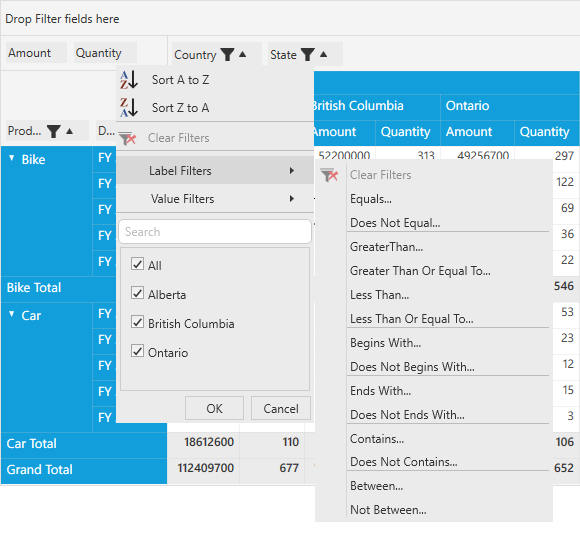
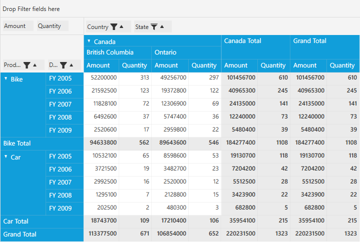

#Excel-like Filtering

PivotGrid control provides excel-like filtering feature in which the FilterPopup will have features similar to MS Excel called as **MultiFunctionalSortFilterPopup**. This MultiFunctionalSortFilterPopup contains various features such as sorting and filtering the PivotItem. 

##Defining the Excel-like Filtering in PivotGrid

We can able to enable or disable the MultiFunctionalSortFilerPopup in PivotGrid by setting **AllowMultiFunctionalSortFilter** property of Grouping Bar in PivotGrid control. After defining the PivotGrid control, raise the Loaded event for PivotGrid. Inside the PivotGrid_Loaded() event, raise the Loaded event for Grouping Bar.

Inside the GroupingBar_Loaded() event set the value for **AllowMultiFunctionalSortFilter** property of the Grouping Bar.

Please refer the below code snippet.



public partial class MainWindow: Window {
    PivotGridControl pivotGrid = new PivotGridControl();
    public MainWindow() {
        InitializeComponent();
        grid1.Children.Add(pivotGrid);
        pivotGrid.ItemSource = ProductSales.GetSalesData();
        PivotItem m_PivotItem = new PivotItem() {
            FieldHeader = "Product", FieldMappingName = "Product", TotalHeader = "Total"
        };
        PivotItem m_PivotItem1 = new PivotItem() {
            FieldHeader = "Date", FieldMappingName = "Date", TotalHeader = "Total"
        };
        PivotItem n_PivotItem = new PivotItem() {
            FieldHeader = "Country", FieldMappingName = "Country", TotalHeader = "Total"
        };
        PivotItem n_PivotItem1 = new PivotItem() {
            FieldHeader = "State", FieldMappingName = "State", TotalHeader = "Total"
        };
        // Adding PivotItem to PivotRows
        pivotGrid.PivotRows.Add(m_PivotItem);
        pivotGrid.PivotRows.Add(m_PivotItem1);
        // Adding PivotItem to PivotColumns
        pivotGrid.PivotColumns.Add(n_PivotItem);
        pivotGrid.PivotColumns.Add(n_PivotItem1);
        PivotComputationInfo m_PivotComputationInfo = new PivotComputationInfo() {
            CalculationName = "Amount", FieldName = "Amount", Format = "C", SummaryType = SummaryType.DoubleTotalSum
        };
        PivotComputationInfo m_PivotComputationInfo1 = new PivotComputationInfo() {
            CalculationName = "Quanity", FieldName = "Quanity", SummaryType = SummaryType.Count
        };
        pivotGrid.PivotCalculations.Add(m_PivotComputationInfo);
        pivotGrid.PivotCalculations.Add(m_PivotComputationInfo1);
        pivotGrid.Loaded += pivotGrid_Loaded;
    }

    void pivotGrid_Loaded(object sender, RoutedEventArgs e) {
        pivotGrid.GroupingBar.Loaded += GroupingBar_Loaded;
    }

    void GroupingBar_Loaded(object sender, RoutedEventArgs e) {
        pivotGrid.GroupingBar.AllowMultiFunctionalSortFilter = true;
    }
}



### Various Features of MultiFunctionalSortFilterPopup

**Sort A to Z**

It can be used to sort the corresponding PivotItem in the *Ascending order*.

**Sort Z to A**

It can be used to sort the corresponding PivotItem in the *Descending order*.

**Clear filters**

It is used to clear all the filter changes applied to the corresponding PivotItem and could bring back the PivotGrid to the normal state.

**Label Filters**

It is used to filter the PivotGrid based on the PivotItem filter labels. It can be done by using the various options which are listed below.

  * Equals
  * Does not equals
  * Greater than
  * Greater than or equal to
  * Less than
  * Less than or equal to
  * Begins with
  * Does not begins with
  * Ends with
  * Does not ends with
  * Contains
  * Does not contains
  * Between
  * Not between

_Label Filter Window for filtering "Alberta" in State_

**Value filters**

It is used to filter the PivotGrid based on the PivotItem field values. It can be done by using the various options which are listed below.

  * Equals
  * Does not equals
  * Greater than
  * Greater than or equal to
  * Less than
  * Less than or equal to
  * Between
  * Not between
  * Top 10

_ValueFilter Window for filtering "Alberta" using its Quantity value "677" in State_

_PivotGrid with Label or Value Filter applied_
