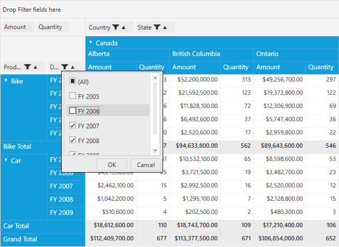

# Filtering

Filtered data displays only a subset of data that meets a specified criterion. **Pivot grid filters** are automatically reapplied every time the pivot grid is refreshed or updated until you remove those filters. In the pivot grid, filters are additive, which means that each additional filter is based on the current filter and reduces the subset of data. You can apply 'n' number of filtering conditions to the pivot grid at a time. While applying filters, a **FilterExpression** is created and data is filtered based on that specified FilterExpression.

## Filtering by FilterExpression

FilterExpression class is used to encapsulate the information needed to define a filter. It contains the following properties:

* **Expression**: Gets or sets the well-formed logical expression that defines this FilterExpression.
* **Name**: Gets or sets the name of the FilterExpression.
* **DimensionName**: Gets or sets the dimension name for the FilterExpression.
* **DimensionHeader**: Gets or sets the dimension header for the FilterExpression.
* **Format**: Gets or sets the format of FilterExpression.
* **Evaluator**: Evaluates the given value.

### Defining filters in XAML

Create a new FilterExpression under the **PivotGridControl.Filters** class. Refer to the following code snippet.



    <Grid>
        <syncfusion:PivotGridControl HorizontalAlignment="Left" Name="pivotGrid" VerticalAlignment="Top" ShowFieldList="True" ItemSource="{Binding   Source={StaticResource data}}">
            <syncfusion:PivotGridControl.PivotRows>
                <syncfusion:PivotItem FieldHeader="Product" FieldMappingName="Product" TotalHeader="Total" />
                <syncfusion:PivotItem FieldHeader="Date" FieldMappingName="Date" TotalHeader="Total" />
            </syncfusion:PivotGridControl.PivotRows>
            <syncfusion:PivotGridControl.PivotColumns>
                <syncfusion:PivotItem FieldHeader="Country" FieldMappingName="Country" TotalHeader="Total" />
                <syncfusion:PivotItem FieldHeader="State" FieldMappingName="State" TotalHeader="Total" />
            </syncfusion:PivotGridControl.PivotColumns>
            <syncfusion:PivotGridControl.PivotCalculations>
                <syncfusion:PivotComputationInfo CalculationName="Total" FieldName="Amount" Format="C" SummaryType="DoubleTotalSum" />
                <syncfusion:PivotComputationInfo CalculationName="Total" FieldName="Quantity" SummaryType="Count" />
            </syncfusion:PivotGridControl.PivotCalculations>

            <syncfusion:PivotGridControl.Filters>
                <syncfusion:FilterExpression DimensionHeader="Product" DimensionName="Product" Name="Product" Expression="Product = Bike" />
            </syncfusion:PivotGridControl.Filters>
        </syncfusion:PivotGridControl>
    </Grid>



### Defining filters in code-behind

Create a new FilterExpression by using the **FilterExpression** class and add that FilterExpression to the **Filters** collection of the pivot grid control.

Refer to the following code snippet.



public partial class MainWindow: Window {
    PivotGridControl pivotGrid = new PivotGridControl();
    public MainWindow() {
        InitializeComponent();
        grid1.Children.Add(pivotGrid);
        pivotGrid.ItemSource = ProductSales.GetSalesData();
        PivotItem m_PivotItem = new PivotItem() {
            FieldHeader = "Product", FieldMappingName = "Product", TotalHeader = "Total"
        };
        PivotItem m_PivotItem1 = new PivotItem() {
            FieldHeader = "Date", FieldMappingName = "Date", TotalHeader = "Total"
        };
        PivotItem n_PivotItem = new PivotItem() {
            FieldHeader = "Country", FieldMappingName = "Country", TotalHeader = "Total"
        };
        PivotItem n_PivotItem1 = new PivotItem() {
            FieldHeader = "State", FieldMappingName = "State", TotalHeader = "Total"
        };
        // Adding PivotItem to PivotRows
        pivotGrid.PivotRows.Add(m_PivotItem);
        pivotGrid.PivotRows.Add(m_PivotItem1);
        // Adding PivotItem to PivotColumns
        pivotGrid.PivotColumns.Add(n_PivotItem);
        pivotGrid.PivotColumns.Add(n_PivotItem1);
        PivotComputationInfo m_PivotComputationInfo = new PivotComputationInfo() {
            CalculationName = "Amount", FieldName = "Amount", Format = "C", SummaryType = SummaryType.DoubleTotalSum
        };
        PivotComputationInfo m_PivotComputationInfo1 = new PivotComputationInfo() {
            CalculationName = "Quantity", FieldName = "Quantity", SummaryType = SummaryType.Count
        };
        pivotGrid.PivotCalculations.Add(m_PivotComputationInfo);
        pivotGrid.PivotCalculations.Add(m_PivotComputationInfo1);

        FilterExpression m_FilterExpression = new FilterExpression() {
            DimensionHeader = "Product", Name = "Product", DimensionName = "Product", Expression = "Product = Bike"
        };
        //Adding FilterExpression to Filters
        pivotGrid.Filters.Add(m_FilterExpression);

    }
}



## Filtering by using filter pop-up

Filters can also be applied to pivot grid control at runtime using the filter pop-up. This filter pop-up can be opened by clicking the filter button in the grouping bar item. The filter pop-up contains the filter list in which you can uncheck the items that are to be filtered and click OK.
This, in turns, creates a FilterExpression at runtime by using the unchecked items and applies the filters to the pivot grid control.

