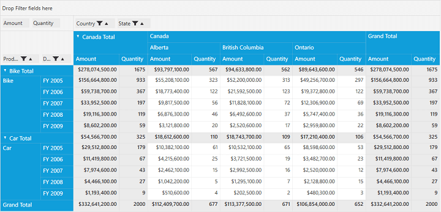

# Grid Layout

PivotGrid provides support for two different types Layout options with respect to Summaries. Thats is , whether to display the summary data of each PivotItem at the top or at the bottom of value cells.

**Use Case Scenario**

User could view the summary values at start or end of the value cells as per their requirement.

Property Table

<table>
<tr>
<th>
Property </th><th>
Description </th><th>
Type </th><th>
Value It Accepts</th><th>
Reference Link</th></tr>
<tr>
<td>
GridLayout</td><td>
Gets or sets the layout of summary data in Pivot Grid. </td><td>
GridLayout</td><td>
Normal(Default),
TopSummary</td><td>
-</td></tr>
</table>

## Defining the Layout options for the PivotGrid

**GridLayout** property of PivotGrid control can be defined both in *XAML* and *Code-Behind*.

If through **XAML**, please refer the below code snippet.



<Grid>
    <syncfusion:PivotGridControl HorizontalAlignment="Left" Name="pivotGrid" VerticalAlignment="Top" GridLayout="TopSummary" ItemSource="{Binding Source={StaticResource data}}">

        <syncfusion:PivotGridControl.PivotRows>
            <syncfusion:PivotItem FieldHeader="Product" FieldMappingName="Product" TotalHeader="Total" />
            <syncfusion:PivotItem FieldHeader="Date" FieldMappingName="Date" TotalHeader="Total" />
        </syncfusion:PivotGridControl.PivotRows>
        <syncfusion:PivotGridControl.PivotColumns>
            <syncfusion:PivotItem FieldHeader="Country" FieldMappingName="Country" TotalHeader="Total" />
            <syncfusion:PivotItem FieldHeader="State" FieldMappingName="State" TotalHeader="Total" />
        </syncfusion:PivotGridControl.PivotColumns>
        <syncfusion:PivotGridControl.PivotCalculations>
            <syncfusion:PivotComputationInfo CalculationName="Total" FieldName="Amount" Format="C" SummaryType="DoubleTotalSum" />
            <syncfusion:PivotComputationInfo CalculationName="Total" FieldName="Quantity" SummaryType="Count" />
        </syncfusion:PivotGridControl.PivotCalculations>

    </syncfusion:PivotGridControl>
</Grid>



Else if through **Code-Behind**, please refer the below code snippet.



public partial class MainWindow: Window {
    PivotGridControl pivotGrid = new PivotGridControl();
    public MainWindow() {
        InitializeComponent();
        grid1.Children.Add(pivotGrid);
        pivotGrid.ItemSource = ProductSales.GetSalesData();
        PivotItem m_PivotItem = new PivotItem() {
            FieldHeader = "Product", FieldMappingName = "Product", TotalHeader = "Total"
        };
        PivotItem m_PivotItem1 = new PivotItem() {
            FieldHeader = "Date", FieldMappingName = "Date", TotalHeader = "Total"
        };
        PivotItem n_PivotItem = new PivotItem() {
            FieldHeader = "Country", FieldMappingName = "Country", TotalHeader = "Total"
        };
        PivotItem n_PivotItem1 = new PivotItem() {
            FieldHeader = "State", FieldMappingName = "State", TotalHeader = "Total"
        };
        // Adding PivotItem to PivotRows
        pivotGrid.PivotRows.Add(m_PivotItem);
        pivotGrid.PivotRows.Add(m_PivotItem1);
        // Adding PivotItem to PivotColumns
        pivotGrid.PivotColumns.Add(n_PivotItem);
        pivotGrid.PivotColumns.Add(n_PivotItem1);
        PivotComputationInfo m_PivotComputationInfo = new PivotComputationInfo() {
            CalculationName = "Amount", FieldName = "Amount", Format = "C", SummaryType = SummaryType.DoubleTotalSum
        };
        PivotComputationInfo m_PivotComputationInfo1 = new PivotComputationInfo() {
            CalculationName = "Quantity", FieldName = "Quantity", SummaryType = SummaryType.Count
        };
        pivotGrid.PivotCalculations.Add(m_PivotComputationInfo);
        pivotGrid.PivotCalculations.Add(m_PivotComputationInfo1);

        pivotGrid.GridLayout = GridLayout.TopSummary;
    }
}



**Normal**

It is used to display the summary data of rows or columns at the end of the value cells. 

**Top Summary**

It is used to display the summary data of rows or columns at the beginning of the value cells.

