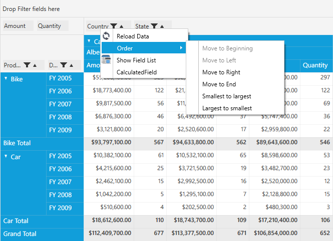

# Grouping Bar Context Menu

The grouping bar context menu consists of the following menu items:

* **Reload Data**: Refreshes the grid with the current item source.
* **Show Field List**: Launches the pivot grid field list.
* **Order**: Changes the position of the item present in the grouping bar. It contains the following submenu items:

* Move to Beginning: Moves the current item to the first position.
* Move to Left: Moves the current item one step toward its left.
* Move to Right: Moves the current item one step toward its right.
* Move to End: Moves the current item to the last position.
* Smallest to Largest: Arranges the pivot fields based on the field header from first letter to the last.
* Largest to Smallest: Arranges the pivot fields based on the field header from last letter to the first.

* **Calculated field**: Adds a new calculation field at runtime.

By default, the context menu is enabled in all areas of the grouping bar. The `DisableContextMenu` property should be set individually for row, column, and data header area in the grouping bar to alter their visibility.

After defining the pivot grid control, raise the loaded event for the pivot grid. Inside the `PivotGrid_Loaded()` event, raise the loaded event for the grouping bar. Inside the `GroupingBar_Loaded()` event, set the value for the `DisableContextMenu` property.

Refer to the following code sample.



public partial class MainWindow: Window {
    PivotGridControl pivotGrid = new PivotGridControl();
    public MainWindow() {
        InitializeComponent();
        grid1.Children.Add(pivotGrid);
        pivotGrid.ItemSource = ProductSales.GetSalesData();
        PivotItem m_PivotItem = new PivotItem() {
            FieldHeader = "Product", FieldMappingName = "Product", TotalHeader = "Total"
        };
        PivotItem m_PivotItem1 = new PivotItem() {
            FieldHeader = "Date", FieldMappingName = "Date", TotalHeader = "Total"
        };
        PivotItem n_PivotItem = new PivotItem() {
            FieldHeader = "Country", FieldMappingName = "Country", TotalHeader = "Total"
        };
        PivotItem n_PivotItem1 = new PivotItem() {
            FieldHeader = "State", FieldMappingName = "State", TotalHeader = "Total"
        };
        // Adding PivotItem to PivotRows
        pivotGrid.PivotRows.Add(m_PivotItem);
        pivotGrid.PivotRows.Add(m_PivotItem1);
        // Adding PivotItem to PivotColumns
        pivotGrid.PivotColumns.Add(n_PivotItem);
        pivotGrid.PivotColumns.Add(n_PivotItem1);
        PivotComputationInfo m_PivotComputationInfo = new PivotComputationInfo() {
            CalculationName = "Amount", FieldName = "Amount", Format = "C", SummaryType = SummaryType.DoubleTotalSum
        };
        PivotComputationInfo m_PivotComputationInfo1 = new PivotComputationInfo() {
            CalculationName = "Quantity", FieldName = "Quantity", SummaryType = SummaryType.Count
        };
        pivotGrid.PivotCalculations.Add(m_PivotComputationInfo);
        pivotGrid.PivotCalculations.Add(m_PivotComputationInfo1);

        pivotGrid.Loaded += pivotGrid_Loaded;
    }

    void pivotGrid_Loaded(object sender, RoutedEventArgs e) {
        pivotGrid.GroupingBar.Loaded += GroupingBar_Loaded;
    }

    void GroupingBar_Loaded(object sender, RoutedEventArgs e) {
        pivotGrid.GroupingBar.ColumnHeaderArea.DisableContextMenu = false;
        pivotGrid.GroupingBar.RowHeaderArea.DisableContextMenu = true;
        pivotGrid.GroupingBar.DataHeaderArea.DisableContextMenu = false;
    }
}



