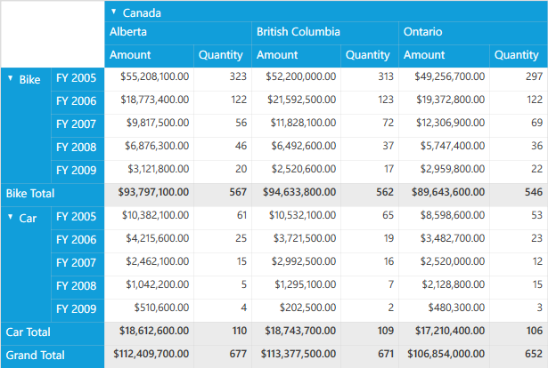

# Grouping Bar

Grouping Bar allows you to slice and dice the fields between column, row, value and filter. Grouping Bar allows us to add, re-arrange, or remove the fields to show data in the PivotGrid exactly the way we want. It consists of the following areas:

* Filter Header Area - which holds the Filter items of PivotGrid control.
* Data Header Area - which holds the PivotCalculation items of PivotGrid control.
* Column Header Area - which holds the PivotColumn items of PivotGrid control.
* Row Header Area - which holds the PivotRow items of PivotGrid control.

By default, Grouping Bar is enabled in PivotGrid control. We can show or hide the Grouping Bar by using the `ShowGroupingBar` property of PivotGrid control. It can be done both in *XAML* or *Code-behind*.

If through *XAML*, please refer the below code sample.



    <Window xmlns="http://schemas.microsoft.com/winfx/2006/xaml/presentation" xmlns:x="http://schemas.microsoft.com/winfx/2006/xaml" syncfusion:SkinStorage.VisualStyle="Metro" xmlns:syncfusion="http://schemas.syncfusion.com/wpf" x:Class="WpfApplication1.MainWindow" Title="MainWindow" Height="350" Width="525" xmlns:local="clr-namespace:WpfApplication1">
        <Window.Resources>
            <ResourceDictionary>
                <ObjectDataProvider x:Key="data" ObjectType="{x:Type local:ProductSales}" MethodName="GetSalesData" />
            </ResourceDictionary>
        </Window.Resources>
        <Grid Name="grid1">
            <syncfusion:PivotGridControl HorizontalAlignment="Left" Name="pivotGrid" VerticalAlignment="Top" ShowGroupingBar="True" ItemSource="{Binding   Source={StaticResource data}}">
            </syncfusion:PivotGridControl>
        </Grid>
    </Window>



Else if, through *Code-behind*, please refer the below code sample.



public partial class MainWindow: Window {
    public MainWindow() {
        InitializeComponent();
        this.Loaded += MainWindow_Loaded;
    }

    void MainWindow_Loaded(object sender, RoutedEventArgs e) {
        PivotGridControl pivotGrid = new PivotGridControl();
        grid1.Children.Add(pivotGrid);
        pivotGrid.ItemSource = ProductSales.GetSalesData();
        pivotGrid.ShowGroupingBar = true;
    }
}



_PivotGrid with Grouping Bar_

_PivotGrid without Grouping Bar_