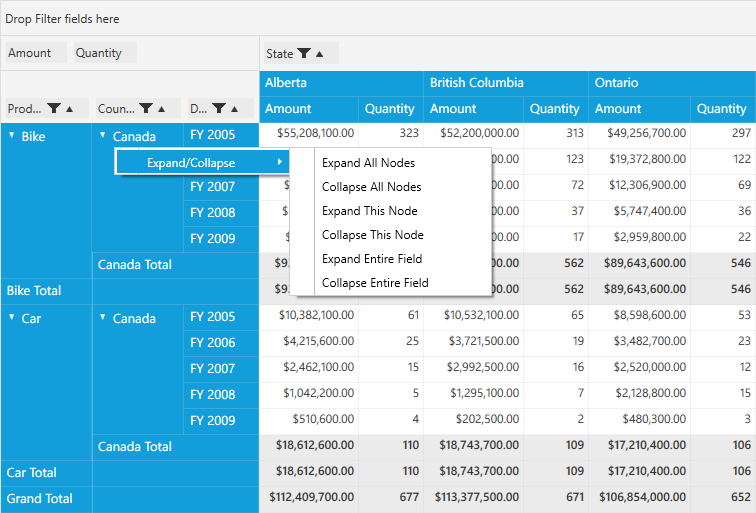
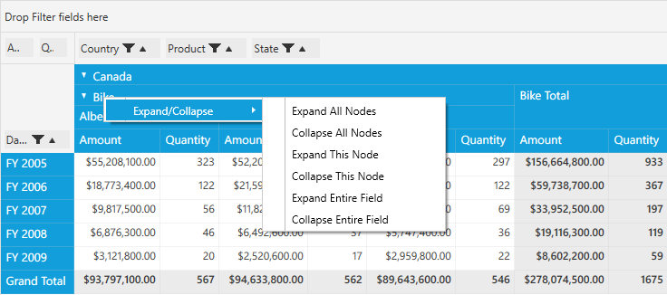

# Expand/Collapse in PivotGrid

Expand/collapse operations can be done at both the UI and programmatic level. 

## Header Cell Context Menu for UI Level Expand/Collapse

Header cell context menu will be shown while right-clicking on the expander cell. Expand/collapse operations can be handled through this context menu at the row level and column level individually.

Property 

* **EnableContextMenu** - Gets or sets the context menu for expander cells (row header and column header cells only).

###Defining the properties in PivotGrid

**EnableContextMenu** property allows us to enable or disable the context menu for row or column headers alone individually.

After defining the PivotGrid control, raise the Loaded event for PivotGrid. Inside the PivotGrid_Loaded() event, set the visibility of **EnableContextMenu** of each row and column header areas.

Please refer the below code snippet.



public partial class MainWindow: Window {
    PivotGridControl pivotGrid = new PivotGridControl();
    public MainWindow() {
        InitializeComponent();
        grid1.Children.Add(pivotGrid);
        pivotGrid.ItemSource = ProductSales.GetSalesData();
        PivotItem m_PivotItem = new PivotItem() {
            FieldHeader = "Product", FieldMappingName = "Product", TotalHeader = "Total"
        };
        PivotItem m_PivotItem1 = new PivotItem() {
            FieldHeader = "Date", FieldMappingName = "Date", TotalHeader = "Total"
        };
        PivotItem n_PivotItem = new PivotItem() {
            FieldHeader = "Country", FieldMappingName = "Country", TotalHeader = "Total"
        };
        PivotItem n_PivotItem1 = new PivotItem() {
            FieldHeader = "State", FieldMappingName = "State", TotalHeader = "Total"
        };
        // Adding PivotItem to PivotRows
        pivotGrid.PivotRows.Add(m_PivotItem);
        pivotGrid.PivotRows.Add(m_PivotItem1);
        // Adding PivotItem to PivotColumns
        pivotGrid.PivotColumns.Add(n_PivotItem);
        pivotGrid.PivotColumns.Add(n_PivotItem1);
        PivotComputationInfo m_PivotComputationInfo = new PivotComputationInfo() {
            CalculationName = "Amount", FieldName = "Amount", Format = "C", SummaryType = SummaryType.DoubleTotalSum
        };
        PivotComputationInfo m_PivotComputationInfo1 = new PivotComputationInfo() {
            CalculationName = "Quantity", FieldName = "Quantity", SummaryType = SummaryType.Count
        };
        pivotGrid.PivotCalculations.Add(m_PivotComputationInfo);
        pivotGrid.PivotCalculations.Add(m_PivotComputationInfo1);
        pivotGrid.Loaded += pivotGrid_Loaded;
    }

    void pivotGrid_Loaded(object sender, RoutedEventArgs e) {
        pivotGrid.ColumnHeaderCellStyle.EnableContextMenu = true;
        pivotGrid.RowHeaderCellStyle.EnableContextMenu = true;
    }
}



##Programmatic Level for Expand/Collapse

Programmatically, we can expand/collapse any number of rows or columns. This can be done using the following methods.

Methods Table

<table>
<tr>
<th>
Method </th><th>
Description </th><th>
Parameters </th><th>
Return Type </th></tr>
<tr>
<td>
ExpandRow(string)</td><td>
Expands the group for the given row UniqueText.</td><td>
string </td><td>
void </td></tr>
<tr>
<td>
ExpandColumn(string)</td><td>
Expands the group for the given column UniqueText.</td><td>
string</td><td>
void</td></tr>
<tr>
<td>
CollapseRow(string)</td><td>
Collapse the group for the given row UniqueText.</td><td>
string</td><td>
void</td></tr>
<tr>
<td>
CollapseColumn(string)</td><td>
Collapse the group for the given column UniqueText.</td><td>
string</td><td>
void</td></tr>
<tr>
<td>
{{ '`ExpandRow(List<string>)`' | markdownify }}</td><td>
Expands the group for the given list of row UniqueText.</td><td>
{{ '`List<string>`' | markdownify }}</td><td>
void</td></tr>
<tr>
<td>
{{ '`ExpandColumn(List<string>)`' | markdownify }}</td><td>
Expands the group for the given list of column UniqueText.</td><td>
{{ '`List<string>`' | markdownify }}</td><td>
void</td></tr>
<tr>
<td>
{{ '`CollapseRow(List<string>)`' | markdownify }}</td><td>
Collapse the group for the given list of row UniqueText.</td><td>
{{ '`List<string>`' | markdownify }}</td><td>
void</td></tr>
<tr>
<td>
{{ '`CollapseColumn(List<string>)`' | markdownify }}</td><td>
Collapse the group for the given list of column UniqueText.</td><td>
{{ '`List<string>`' | markdownify }}</td><td>
void</td></tr>
<tr>
<td>
ExpandAllGroup</td><td>
Expands all the group.</td><td>
-</td><td>
void</td></tr>
<tr>
<td>
CollapseAllGroup</td><td>
Collapses all the group.</td><td>
-</td><td>
void</td></tr>
</table>

### Defining the methods in PivotGrid

For programmatic level expand/collapse operations in code behind, we can make use of the above mentioned methods respectively as per our requirement. Passing the UniqueText as a parameter we can expand/collapse one or more columns/rows as per our requirement. 

After defining the PivotGrid control, raise the Loaded event for PivotGrid. Inside the PivotGrid_Loaded() event, use the appropriate methods for expand/collapse operations.

Please refer the below code snippets.



public partial class MainWindow: Window {
    PivotGridControl pivotGrid = new PivotGridControl();
    public MainWindow() {
        InitializeComponent();
        grid1.Children.Add(pivotGrid);
        pivotGrid.ItemSource = ProductSales.GetSalesData();
        PivotItem m_PivotItem = new PivotItem() {
            FieldHeader = "Product", FieldMappingName = "Product", TotalHeader = "Total"
        };
        PivotItem m_PivotItem1 = new PivotItem() {
            FieldHeader = "Date", FieldMappingName = "Date", TotalHeader = "Total"
        };
        PivotItem n_PivotItem = new PivotItem() {
            FieldHeader = "Country", FieldMappingName = "Country", TotalHeader = "Total"
        };
        PivotItem n_PivotItem1 = new PivotItem() {
            FieldHeader = "State", FieldMappingName = "State", TotalHeader = "Total"
        };
        // Adding PivotItem to PivotRows
        pivotGrid.PivotRows.Add(m_PivotItem);
        pivotGrid.PivotRows.Add(m_PivotItem1);
        // Adding PivotItem to PivotColumns
        pivotGrid.PivotColumns.Add(n_PivotItem);
        pivotGrid.PivotColumns.Add(n_PivotItem1);
        PivotComputationInfo m_PivotComputationInfo = new PivotComputationInfo() {
            CalculationName = "Amount", FieldName = "Amount", Format = "C", SummaryType = SummaryType.DoubleTotalSum
        };
        PivotComputationInfo m_PivotComputationInfo1 = new PivotComputationInfo() {
            CalculationName = "Quantity", FieldName = "Quantity", SummaryType = SummaryType.Count
        };
        pivotGrid.PivotCalculations.Add(m_PivotComputationInfo);
        pivotGrid.PivotCalculations.Add(m_PivotComputationInfo1);
        pivotGrid.Loaded += pivotGrid_Loaded;
    }

    void pivotGrid_Loaded(object sender, RoutedEventArgs e) {
        /// Expands the Bike from row       
        pivotGrid.ExpandRow("Bike");
        /// Collapses the Bike from row        
        pivotGrid.CollapseRow("Bike");
        /// Expands the Canada from column        
        pivotGrid.ExpandColumn("Canada");
        /// Collapses the Canada from column        
        pivotGrid.CollapseColumn("Canada");
        /// Collapses the given collection of UniqueText string values for row        
        pivotGrid.CollapseRow(new List < string > {
            "Bike",
            "Car"
        });
        /// Expands the given collection of UniqueText string values for row        
        pivotGrid.ExpandRow(new List < string > {
            "Bike",
            "Car"
        });
        /// Collapses the given collection of UniqueText string values for Column        
        pivotGrid.CollapseColumn(new List < string > {
            "Canada",
            "France"
        });
        /// Expands the given collection of UniqueText string values for Column        
        pivotGrid.ExpandColumn(new List < string > {
            "Canada",
            "France"
        });
        /// Expands entire group in both row and column.
        pivotGrid.ExpandAllGroup();
        /// Collapse entire group in both row and column.
        pivotGrid.CollapseAllGroup();
    }
}


  

_Context menu for Row headers_

_Context menu for Column headers_