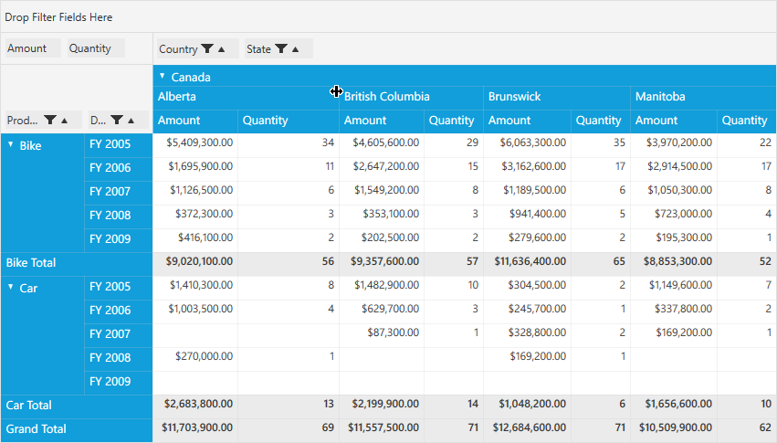

# How to resizing the columns and rows in PivotGrid?

PivotGridControl supports resizing of rows and columns dynamically. In this topic, on-demand resizing of rows and columns is discussed.

## Resizing the columns

You can change the column width by click and dragging the resizing cursor at the edge of column header. The resizing cursor appears when you hover the grid line exists between two columns.

To enable the column resizing dynamically, the [`AllowResizeColumns`](https://help.syncfusion.com/cr/wpf/Syncfusion.PivotAnalysis.Wpf~Syncfusion.Windows.Controls.PivotGrid.PivotGridControl~AllowResizeColumns.html) property should be enabled. The below code snippet shows the resizing of columns in pivot grid is being enabled.





<Grid>
    <syncfusion:PivotGridControl Name="pivotGrid" ItemSource="{Binding Source={StaticResource data}}" 
                                 AllowResizeColumns="True">
        <syncfusion:PivotGridControl.PivotRows>
            <syncfusion:PivotItem FieldHeader="Product" FieldMappingName="Product" TotalHeader="Total" />
            <syncfusion:PivotItem FieldHeader="Date" FieldMappingName="Date" TotalHeader="Total" />
        </syncfusion:PivotGridControl.PivotRows>
        <syncfusion:PivotGridControl.PivotColumns>
            <syncfusion:PivotItem FieldHeader="Country" FieldMappingName="Country" TotalHeader="Total" />
            <syncfusion:PivotItem FieldHeader="State" FieldMappingName="State" TotalHeader="Total" />
        </syncfusion:PivotGridControl.PivotColumns>
        <syncfusion:PivotGridControl.PivotCalculations>
            <syncfusion:PivotComputationInfo CalculationName="Total" FieldName="Amount" 
                                Format="C" SummaryType="DoubleTotalSum" />
            <syncfusion:PivotComputationInfo CalculationName="Total" FieldName="Quantity" 
                                SummaryType="Count" />
        </syncfusion:PivotGridControl.PivotCalculations>
    </syncfusion:PivotGridControl>
</Grid>





public partial class MainWindow: Window 
{
    PivotGridControl pivotGrid = new PivotGridControl();
    public MainWindow() 
    {
        InitializeComponent();
        grid1.Children.Add(pivotGrid);
        pivotGrid.ItemSource = ProductSales.GetSalesData();
        PivotItem m_PivotItem = new PivotItem() 
        {
            FieldHeader = "Product", FieldMappingName = "Product", TotalHeader = "Total"
        };
        PivotItem m_PivotItem1 = new PivotItem() 
        {
            FieldHeader = "Date", FieldMappingName = "Date", TotalHeader = "Total"
        };
        PivotItem n_PivotItem = new PivotItem() 
        {
            FieldHeader = "Country", FieldMappingName = "Country", TotalHeader = "Total"
        };
        PivotItem n_PivotItem1 = new PivotItem() 
        {
            FieldHeader = "State", FieldMappingName = "State", TotalHeader = "Total"
        };
        // Adding PivotItem to PivotRows
        pivotGrid.PivotRows.Add(m_PivotItem);
        pivotGrid.PivotRows.Add(m_PivotItem1);
        // Adding PivotItem to PivotColumns
        pivotGrid.PivotColumns.Add(n_PivotItem);
        pivotGrid.PivotColumns.Add(n_PivotItem1);
        PivotComputationInfo m_PivotComputationInfo = new PivotComputationInfo() 
        {
            CalculationName = "Amount", 
            FieldName = "Amount",
            Format = "C", 
            SummaryType = SummaryType.DoubleTotalSum
        };
        PivotComputationInfo m_PivotComputationInfo1 = new PivotComputationInfo()
         {
            CalculationName = "Quantity", 
            FieldName = "Quantity", 
            SummaryType = SummaryType.Count
        };
        pivotGrid.PivotCalculations.Add(m_PivotComputationInfo);
        pivotGrid.PivotCalculations.Add(m_PivotComputationInfo1);

        pivotGrid1.AllowResizeColumns = true;
    }
}





Partial Public Class MainWindow
	Inherits Window
	Private pivotGrid As New PivotGridControl()
	Public Sub New()
		InitializeComponent()
		grid1.Children.Add(pivotGrid)
		pivotGrid.ItemSource = ProductSales.GetSalesData()
		Dim m_PivotItem As New PivotItem() With {.FieldHeader = "Product", .FieldMappingName = "Product", .TotalHeader = "Total"}
		Dim m_PivotItem1 As New PivotItem() With {.FieldHeader = "Date", .FieldMappingName = "Date", .TotalHeader = "Total"}
		Dim n_PivotItem As New PivotItem() With {.FieldHeader = "Country", .FieldMappingName = "Country", .TotalHeader = "Total"}
		Dim n_PivotItem1 As New PivotItem() With {.FieldHeader = "State", .FieldMappingName = "State", .TotalHeader = "Total"}
		' Adding PivotItem to PivotRows
		pivotGrid.PivotRows.Add(m_PivotItem)
		pivotGrid.PivotRows.Add(m_PivotItem1)
		' Adding PivotItem to PivotColumns
		pivotGrid.PivotColumns.Add(n_PivotItem)
		pivotGrid.PivotColumns.Add(n_PivotItem1)
		Dim m_PivotComputationInfo As New PivotComputationInfo() With {.CalculationName = "Amount", .FieldName = "Amount", .Format = "C", .SummaryType = SummaryType.DoubleTotalSum}
		Dim m_PivotComputationInfo1 As New PivotComputationInfo() With {.CalculationName = "Quantity", .FieldName = "Quantity", .SummaryType = SummaryType.Count}
		pivotGrid.PivotCalculations.Add(m_PivotComputationInfo)
		pivotGrid.PivotCalculations.Add(m_PivotComputationInfo1)

		pivotGrid1.AllowResizeColumns = True
	End Sub
End Class





## Resizing the Rows

You can change the row height by click and dragging the resizing cursor at the edge of row header. The resizing cursor appears when you hover the grid line exists between two rows.

To enable the row resizing dynamically, the [`AllowResizeRows`](https://help.syncfusion.com/cr/wpf/Syncfusion.PivotAnalysis.Wpf~Syncfusion.Windows.Controls.PivotGrid.PivotGridControl~AllowResizeRows.html) property should be enabled. The below code snippet shows the resizing of rows in pivot grid is being enabled.





<Grid>
    <syncfusion:PivotGridControl Name="pivotGrid" ItemSource="{Binding Source={StaticResource data}}"
                                 AllowResizeRows="True">
        <syncfusion:PivotGridControl.PivotRows>
            <syncfusion:PivotItem FieldHeader="Product" FieldMappingName="Product" TotalHeader="Total" />
            <syncfusion:PivotItem FieldHeader="Date" FieldMappingName="Date" TotalHeader="Total" />
        </syncfusion:PivotGridControl.PivotRows>
        <syncfusion:PivotGridControl.PivotColumns>
            <syncfusion:PivotItem FieldHeader="Country" FieldMappingName="Country" TotalHeader="Total" />
            <syncfusion:PivotItem FieldHeader="State" FieldMappingName="State" TotalHeader="Total" />
        </syncfusion:PivotGridControl.PivotColumns>
        <syncfusion:PivotGridControl.PivotCalculations>
            <syncfusion:PivotComputationInfo CalculationName="Total" FieldName="Amount" 
                                Format="C" SummaryType="DoubleTotalSum" />
            <syncfusion:PivotComputationInfo CalculationName="Total" FieldName="Quantity" 
                                SummaryType="Count" />
        </syncfusion:PivotGridControl.PivotCalculations>
    </syncfusion:PivotGridControl>
</Grid>





public partial class MainWindow: Window 
{
    PivotGridControl pivotGrid = new PivotGridControl();
    public MainWindow() 
    {
        InitializeComponent();
        grid1.Children.Add(pivotGrid);
        pivotGrid.ItemSource = ProductSales.GetSalesData();
        PivotItem m_PivotItem = new PivotItem()
        {
            FieldHeader = "Product", FieldMappingName = "Product", TotalHeader = "Total"
        };
        PivotItem m_PivotItem1 = new PivotItem()
        {
            FieldHeader = "Date", FieldMappingName = "Date", TotalHeader = "Total"
        };
        PivotItem n_PivotItem = new PivotItem()
        {
            FieldHeader = "Country", FieldMappingName = "Country", TotalHeader = "Total"
        };
        PivotItem n_PivotItem1 = new PivotItem()
        {
            FieldHeader = "State", FieldMappingName = "State", TotalHeader = "Total"
        };
        // Adding PivotItem to PivotRows
        pivotGrid.PivotRows.Add(m_PivotItem);
        pivotGrid.PivotRows.Add(m_PivotItem1);
        // Adding PivotItem to PivotColumns
        pivotGrid.PivotColumns.Add(n_PivotItem);
        pivotGrid.PivotColumns.Add(n_PivotItem1);
        PivotComputationInfo m_PivotComputationInfo = new PivotComputationInfo()
        {
            CalculationName = "Amount",
            FieldName = "Amount",
            Format = "C",
            SummaryType = SummaryType.DoubleTotalSum
        };
        PivotComputationInfo m_PivotComputationInfo1 = new PivotComputationInfo()
         {
            CalculationName = "Quantity", 
            FieldName = "Quantity",
            SummaryType = SummaryType.Count
        };
        pivotGrid.PivotCalculations.Add(m_PivotComputationInfo);
        pivotGrid.PivotCalculations.Add(m_PivotComputationInfo1);

        pivotGrid1.AllowResizeRows = true;
    }
}





Partial Public Class MainWindow
	Inherits Window
	Private pivotGrid As New PivotGridControl()
	Public Sub New()
		InitializeComponent()
		grid1.Children.Add(pivotGrid)
		pivotGrid.ItemSource = ProductSales.GetSalesData()
		Dim m_PivotItem As New PivotItem() With {.FieldHeader = "Product", .FieldMappingName = "Product", .TotalHeader = "Total"}
		Dim m_PivotItem1 As New PivotItem() With {.FieldHeader = "Date", .FieldMappingName = "Date", .TotalHeader = "Total"}
		Dim n_PivotItem As New PivotItem() With {.FieldHeader = "Country", .FieldMappingName = "Country", .TotalHeader = "Total"}
		Dim n_PivotItem1 As New PivotItem() With {.FieldHeader = "State", .FieldMappingName = "State", .TotalHeader = "Total"}
		' Adding PivotItem to PivotRows
		pivotGrid.PivotRows.Add(m_PivotItem)
		pivotGrid.PivotRows.Add(m_PivotItem1)
		' Adding PivotItem to PivotColumns
		pivotGrid.PivotColumns.Add(n_PivotItem)
		pivotGrid.PivotColumns.Add(n_PivotItem1)
		Dim m_PivotComputationInfo As New PivotComputationInfo() With {.CalculationName = "Amount", .FieldName = "Amount", .Format = "C", .SummaryType = SummaryType.DoubleTotalSum}
		Dim m_PivotComputationInfo1 As New PivotComputationInfo() With {.CalculationName = "Quantity", .FieldName = "Quantity", .SummaryType = SummaryType.Count}
		pivotGrid.PivotCalculations.Add(m_PivotComputationInfo)
		pivotGrid.PivotCalculations.Add(m_PivotComputationInfo1)

		pivotGrid1.AllowResizeRows = True
	End Sub
End Class





