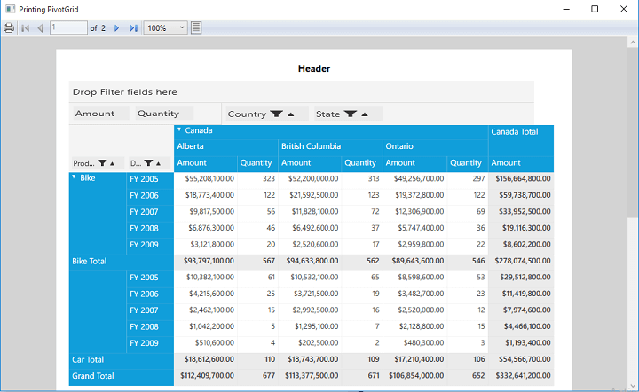

# Print and Print Preview

Essential PivotGrid for WPF provides in-built support for printing and print preview. This feature provides a print dialog that allows you to preview the output and make any modifications if required before printing.

Properties Table

<table>
<tr>
<th>
Property </th><th>
Description </th><th>
Type </th><th>
Value It Accepts</th><th>
Reference Link</th></tr>
<tr>
<td>
PrintHeader</td><td>
Add/Remove the Header in the Print Preview dialog</td><td>
bool</td><td>
True, False(Default)</td><td>
-</td></tr>
<tr>
<td>
PrintFooter</td><td>
Add/Remove the Footer in the Print Preview dialog</td><td>
bool</td><td>
True, False(Default)</td><td>
-</td></tr>
</table>

Methods Table

<table>
<tr>
<th>
Method </th><th>
Description </th><th>
Parameters </th><th>
Return Type </th></tr>
<tr>
<td>
ShowPrintPreview</td><td>
Shows the Print Preview window with empty template and default title</td><td>
(Window Win)</td><td>
void</td></tr>
<tr>
<td>
ShowPrintPreview</td><td>
Shows the Print Preview window with templates for header, footer and default title.</td><td>
(DataTemplate headerTemplate, DataTemplate footerTemplate, Window win)</td><td>
void</td></tr>
<tr>
<td>
ShowPrintPreview</td><td>
Shows the Print Preview window with templates for header, footer and user defined title</td><td>
(DataTemplate headerTemplate, DataTemplate footerTemplate, string title, Window win)</td><td>
void</td></tr>
</table>

## Using the Print and Print Preview for PivotGrid

It provides printing support for PivotGrid control along with GroupingBar. You can use the method **ShowPrintPreview** to preview the PivotGrid control before printing using the PrintPreview Window. The properties **PrintHeader** and **PrintFooter** helps to add or remove the header and footer information while printing.

**Defining Header and Footer in XAML**

After defining PivotGrid control, define the DataTemplate for Header and Footer and set the **PrintHeader**, **PrintFooter** proerties of PivotGrid control.

Please refer the below code snippet to know about the Header, Footer Template and setting its properties in PivotGrid control. 



<Window.Resources>
    <ResourceDictionary>
        <ObjectDataProvider x:Key="data" ObjectType="{x:Type local:ProductSales}" MethodName="GetSalesData" />
        <!--Creating Template for Header -->
        <DataTemplate x:Key="HeaderTemplate">
            <Grid Height="30">
                <TextBlock Text="Header" FontSize="15" FontWeight="Bold" HorizontalAlignment="Center"></TextBlock>
            </Grid>
        </DataTemplate>
        <!--Creating Template for Footer -->
        <DataTemplate x:Key="FooterTemplate">
            <Grid Height="30">
                <TextBlock Text="Footer" FontSize="15" FontWeight="Bold" HorizontalAlignment="Center"></TextBlock>
            </Grid>
        </DataTemplate>
    </ResourceDictionary>
</Window.Resources>
<Grid Name="grid1">
    <syncfusion:PivotGridControl HorizontalAlignment="Left" Name="pivotGrid" VerticalAlignment="Top" VisualStyle="Metro" syncfusion:PrintSettings.PrintHeader="True" syncfusion:PrintSettings.PrintFooter="True" ItemSource="{Binding   Source={StaticResource data}}">

        <syncfusion:PivotGridControl.PivotRows>
            <syncfusion:PivotItem FieldHeader="Product" FieldMappingName="Product" TotalHeader="Total" />
            <syncfusion:PivotItem FieldHeader="Date" FieldMappingName="Date" TotalHeader="Total" />
        </syncfusion:PivotGridControl.PivotRows>
        <syncfusion:PivotGridControl.PivotColumns>
            <syncfusion:PivotItem FieldHeader="Country" FieldMappingName="Country" TotalHeader="Total" />
            <syncfusion:PivotItem FieldHeader="State" FieldMappingName="State" TotalHeader="Total" />
        </syncfusion:PivotGridControl.PivotColumns>
        <syncfusion:PivotGridControl.PivotCalculations>
            <syncfusion:PivotComputationInfo CalculationName="Total" FieldName="Amount" Format="C" SummaryType="DoubleTotalSum" />
            <syncfusion:PivotComputationInfo CalculationName="Total" FieldName="Quantity" SummaryType="Count" />
        </syncfusion:PivotGridControl.PivotCalculations>
    </syncfusion:PivotGridControl>

</Grid>



**Invoking PrintPreview Window in PivotGrid**

After defining the PivotGrid control, raise the Loaded event for PivotGrid. Inside the PivotGrid_Loaded() event, invoke the method **ShowPrintPreview** to enable the printing behavior.



public partial class MainWindow: Window {
    public MainWindow() {
        InitializeComponent();
        this.pivotGrid.Loaded += pivotGrid_Loaded;
    }

    void pivotGrid_Loaded(object sender, RoutedEventArgs e) {
        //	Shows the Print Preview window with templates for header, footer and with user defined title                               
        this.pivotGrid.ShowPrintPreview((DataTemplate) this.Resources["HeaderTemplate"], (DataTemplate) this.Resources["FooterTemplate"], "Printing PivotGrid", this);

        //	Shows the Print Preview window with empty template and default title
        this.pivotGrid.ShowPrintPreview(this);

        //	Shows the Print Preview window with templates for header, footer and with default title.               
        this.pivotGrid.ShowPrintPreview((DataTemplate) this.Resources["HeaderTemplate"], (DataTemplate) this.Resources["FooterTemplate"], this);
    }
}



## Various Options in PrintPreview Window of PivotGrid

The Print Preview window provides the following options:  

   * Zooming
   * Page Settings
   * Print
   
You can use these options to get a magnified view of the PivotGrid or to change the page setup or to print the PivotGrid control respectively.

**Zooming**

Click on the **Zoom** drop-down button in the print preview window and select the desired percentage to magnify the print preview in PivotGrid. You can choose from various preset zoom level options such as 50%, 100%, 200% or 400%.

**Page Settings**

Click the **PageSettings** button in the print preview to change the pages while printing.

**Print** 

Click the **Print** button in the print preview window to print the PivotGrid content.

