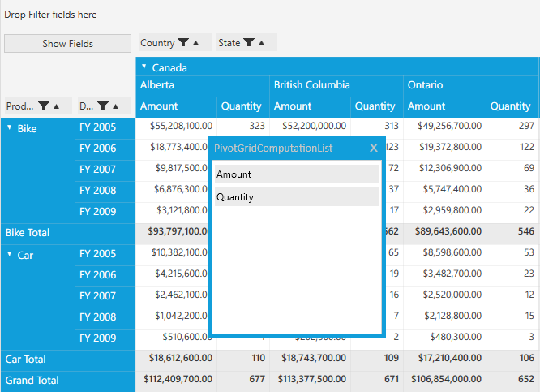

# Restrict Auto-resizing of Row Header Area

PivotGrid provides support for restricting the row header items from being stretched when there are too many PivotCalculation items in the Data Header Area. When the ShowFields button located in the DataHeaderArea of the grouping bar is clicked, the PivotComputation List window appears with the PivotCalculation fields. 

**Use Case Scenario**

It allows the user to restrict the row header items from being stretched and maintains its size with the fixed one so that users can view most of the data in the viewable area instead of scrolling to view the data.

                                               Property Table

<table>
<tr>
<th>
Property </th><th>
Description </th><th>
Type</th><th>
Value it Accepts</th><th>
Reference link</th></tr>
<tr>
<td>
AllowRowHeaderAreaAutoSizing</td><td>
Gets or sets to restrict the RowHeaders stretching when too many items in the PivotGrid GroupingBar computationArea.</td><td>
bool</td><td>
True(Default), False</td><td>
 -</td></tr>
</table>

##Defining Row Header auto sizing in PivotGrid

**AllowRowHeaderAreaAutoSizing** is set to false, in order to display the Computation button (Show Fields button) and to restrict the row header items from being stretched when more items are added to the computation area. By default, this property is set to true. It can be defined both in *XAML* and *Code-Behind*. 

If through **XAML**, please refer the below code snippet.



<Grid>
    <syncfusion:PivotGridControl HorizontalAlignment="Left" Name="pivotGrid" VerticalAlignment="Top" AllowRowHeaderAreaAutoSizing="False" ItemSource="{Binding   Source={StaticResource data}}">

        <syncfusion:PivotGridControl.PivotRows>
            <syncfusion:PivotItem FieldHeader="Product" FieldMappingName="Product" TotalHeader="Total" />
            <syncfusion:PivotItem FieldHeader="Date" FieldMappingName="Date" TotalHeader="Total" />
        </syncfusion:PivotGridControl.PivotRows>
        <syncfusion:PivotGridControl.PivotColumns>
            <syncfusion:PivotItem FieldHeader="Country" FieldMappingName="Country" TotalHeader="Total" />
            <syncfusion:PivotItem FieldHeader="State" FieldMappingName="State" TotalHeader="Total" />
        </syncfusion:PivotGridControl.PivotColumns>
        <syncfusion:PivotGridControl.PivotCalculations>
            <syncfusion:PivotComputationInfo CalculationName="Total" FieldName="Amount" Format="C" SummaryType="DoubleTotalSum" />
            <syncfusion:PivotComputationInfo CalculationName="Total" FieldName="Quantity" SummaryType="Count" />
        </syncfusion:PivotGridControl.PivotCalculations>

    </syncfusion:PivotGridControl>
</Grid>



Else if through **Code-Behind**, please refer the below code snippet.



public partial class MainWindow: Window {
    PivotGridControl pivotGrid = new PivotGridControl();
    public MainWindow() {
        InitializeComponent();
        grid1.Children.Add(pivotGrid);
        pivotGrid.ItemSource = ProductSales.GetSalesData();
        PivotItem m_PivotItem = new PivotItem() {
            FieldHeader = "Product", FieldMappingName = "Product", TotalHeader = "Total"
        };
        PivotItem m_PivotItem1 = new PivotItem() {
            FieldHeader = "Date", FieldMappingName = "Date", TotalHeader = "Total"
        };
        PivotItem n_PivotItem = new PivotItem() {
            FieldHeader = "Country", FieldMappingName = "Country", TotalHeader = "Total"
        };
        PivotItem n_PivotItem1 = new PivotItem() {
            FieldHeader = "State", FieldMappingName = "State", TotalHeader = "Total"
        };
        // Adding PivotItem to PivotRows
        pivotGrid.PivotRows.Add(m_PivotItem);
        pivotGrid.PivotRows.Add(m_PivotItem1);
        // Adding PivotItem to PivotColumns
        pivotGrid.PivotColumns.Add(n_PivotItem);
        pivotGrid.PivotColumns.Add(n_PivotItem1);
        PivotComputationInfo m_PivotComputationInfo = new PivotComputationInfo() {
            CalculationName = "Amount", FieldName = "Amount", Format = "C", SummaryType = SummaryType.DoubleTotalSum
        };
        PivotComputationInfo m_PivotComputationInfo1 = new PivotComputationInfo() {
            CalculationName = "Quantity", FieldName = "Quantity", SummaryType = SummaryType.Count
        };
        pivotGrid.PivotCalculations.Add(m_PivotComputationInfo);
        pivotGrid.PivotCalculations.Add(m_PivotComputationInfo1);

        pivotGrid.AllowRowHeaderAreaAutoSizing = false;
    }
}
    


