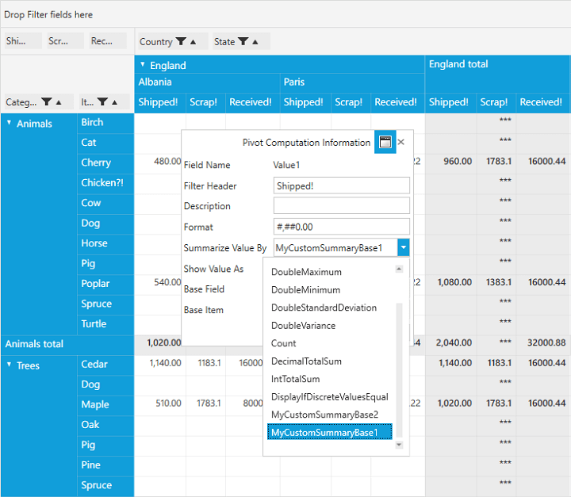

# Custom Summary (Runtime)

PivotGrid enables us to set the custom summaries for the PivotItem values at both load time and runtime (using PivotComputationInfo dialog).

For creating a custom SummaryBase class, add a new class and inherit the abstract class `SummaryBase`. Implement your summary logics by overriding Combine(), CombineSummary(),GetResult(), GetInstance(), Reset() methods. 

Please refer below code sample.

 
 
public class MyCustomSummaryBase1: SummaryBase {
    public MyCustomSummaryBase1() {}
    private double mTotalValue;

    public override void Combine(object other) {
        mTotalValue += (double) other;
    }

    public override void CombineSummary(SummaryBase other) {
        MyCustomSummaryBase1 dpsb = other as MyCustomSummaryBase1;

        if (null != dpsb) {
            mTotalValue += dpsb.mTotalValue;
        }
    }

    public override SummaryBase GetInstance() {
        return new MyCustomSummaryBase1();
    }

    public override object GetResult() {
        return mTotalValue / 3.33333;
    }

    public override void Reset() {
        mTotalValue = 0;
    }
}

public class MyCustomSummaryBase2: SummaryBase {
    private double mTotalValue;

    public override void Combine(object other) {
        mTotalValue += (double) other;
    }

    public override void CombineSummary(SummaryBase other) {
        MyCustomSummaryBase2 dpsb = other as MyCustomSummaryBase2;

        if (null != dpsb) {
            mTotalValue += dpsb.mTotalValue;
        }
    }

    public override SummaryBase GetInstance() {
        return new MyCustomSummaryBase2();
    }

    public override object GetResult() {
        return mTotalValue / 5.5555;
    }

    public override void Reset() {
        mTotalValue = 0;
    }
}
 
 

## Defining Custom Summary in Load time

We can define our own custom SummaryBase to PivotCalculations in PivotGrid by setting the instance of the custom summary in `Summary` property. And this custom summary can be used only if we set `SummaryType` of that PivotCalculation as "Custom". It can be done through *XAML* or *Code-behind*. 

If through *XAML*, please refer the below code sample.



<Window xmlns="http://schemas.microsoft.com/winfx/2006/xaml/presentation" xmlns:x="http://schemas.microsoft.com/winfx/2006/xaml" xmlns:syncfusion="http://schemas.syncfusion.com/wpf" x:Class="WpfApplication1.MainWindow" Title="MainWindow" Height="350" Width="525" xmlns:local="clr-namespace:WpfApplication1">
    <Window.Resources>
        <ResourceDictionary>
            <ObjectDataProvider x:Key="data" ObjectType="{x:Type local:ProductSales}" MethodName="GetSalesData" />
            <local:MyCustomSummaryBase1 x:Key="summary1" />
        </ResourceDictionary>
    </Window.Resources>
    <Grid Name="grid1">
        <syncfusion:PivotGridControl HorizontalAlignment="Left" Name="pivotGrid" VerticalAlignment="Top" VisualStyle="Metro" ItemSource="{Binding   Source={StaticResource data}}">
            <syncfusion:PivotGridControl.PivotRows>
                <syncfusion:PivotItem FieldHeader="Product" FieldMappingName="Product" TotalHeader="Total" />
                <syncfusion:PivotItem FieldHeader="Date" FieldMappingName="Date" TotalHeader="Total" />
            </syncfusion:PivotGridControl.PivotRows>
            <syncfusion:PivotGridControl.PivotColumns>
                <syncfusion:PivotItem FieldHeader="Country" FieldMappingName="Country" TotalHeader="Total" />
                <syncfusion:PivotItem FieldHeader="State" FieldMappingName="State" TotalHeader="Total" />
            </syncfusion:PivotGridControl.PivotColumns>

            <syncfusion:PivotGridControl.PivotCalculations>
                <syncfusion:PivotComputationInfo CalculationName="Total" FieldName="Amount" Format="C" SummaryType="Custom" Summary="{StaticResource summary1}" />
                <syncfusion:PivotComputationInfo CalculationName="Total" FieldName="Quantity" SummaryType="Count" />
            </syncfusion:PivotGridControl.PivotCalculations>

        </syncfusion:PivotGridControl>
    </Grid>
</Window>



Else if through *Code-behind*, please refer the below code sample.



public partial class MainWindow: Window {
    PivotGridControl pivotGrid = new PivotGridControl();
    public MainWindow() {
        InitializeComponent();
        grid1.Children.Add(pivotGrid);
        pivotGrid.ItemSource = ProductSales.GetSalesData();
        PivotItem m_PivotItem = new PivotItem() {
            FieldHeader = "Product", FieldMappingName = "Product", TotalHeader = "Total"
        };
        PivotItem m_PivotItem1 = new PivotItem() {
            FieldHeader = "Date", FieldMappingName = "Date", TotalHeader = "Total"
        };
        PivotItem n_PivotItem = new PivotItem() {
            FieldHeader = "Country", FieldMappingName = "Country", TotalHeader = "Total"
        };
        PivotItem n_PivotItem1 = new PivotItem() {
            FieldHeader = "State", FieldMappingName = "State", TotalHeader = "Total"
        };
        // Adding PivotItem to PivotRows
        pivotGrid.PivotRows.Add(m_PivotItem);
        pivotGrid.PivotRows.Add(m_PivotItem1);
        // Adding PivotItem to PivotColumns
        pivotGrid.PivotColumns.Add(n_PivotItem);
        pivotGrid.PivotColumns.Add(n_PivotItem1);
        PivotComputationInfo m_PivotComputationInfo = new PivotComputationInfo() {
            CalculationName = "Amount", FieldName = "Amount", Format = "C", SummaryType = SummaryType.Custom, Summary = new MyCustomSummaryBase1()
        };
        PivotComputationInfo m_PivotComputationInfo1 = new PivotComputationInfo() {
            CalculationName = "Quantity", FieldName = "Quantity", SummaryType = SummaryType.Count
        };
        pivotGrid.PivotCalculations.Add(m_PivotComputationInfo);
        pivotGrid.PivotCalculations.Add(m_PivotComputationInfo1);
    }
}


     
## Defining Custom Summary in Runtime

Create an object for all the custom SummaryBase class and set the add object's to PivotSchemaDesigner's `CustomSummaryBaseCollection` property. Hence this property is an ObservableCollection type of SummaryBase that enable the user to add more than one class object. Each object is considered as a unique custom SummaryBase. 

Using the CustomSummaryBaseCollection, we set the summary for the respective columns by its `Summary` property.  

Please refer the below code sample.



public partial class MainWindow: Window {
    public MainWindow() {
        InitializeComponent();
        this.pivotGrid.Loaded += pivotGrid_Loaded;
    }

    void pivotGrid_Loaded(object sender, RoutedEventArgs e) {
        /// Adding Custom SummaryBases to the CustomSummaryBaseCollection property
        this.pivotSchemaDesigner.CustomSummaryBaseCollection = new System.Collections.ObjectModel.ObservableCollection < SummaryBase > {
            new MyCustomSummaryBase1(),
            new MyCustomSummaryBase2()
        };
    }
}
	


To set custom summary at runtime, double-click Items from the PivotSchemaDesigner which will pop-up the *PivotComputationInformation* dialog box. 
In the *Summarize Value by* combo-box, you can select the pre-defined custom summaries based on your requirement.

