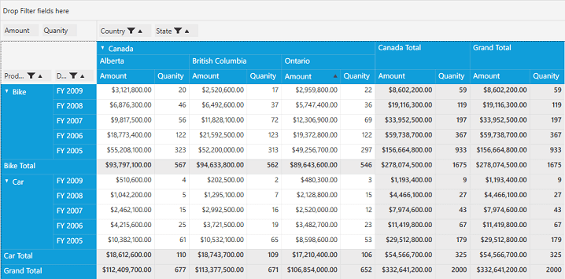
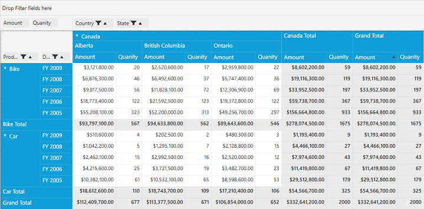

# Sorting by values using SortOptions

It allows users to sort the value columns in ascending or descending order and it is possible to enable or disable this feature to specific type of columns using the below illustrated **SortOptions**.

* Sort all the columns.
* Sort all columns other than total and grand total columns.
* Sort only total columns.
* Sort only grand total columns.
* Disable the sort.

Properties

* **SortDirection** - Gets or sets the sort order to ascending or descending. 
* **SortOption** - Gets or sets the sorting option as all, none, column sorting, total sorting, or grand total sorting.

##Defining the Sorting Option for PivotGrid

The **SortOption** property of PivotGrid control can be defined both in XAML and Code-Behind. Please refer the below code snippets and screen-shots.



<Grid>
    <syncfusion:PivotGridControl HorizontalAlignment="Left" Name="pivotGrid" VerticalAlignment="Top" SortOption=”All "    ItemSource="{Binding Source={StaticResource data}} " >
           
           <syncfusion:PivotGridControl.PivotRows>
                <syncfusion:PivotItem FieldHeader="Product " FieldMappingName="Product " TotalHeader="Total " />
                <syncfusion:PivotItem FieldHeader="Date " FieldMappingName="Date " TotalHeader="Total "/>
            </syncfusion:PivotGridControl.PivotRows>
            <syncfusion:PivotGridControl.PivotColumns>
                <syncfusion:PivotItem FieldHeader="Country " FieldMappingName="Country " TotalHeader="Total " />
                <syncfusion:PivotItem FieldHeader="State " FieldMappingName="State " TotalHeader="Total "/>
            </syncfusion:PivotGridControl.PivotColumns>
            <syncfusion:PivotGridControl.PivotCalculations>
                <syncfusion:PivotComputationInfo CalculationName = "Total " FieldName = "Amount " Format="C " SummaryType="DoubleTotalSum "/>
                <syncfusion:PivotComputationInfo CalculationName = "Total " FieldName = "Quantity " SummaryType="Count "/>
            </syncfusion:PivotGridControl.PivotCalculations>   
            
     </syncfusion:PivotGridControl>            
</Grid>





public partial class MainWindow: Window {
    PivotGridControl pivotGrid = new PivotGridControl();
    public MainWindow() {
        InitializeComponent();
        grid1.Children.Add(pivotGrid);
        pivotGrid.ItemSource = ProductSales.GetSalesData();
        PivotItem m_PivotItem = new PivotItem() {
            FieldHeader = "Product", FieldMappingName = "Product", TotalHeader = "Total"
        };
        PivotItem m_PivotItem1 = new PivotItem() {
            FieldHeader = "Date", FieldMappingName = "Date", TotalHeader = "Total"
        };
        PivotItem n_PivotItem = new PivotItem() {
            FieldHeader = "Country", FieldMappingName = "Country", TotalHeader = "Total"
        };
        PivotItem n_PivotItem1 = new PivotItem() {
            FieldHeader = "State", FieldMappingName = "State", TotalHeader = "Total"
        };
        // Adding PivotItem to PivotRows
        pivotGrid.PivotRows.Add(m_PivotItem);
        pivotGrid.PivotRows.Add(m_PivotItem1);
        // Adding PivotItem to PivotColumns
        pivotGrid.PivotColumns.Add(n_PivotItem);
        pivotGrid.PivotColumns.Add(n_PivotItem1);
        PivotComputationInfo m_PivotComputationInfo = new PivotComputationInfo() {
            CalculationName = "Amount", FieldName = "Amount", Format = "C", SummaryType = SummaryType.DoubleTotalSum
        };
        PivotComputationInfo m_PivotComputationInfo1 = new PivotComputationInfo() {
            CalculationName = "Quantity", FieldName = "Quantity", SummaryType = SummaryType.Count
        };
        pivotGrid.PivotCalculations.Add(m_PivotComputationInfo);
        pivotGrid.PivotCalculations.Add(m_PivotComputationInfo1);

        this.pivotGrid.SortOption = PivotSortOption.All;
    }
}
		


###Sorting all the Value Columns

**All** is used to enable the sorting on all the value columns of PivotGrid.

###Disable the Sorting

**None** is the default option and it disables sorting on all the value columns of PivotGrid.

###Sorting all Columns other than Total and GrandTotal columns

**ColumnSorting** enables sorting on all the value columns other than SubTotal and GrandTotal columns of PivotGrid.

###Sorting only Total columns

**TotalSorting** enables sorting only on the SubTotal columns or Summary columns of PivotGrid.

###Sorting only GrandTotal columns

**GrandTotalSorting** enables sorting only on the GrandTotal columns of PivotGrid.

##Multi-Column Sorting

Multi column sorting behavior has been created which allows you to sort the value columns by one field after another field. Please refer the [Multi-Column Sorting in Normal mode of PivotGrid control](http://help.syncfusion.com/wpf/pivotgrid/multi-column-sorting#multi-column-sorting-in-normal-mode-of-pivotgrid-control) topic for further references.

