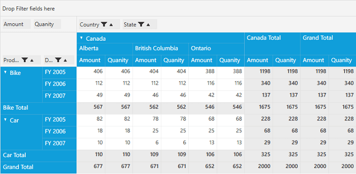

# Sorting

Sorting enables you to quickly visualize and understand your data better, organize, find the data that you want and ultimately make more effective decisions. By default, PivotGrid holds built-in Comparers for all data types so that it will populate the data in ascending/descending order according to its data type. You can also define your own custom Comparer in order to view the data based on your requirement.

**Sorting using Custom Comparer**
 
Sorting the data with your own custom Comparer can be achieved by defining your custom Comparer and initializing its instance to the `Comparer` property of the corresponding PivotItem.

For example, we have defined a custom `ReverseOrderComparer` for the PivotItem. Please find the appropriate code sample below.


   
/// 

/// ReverseOrderComparer for descending sort order.
/// 

public class ReverseOrderComparer: IComparer {
    public int Compare(object x, object y) {
        if (x == null && y == null)
            return 0;
        else if (y == null)
            return 1;
        else if (x == null)
            return -1;
        else
            return -x.ToString().CompareTo(y.ToString());
    }
}



In order to apply this comparer to PivotItem, we have created an instance for the `ReverseOrderComparer` and assigned it to the `Comparer` property of the *Product* PivotItem. Please refer the below code sample.



public MainWindow() {
    InitializeComponent();
    this.Loaded += MainWindow_Loaded;
}

void MainWindow_Loaded(object sender, RoutedEventArgs e) {
    PivotGridControl pivotGrid = new PivotGridControl();
    grid1.Children.Add(pivotGrid);
    PivotItem m_PivotItem = new PivotItem() {
        FieldHeader = "Product", FieldMappingName = "Product", TotalHeader = "Total", Comparer = new ReverseOrderComparer()
    };
    PivotItem m_PivotItem1 = new PivotItem() {
        FieldHeader = "Date", FieldMappingName = "Date", TotalHeader = "Total"
    };
    PivotItem n_PivotItem = new PivotItem() {
        FieldHeader = "Country", FieldMappingName = "Country", TotalHeader = "Total"
    };
    PivotItem n_PivotItem1 = new PivotItem() {
        FieldHeader = "State", FieldMappingName = "State", TotalHeader = "Total"
    };
    // Adding PivotItem to PivotRows
    pivotGrid.PivotRows.Add(m_PivotItem);
    pivotGrid.PivotRows.Add(m_PivotItem1);
    // Adding PivotItem to PivotColumns
    pivotGrid.PivotColumns.Add(n_PivotItem);
    pivotGrid.PivotColumns.Add(n_PivotItem1);
    PivotComputationInfo m_PivotComputationInfo = new PivotComputationInfo() {
        CalculationName = "Amount", FieldName = "Amount", SummaryType = SummaryType.Count
    };
    PivotComputationInfo m_PivotComputationInfo1 = new PivotComputationInfo() {
        CalculationName = "Quanity", FieldName = "Quanity", SummaryType = SummaryType.Count
    };
    pivotGrid.PivotCalculations.Add(m_PivotComputationInfo);
    pivotGrid.PivotCalculations.Add(m_PivotComputationInfo1);
    pivotGrid.ItemSource = ProductSales.GetSalesData();
}
  


_PivotGrid without ReverseOrderComparer_

_PivotGrid with ReverseOrderComparer_

