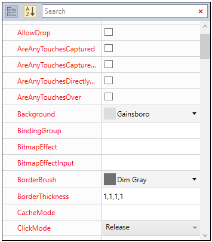

# Appearance in WPF PropertyGrid

This section explains the [PropertyGrid](https://www.syncfusion.com/wpf-ui-controls/propertygrid) control background, foreground, font weight and theme customization.

## Setting the Foreground

The User can change the foreground color for properties of `PropertyGrid.`[SelectedObject](https://help.syncfusion.com/cr/wpf/Syncfusion.PropertyGrid.Wpf~Syncfusion.Windows.PropertyGrid.PropertyGrid~SelectedObject.html) by setting the `Foreground` property. The default color value of `Foreground` property is `Blue`.




<syncfusion:PropertyGrid Foreground="Red" x:Name="propertyGrid">
            <syncfusion:PropertyGrid.SelectedObject>
                <Button></Button>
            </syncfusion:PropertyGrid.SelectedObject>
</syncfusion:PropertyGrid>




PropertyGrid propertyGrid = new PropertyGrid();
propertyGrid.SelectedObject = new Button();
propertyGrid.Foreground = Brushes.Red;




## Setting the Background and FontWeight

The users can change the background and font weight for all the properties by using the [ViewBackgroundColor](https://help.syncfusion.com/cr/wpf/Syncfusion.PropertyGrid.Wpf~Syncfusion.Windows.PropertyGrid.PropertyGrid~ViewBackgroundColor.html) and `FontWeight` properties.




<syncfusion:PropertyGrid ViewBackgroundColor="Cyan" FontWeight="Bold" x:Name="propertyGrid">
            <syncfusion:PropertyGrid.SelectedObject>
                <Button></Button>
            </syncfusion:PropertyGrid.SelectedObject>
</syncfusion:PropertyGrid>




PropertyGrid propertyGrid = new PropertyGrid();
propertyGrid.SelectedObject = new Button();
propertyGrid.ViewBackgroundColor = Brushes.Cyan;
propertyGrid.FontWeight = FontWeights.Bold;



### Background and FontWeight for the Editable and Readonly Properties

If the user want to differentiate between editable and non-editable properties, you can do this by using [EditableBackground](https://help.syncfusion.com/cr/wpf/Syncfusion.PropertyGrid.Wpf~Syncfusion.Windows.PropertyGrid.PropertyGrid~EditableBackground.html) and [EditableFontWeight](https://help.syncfusion.com/cr/wpf/Syncfusion.PropertyGrid.Wpf~Syncfusion.Windows.PropertyGrid.PropertyGrid~EditableFontWeight.html) properties to highlight editable properties and use the [ReadOnlyBackground](https://help.syncfusion.com/cr/wpf/Syncfusion.PropertyGrid.Wpf~Syncfusion.Windows.PropertyGrid.PropertyGrid~ReadOnlyBackground.html) and [ReadOnlyFontWeight](https://help.syncfusion.com/cr/wpf/Syncfusion.PropertyGrid.Wpf~Syncfusion.Windows.PropertyGrid.PropertyGrid~ReadOnlyFontWeight.html) properties to highlight non-editable properties.




//Model.cs
class Employee {
    public string EmployeeName { get; set; }
    [Editable(false)]
    public int EmployeeID { get; set; }     
    public int Age { get; set; }
    [ReadOnly(true)]
    public DateTime DOB { get; set; }
}

//ViewModel.cs
public class ViewModel {
    public Object SelectedEmployee { get; set; }
    public ViewModel() {
        SelectedEmployee = new Employee() { EmployeeName = "John", DOB = new DateTime(1995, 01, 08), Age=25, EmployeeID = 036 };
    }
}






<Window.DataContext>
    <local:ViewModel></local:ViewModel>
</Window.DataContext>
<syncfusion:PropertyGrid EditableBackground="LightGreen" EditableFontWeight="Bold"
                         ReadOnlyBackground="LightPink"  ReadOnlyFontWeight="UltraLight"
                         SelectedObject="{Binding SelectedEmployee}" x:Name="propertyGrid">
</syncfusion:PropertyGrid>




PropertyGrid propertyGrid = new PropertyGrid();
propertyGrid.EditableBackground = Brushes.LightGreen;
propertyGrid.EditableFontWeight = FontWeights.Bold;
propertyGrid.ReadOnlyBackground = Brushes.LightPink;
propertyGrid.ReadOnlyFontWeight = FontWeights.UltraLight;
ViewModel viewModel= new ViewModel();
propertyGrid.SelectedObject = viewModel.SelectedEmployee;




N> If you use `EditableBackground` or `ReadOnlyBackground` properties with `ViewBackgroundColor` property, `EditableBackground` and `ReadOnlyBackground` properties have higher priority.

N> If you use `EditableFontWeight` or `ReadOnlyFontWeight` properties with `FontWeight` property, `EditableFontWeight` and `ReadOnlyFontWeight` properties have higher priority.

## Group Header's foreground and background

The user can change the background and foreground of the `Category Header` by setting the [LineColor](https://help.syncfusion.com/cr/wpf/Syncfusion.PropertyGrid.Wpf~Syncfusion.Windows.PropertyGrid.PropertyGrid~LineColor.html) property and [CategoryForeground](https://help.syncfusion.com/cr/wpf/Syncfusion.PropertyGrid.Wpf~Syncfusion.Windows.PropertyGrid.PropertyGrid~CategoryForeground.html) property. The `LineColor` value applied to the background and `CategoryForeground` value applied to the foreground of the `Category Header` only on grouping state. To enable grouping state, use the [EnableGrouping](https://help.syncfusion.com/cr/wpf/Syncfusion.PropertyGrid.Wpf~Syncfusion.Windows.PropertyGrid.PropertyGrid~EnableGrouping.html) property as `true`.




<syncfusion:PropertyGrid x:Name="propertyGrid"  Width="350" 
                         LineColor="Cyan" CategoryForeground="Red">
    <syncfusion:PropertyGrid.SelectedObject>
        <Button></Button>
    </syncfusion:PropertyGrid.SelectedObject>
</syncfusion:PropertyGrid>




PropertyGrid propertyGrid = new PropertyGrid();
propertyGrid.Width = 350;
propertyGrid.Height = 400;
propertyGrid.SelectedObject = new Button();
propertyGrid.LineColor = Brushes.Cyan;
propertyGrid.CategoryForeground = Brushes.Red;




## Setting ToolTip

ToolTip is used to show the information about the segment, when you mouse over on the segment. By default, the tooltip is shown in the `PropertyGrid`. You can hide the tooltip for the properties by setting [EnableToolTip](https://help.syncfusion.com/cr/wpf/Syncfusion.PropertyGrid.Wpf~Syncfusion.Windows.PropertyGrid.PropertyGrid~EnableToolTip.html) Property as `false`. The default value of `EnableToolTip` property is `true`.




<syncfusion:PropertyGrid x:Name="propertyGrid"  Width="350"
                         EnableToolTip="False">
    <syncfusion:PropertyGrid.SelectedObject>
        <Button></Button>
    </syncfusion:PropertyGrid.SelectedObject>
</syncfusion:PropertyGrid>




PropertyGrid propertyGrid = new PropertyGrid();
propertyGrid.Width = 350;
propertyGrid.Height = 400;
propertyGrid.SelectedObject = new Button();
propertyGrid.EnableToolTip = false;




Click [here](https://github.com/SyncfusionExamples/wpf-property-grid-examples/tree/master/Samples/PropertyGrid-Apperance) to download the sample that showcases the `Background`,`ToolTip` and `Foreground` support. 

## Theme

The appearance of the `PropertyGrid` control can be customized by using the [SfSkinManager.SetVisualStyle](https://help.syncfusion.com/cr/cref_files/wpf/Syncfusion.SfSkinmanager.Wpf~Syncfusion.SfSkinmanager.SfSkinmanager~SetVisualStyle.html) method. The following are the various built-in visual styles for `PropertyGrid` control.

* Blend
* Default
* Lime
* Metro
* Office2010Black
* Office2010Blue
* Office2010Silver
* Office2013DarkGray
* Office2013LightGray
* Office2013White
* Office2016Colorful
* Office2016DarkGray
* Office2016White
* Office365
* Saffron
* SystemTheme
* VisualStudio2013
* VisualStudio2015

Here, the `Blend` style is applied to the `PropertyGrid`.




<syncfusion:PropertyGrid syncfusionskin:SfSkinManager.VisualStyle="Blend" x:Name="propertyGrid" >
    <syncfusion:PropertyGrid.SelectedObject>
        <Button></Button>
    </syncfusion:PropertyGrid.SelectedObject>
</syncfusion:PropertyGrid>







// Namespace for the SfSkinManager.
using Syncfusion.SfSkinManager;

PropertyGrid propertyGrid = new PropertyGrid();
propertyGrid.SelectedObject = new Button();
SfSkinManager.SetVisualStyle(propertyGrid, VisualStyles.Blend);




Click [here](https://github.com/SyncfusionExamples/wpf-property-grid-examples/tree/master/Samples/PropertyGrid-Themes) to download the sample that showcases the different theme support. 