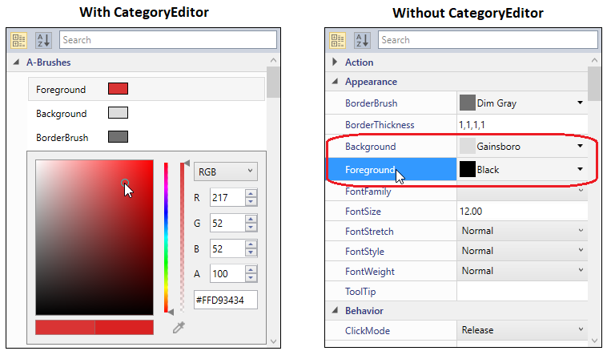

# CategoryEditor support

The PropertyGrid control supports several built-in editors, to give a good look and feel for the application (like in Expression Blend) using CustomEditors or CategoryEditors. CategoryEditor support enables you to set related properties (one or more properties) on a custom control. CategoryEditor can be applied for Grouping. While sorting, default editors will be displayed.

Adding CategoryEditor support to an Application 

Using CategoryEditor, you can set the related properties on a custom control. 

In the below example, Text related properties are grouped under one category using CategoryEditor support. You can add any number of CategoryEditors. You must add property names in the Properties collection CategoryEditor. Theproperties can also be shown in a  separate tab using the Category property of CategoryEditor. You have to set the Template to group the related properties, using the EditorTemplate property of CategoryEditor.

In the below example, FontWeightButton and FontListBox are the custom controls.

[XAML]

&lt;syncfusion:PropertyGrid x:Name="propertyGrid" SelectedObject="{Binding ElementName=Btn}" Margin="50"                            Width="350" BorderBrush="Gray" BorderThickness="3" HorizontalAlignment="Center" VerticalAlignment="Center"&gt;
    &lt;syncfusion:PropertyGrid.CategoryEditors&gt;
        &lt;syncfusion:CategoryEditor Category="MyFonts"&gt;
            &lt;syncfusion:CategoryEditor.Properties&gt;
                &lt;syncfusion:CategoryEditorProperty Name="FontSize"/&gt;
                &lt;syncfusion:CategoryEditorProperty Name="FontFamily"/&gt;
                &lt;syncfusion:CategoryEditorProperty Name="FontStyle"/&gt;
                &lt;syncfusion:CategoryEditorProperty Name="FontWeight"/&gt;
            &lt;/syncfusion:CategoryEditor.Properties&gt;
            &lt;syncfusion:CategoryEditor.EditorTemplate&gt;
                &lt;DataTemplate&gt;
                    &lt;Border HorizontalAlignment="Stretch" VerticalAlignment="Stretch" BorderBrush="Gray" BorderThickness="1" Margin="10" Background="LightGray" CornerRadius="5"&gt;
                        &lt;Grid&gt;
                            &lt;Grid.ColumnDefinitions&gt;
                                &lt;ColumnDefinition Width="5*"/&gt;
                                &lt;ColumnDefinition Width="5*"/&gt;
                            &lt;/Grid.ColumnDefinitions&gt;
                            &lt;Grid.RowDefinitions&gt;
                                &lt;RowDefinition Height="Auto"/&gt;
                                &lt;RowDefinition Height="Auto"/&gt;
                            &lt;/Grid.RowDefinitions&gt;
                            &lt;local:FontListBox SelectedValue="{Binding Path=CategoryValueProperties[FontFamily].Value,Mode=TwoWay}" Grid.Row="0" Grid.Column="0" Margin="5"/&gt;
                            &lt;shared:IntegerTextBox Value="{Binding Path=CategoryValueProperties[FontSize].Value,Mode=TwoWay}" Grid.Row="0" Grid.Column="1" Margin="5"/&gt;
                            &lt;local:FontWeightButton SelectedValue="{Binding Path=CategoryValueProperties[FontWeight].Value,Mode=TwoWay}" Grid.Row="1" Grid.Column="0" Margin="5" PropType="FontWeight"/&gt;
                            &lt;local:FontWeightButton SelectedValue="{Binding Path=CategoryValueProperties[FontStyle].Value,Mode=TwoWay}" Grid.Row="1" Grid.Column="1" Margin="5" PropType="FontStyle"/&gt;
                        &lt;/Grid&gt;
                    &lt;/Border&gt;
                &lt;/DataTemplate&gt;
            &lt;/syncfusion:CategoryEditor.EditorTemplate&gt;
        &lt;/syncfusion:CategoryEditor&gt;
    &lt;/syncfusion:PropertyGrid.CategoryEditors&gt;
&lt;/syncfusion:PropertyGrid&gt;

{:.image }

Properties

_CategoryEditor Table_

<table>
<tr>
<td>
Property </td><td>
Description </td><td>
Type </td><td>
Data Type </td><td>
Reference links </td></tr>
<tr>
<td>
CategoryEditors</td><td>
CategoryEditor support enables you to set the related properties (one or more properties) on a custom control.</td><td>
DependencyProperty</td><td>
CategoryEditorCollection</td><td>
</td></tr>
</table>

Sample Link

1. Select Start -> Programs -> Syncfusion -> Essential Studio xx.x.x.xx -> Dashboard.
2. Select   Run Locally Installed Samples in WPF Button.
3. Now expand the PropertyGrid treeview item in the Sample Browser.
4. Choose any one of the samples listed under it to launch. 

