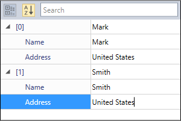
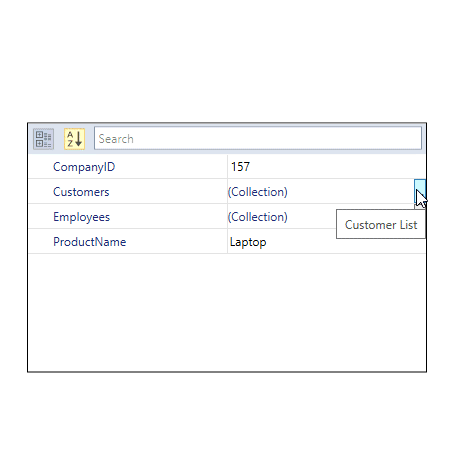
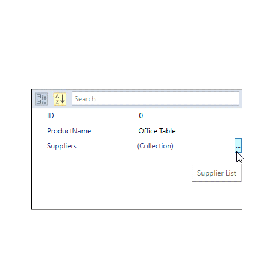
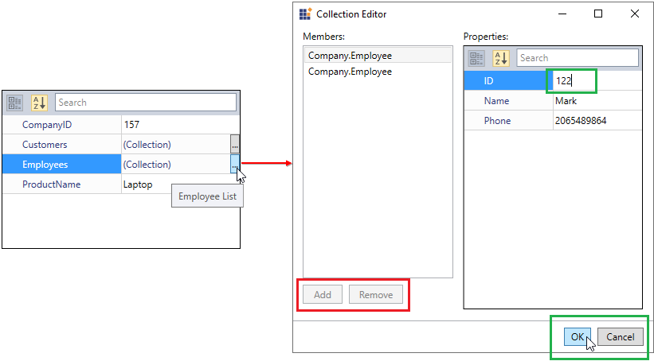
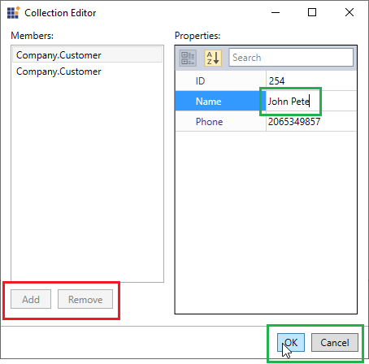

# Collection Editor in WPF PropertyGrid

You can edit (add, remove) a collection type of property such as List, ObservableCollection using the `Collection Editor` in the [PropertyGrid](https://help.syncfusion.com/cr/wpf/Syncfusion.Windows.PropertyGrid.PropertyGrid.html).

## How to add or remove items in collection using collection editor

You can add or remove the new items into the collection type properties by clicking the `Add` or `Remove` button. If you want to add the items into `SelectedObject` collection, you must click the `Ok` button to update the added items into the collection, otherwise it is not updated. 

N> Collection type property must be derived from the `IList` type to edit the collection properties in  the `SelectedObject`. The `IList` collection property must contain the non-parameter constructor to edit the items in the collection, otherwise only the items in the collection property can be removed.

N> You will not be able to edit a collection of primitive type, such as `List<int>` and `List<string>`. 

## Edit a selected object, which is of type collection

If you directly assign the collection instance as [SelectedObject](https://help.syncfusion.com/cr/wpf/Syncfusion.Windows.PropertyGrid.PropertyGrid.html#Syncfusion_Windows_PropertyGrid_PropertyGrid_SelectedObject), it generates value editor for the each collection property items.




public class Persons {
    public string Name { get; set; }
    public string Address { get; set; }
    public override string ToString() {
        return Name;
    }
}

public class ViewModel {
    private ObservableCollection<Person> persons = new ObservableCollection<Person>();
    public ObservableCollection<Person> Persons {
        get {
            return persons;
        }
        set {
            persons = value;
        }
    }

    public ViewModel() {
        persons.Add(new Person() { Name = "Mark", Address = "United States" });
        persons.Add(new Person() { Name = "Smith", Address = "United States" });

    }
}



 



<syncfusion:PropertyGrid PropertyExpandMode="NestedMode"
                         SelectedObject="{Binding Persons}" 
                         x:Name="propertyGrid">
    <syncfusion:PropertyGrid.DataContext>
        <local:ViewModel></local:ViewModel>
    </syncfusion:PropertyGrid.DataContext>
</syncfusion:PropertyGrid>




PropertyGrid propertyGrid = new PropertyGrid();
propertyGrid.DataContext = new ViewModel();
propertyGrid.SetBinding(PropertyGrid.SelectedObjectProperty, new Binding("Persons"));
propertyGrid1.PropertyExpandMode = PropertyExpandModes.NestedMode;




N> View [Sample](https://github.com/SyncfusionExamples/wpf-property-grid-examples/tree/master/Samples/DirectCollectionEditor) on GitHub

## Edit a selected object, which has a property of type collection.

You can add, remove or edit the collection type property item by using the `Collection Editor`.




public class Customer {
    public int ID { get; set; }
    public string Name { get; set; }
    public string Phone { get; set; }
}

public class Employee {
    public int ID { get; set; }
    public string Name { get; set; }
    public string Phone { get; set; }
}

public class CustomerCollection : ObservableCollection<Customer> {
    public CustomerCollection() { }
    public override string ToString() {
        return "Customer List";
    }
}

public class EmployeeList : List<Employee> {
    public EmployeeList() { }
    public override string ToString() {
        return "Employee List";
    }
}

public class Product {
    public int CompanyID { get; set; }
    public string ProductName { get; set; }
    public CustomerCollection Customers { get; set; }
    public EmployeeList Employees { get; set; }
}

public class ViewModel {
    public Product DemoProduct { get; set; }

    public ViewModel() {
        DemoProduct = new Product()
        {
            CompanyID = 157,
            ProductName = "Laptop",
            Customers = new CustomerCollection
            {
                new Customer() { ID = 0, Name = "John", Phone = "2065349857" },
                new Customer() { ID = 1, Name = "Peter", Phone = "2065981189" }
            },

            Employees = new EmployeeList
            {
                new Employee() { ID = 0, Name = "Mark", Phone = "2065489864" },
                new Employee() { ID = 1, Name = "David", Phone = "2063481135" }
            }
        };
    }
}



 



<syncfusion:PropertyGrid SelectedObject="{Binding DemoProduct}" 
                         x:Name="propertyGrid">
    <syncfusion:PropertyGrid.DataContext>
        <local:ViewModel></local:ViewModel>
    </syncfusion:PropertyGrid.DataContext>
</syncfusion:PropertyGrid>




PropertyGrid propertyGrid = new PropertyGrid();
propertyGrid.DataContext = new ViewModel();
propertyGrid.SetBinding(PropertyGrid.SelectedObjectProperty, new Binding("DemoProduct"));




N> View [Sample](https://github.com/SyncfusionExamples/wpf-property-grid-examples/tree/master/Samples/CollectionEditor) on GitHub

## Collection Editor for nested collection property

You can update the nested collection property item by using the `Collection Editor`.




public class AddressDetails {
    public int DoorNo { get; set; }
    public string City { get; set; }
}

public class Supplier {
    public int ID { get; set; }
    public string Name { get; set; }
    public string Phone { get; set; }
    public ObservableCollection<AddressDetails> Address { get; set; }
}

public class SupplierList : List<Supplier> {
    public SupplierList() : base() { }
    public override string ToString()
    {
        return "Supplier List";
    }
}

public class Product {
    public int ID { get; set; }
    public string ProductName { get; set; }
    public SupplierList Suppliers { get; set; }
}

public ViewModel() {
    DemoProduct = new Product() {
        ID = 0,
        ProductName = "Office Table",
        Suppliers = new SupplierList
        {
            new Supplier()
            {
                ID = 0,
                Name = "Jack Plank",
                Phone = "2065559857",
                Address = new ObservableCollection<AddressDetails>()
                {
                    new AddressDetails
                    {
                        City="Mexico",
                        DoorNo=456
                    }
                }
            }
        }
    };
}



 



<syncfusion:PropertyGrid SelectedObject="{Binding DemoProduct}" 
                         x:Name="propertyGrid">
    <syncfusion:PropertyGrid.DataContext>
        <local:ViewModel></local:ViewModel>
    </syncfusion:PropertyGrid.DataContext>
</syncfusion:PropertyGrid>




PropertyGrid propertyGrid = new PropertyGrid();
propertyGrid.DataContext = new ViewModel();
propertyGrid.SetBinding(PropertyGrid.SelectedObjectProperty, new Binding("DemoProduct"));




N> View [Sample](https://github.com/SyncfusionExamples/wpf-property-grid-examples/tree/master/Samples/NestedCollectionEditor) on GitHub

## Readonly mode for collection type properties

If you want to restrict the user to add or remove the items in the collection type properties, handle the [CollectionEditorOpening](https://help.syncfusion.com/cr/wpf/Syncfusion.Windows.PropertyGrid.PropertyGrid.html#Syncfusion_Windows_PropertyGrid_PropertyGrid_CollectionEditorOpening) event and set the [CollectionEditorOpeningEventArgs.IsReadonly](https://help.syncfusion.com/cr/wpf/Syncfusion.Windows.PropertyGrid.CollectionEditorOpeningEventArgs.html#Syncfusion_Windows_PropertyGrid_CollectionEditorOpeningEventArgs_IsReadonly) property value as `true`. The default value of `CollectionEditorOpeningEventArgs.IsReadonly` property is `false`.

N> You will not be able to add or remove the items into the collection type properties. But, you can edit and save the existing items that are available in the collection type properties.




public class Customer {
    public int ID { get; set; }
    public string Name { get; set; }
    public string Phone { get; set; }
}

public class Employee {
    public int ID { get; set; }
    public string Name { get; set; }
    public string Phone { get; set; }
}

public class CustomerCollection : ObservableCollection<Customer> {
    public CustomerCollection() { }
    public override string ToString() {
        return "Customer List";
    }
}

public class EmployeeList : List<Employee> {
    public EmployeeList() { }
    public override string ToString() {
        return "Employee List";
    }
}

public class Product {
    public int CompanyID { get; set; }
    public string ProductName { get; set; }
    public CustomerCollection Customers { get; set; }
    public EmployeeList Employees { get; set; }
}

public class ViewModel {
    public Product DemoProduct { get; set; }

    public ViewModel() {
        DemoProduct = new Product()
        {
            CompanyID = 157,
            ProductName = "Laptop",
            Customers = new CustomerCollection
            {
                new Customer() { ID = 0, Name = "John", Phone = "2065349857" },
                new Customer() { ID = 1, Name = "Peter", Phone = "2065981189" }
            },

            Employees = new EmployeeList
            {
                new Employee() { ID = 0, Name = "Mark", Phone = "2065489864" },
                new Employee() { ID = 1, Name = "David", Phone = "2063481135" }
            }
        };
    }
}







<syncfusion:PropertyGrid CollectionEditorOpening="propertyGrid_CollectionEditorOpening"
                         SelectedObject="{Binding DemoProduct}" 
                         x:Name="propertyGrid">
    <syncfusion:PropertyGrid.DataContext>
        <local:ViewModel></local:ViewModel>
    </syncfusion:PropertyGrid.DataContext>
</syncfusion:PropertyGrid>




PropertyGrid propertyGrid = new PropertyGrid();
propertyGrid.DataContext = new ViewModel();
propertyGrid.SetBinding(PropertyGrid.SelectedObjectProperty, new Binding("DemoProduct"));
propertyGrid.CollectionEditorOpening += propertyGrid_CollectionEditorOpening;




You can handle the `CollectionEditorOpening` event as follows,




private void propertyGrid_CollectionEditorOpening(object sender, CollectionEditorOpeningEventArgs e)
{
    //Enabling the readonly collection editor
    e.IsReadonly = true;
}




Here, `Add` and `Remove` buttons are disabled. `Ok` and `Cancel` button are enabled to edit the existing item values.

N> [View Sample in GitHub](https://github.com/SyncfusionExamples/wpf-property-grid-examples/tree/master/Samples/CollectionEditorOpening)

## Readonly mode for specific property of collection type

If you want to restrict the user to add or remove the items in the specific property of collection type, create that collection property as the type of `ReadOnlyCollection`.

N> You will not be able to add or remove the items into the readonly collection type properties. But, you can edit and save the existing items that are available in the readonly collection type properties.




public class Customer
{
    public int ID { get; set; }
    public string Name { get; set; }
    public string Phone { get; set; }
}

public class Employee
{
    public int ID { get; set; }
    public string Name { get; set; }
    public string Phone { get; set; }
}

public class Product
{
    public int CompanyID { get; set; }
    public string ProductName { get; set; }        
    public List<Employee> Employees { get; set; }

    internal List<Customer> customers;
    public ReadOnlyCollection<Customer> Customers
    {
        get 
        {
            return customers.AsReadOnly();
        }
    }
}

public class ViewModel
{
    public Product DemoProduct { get; set; }

    public ViewModel()
    {
        DemoProduct = new Product()
        {
            CompanyID = 157,
            ProductName = "Laptop",
            customers = new List<Customer>
            {
                new Customer() { ID = 0, Name = "John", Phone = "2065349857" },
                new Customer() { ID = 1, Name = "Peter", Phone = "2065981189" }
            },
            Employees = new List<Employee>()
            {
                new Employee() { ID = 0, Name = "Mark", Phone = "2065489864" },
                new Employee() { ID = 1, Name = "David", Phone = "2063481135" }
            }
        };             
    }
}







<syncfusion:PropertyGrid SelectedObject="{Binding DemoProduct}" 
                         x:Name="propertyGrid">
    <syncfusion:PropertyGrid.DataContext>
        <local:ViewModel></local:ViewModel>
    </syncfusion:PropertyGrid.DataContext>
</syncfusion:PropertyGrid>




PropertyGrid propertyGrid = new PropertyGrid();
propertyGrid.DataContext = new ViewModel();
propertyGrid.SetBinding(PropertyGrid.SelectedObjectProperty, new Binding("DemoProduct"));




Here, `Customers` property is a readonly collection type property. So, you will not be able to add or remove the items into the `Customers` property.

N> [View Sample in GitHub](https://github.com/SyncfusionExamples/wpf-property-grid-examples/tree/master/Samples/CollectionEditorOpening)

## Restrict the collection editor from opening

You can restrict the opening of collection editor window which used to edit the collection type properties in `PropertyGrid` by handling the [CollectionEditorOpening](https://help.syncfusion.com/cr/wpf/Syncfusion.Windows.PropertyGrid.PropertyGrid.html#Syncfusion_Windows_PropertyGrid_PropertyGrid_CollectionEditorOpening) event and set the [CollectionEditorOpeningEventArgs.Cancel](https://help.syncfusion.com/cr/wpf/Syncfusion.Windows.PropertyGrid.CollectionEditorOpeningEventArgs.html) property value as `true`. The default value of `CollectionEditorOpeningEventArgs.Cancel` property is `false`.




public class Customer {
    public int ID { get; set; }
    public string Name { get; set; }
    public string Phone { get; set; }
}

public class Employee {
    public int ID { get; set; }
    public string Name { get; set; }
    public string Phone { get; set; }
}

public class CustomerCollection : ObservableCollection<Customer> {
    public CustomerCollection() { }
    public override string ToString() {
        return "Customer List";
    }
}

public class EmployeeList : List<Employee> {
    public EmployeeList() { }
    public override string ToString() {
        return "Employee List";
    }
}

public class Product {
    public int CompanyID { get; set; }
    public string ProductName { get; set; }
    public CustomerCollection Customers { get; set; }
    public EmployeeList Employees { get; set; }
}

public class ViewModel {
    public Product DemoProduct { get; set; }

    public ViewModel() {
        DemoProduct = new Product()
        {
            CompanyID = 157,
            ProductName = "Laptop",
            Customers = new CustomerCollection
            {
                new Customer() { ID = 0, Name = "John", Phone = "2065349857" },
                new Customer() { ID = 1, Name = "Peter", Phone = "2065981189" }
            },

            Employees = new EmployeeList
            {
                new Employee() { ID = 0, Name = "Mark", Phone = "2065489864" },
                new Employee() { ID = 1, Name = "David", Phone = "2063481135" }
            }
        };
    }
}







<syncfusion:PropertyGrid CollectionEditorOpening="propertyGrid_CollectionEditorOpening"
                         SelectedObject="{Binding DemoProduct}" 
                         x:Name="propertyGrid">
    <syncfusion:PropertyGrid.DataContext>
        <local:ViewModel></local:ViewModel>
    </syncfusion:PropertyGrid.DataContext>
</syncfusion:PropertyGrid>




PropertyGrid propertyGrid = new PropertyGrid();
propertyGrid.DataContext = new ViewModel();
propertyGrid.SetBinding(PropertyGrid.SelectedObjectProperty, new Binding("DemoProduct"));
propertyGrid.CollectionEditorOpening += propertyGrid_CollectionEditorOpening;




You can handle the `CollectionEditorOpening` event as follows,




private void propertyGrid_CollectionEditorOpening(object sender, CollectionEditorOpeningEventArgs e)
{
    //Restrict collection editor window opening
    e.Cancel = false;
}




N> [View Sample in GitHub](https://github.com/SyncfusionExamples/wpf-property-grid-examples/tree/master/Samples/CollectionEditorOpening)
