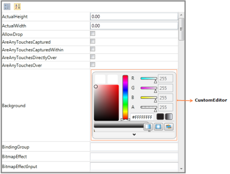

# CustomEditor support

The PropertyGrid control supports several built-in editors, to give a good look and feel for the application (like in Expression Blend). Using CustomEditors or CategoryEditors. CustomEditor support enables you to set custom value editors for particular properties, instead of default editors.

Adding CustomEditor support to an Application 

Using CustomEditorCollection property user can add custom editors to PropertyGrid control. To create CustomEditor user needs to implement ITypeEditor interface. In the below example for Background(Type – Brush), by default ColorPicker will be displayed as ValueEditor. By setting CustomEditor for Background, ColorEdit will be displayed as ValueEditor instead of ColorPicker.

<table>
<tr>
<td>
[XAML]    &lt;Grid x:Name="LayoutRoot" Background="White" HorizontalAlignment="Stretch" VerticalAlignment="Stretch"&gt;         &lt;Button Height="25" Width="100" VerticalAlignment="Top" x:Name="Btn"/&gt;         &lt;syncfusion:PropertyGrid x:Name="propertyGrid" SelectedObject="{Binding ElementName=Btn}" Margin="50" Width="500" BorderBrush="Gray" BorderThickness="3" HorizontalAlignment="Center" VerticalAlignment="Center"/&gt;     &lt;/Grid&gt;</td></tr>
<tr>
<td>
[C#]    /// &lt;summary&gt;     /// Interaction logic for MainWindow.xaml.     /// &lt;/summary&gt;     public partial class MainWindow : Window     {         /// &lt;summary&gt;         /// Initializes a new instance of the &lt;see cref="MainWindow"/&gt; class.         /// &lt;/summary&gt;         public MainWindow()         {             InitializeComponent();             // Creating CustomEditor for Background.             CustomEditor editor = new CustomEditor();             editor.Properties.Add("Background");             editor.Editor = new ColorEditEditor();             this.propertyGrid.CustomEditorCollection.Add(editor);         }     }      public class ColorEditEditor : ITypeEditor     {         public void Attach(PropertyViewItem property, PropertyItem info)         {             if (info.CanWrite)             {                 var binding = new Binding("Value")                 {                     Mode = BindingMode.TwoWay,                     Source = info,                     ValidatesOnExceptions = true,                     ValidatesOnDataErrors = true                 };                 BindingOperations.SetBinding(colorEdit, ColorEdit.BrushProperty, binding);             }             else             {                 var binding = new Binding("Value")                 {                     Mode = BindingMode.OneWayToSource,                     Source = info,                     ValidatesOnExceptions = true,                     ValidatesOnDataErrors = true                 };                 BindingOperations.SetBinding(colorEdit, ColorEdit.BrushProperty, binding);             }         }          public ColorEdit colorEdit;         public object Create(System.Reflection.PropertyInfo PropertyInfo)         {             colorEdit = new ColorEdit();             return colorEdit;         }          public void Detach(PropertyViewItem property)         {             throw new NotImplementedException();         }     }</td></tr>
</table>

{:.image }

Properties

_CustomEditor Table_

<table>
<tr>
<td>
Property </td><td>
Description </td><td>
Type </td><td>
Data Type </td><td>
Reference links </td></tr>
<tr>
<td>
CustomEditorCollection</td><td>
CustomEditor support enables you to set custom value editors for particular properties, instead of default editors.</td><td>
DependencyProperty</td><td>
CustomEditorCollection</td><td>
</td></tr>
</table>

Sample Link

1. Select Start -> Programs -> Syncfusion -> Essential Studio xx.x.x.xx -> Dashboard.
2. Select   Run Locally Installed Samples in WPF Button.
3. Now expand the PropertyGrid treeview item in the Sample Browser.
4. Choose any one of the samples listed under it to launch. 

