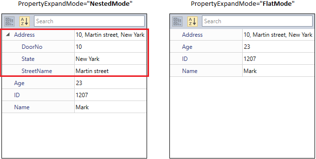

# Expand Nested Properties in PropertyGrid

The [PropertyGrid](https://www.syncfusion.com/wpf-ui-controls/propertygrid) control has support to expand instance properties of a class.

###  Explore the nested properties

We can choose whether the nested properties of the [SelectedObject](https://help.syncfusion.com/cr/wpf/Syncfusion.PropertyGrid.Wpf~Syncfusion.Windows.PropertyGrid.PropertyGrid~SelectedObject.html) can be expanded or not by using the [PropertyExpandMode](https://help.syncfusion.com/cr/wpf/Syncfusion.PropertyGrid.Wpf~Syncfusion.Windows.PropertyGrid.PropertyGrid~PropertyExpandMode.html) property.  By default, `PropertyExpandMode` value is `FlatMode`, thus the nested properties are not shown.  If we want to display the nested properties, we can set the `PropertyExpandMode`  property as `NestedMode`.




// A Class that represents the nested properties
public class Address {
    public string State { get; set; }        
    public string StreetName { get; set; }
    public string DoorNo { get; set; }
    public override string ToString() {
        return DoorNo + ", " + StreetName + ", " + State;
    }
}

public class Employee {
    public string Name { get; set; }
    public string ID { get; set; }
    public int Age { get; set; }
    // Property contains the nested properties
    public Address Address { get; set; }
}

public class ViewModel {
    public object SelectedEmployee { get; set; }
    public PropertyExpandModes PropertyExpandMode { get; set; }
    public ViewModel() {
        SelectedEmployee = new Employee() {                
            Age = 23,
            ID = "1207",
            Name = "Mark",
            Address = new Address()
            {
                State = "New Yark",
                DoorNo = "10",
                StreetName = "Martin street"
            }
        };
        PropertyExpandMode = PropertyExpandModes.FlatMode;
    }
}







<syncfusion:PropertyGrid PropertyExpandMode="NestedMode"
                         SelectedObject="{Binding SelectedEmployee}"
                         x:Name="propertyGrid1">
    <syncfusion:PropertyGrid.DataContext>
        <local:ViewModel></local:ViewModel>
    </syncfusion:PropertyGrid.DataContext>
</syncfusion:PropertyGrid>

 


PropertyGrid propertyGrid = new PropertyGrid();
propertyGrid.DataContext = new ViewModel();
propertyGrid.SetBinding(PropertyGrid.SelectedObjectProperty, new Binding("SelectedEmployee"));
propertyGrid1.PropertyExpandMode = PropertyExpandModes.NestedMode;

 
 

Here, `Address` is a class type property in the `Employee` class. It includes the `City`, `StreetName`, and `DoorNo` properties that are shown by setting `PropertyExpandMode` property as `NestedMode`.

Click [here](https://github.com/SyncfusionExamples/wpf-property-grid-examples/tree/master/Samples/Nested_Properties) to download the sample that showcases the nested property expanding support.