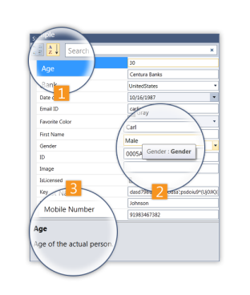
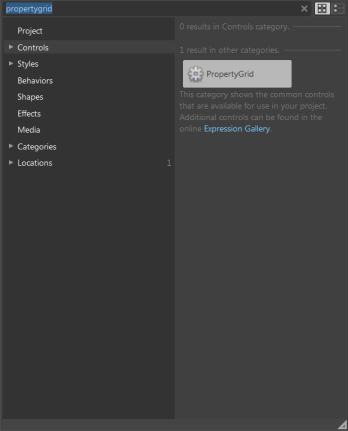
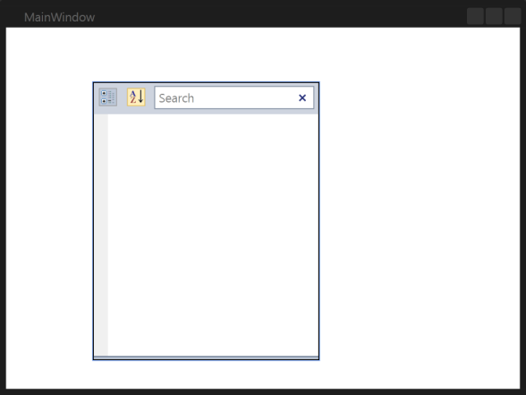
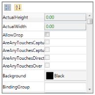
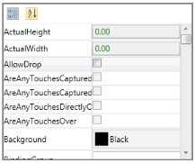
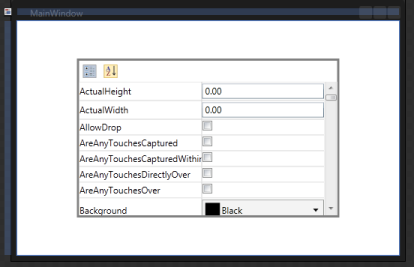

# Getting Started

This section guides you through getting started with the PropertyGrid control. It covers the following topics:

## Visual structure

1. ButtonPanel Items
1. Group Button — Used to group the properties.
2. Sort Button — Used to sort the properties in ascending or descending order.
3. Search Box — Used to filter properties.
2. ToolTip — Displays the name and type of the property on mouse over.
3. Description Panel — Gives a short description about the property.

## Creating the control through Visual Studio

To create the PropertyGrid control:

1. Drag and drop the PropertyGrid from the Visual Studio Toolbox as shown below.

   

   

2. Configure the properties of the PropertyGrid using the VS Properties window.

## Creating the control through Expression Blend

The PropertyGrid control can also be created and configured using Microsoft Expression Blend. To create the control through Expression Blend:

1. Create a WPF project in Expression Blend and add the reference to the following assemblies:
   
   1. Syncfusion.Tools.Wpf
   2. Syncfusion.Shared.Wpf
   3. Syncfusion.PropertyGrid.Wpf
   4. Syncfusion.Core
   
2. Search for the PropertyGrid in the Toolbox.

   

3. Drag and drop the PropertyGrid into the designer. The PropertyGrid control is created as shown in the following screenshot. 

   

The user can customize any part of the PropertyGrid using the template editing feature in Expression Blend. 

## Populating the properties

This section explains how to populate the properties of any selected object.

### Through XAML

The user can populate the properties of selected object using XAML.

The following code snippet shows how to create the PropertyGrid control in XAML. 




<syncfusion:PropertyGrid  Name="propertyGrid1" Height="500" Width="300" >
<syncfusion:PropertyGrid.SelectedObject>
<Button/>
</syncfusion:PropertyGrid.SelectedObject>
</syncfusion:PropertyGrid>




In the above code snippet, the Button is set as SelectedObject for the PropertyGrid; thus, the PropertyGrid shows all the properties available in the Button. 

This will create the property as shown in the following screenshot:

### Through C&#35

To create the PropertyGrid control:

1. Include the following namespace to the using directives list for creating the PropertyGrid control in C#.




using Syncfusion.Windows.PropertyGrid;




2. Create the PropertyGrid as follows:




PropertyGrid pGrid = new PropertyGrid();
pGrid.SelectedObject = new Button();




### Name and description of properties

You can edit the custom object properties using the PropertyGrid. The following example illustrates how to edit the custom object properties.

1. Create a class called Person and define the properties. 




[TypeConverter(typeof(ExpandableObjects))]
public class Person
{
	public Person()
	{            
		Name = "Johnson";
		Age = 30;
		Mobile = 91983467382;
		Email = "carljohnson@gta.com";
		ID = "0005A";
		DOB = new DateTime(1987, 10, 16);           
	}
	[CategoryAttribute("Identity")]
	[DisplayNameAttribute("Name")]
	[DescriptionAttribute("Name of the actual person.")]
	public string Name
	{
		get;
		set;
	}
	[CategoryAttribute("Identity")]
	[DisplayNameAttribute("ID")]
	[DescriptionAttribute("ID of the actual person.")]
	public string ID
	{
		get;
		set;
	}
	[CategoryAttribute("Identity")]
	[DisplayNameAttribute("Date of Birth")]
	[DescriptionAttribute("Birth date of the actual person.")]
	public DateTime DOB
	{
		get;
		set;
	}
	[CategoryAttribute("Contact Details")]
	[DisplayNameAttribute("Email ID")]
	[DescriptionAttribute("Email address of the actual person.")]
	public string Email
	{
		get;
		set;
	}
    [CategoryAttribute("Contact Details")]
	[DisplayNameAttribute("Mobile Number")]
	[DescriptionAttribute("Contact number of the actual person.")]
	public long Mobile
	{
		get;
		set;
	}
	[CategoryAttribute("Identity")]
	[DisplayNameAttribute("Age")]
	[DescriptionAttribute("Age of the actual person.")]
	public int Age
	{
		get;
		set;
	}
    [CategoryAttribute("Identity")]
	[DisplayNameAttribute("Gender")]
	[DescriptionAttribute("Gender information of the actual person.")]
	public Gender Gender
	{
		get;
		set;
	}
	[CategoryAttribute("Location")]
	[DisplayNameAttribute("Country")]
	[DescriptionAttribute("Country where the person is located.")]
	public Country Country
	{
		get;
		set;
	}       
}
public enum Country
{
	UnitedStates,
	Germany,
	Canada,
}




2. Set the SelectedObject of the property to the instance of the class Person.




PropertyGrid pGrid = new PropertyGrid();
pGrid.SelectedObject = new Person();




3. The PropertyGrid will be generated as shown in the following screenshot.

### Edit properties using custom editor

The PropertyGrid also provides custom editor support. The following example shows how to create the custom editor.

1. Define the custom editor with the ITypeEditor interface as follows:




public class UpDownEditor : ITypeEditor
{
	public void Attach(PropertyViewItem property, PropertyItem info)
	{
		if (info.CanWrite)
		{
			var binding = new Binding("Value")
			{
				Mode = BindingMode.TwoWay,
				Source = info,
				ValidatesOnExceptions = true,
				ValidatesOnDataErrors = true
			};
			BindingOperations.SetBinding(upDown, UpDown.ValueProperty, binding);
		}
		else
		{
			upDown.AllowEdit = false;
			var binding = new Binding("Value")
			{
				Source = info,
				ValidatesOnExceptions = true,
				ValidatesOnDataErrors = true
			};
			BindingOperations.SetBinding(upDown, UpDown.ValueProperty, binding);
		}
	}
    UpDown upDown;
	public object Create(PropertyInfo propertyInfo)
	{
		upDown = new UpDown()
		{
			ApplyZeroColor = false
		};
		if (propertyInfo.Name == "FontSize" || propertyInfo.Name == "MinWidth" || propertyInfo.Name == "MinHeight" || propertyInfo.Name == "MaxHeight" || propertyInfo.Name == "MaxWidth" ||
		propertyInfo.Name == "Height" || propertyInfo.Name == "Width" || propertyInfo.Name == "ActualWidth" || propertyInfo.Name == "ActualHeight")
		{
			upDown.MinValue = 0;
		}
		if (propertyInfo.Name == "Opacity")
		{
			upDown.MinValue = 0.0;
			upDown.MaxValue = 1.0;
			upDown.Step = 0.1;
		}
		return upDown;
	}
	public void Detach(PropertyViewItem property)
	{
		throw new NotImplementedException();
	}
}




The UpDownEditor given in the above code snippet is used to edit the double values. Since the UpDown control has features like scroll buttons to increase the value, it makes it easier to edit the property values of type double. 

2. Create an instance of Customer Editor with this UpDownEditor as follows:




CustomEditor upDownEditor = new CustomEditor() 
{ 
	HasPropertyType = true, 			
	PropertyType = typeof(double), 
	Editor = new UpDownEditor() 
};




3. Add this custom editor instance to the CustomEditorCollection property of the PropertyGrid as follows:



 
pgridInstance.CustomEditorCollection.Add(brusheditor); 




The PropertyGrid displays the UpDownEditor as shown in the following screenshot for the double type values.

## Visual styles

The PropertyGrid control supports the following built-in visual styles:

* Office2007Blue
* Office2007Black
* Office2007Silver
* Office2010Blue
* Office2010Black
* Office2010Silver
* Blend
* Metro
* Transparent

The visual style can be applied in XAML as follows:




<syncfusion:PropertyGrid
syncfusion:SkinStorage.VisualStyle="Office2010Blue" />   




The PropertyGrid control gets the Office2010Blue look.

The visual styles can be applied in C# as follows:




SkinStorage.SetVisualStyle(propertyGridInstance, "Office2010Blue");




## Structure of the PropertyGrid control

* Button panel—Shows the GroupButton and SortButton to help the user at run time.
* GroupButton—Groups the properties based on Category attribute of the property.
* SortButton—Displays the properties in sorting order in PropertyGrid.
* PropertyGrid—Lists all the properties

## Adding PropertyGrid to an application

The PropertyGrid control can be added to an application by using Visual Studio and Blend.

### Adding through C#

Following are the steps to add the PropertyGrid control by using VisualStudio in C#:

1. Open Visual Studio. On the File menu, select New -> Project. This opens the New Project Dialog box.

   

2. On the Project Dialog window, select WPF Application, in the Name field, type the name of the project, and then click OK.

3. Add the following reference with the sample project:
   1. Syncfusion.PropertyGrid.Wpf.dll
   2. Syncfusion.Shared.Wpf.dll
   3. Syncfusion.Tools.Wpf.dll
   
4. Click the C# file and add the PropertyGrid control to your application as follows.




Syncfusion.Windows.PropertyGrid.PropertyGrid propertyGrid = new Syncfusion.Windows.PropertyGrid.PropertyGrid();
propertyGrid.Height = 250;
propertyGrid.Width = 250;
propertyGrid.BorderBrush = new SolidColorBrush(Colors.Gray);
propertyGrid.BorderThickness = new Thickness(2);
propertyGrid.SelectedObject = new Button();
LayoutRoot.Children.Add(propertyGrid);




### Adding through XAML

Following are the steps to add the PropertyGrid control by using Visual Studio in XAML.

1. Create a new application in Visual Studio.
2. In the Visual Studio Toolbox, click Syncfusion WPF Toolbox tab and select PropertyGrid.
3. Drag-and-drop the PropertyGrid to Design View, to add PropertyGrid to your application.
4. In the properties window, customize the properties of the PropertyGrid.




<Window x:Class="PropertyGridSample.MainWindow" xmlns="http://schemas.microsoft.com/winfx/2006/xaml/presentation"       xmlns:x="http://schemas.microsoft.com/winfx/2006/xaml"        Title="MainWindow" Height="350" Width="525"        xmlns:syncfusion="clr-namespace:Syncfusion.Windows.PropertyGrid;assembly=Syncfusion.PropertyGrid.Wpf">
<Grid x:Name="LayoutRoot">
<syncfusion:PropertyGrid Margin="109,32,117,47" SelectedObject="{Binding ElementName=LayoutRoot}" BorderBrush="Gray" BorderThickness="2"/>        
</Grid>
</Window>




### Adding through Blend

Following are the steps to add the PropertyGrid control by using Blend. 

1. Open Blend, On the File Menu click New Project. This opens the New Project dialog box.

   

2. In the Project type’s panel, select WPF application and then click OK.

   

3. Add the following Reference with the sample project.

   1. Syncfusion.PropertyGrid.Wpf.dll
   2. Syncfusion.Shared.Wpf.dll
   3. Syncfusion.Tools.Wpf.dll
   4. On the Window menu, select Assets. This opens the Assets Library dialog box.
   5. In the Search box, type PropertyGrid. This displays the search results.
   6. Drag the PropertyGrid control to Design View.

## ToolTip

ToolTips are used to show the information about the segment, when you mouse over on the segment.  You can show or hide the tooltip for the properties in the PropertyGrid by handling EnableToolTip Property. By default, `EnableToolTip` property is set to true.





// to hide the tooltip for the properties
this.propertygrid1.EnableToolTip = false;  





' to hide the tooltip for the properties
Me.propertygrid1.EnableToolTip = False




