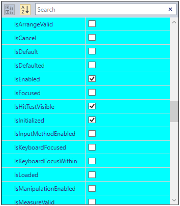
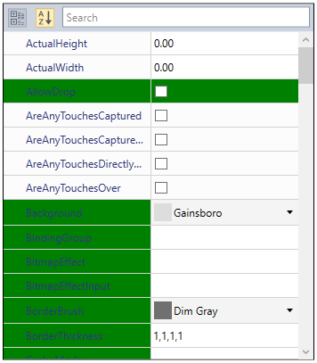
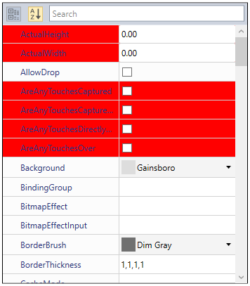
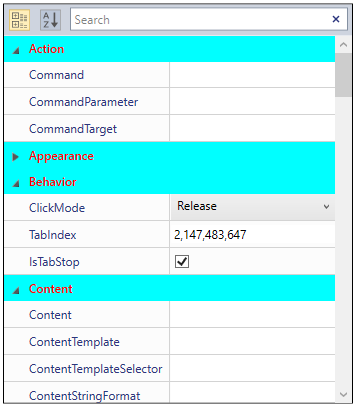
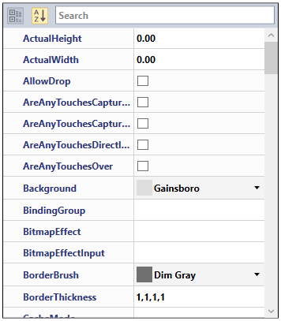
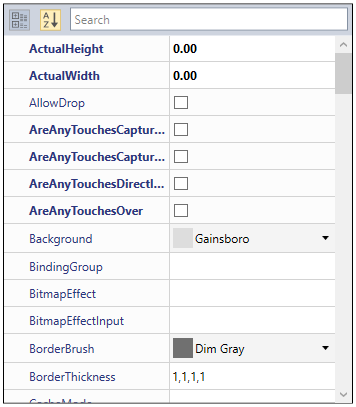
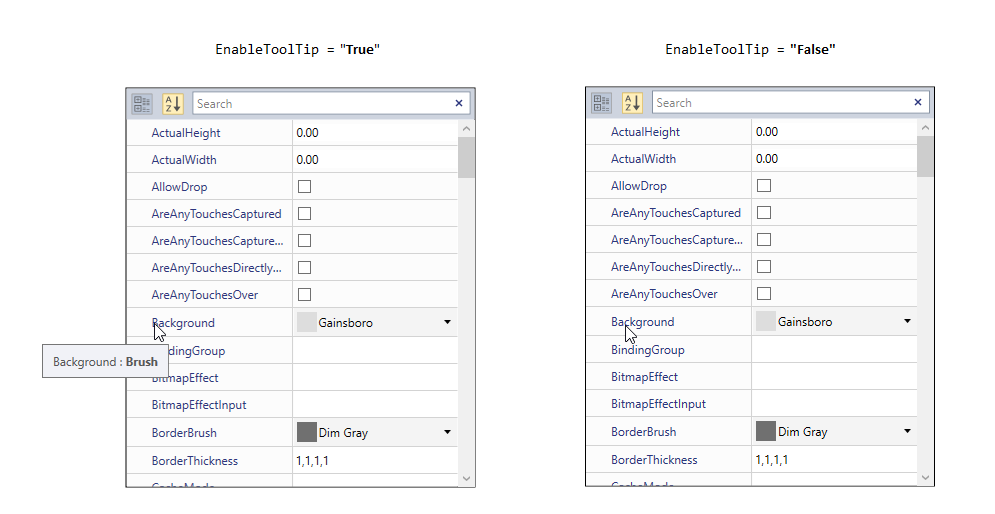

# Appearance in WPF PropertyGrid

This section deals with the appearance of [PropertyGrid](https://www.syncfusion.com/wpf-ui-controls/propertygrid) control and contains the following topics.

## Setting the Foreground

The User can change the foreground color for properties of `PropertyGrid's` [SelectedObject](https://help.syncfusion.com/cr/wpf/Syncfusion.PropertyGrid.Wpf~Syncfusion.Windows.PropertyGrid.PropertyGrid~SelectedObject.html) by setting the `Foreground` property. The default color value of `Foreground` property is `Blue`.




<syncfusion:PropertyGrid x:Name="propertyGrid" Width="350" Height="400"
                         Foreground="Red">
            <syncfusion:PropertyGrid.SelectedObject>
                <Button></Button>
            </syncfusion:PropertyGrid.SelectedObject>
</syncfusion:PropertyGrid>




PropertyGrid propertyGrid = new PropertyGrid();
propertyGrid.Width = 350;
propertyGrid.Height = 400;
propertyGrid.SelectedObject = new Button();
propertyGrid.Foreground = Brushes.Red;




## Setting the Background

The Users can change the background color for the properties of `PropertyGrid's` `SelectedObject` in the following ways.

    1.ViewBackgroundColor
    2.EditableBackground
    3.ReadOnlyBackground
    
### 1.ViewBackgroundColor

 You can change the background color for the properties by setting the [ViewBackgroundColor](https://help.syncfusion.com/cr/wpf/Syncfusion.PropertyGrid.Wpf~Syncfusion.Windows.PropertyGrid.PropertyGrid~ViewBackgroundColor.html) property.




<syncfusion:PropertyGrid x:Name="propertyGrid" Width="350" Height="400"
                         ViewBackgroundColor="Cyan">
            <syncfusion:PropertyGrid.SelectedObject>
                <Button></Button>
            </syncfusion:PropertyGrid.SelectedObject>
</syncfusion:PropertyGrid>




PropertyGrid propertyGrid = new PropertyGrid();
propertyGrid.Width = 350;
propertyGrid.Height = 400;
propertyGrid.SelectedObject = new Button();
propertyGrid.ViewBackgroundColor = Brushes.Cyan;




### 2.EditableBackground

You can change the background color for the editable properties by setting the [EditableBackground](https://help.syncfusion.com/cr/wpf/Syncfusion.PropertyGrid.Wpf~Syncfusion.Windows.PropertyGrid.PropertyGrid~EditableBackground.html) property.




<syncfusion:PropertyGrid x:Name="propertyGrid" Width="350" Height="400"
                         EditableBackground="Green">
            <syncfusion:PropertyGrid.SelectedObject>
                <Button></Button>
            </syncfusion:PropertyGrid.SelectedObject>
</syncfusion:PropertyGrid>




PropertyGrid propertyGrid = new PropertyGrid();
propertyGrid.Width = 350;
propertyGrid.Height = 400;
propertyGrid.SelectedObject = new Button();
propertyGrid.EditableBackground = Brushes.Green;




### 3.ReadOnlyBackground

You can change the background color for the readonly properties by setting the [ReadOnlyBackground](https://help.syncfusion.com/cr/wpf/Syncfusion.PropertyGrid.Wpf~Syncfusion.Windows.PropertyGrid.PropertyGrid~ReadOnlyBackground.html) property.




<syncfusion:PropertyGrid x:Name="propertyGrid" Width="350" Height="400"
                         ReadOnlyBackground="Red">
            <syncfusion:PropertyGrid.SelectedObject>
                <Button></Button>
            </syncfusion:PropertyGrid.SelectedObject>
</syncfusion:PropertyGrid>




PropertyGrid propertyGrid = new PropertyGrid();
propertyGrid.Width = 350;
propertyGrid.Height = 400;
propertyGrid.SelectedObject = new Button();
propertyGrid.ReadOnlyBackground = Brushes.Red;




N> If you use `EditableBackground` or `ReadOnlyBackground` properties with `ViewBackgroundColor`, `EditableBackground` and `ReadOnlyBackground` properties have higher priority.

### Group Header's foreground and background

You can change the foreground and background of the `Category Header` by setting the [LineColor](https://help.syncfusion.com/cr/wpf/Syncfusion.PropertyGrid.Wpf~Syncfusion.Windows.PropertyGrid.PropertyGrid~LineColor.html) property and [CategoryForeground](https://help.syncfusion.com/cr/wpf/Syncfusion.PropertyGrid.Wpf~Syncfusion.Windows.PropertyGrid.PropertyGrid~CategoryForeground.html) property. The `LineColor` value applied to the foreground and `CategoryForeground` value applied to the background of the `Category Header` only on grouping state and when [EnableGrouping](https://help.syncfusion.com/cr/wpf/Syncfusion.PropertyGrid.Wpf~Syncfusion.Windows.PropertyGrid.PropertyGrid~EnableGrouping.html) property is `true`.




<syncfusion:PropertyGrid x:Name="propertyGrid"  Width="350" 
                         LineColor="Cyan" CategoryForeground="Red">
    <syncfusion:PropertyGrid.SelectedObject>
        <Button></Button>
    </syncfusion:PropertyGrid.SelectedObject>
</syncfusion:PropertyGrid>




PropertyGrid propertyGrid = new PropertyGrid();
propertyGrid.Width = 350;
propertyGrid.Height = 400;
propertyGrid.SelectedObject = new Button();
propertyGrid.LineColor = Brushes.Cyan;
propertyGrid.CategoryForeground = Brushes.Red;




## Setting the FontWeight

The Users can change the font weight for the properties of `PropertyGrid's` `SelectedObject` in the following ways.

    1.FontWeight
    2.EditableFontWeight
    3.ReadOnlyFontWeight
    
### 1.FontWeight

 You can change the font weight for the properties by setting the `FontWeight` property.




<syncfusion:PropertyGrid x:Name="propertyGrid" Width="350" Height="400"
                         FontWeight="Bold">
            <syncfusion:PropertyGrid.SelectedObject>
                <Button></Button>
            </syncfusion:PropertyGrid.SelectedObject>
</syncfusion:PropertyGrid>




PropertyGrid propertyGrid = new PropertyGrid();
propertyGrid.Width = 350;
propertyGrid.Height = 400;
propertyGrid.SelectedObject = new Button();
propertyGrid.FontWeight = FontWeights.Bold;




### 2.EditableFontWeight

You can change the font weight for the editable properties by setting the [EditableFontWeight](https://help.syncfusion.com/cr/wpf/Syncfusion.PropertyGrid.Wpf~Syncfusion.Windows.PropertyGrid.PropertyGrid~EditableFontWeight.html) property.




<syncfusion:PropertyGrid x:Name="propertyGrid" Width="350" Height="400"
                         EditableFontWeight="Bold">
            <syncfusion:PropertyGrid.SelectedObject>
                <Button></Button>
            </syncfusion:PropertyGrid.SelectedObject>
</syncfusion:PropertyGrid>




PropertyGrid propertyGrid = new PropertyGrid();
propertyGrid.Width = 350;
propertyGrid.Height = 400;
propertyGrid.SelectedObject = new Button();
propertyGrid.EditableFontWeight = FontWeights.Bold;




### 3.ReadOnlyFontWeight

You can change the font weight for the readonly properties by setting the [ReadOnlyFontWeight](https://help.syncfusion.com/cr/wpf/Syncfusion.PropertyGrid.Wpf~Syncfusion.Windows.PropertyGrid.PropertyGrid~ReadOnlyFontWeight.html) property.




<syncfusion:PropertyGrid x:Name="propertyGrid" Width="350" Height="400"
                         ReadOnlyFontWeight="Bold">
            <syncfusion:PropertyGrid.SelectedObject>
                <Button></Button>
            </syncfusion:PropertyGrid.SelectedObject>
</syncfusion:PropertyGrid>




PropertyGrid propertyGrid = new PropertyGrid();
propertyGrid.Width = 350;
propertyGrid.Height = 400;
propertyGrid.SelectedObject = new Button();
propertyGrid.ReadOnlyFontWeight = FontWeights.Bold;




N> If you use `EditableFontWeight` or `ReadOnlyFontWeight` properties with `FontWeight`, `EditableFontWeight` and `ReadOnlyFontWeight` properties have higher priority.

## Setting ToolTip

ToolTips are used to show the information about the segment, when you mouse over on the segment. You can show or hide the tooltip for the properties in the `PropertyGrid` by handling [EnableToolTip](https://help.syncfusion.com/cr/wpf/Syncfusion.PropertyGrid.Wpf~Syncfusion.Windows.PropertyGrid.PropertyGrid~EnableToolTip.html) Property. The default value of `EnableToolTip` property is `true`.




<syncfusion:PropertyGrid x:Name="propertyGrid"  Width="350"
                         EnableToolTip="False">
    <syncfusion:PropertyGrid.SelectedObject>
        <Button></Button>
    </syncfusion:PropertyGrid.SelectedObject>
</syncfusion:PropertyGrid>




PropertyGrid propertyGrid = new PropertyGrid();
propertyGrid.Width = 350;
propertyGrid.Height = 400;
propertyGrid.SelectedObject = new Button();
propertyGrid.EnableToolTip = false;




## Theme

The appearance of the `PropertyGrid` control can be customized by using the [SfSkinManager.SetVisualStyle](https://help.syncfusion.com/cr/cref_files/wpf/Syncfusion.SfSkinmanager.Wpf~Syncfusion.SfSkinmanager.SfSkinmanager~SetVisualStyle.html) method. The following are the various built-in visual styles for `PropertyGrid` control.

* Blend
* Default
* Lime
* Metro
* Office2010Black
* Office2010Blue
* Office2010Silver
* Office2013DarkGray
* Office2013LightGray
* Office2013White
* Office2016Colorful
* Office2016DarkGray
* Office2016White
* Office365
* Saffron
* SystemTheme
* VisualStudio2013
* VisualStudio2015

For example, the `Blend` style applied to the `PropertyGrid` as shown in the following example code:




// Namespace for the SfSkinManager.

using Syncfusion.SfSkinManager;







PropertyGrid propertyGrid = new PropertyGrid();
propertyGrid.Width = 350;
propertyGrid.Height = 400;
propertyGrid.SelectedObject = new Button();
SfSkinManager.SetVisualStyle(propertyGrid, VisualStyles.Blend);




