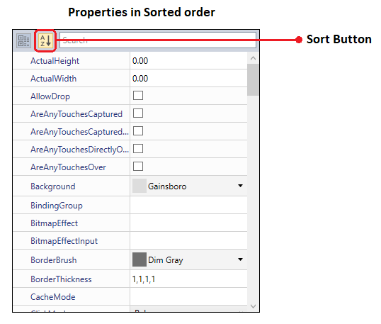

# Sorting in WPF PropertyGrid

The user can sorting the properties according to their needs. You can change the sorting order of the properties by [SortDirection](https://help.syncfusion.com/cr/wpf/Syncfusion.PropertyGrid.Wpf~Syncfusion.Windows.PropertyGrid.PropertyGrid~SortDirection.html) property.
Values of `SortDirection` property is `Ascending`, `Descending` and `Null`. The Default value of the `SortDirection` property is `Ascending` order.

## Show or Hide the Sort Button

The User can change the states of the properties from grouping state to sort state by the `SortButton`. You can show or hide the sort button by using the [ButtonPanelVisibility](https://help.syncfusion.com/cr/wpf/Syncfusion.PropertyGrid.Wpf~Syncfusion.Windows.PropertyGrid.PropertyGrid~ButtonPanelVisibility.html) property. If you want to hide the `SortButton`, set the `ButtonPanelVisibility` property as `Collapsed`. The Default value of the `ButtonPanelVisibility` property is `Visible`.




<syncfusion:PropertyGrid x:Name="propertyGrid1" Width="350" Height="400"
                         ButtonPanelVisibility="Collapsed">
    <syncfusion:PropertyGrid.SelectedObject>
        <Button></Button>
    </syncfusion:PropertyGrid.SelectedObject>
</syncfusion:PropertyGrid>




PropertyGrid propertyGrid = new PropertyGrid();
propertyGrid.Width = 350;
propertyGrid.Height = 400;propertyGrid.SelectedObject = new Button();
propertyGrid1.ButtonPanelVisibility = Visibility.Collapsed;




## Sorting the Properties

Properties in the [PropertyGrid](https://www.syncfusion.com/wpf-ui-controls/propertygrid) are sorted by using the `SortDirection` property as either `Ascending` or `Descending` order. They sorted based only on the name of the property, not on the display name of the property. If the properties are in the grouped state, then the groups are sorted based on the group name. 




//Model.cs

using System;
using System.ComponentModel;

public class Model
{
    [Category("Identity")]
    public string Name
    {
        get;
        set;
    }

    [Category("Contact Details")]
    public string Email
    {
        get;
        set;
    }

    [Category("Account Details")]
    public string Bank
    {
        get;
        set;
    }

    [Category("Identity")]
    public string ID
    {
        get;
        set;
    }
    
    [Category("Account Details")]
    public string AccountNumber
    {
        get;
        set;
    }  
}
        

 




//ViewModel.cs

public class ViewModel
{
    private Object items = null;
   
    public Object Items
    {
        get
        {
            return items;
        }
        set
        {
            items = value;
        }
    }

    public ViewModel()
    {
        Items = new Model();
    }

}

 
 




<Window x:Class="PropertyGrid_WPF.MainWindow"
        xmlns="http://schemas.microsoft.com/winfx/2006/xaml/presentation"
        xmlns:x="http://schemas.microsoft.com/winfx/2006/xaml"
        xmlns:d="http://schemas.microsoft.com/expression/blend/2008"
        xmlns:mc="http://schemas.openxmlformats.org/markup-compatibility/2006"
        xmlns:local="clr-namespace:PropertyGrid_WPF"
        xmlns:syncfusion="http://schemas.syncfusion.com/wpf"
        mc:Ignorable="d" WindowStartupLocation="CenterScreen"
        Title="MainWindow" Height="572" Width="800">
    <Window.DataContext>
        <local:ViewModel></local:ViewModel>
    </Window.DataContext>
    <Grid x:Name="LayoutRoot" Background="White" HorizontalAlignment="Stretch" VerticalAlignment="Stretch">
        <syncfusion:PropertyGrid x:Name="propertyGrid1" Width="350" Height="200" SelectedObject="{Binding Items}" 
                                 SortDirection="Ascending">
        </syncfusion:PropertyGrid>
    </Grid>
</Window>

 
 

**SortDirection= Ascending**

**SortDirection= Descending**

## Disable the Sorting
We can disable the sorting by setting the `SortDirection` property as `null`. When sorting is disabled, the properties are arranged based on the value of the `Order` attributes or on
 the order they added into the [SelectedObject](https://help.syncfusion.com/cr/wpf/Syncfusion.PropertyGrid.Wpf~Syncfusion.Windows.PropertyGrid.PropertyItem~SelectedObject.html).
 



<syncfusion:PropertyGrid x:Name="propertyGrid1" SortDirection="{x:Null}" SelectedObject="{Binding SelectedEmployee}">
        </syncfusion:PropertyGrid>

 


PropertyGrid propertyGrid1 = new PropertyGrid();
propertyGrid1.SortDirection = null;

 
 