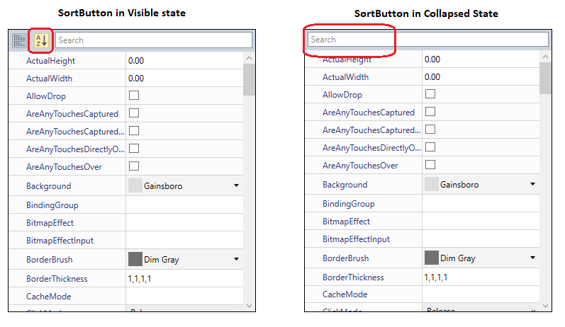

# Sorting in WPF PropertyGrid

We can sort the properties according to our needs. We can change the sorting order of the properties by [SortDirection](https://help.syncfusion.com/cr/wpf/Syncfusion.PropertyGrid.Wpf~Syncfusion.Windows.PropertyGrid.PropertyGrid~SortDirection.html) property.
Values of `SortDirection` property is `Ascending`, `Descending` and `Null`. The Default value of the `SortDirection` property is `Ascending` order.

## Sorting the Properties

Properties in the [PropertyGrid](https://www.syncfusion.com/wpf-ui-controls/propertygrid) are sorted by using the `SortDirection` property. They sorted based only on the name of the property, not on the display name of the property. If the properties are in the grouped state, then the groups are sorted based on the group name either `Ascending` or `Descending` order. 




using System;
using System.ComponentModel;
public class ViewModel {
    public Object SelectedEmployee { get; set; }
    public ViewModel() {
        SelectedEmployee = new Employee();
    }
}

public class Employee
{
    [Category("Identity")]
    public string Name { get; set; }
    [Category("Contact Details")]
    public string Email { get; set; }
    [Category("Account Details")]
    public string Bank { get; set; }     
    [Category("Identity")]
    public string ID { get; set; }
    [Category("Account Details")]
    public string AccountNumber { get; set; }
}
        

 




<syncfusion:PropertyGrid SelectedObject="{Binding SelectedEmployee}"   
                         SortDirection="Ascending"
                         x:Name="propertyGrid1">
    <syncfusion:PropertyGrid.DataContext>
        <local:ViewModel></local:ViewModel>
    </syncfusion:PropertyGrid.DataContext>
</syncfusion:PropertyGrid>

 
 

**SortDirection= Ascending**

**SortDirection= Descending**

## Disable the Sorting

We can disable the sorting by setting the `SortDirection` property as `null`. When sorting is disabled, the properties are arranged based on the value of the `Order` attributes or on
 the order they added into the [SelectedObject](https://help.syncfusion.com/cr/wpf/Syncfusion.PropertyGrid.Wpf~Syncfusion.Windows.PropertyGrid.PropertyItem~SelectedObject.html).
 



using System;
using System.ComponentModel;

public class Employee {
    [Category("Identity")]
    public String Gender { get; set; }
    [Category("Address")]
    public String Country { get; set; }
    [Category("Contact Details")]
    public string Email { get; set; }
    [Category("Identity")]
    public string FirstName { get; set; }
    public string Designation { get; set; }
    [Category("Identity")]
    public string LastName { get; set; }
    public string ID { get; set; }
    public DateTime DOB { get; set; }
    [Category("Contact Details")]
    public string Mobile { get; set; }
    public int Age { get; set; }
}

public class ViewModel {
    public Object SelectedEmployee { get; set; }
    public ViewModel() {
        SelectedEmployee = new Employee() 
        { 
            FirstName = "Carl",
            LastName = "johnson", 
            Age = 30,
            Country = "United States", 
            Designation = "Team Lead",
            DOB = new DateTime(2000, 12, 01),
            Email = "carljanson@gta.com", 
            Gender = "Male", 
            ID = "SF001", 
            Mobile = "1234567890"
        };
    }
}

 





<syncfusion:PropertyGrid SelectedObject="{Binding SelectedEmployee}"
                         SortDirection="{x:Null}" x:Name="propertyGrid1" >
    <syncfusion:PropertyGrid.DataContext>
        <local:ViewModel></local:ViewModel>
    </syncfusion:PropertyGrid.DataContext>
</syncfusion:PropertyGrid>

 
 

Here, the properties are arranged from the `Gender` property and end with `Age` property by the order in which they were added to the class. 

## Show or Hide the Sort Button

The User can change the states of the properties from grouping state to sort state by the `SortButton`. You can show or hide the sort button by using the [ButtonPanelVisibility](https://help.syncfusion.com/cr/wpf/Syncfusion.PropertyGrid.Wpf~Syncfusion.Windows.PropertyGrid.PropertyGrid~ButtonPanelVisibility.html) property. If you want to hide the `SortButton`, set the `ButtonPanelVisibility` property as `Collapsed`. The Default value of the `ButtonPanelVisibility` property is `Visible`.




<syncfusion:PropertyGrid x:Name="propertyGrid1" Width="350" Height="400"
                         ButtonPanelVisibility="Collapsed">
    <syncfusion:PropertyGrid.SelectedObject>
        <Button></Button>
    </syncfusion:PropertyGrid.SelectedObject>
</syncfusion:PropertyGrid>




PropertyGrid propertyGrid = new PropertyGrid();
propertyGrid.Width = 350;
propertyGrid.Height = 400;propertyGrid.SelectedObject = new Button();
propertyGrid1.ButtonPanelVisibility = Visibility.Collapsed;




Click [here](https://github.com/SyncfusionExamples/wpf-property-grid-examples/tree/master/Samples/PropertyGrid-Grouping-Sorting-Ordering) to download the sample that showcases the property sorting support using the attributes.