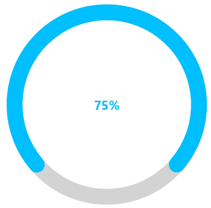

# Annotations in WPF Radial Gauge (SfCircularGauge)

SfCircularGauge supports annotations, which allows you to mark the specific area of interest in circular gauge. You can place custom views as annotations. The text and images can also be added by using `Annotations` property.

## Setting a view annotation

When the annotation allows you to place the custom elements, a gauge can be initialized to the element, and this can be used to place the annotation in another gauge. The Following properties are used to customize the Annotations:

* [`Angle`](https://help.syncfusion.com/cr/wpf/Syncfusion.UI.Xaml.Gauges.GaugeAnnotation.html#Syncfusion_UI_Xaml_Gauges_GaugeAnnotation_Angle) : Used to place the view at the given angle.
* [`Offset`](https://help.syncfusion.com/cr/wpf/Syncfusion.UI.Xaml.Gauges.GaugeAnnotation.html#Syncfusion_UI_Xaml_Gauges_GaugeAnnotation_Offset) : Used to move the view from the center to edge of the circular gauge. The value should be ranges from 0 to 1.
* [`ViewMargin`](https://help.syncfusion.com/cr/wpf/Syncfusion.UI.Xaml.Gauges.GaugeAnnotation.html#Syncfusion_UI_Xaml_Gauges_GaugeAnnotation_ViewMargin) : Used to customize the Annotation x and y position by using the pixel values.

The following code is used to create the Annotations.





     <gauge:SfCircularGauge>
            <gauge:SfCircularGauge.Annotations>
                <gauge:GaugeAnnotation Offset="0" Angle="270">
                    <TextBlock Text="75%" FontSize="25" 
                               Foreground="DeepSkyBlue" FontWeight="Bold"
                               HorizontalAlignment="Center" VerticalAlignment="Center"/>
                </gauge:GaugeAnnotation>
            </gauge:SfCircularGauge.Annotations>
            <gauge:SfCircularGauge.Scales>
                <gauge:CircularScale x:Name="scale" SweepAngle="360" RimStroke="LightGray"
                                     LabelStroke="Transparent"
                                     RimStrokeThickness="30" RangePointerPosition="Custom">
                    <gauge:CircularScale.MajorTickSettings>
                        <gauge:MajorTickSetting Stroke="Transparent"/>
                    </gauge:CircularScale.MajorTickSettings>
                    <gauge:CircularScale.MinorTickSettings>
                        <gauge:MinorTickSetting Stroke="Transparent"/>
                    </gauge:CircularScale.MinorTickSettings>
                    <gauge:CircularScale.Pointers>
                        <gauge:CircularPointer PointerType="RangePointer" 
                                               RangePointerStrokeThickness="30" 
                                               RangeCap="Both"  
                                               RangePointerStroke="DeepSkyBlue" Value="75"/>
                    </gauge:CircularScale.Pointers>
                </gauge:CircularScale>
            </gauge:SfCircularGauge.Scales>
        </gauge:SfCircularGauge>





           SfCircularGauge sfCircularGauge = new SfCircularGauge();
            CircularScale mainscale = new CircularScale();
            mainscale.RangePointerPosition = RangePointerPosition.Custom;
            mainscale.SweepAngle = 360;
            mainscale.RimStroke = new SolidColorBrush(Colors.LightGray);
            mainscale.RimStrokeThickness = 30;
            mainscale.MinorTickSettings.Stroke = new SolidColorBrush(Colors.Transparent);
            mainscale.MajorTickSettings.Stroke = new SolidColorBrush(Colors.Transparent);
            mainscale.LabelStroke = new SolidColorBrush(Colors.Transparent);
            TextBlock annotationText = new TextBlock();
            annotationText.Text = "75%";
            annotationText.FontWeight = FontWeights.Bold;
            annotationText.FontSize = 25;
            annotationText.Foreground = new SolidColorBrush(Colors.DeepSkyBlue);
            annotationText.HorizontalAlignment = HorizontalAlignment.Center;
            annotationText.VerticalAlignment = VerticalAlignment.Center;
            GaugeAnnotation gaugeAnnotation = new GaugeAnnotation();
            gaugeAnnotation.Content = annotationText;
            gaugeAnnotation.Angle = 270;
            gaugeAnnotation.Offset = 0;
            CircularGaugeAnnotationCollection annotations = new CircularGaugeAnnotationCollection();
            annotations.Add(gaugeAnnotation);
            sfCircularGauge.Annotations = annotations;
            CircularPointer circularPointer = new CircularPointer();
            circularPointer.PointerType = PointerType.RangePointer;
            circularPointer.RangePointerStrokeThickness = 30;
            circularPointer.RangeCap = RangeCap.Both;
            circularPointer.RangePointerStroke = new SolidColorBrush(Colors.DeepSkyBlue);
            circularPointer.Value = 75;
            mainscale.Pointers.Add(circularPointer);
            sfCircularGauge.Scales.Add(mainscale);

            this.Content = sfCircularGauge;            





