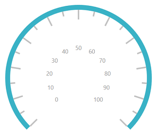
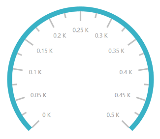
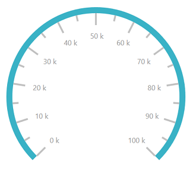
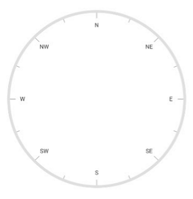

# Labels support in SfCircularGauge

The `Scale` labels associate numeric values with major scale tick marks.

## Label stroke customization

The label color can be changed using the [`LabelStroke`](https://help.syncfusion.com/cr/wpf/Syncfusion.UI.Xaml.Gauges.CircularScale.html#Syncfusion_UI_Xaml_Gauges_CircularScale_LabelStroke) property.





    <gauge:SfCircularGauge>

    <gauge:SfCircularGauge.Scales>

    <gauge:CircularScale LabelStroke="DeepPink">

    <gauge:CircularScale.Pointers>

    <gauge:CircularPointer NeedlePointerVisibility="Hidden"/>

    </gauge:CircularScale.Pointers>

    </gauge:CircularScale>

    </gauge:SfCircularGauge.Scales>

    </gauge:SfCircularGauge>





SfCircularGauge sfCircularGauge = new SfCircularGauge();

CircularScale mainscale = new CircularScale();

mainscale.LabelStroke = new SolidColorBrush(Colors.DeepPink);

CircularPointer circularPointer = new CircularPointer();

circularPointer.NeedlePointerVisibility = Visibility.Hidden;

mainscale.Pointers.Add(circularPointer);

sfCircularGauge.Scales.Add(mainscale);





## Label font customization

The label font can be customized using the `FontSize`, `FontFamily`, and `FontStyle` properties.





    <gauge:SfCircularGauge>

    <gauge:SfCircularGauge.Scales>

    <gauge:CircularScale FontFamily="Monotype Corsiva" FontSize="20" 

    FontStyle="Italic" >

    <gauge:CircularScale.Pointers>

    <gauge:CircularPointer NeedlePointerVisibility="Hidden"/>
                        
    </gauge:CircularScale.Pointers>

    </gauge:CircularScale>

    </gauge:SfCircularGauge.Scales>

    </gauge:SfCircularGauge>





SfCircularGauge sfCircularGauge = new SfCircularGauge();

CircularScale mainscale = new CircularScale();

sfCircularGauge.FontSize = 20;

sfCircularGauge.FontFamily = new FontFamily("Monotype Corsiva");

sfCircularGauge.FontStyle = FontStyles.Italic;

CircularPointer circularPointer = new CircularPointer();

circularPointer.NeedlePointerVisibility = Visibility.Hidden;

mainscale.Pointers.Add(circularPointer);

sfCircularGauge.Scales.Add(mainscale);





## Setting a position for labels

  The `Labels` can be placed inside the scale, outside the scale, or custom position using the following two ways:

### Inside or Outside label Position

Placing the labels inside or outside the scale by selecting the [`LabelPosition`](https://help.syncfusion.com/cr/wpf/Syncfusion.UI.Xaml.Gauges.CircularScale.html#Syncfusion_UI_Xaml_Gauges_CircularScale_LabelPosition) property is `Inside` or `Outside`. Please find the values available in `LabelPosition` property below.

1.	Inside (Default)

2.	Outside

3.	Custom





    <gauge:SfCircularGauge>

    <gauge:SfCircularGauge.Scales>

    <gauge:CircularScale LabelPosition="Outside" >

    <gauge:CircularScale.Pointers>

    <gauge:CircularPointer NeedlePointerVisibility="Hidden"/>

    </gauge:CircularScale.Pointers>

    </gauge:CircularScale>

    </gauge:SfCircularGauge.Scales>

    </gauge:SfCircularGauge>





SfCircularGauge sfCircularGauge = new SfCircularGauge();

CircularScale mainscale = new CircularScale();

mainscale.LabelPosition = LabelPosition.Outside;

CircularPointer circularPointer = new CircularPointer();

circularPointer.NeedlePointerVisibility = Visibility.Hidden;

mainscale.Pointers.Add(circularPointer);

sfCircularGauge.Scales.Add(mainscale);





### Setting custom position for labels

Positioning the labels far away from the ticks using the [`LabelOffset`](https://help.syncfusion.com/cr/wpf/Syncfusion.UI.Xaml.Gauges.CircularScale.html#Syncfusion_UI_Xaml_Gauges_CircularScale_LabelOffset) property. First, set the [`LabelPosition`](https://help.syncfusion.com/cr/wpf/Syncfusion.UI.Xaml.Gauges.CircularScale.html#Syncfusion_UI_Xaml_Gauges_CircularScale_LabelPosition) to custom, and then position the label using the `LabelOffset` property.





    <gauge:SfCircularGauge>

    <gauge:SfCircularGauge.Scales>

    <gauge:CircularScale LabelPosition="Custom" LabelOffset="0.5" >

    <gauge:CircularScale.Pointers>

    <gauge:CircularPointer NeedlePointerVisibility="Hidden"/>

    </gauge:CircularScale.Pointers>

    </gauge:CircularScale>

    </gauge:SfCircularGauge.Scales>

    </gauge:SfCircularGauge>





SfCircularGauge sfCircularGauge = new SfCircularGauge();

CircularScale mainscale = new CircularScale();

mainscale.LabelPosition = LabelPosition.Custom;

mainscale.LabelOffset = 0.5;

CircularPointer circularPointer = new CircularPointer();

circularPointer.NeedlePointerVisibility = Visibility.Hidden;

mainscale.Pointers.Add(circularPointer);

sfCircularGauge.Scales.Add(mainscale);





## Label rotation

Circular gauge labels can be rotated based on its corresponding angle. This can be controlled by `CanRotateLabels` property in the scale.

Setting false to this property will display all the labels without rotation.





        <gauge:SfCircularGauge>

            <gauge:SfCircularGauge.Scales>

                <gauge:CircularScale FontFamily="Monotype Corsiva" FontSize="20" CanRotateLabels="True"

    FontStyle="Italic" >

                    <gauge:CircularScale.Pointers>

                        <gauge:CircularPointer NeedlePointerVisibility="Hidden"/>

                    </gauge:CircularScale.Pointers>

                </gauge:CircularScale>

            </gauge:SfCircularGauge.Scales>

        </gauge:SfCircularGauge>





            SfCircularGauge sfCircularGauge = new SfCircularGauge();

            CircularScale mainscale = new CircularScale();

            sfCircularGauge.FontSize = 20;

            sfCircularGauge.FontFamily = new FontFamily("Monotype Corsiva");

            sfCircularGauge.FontStyle = FontStyles.Italic;

            CircularPointer circularPointer = new CircularPointer();

            circularPointer.NeedlePointerVisibility = Visibility.Hidden;

            mainscale.Pointers.Add(circularPointer);

            mainscale.CanRotateLabels = true;

            sfCircularGauge.Scales.Add(mainscale);





## Setting a smart labels

The [`EnableSmartLabels`](https://help.syncfusion.com/cr/wpf/Syncfusion.UI.Xaml.Gauges.CircularScale.html#Syncfusion_UI_Xaml_Gauges_CircularScale_EnableSmartLabels) property is a Boolean property that enables or disables the smart label feature of the circular gauge.

This property allow to change the `NumericScaleType` of the labels displayed in a gauge scale, and customize the labels by adding prefixes or suffixes to the scale labels.

The [`NumericScaleType`](https://help.syncfusion.com/cr/wpf/Syncfusion.UI.Xaml.Gauges.CircularScale.html#Syncfusion_UI_Xaml_Gauges_CircularScale_NumericScaleType) property allows to set the type of label. The following types can be applied to labels:

•	Auto

•	Thousands

•	Millions

•	Billions

•	Trillions

•	Quadrillions

•	Quintillions





    <gauge:SfCircularGauge>

    <gauge:SfCircularGauge.Scales>

    <gauge:CircularScale StartValue="0" EndValue="500" 
                         EnableSmartLabels="True" NumericScaleType="Thousands">

    <gauge:CircularScale.Pointers>

    <gauge:CircularPointer NeedlePointerVisibility="Hidden"/>

    </gauge:CircularScale.Pointers>

    </gauge:CircularScale>

    </gauge:SfCircularGauge.Scales>

    </gauge:SfCircularGauge>





SfCircularGauge sfCircularGauge = new SfCircularGauge();

CircularScale mainscale = new CircularScale();

mainscale.StartValue = 0;

mainscale.EndValue = 500;

mainscale.EnableSmartLabels = true;

mainscale.NumericScaleType = NumericScaleType.Thousands;

CircularPointer circularPointer = new CircularPointer();

circularPointer.NeedlePointerVisibility = Visibility.Hidden;

mainscale.Pointers.Add(circularPointer);

sfCircularGauge.Scales.Add(mainscale);





## Setting a number of fraction digits for labels

The [`NoOfFractionalDigit`](https://help.syncfusion.com/cr/wpf/Syncfusion.UI.Xaml.Gauges.CircularScale.html#Syncfusion_UI_Xaml_Gauges_CircularScale_NoOfFractionalDigit) property is used to set the number of fractional digits to be displayed in the scale labels.





    <gauge:SfCircularGauge>

    <gauge:SfCircularGauge.Scales>

    <gauge:CircularScale NoOfFractionalDigit="3">

    <gauge:CircularScale.Pointers>

    <gauge:CircularPointer NeedlePointerVisibility="Hidden"/>

    </gauge:CircularScale.Pointers>

    </gauge:CircularScale>

    </gauge:SfCircularGauge.Scales>

    </gauge:SfCircularGauge>





SfCircularGauge sfCircularGauge = new SfCircularGauge();

CircularScale mainscale = new CircularScale();

mainscale.NoOfFractionalDigit = 3;

CircularPointer circularPointer = new CircularPointer();

circularPointer.NeedlePointerVisibility = Visibility.Hidden;

mainscale.Pointers.Add(circularPointer);

sfCircularGauge.Scales.Add(mainscale);





## Setting a postfix and prefix for labels

You can postfix or prefix values to the scale labels using the [`LabelPostfix`](https://help.syncfusion.com/cr/wpf/Syncfusion.UI.Xaml.Gauges.CircularScale.html#Syncfusion_UI_Xaml_Gauges_CircularScale_LabelPostfix) and [`LabelPrefix`](https://help.syncfusion.com/cr/wpf/Syncfusion.UI.Xaml.Gauges.CircularScale.html#Syncfusion_UI_Xaml_Gauges_CircularScale_LabelPrefix) properties, respectively.

### Setting postfix value for labels

The `LabelPostfix` property allows to postfix the values to the scale labels.





    <gauge:SfCircularGauge>

    <gauge:SfCircularGauge.Scales>

    <gauge:CircularScale LabelPostfix="k">

    <gauge:CircularScale.Pointers>

    <gauge:CircularPointer NeedlePointerVisibility="Hidden"/>

    </gauge:CircularScale.Pointers>

    </gauge:CircularScale>

    </gauge:SfCircularGauge.Scales>

    </gauge:SfCircularGauge>





SfCircularGauge sfCircularGauge = new SfCircularGauge();

CircularScale mainscale = new CircularScale();

mainscale.LabelPostfix = "k";

CircularPointer circularPointer = new CircularPointer();

circularPointer.NeedlePointerVisibility = Visibility.Hidden;

mainscale.Pointers.Add(circularPointer);

sfCircularGauge.Scales.Add(mainscale);





### Setting prefix value for labels

The `LabelPrefix` property allows to prefix the values to the scale labels.





    <gauge:SfCircularGauge>

    <gauge:SfCircularGauge.Scales>

    <gauge:CircularScale LabelPrefix="$">

    <gauge:CircularScale.Pointers>

    <gauge:CircularPointer NeedlePointerVisibility="Hidden"/>

    </gauge:CircularScale.Pointers>

    </gauge:CircularScale>

    </gauge:SfCircularGauge.Scales>

    </gauge:SfCircularGauge>





SfCircularGauge sfCircularGauge = new SfCircularGauge();

CircularScale mainscale = new CircularScale();

mainscale.LabelPrefix = "$";

CircularPointer circularPointer = new CircularPointer();

circularPointer.NeedlePointerVisibility = Visibility.Hidden;

mainscale.Pointers.Add(circularPointer);





### Setting scale labels visibility

The [`ShowLabels`](https://help.syncfusion.com/cr/wpf/Syncfusion.UI.Xaml.Gauges.CircularScale.html#Syncfusion_UI_Xaml_Gauges_CircularScale_ShowLabels) property is a Boolean property, which is used to enable or disable the labels in circular gauge.

N> Default value of the ShowLabels property is true.





      <gauge:SfCircularGauge>
           <gauge:SfCircularGauge.Scales >
                 <gauge:CircularScale ShowLabels="False" x:Name="scale" RimStroke="LightGray" >
                        <gauge:CircularScale.Pointers>
                            <gauge:CircularPointer NeedlePointerVisibility="Hidden"/>
                        </gauge:CircularScale.Pointers>
                    </gauge:CircularScale>
                </gauge:SfCircularGauge.Scales>
		</gauge:SfCircularGauge>





 SfCircularGauge sfCircularGauge = new SfCircularGauge();
            CircularScale mainscale = new CircularScale();
            mainscale.ShowLabels = false;
			mainscale.RimStroke = new SolidColorBrush(Colors.LightGray);
            CircularPointer circularPointer = new CircularPointer();
            circularPointer.NeedlePointerVisibility = Visibility.Hidden;
            mainscale.Pointers.Add(circularPointer);
            sfCircularGauge.Scales.Add(mainscale);





### Edge label customization in scale

You can customize the edge label by using the [`ShowFirstLabel`](https://help.syncfusion.com/cr/wpf/Syncfusion.UI.Xaml.Gauges.CircularScale.html#Syncfusion_UI_Xaml_Gauges_CircularScale_ShowFirstLabel) and [`ShowLastLabel`](https://help.syncfusion.com/cr/wpf/Syncfusion.UI.Xaml.Gauges.CircularScale.html#Syncfusion_UI_Xaml_Gauges_CircularScale_ShowLastLabel) properties, which are Boolean properties.

* `ShowFirstLabel` property is used to enable or disable the first label. Default value of the ShowFirstLabel property is true.

* `ShowLastLabel` property is used to enable or disable the last label. Default value of the ShowLastLabel property is true.





      <gauge:SfCircularGauge>
           <gauge:SfCircularGauge.Scales >
                 <gauge:CircularScale ShowFirstLabel = "False" StartValue = "0" EndValue = "12" 
                                      Interval ="1" MinorTicksPerInterval = "5" StartAngle = "270" 
                                      SweepAngle = "360" x:Name="scale" RimStroke="LightGray" >
                        <gauge:CircularScale.Pointers>
                            <gauge:CircularPointer NeedlePointerVisibility="Hidden"/>
                        </gauge:CircularScale.Pointers>
                    </gauge:CircularScale>
                </gauge:SfCircularGauge.Scales>
		</gauge:SfCircularGauge>





            SfCircularGauge sfCircularGauge = new SfCircularGauge();
            CircularScale mainscale = new CircularScale();
            mainscale.StartValue = 0;
            mainscale.Interval = 1;
            mainscale.MinorTicksPerInterval = 5;
            mainscale.EndValue = 12;
            mainscale.StartAngle = 270;
            mainscale.SweepAngle = 360;
            mainscale.ShowFirstLabel = false;
            mainscale.RimStroke = new SolidColorBrush(Colors.LightGray);
            CircularPointer circularPointer = new CircularPointer();
            circularPointer.NeedlePointerVisibility = Visibility.Hidden;
            mainscale.Pointers.Add(circularPointer);
            sfCircularGauge.Scales.Add(mainscale);





## Events

You can change the default label by hooking the [`LabelCreated`](https://help.syncfusion.com/cr/wpf/Syncfusion.UI.Xaml.Gauges.CircularScale.html) event. Based on requirements, the labels can be changed by using the [`LabelText`](https://help.syncfusion.com/cr/wpf/Syncfusion.UI.Xaml.Gauges.LabelCreatedEventArgs.html#Syncfusion_UI_Xaml_Gauges_LabelCreatedEventArgs_LabelText) property of `LabelCreatedEventArgs`.





       <gauge:SfCircularGauge>
            <gauge:SfCircularGauge.Scales >
                    <gauge:CircularScale  x:Name="scale"  LabelCreated="scale_LabelCreated" 
                                          SweepAngle="360" StartAngle="270" StartValue="0" EndValue="16" 
                                          Interval="2" RimStroke="LightGray" MinorTicksPerInterval="1" 
                                          ShowLastLabel="False"  >
                        <gauge:CircularScale.Pointers>
                            <gauge:CircularPointer NeedlePointerVisibility="Hidden"/>
                        </gauge:CircularScale.Pointers>
                    </gauge:CircularScale>
             </gauge:SfCircularGauge.Scales>
		</gauge:SfCircularGauge>





            SfCircularGauge sfCircularGauge = new SfCircularGauge();
            CircularScale mainscale = new CircularScale();
            mainscale.StartValue = 0;
            mainscale.Interval = 2;
            mainscale.MinorTicksPerInterval = 1;
            mainscale.EndValue = 16;
            mainscale.StartAngle = 270;
            mainscale.SweepAngle = 360;
			mainscale.LabelCreated += scale_LabelCreated;
            mainscale.ShowLastLabel = false;
            mainscale.RimStroke = new SolidColorBrush(Colors.LightGray);
            CircularPointer circularPointer = new CircularPointer();
            circularPointer.NeedlePointerVisibility = Visibility.Hidden;
            mainscale.Pointers.Add(circularPointer);
            sfCircularGauge.Scales.Add(mainscale);
			
		   private void scale_LabelCreated(object sender, LabelCreatedEventArgs e)
           {
            switch ((string)e.LabelText)
            {

                case "0":
                    e.LabelText = "N";
                    break;
                case "2":
                    e.LabelText = "NE";
                    break;
                case "4":
                    e.LabelText = "E";
                    break;
                case "6":
                    e.LabelText = "SE";
                    break;
                case "8":
                    e.LabelText = "S";
                    break;
                case "10":
                    e.LabelText = "SW";
                    break;
                case "12":
                    e.LabelText = "W";
                    break;
                case "14":
                    e.LabelText = "NW";
                    break;
            }
        }





