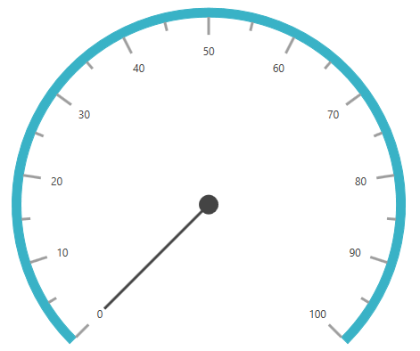
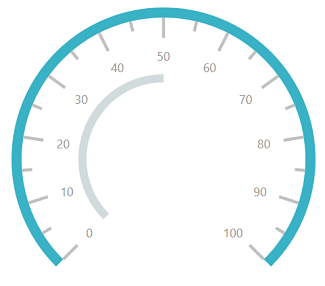
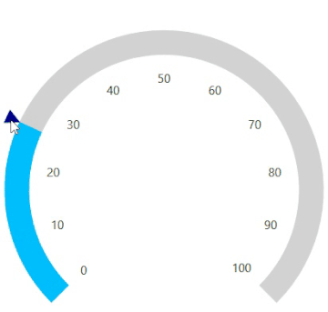

# Pointer support in SfCircularGauge

Pointers are used to indicate values on the scale. Value of the pointer can be modified using the `Value` property.

## Setting pointer type of CircularPointer

There are three types of pointers. You can choose a pointer using the [`PointerType`](https://help.syncfusion.com/cr/wpf/Syncfusion.SfGauge.WPF~Syncfusion.UI.Xaml.Gauges.CircularPointer~PointerType.html) property. 

## Circular pointer with needle pointer

A needle pointer contains two parts, a needle and a pointer cap, that can be placed on a gauge to mark values. 





    <gauge:SfCircularGauge >

    <gauge:SfCircularGauge.Scales>

    <gauge:CircularScale >

    <gauge:CircularScale.Pointers>

    <gauge:CircularPointer PointerType="NeedlePointer"/>

    </gauge:CircularScale.Pointers>

    </gauge:CircularScale>

    </gauge:SfCircularGauge.Scales>

    </gauge:SfCircularGauge>





SfCircularGauge sfCircularGauge = new SfCircularGauge();

CircularScale mainscale = new CircularScale();

CircularPointer circularPointer = new CircularPointer();

circularPointer.PointerType = PointerType.NeedlePointer;

mainscale.Pointers.Add(circularPointer);

sfCircularGauge.Scales.Add(mainscale);





### Different types of needle pointer with scale

The appearance of the needle pointer can be customized using the [`NeedlePointerType`](https://help.syncfusion.com/cr/wpf/Syncfusion.SfGauge.WPF~Syncfusion.UI.Xaml.Gauges.CircularPointer~NeedlePointerType.html) property. The default value of this property is Rectangle.
The `NeedlePointerType` is an `enum` property that includes the following options:

1.	Rectangle

2.	Triangle

3.	Tapered

4.	Arrow





    <gauge:SfCircularGauge >

    <gauge:SfCircularGauge.Scales>

    <gauge:CircularScale >

    <gauge:CircularScale.Pointers>

    <gauge:CircularPointer PointerType="NeedlePointer" 
                           NeedlePointerType="Triangle"/>

    </gauge:CircularScale.Pointers>

    </gauge:CircularScale>

    </gauge:SfCircularGauge.Scales>

    </gauge:SfCircularGauge>





SfCircularGauge sfCircularGauge = new SfCircularGauge();

CircularScale mainscale = new CircularScale();

CircularPointer circularPointer = new CircularPointer();

circularPointer.PointerType = PointerType.NeedlePointer;

circularPointer.NeedlePointerType = NeedlePointerType.Triangle;

mainscale.Pointers.Add(circularPointer);

sfCircularGauge.Scales.Add(mainscale);





### Needle pointer customization

The length of a needle is controlled using the [`NeedleLengthFactor`](https://help.syncfusion.com/cr/wpf/Syncfusion.SfGauge.WPF~Syncfusion.UI.Xaml.Gauges.CircularPointer~NeedleLengthFactor.html) property. The minimum and maximum bounds of the `NeedleLengthFactor` property is 0 to 1. The needle’s UI is customized using the [`NeedlePointerStroke`](https://help.syncfusion.com/cr/wpf/Syncfusion.SfGauge.WPF~Syncfusion.UI.Xaml.Gauges.CircularPointer~NeedlePointerStroke.html) and [`NeedlePointerStrokeThickness`](https://help.syncfusion.com/cr/wpf/Syncfusion.SfGauge.WPF~Syncfusion.UI.Xaml.Gauges.CircularPointer~NeedlePointerStrokeThickness.html) properties. The size of the pointer cap can be modified by changing the [`PointerCapDiameter`](https://help.syncfusion.com/cr/wpf/Syncfusion.SfGauge.WPF~Syncfusion.UI.Xaml.Gauges.CircularPointer~PointerCapDiameter.html) property, and color can be modified using the [`KnobStroke`](https://help.syncfusion.com/cr/wpf/Syncfusion.SfGauge.WPF~Syncfusion.UI.Xaml.Gauges.CircularPointer~KnobStroke.html) property.





    <gauge:SfCircularGauge >

    <gauge:SfCircularGauge.Scales>

    <gauge:CircularScale >

    <gauge:CircularScale.Pointers>

    <gauge:CircularPointer PointerType="NeedlePointer" NeedlePointerType="Triangle" 
                           NeedlePointerStroke="DeepSkyBlue" PointerCapDiameter="20" KnobStroke="DeepSkyBlue"
                           NeedleLengthFactor="0.5" NeedlePointerStrokeThickness="10"/>

    </gauge:CircularScale.Pointers>

    </gauge:CircularScale>

    </gauge:SfCircularGauge.Scales>

    </gauge:SfCircularGauge>





SfCircularGauge sfCircularGauge = new SfCircularGauge();

CircularScale mainscale = new CircularScale();

CircularPointer circularPointer = new CircularPointer();

circularPointer.PointerType = PointerType.NeedlePointer;

circularPointer.NeedlePointerType = NeedlePointerType.Triangle;

circularPointer.NeedlePointerStroke = new SolidColorBrush(Colors.DeepSkyBlue);

circularPointer.NeedlePointerStrokeThickness =10;

circularPointer.NeedleLengthFactor = 0.5;

circularPointer.PointerCapDiameter = 20;

circularPointer.KnobStroke = new SolidColorBrush(Colors.DeepSkyBlue);

mainscale.Pointers.Add(circularPointer);

sfCircularGauge.Scales.Add(mainscale);





### Setting visibility of needle pointer

The visibility of the needle pointer can be set using the [`NeedlePointerVisibility`](https://help.syncfusion.com/cr/wpf/Syncfusion.SfGauge.WPF~Syncfusion.UI.Xaml.Gauges.CircularPointer~NeedlePointerVisibility.html) property.





    <gauge:SfCircularGauge >

    <gauge:SfCircularGauge.Scales>

    <gauge:CircularScale >

    <gauge:CircularScale.Pointers>

    <gauge:CircularPointer NeedlePointerVisibility="Hidden"/>

    </gauge:CircularScale.Pointers>

    </gauge:CircularScale>

    </gauge:SfCircularGauge.Scales>

    </gauge:SfCircularGauge>





SfCircularGauge sfCircularGauge = new SfCircularGauge();

CircularScale mainscale = new CircularScale();

CircularPointer circularPointer = new CircularPointer();

circularPointer.NeedlePointerVisibility = Visibility.Hidden;

mainscale.Pointers.Add(circularPointer);

sfCircularGauge.Scales.Add(mainscale);





### Setting tail for needle pointer

Tail of the needle pointer can be customized by using the [`TailFill`](https://help.syncfusion.com/cr/wpf/Syncfusion.SfGauge.WPF~Syncfusion.UI.Xaml.Gauges.CircularPointer~TailFill.html), [`TailLengthFactor`](https://help.syncfusion.com/cr/wpf/Syncfusion.SfGauge.WPF~Syncfusion.UI.Xaml.Gauges.CircularPointer~TailLengthFactor.html), [`TailStroke`](https://help.syncfusion.com/cr/wpf/Syncfusion.SfGauge.WPF~Syncfusion.UI.Xaml.Gauges.CircularPointer~TailStroke.html), and [`TailStrokeThickness`](https://help.syncfusion.com/cr/wpf/Syncfusion.SfGauge.WPF~Syncfusion.UI.Xaml.Gauges.CircularPointer~TailStrokeThickness.html) properties.

* `TailFill` - Fill color to needle pointer’s tail.

* `TailLengthFactor` - Length factor of needle pointer’s tail. It’s range is 0 to 1.

* `TailStroke` - Stroke to needle pointer’s tail.

* `TailStrokeThickness` - Set the stroke thickness to needle pointer’s tail.





    <gauge:SfCircularGauge >
    <gauge:SfCircularGauge.Scales>
    <gauge:CircularScale >
      <gauge:CircularScale.Pointers>
            <gauge:CircularPointer 
			Value="30" 
			PointerType="NeedlePointer"
            TailLengthFactor="0.3"
			TailStroke="#ed7d31"
			TailFill="#ed7d31"
			NeedlePointerStrokeThickness="3"
			NeedlePointerType="Tapered" 
			KnobFill="White"     
			NeedlePointerVisibility="Visible"
			NeedlePointerStroke="#ed7d31" />
      <gauge:CircularPointer
           Value="50"
	       PointerType="NeedlePointer"
		   TailLengthFactor="0.4"
	       TailStroke="#ed7d31"
           TailFill="#ed7d31"
           KnobFill="White"
           NeedlePointerStrokeThickness="3"
           NeedlePointerType="Tapered" 
           NeedlePointerVisibility="Visible"
           NeedlePointerStroke="#ed7d31"  />
    </gauge:CircularScale.Pointers>
    </gauge:CircularScale>
    </gauge:SfCircularGauge.Scales>
    </gauge:SfCircularGauge>





    SfCircularGauge sfCircularGauge = new SfCircularGauge();
            CircularScale mainscale = new CircularScale();
            CircularPointer circularPointer = new CircularPointer();
            circularPointer.PointerType = PointerType.NeedlePointer;
            circularPointer.Value = 30;
            circularPointer.TailLengthFactor = 0.3;
            circularPointer.TailStroke = new SolidColorBrush(Color.FromRgb(237,125,49));
            circularPointer.TailFill = new SolidColorBrush(Color.FromRgb(237, 125, 49));
            circularPointer.NeedlePointerStrokeThickness = 3;
            circularPointer.NeedlePointerType = NeedlePointerType.Tapered;
            circularPointer.KnobFill = new SolidColorBrush(Colors.White);
            circularPointer.NeedlePointerVisibility = Visibility.Visible;
            circularPointer.NeedlePointerStroke = new SolidColorBrush(Color.FromRgb(237, 125, 49));
            mainscale.Pointers.Add(circularPointer);
            CircularPointer circularPointer2 = new CircularPointer();
            circularPointer2.PointerType = PointerType.NeedlePointer;
            circularPointer2.Value = 50;
            circularPointer2.TailLengthFactor = 0.3;
            circularPointer2.TailStroke = new SolidColorBrush(Color.FromRgb(237, 125, 49));
            circularPointer2.TailFill = new SolidColorBrush(Color.FromRgb(237, 125, 49));
            circularPointer2.NeedlePointerStrokeThickness = 3;
            circularPointer2.NeedlePointerType = NeedlePointerType.Tapered;
            circularPointer2.KnobFill = new SolidColorBrush(Colors.White);
            circularPointer2.NeedlePointerVisibility = Visibility.Visible;
            circularPointer2.NeedlePointerStroke = new SolidColorBrush(Color.FromRgb(237, 125, 49));
            mainscale.Pointers.Add(circularPointer2);
            sfCircularGauge.Scales.Add(mainscale);





## Setting range pointer with circular scale

The range pointer is an accenting line or shaded background range that can be placed on a gauge to mark values. 





    <gauge:SfCircularGauge >

    <gauge:SfCircularGauge.Scales>

    <gauge:CircularScale >

    <gauge:CircularScale.Pointers>

    <gauge:CircularPointer PointerType="RangePointer" Value="50" />

    </gauge:CircularScale.Pointers>

    </gauge:CircularScale>

    </gauge:SfCircularGauge.Scales>

    </gauge:SfCircularGauge>





SfCircularGauge sfCircularGauge = new SfCircularGauge();

CircularScale mainscale = new CircularScale();

CircularPointer circularPointer = new CircularPointer();

circularPointer.PointerType = PointerType.RangePointer;

circularPointer.Value = 50;

mainscale.Pointers.Add(circularPointer);

sfCircularGauge.Scales.Add(mainscale);





### Range pointer customization

The range pointer’s UI is customized using the [`RangePointerStroke`](https://help.syncfusion.com/cr/wpf/Syncfusion.SfGauge.WPF~Syncfusion.UI.Xaml.Gauges.CircularPointer~RangePointerStroke.html) and [`RangePointerStrokeThickness`](https://help.syncfusion.com/cr/wpf/Syncfusion.SfGauge.WPF~Syncfusion.UI.Xaml.Gauges.CircularPointer~RangePointerStrokeThickness.html) properties.  





    <gauge:SfCircularGauge >

    <gauge:SfCircularGauge.Scales>

    <gauge:CircularScale >

    <gauge:CircularScale.Pointers>

    <gauge:CircularPointer PointerType="RangePointer" Value="50" 
                           RangePointerStroke="DarkCyan" RangePointerStrokeThickness="20"/>

    </gauge:CircularScale.Pointers>

    </gauge:CircularScale>

    </gauge:SfCircularGauge.Scales>

    </gauge:SfCircularGauge>





SfCircularGauge sfCircularGauge = new SfCircularGauge();

CircularScale mainscale = new CircularScale();

CircularPointer circularPointer = new CircularPointer();

circularPointer.PointerType = PointerType.RangePointer;

circularPointer.Value = 50;

circularPointer.RangePointerStroke = new SolidColorBrush(Colors.DarkCyan);

circularPointer.RangePointerStrokeThickness = 20;

mainscale.Pointers.Add(circularPointer);

sfCircularGauge.Scales.Add(mainscale);





### Setting visibility for range pointer

The [`RangePointerVisibility`](https://help.syncfusion.com/cr/wpf/Syncfusion.SfGauge.WPF~Syncfusion.UI.Xaml.Gauges.CircularPointer~RangePointerVisibility.html) property is used to set the visibility of the range pointer.





    <gauge:SfCircularGauge >

    <gauge:SfCircularGauge.Scales>

    <gauge:CircularScale >

    <gauge:CircularScale.Pointers>

    <gauge:CircularPointer RangePointerVisibility="Hidden"/>

    </gauge:CircularScale.Pointers>

    </gauge:CircularScale>
                    
    </gauge:SfCircularGauge.Scales>

    </gauge:SfCircularGauge>





SfCircularGauge sfCircularGauge = new SfCircularGauge();

CircularScale mainscale = new CircularScale();

CircularPointer circularPointer = new CircularPointer();

circularPointer.RangePointerVisibility = Visibility.Hidden;

mainscale.Pointers.Add(circularPointer);

sfCircularGauge.Scales.Add(mainscale);





### Setting position for range pointer

The `RangePointer` can be placed inside or outside the scale by the following two ways:
*	Using the [`RangePointerPosition`](https://help.syncfusion.com/cr/wpf/Syncfusion.SfGauge.WPF~Syncfusion.UI.Xaml.Gauges.CircularScale~RangePointerPosition.html) property.

You can place the range pointer by selecting one of the below option available in the `RangePointerPosition` property. 
1.	Inside (Default)

2.	Outside

3.	Cross

4.	Custom





    <gauge:SfCircularGauge >

    <gauge:SfCircularGauge.Scales>

    <gauge:CircularScale RangePointerPosition="Outside">

    <gauge:CircularScale.Pointers>

    <gauge:CircularPointer PointerType="RangePointer" 
                           RangePointerStroke="HotPink" Value="60"/>

    </gauge:CircularScale.Pointers>

    </gauge:CircularScale>

    </gauge:SfCircularGauge.Scales>

    </gauge:SfCircularGauge>





SfCircularGauge sfCircularGauge = new SfCircularGauge();

CircularScale mainscale = new CircularScale();

mainscale.RangePointerPosition = RangePointerPosition.Outside;

CircularPointer circularPointer = new CircularPointer();

circularPointer.PointerType = PointerType.RangePointer;

circularPointer.RangePointerStroke = new SolidColorBrush(Colors.HotPink);

circularPointer.Value = 60;

mainscale.Pointers.Add(circularPointer);

sfCircularGauge.Scales.Add(mainscale);





*	Using the `Offset` property. First, set the `RangePointerPosition` to custom, and then set the `Offset` property.





    <gauge:SfCircularGauge >
        <gauge:SfCircularGauge.Scales >
            <gauge:CircularScale  x:Name="scale" RangePointerPosition="Custom">
                <gauge:CircularScale.Pointers>
                    <gauge:CircularPointer PointerType="RangePointer" Offset="0.5" 
                                           RangePointerStroke="LightGray" Value="90"/>
                </gauge:CircularScale.Pointers>
            </gauge:CircularScale>
        </gauge:SfCircularGauge.Scales>
    </gauge:SfCircularGauge>





SfCircularGauge sfCircularGauge = new SfCircularGauge();

CircularScale mainscale = new CircularScale();

mainscale.RangePointerPosition = RangePointerPosition.Custom;

CircularPointer circularPointer = new CircularPointer();

circularPointer.PointerType = PointerType.RangePointer;

circularPointer.Offset = 0.5;

circularPointer.RangePointerStroke = new SolidColorBrush(Colors.LightGray);

circularPointer.Value = 90;

mainscale.Pointers.Add(circularPointer);

sfCircularGauge.Scales.Add(mainscale);





### Setting range cap for range pointer

The [`RangeCap`](https://help.syncfusion.com/cr/wpf/Syncfusion.SfGauge.WPF~Syncfusion.UI.Xaml.Gauges.CircularPointer~RangeCap.html) property provides options to position the range cap of the RangePointer, which contains the start, end, both, and none options. The RangeCap property is an enum property.





    <gauge:SfCircularGauge Margin="10">
        <gauge:SfCircularGauge.Scales>
            <gauge:CircularScale x:Name="scale" SweepAngle="360" 
                                 RimStroke="LightGray"  
                                 RimStrokeThickness="30" 
                                 RangePointerPosition="Custom">
                <gauge:CircularScale.Pointers>
                    <gauge:CircularPointer PointerType="RangePointer" 
                                           RangePointerStrokeThickness="30" 
                                           RangeCap="Both" 
                                           RangePointerStroke="DeepSkyBlue" 
                                           Value="75"/>
                </gauge:CircularScale.Pointers>
            </gauge:CircularScale>
        </gauge:SfCircularGauge.Scales>
    </gauge:SfCircularGauge>





            SfCircularGauge sfCircularGauge = new SfCircularGauge();
            CircularScale mainscale = new CircularScale();
            mainscale.RangePointerPosition = RangePointerPosition.Custom;
            mainscale.SweepAngle = 360;
            mainscale.RimStroke = new SolidColorBrush(Colors.LightGray);
            mainscale.RimStrokeThickness = 30;
            CircularPointer circularPointer = new CircularPointer();
            circularPointer.PointerType = PointerType.RangePointer;
            circularPointer.RangePointerStrokeThickness = 30;
            circularPointer.RangeCap = RangeCap.Both;
            circularPointer.RangePointerStroke = new SolidColorBrush(Colors.DeepSkyBlue);
            circularPointer.Value = 75;
            mainscale.Pointers.Add(circularPointer);
            sfCircularGauge.Scales.Add(mainscale);





## Setting symbol pointer with circular scale

In symbol pointer, the value is pointed out using a symbol on the scale. The symbol is an enum property that provides symbol options for the symbol pointer, which contains several shapes such as rectangle, ellipse, and triangle.





    <gauge:SfCircularGauge >

    <gauge:SfCircularGauge.Scales>

    <gauge:CircularScale>

    <gauge:CircularScale.Pointers>

    <gauge:CircularPointer PointerType="SymbolPointer"  Value="60"/>

    </gauge:CircularScale.Pointers>

    </gauge:CircularScale>

    </gauge:SfCircularGauge.Scales>

    </gauge:SfCircularGauge>





SfCircularGauge sfCircularGauge = new SfCircularGauge();

CircularScale mainscale = new CircularScale();

CircularPointer circularPointer = new CircularPointer();

circularPointer.PointerType = PointerType.SymbolPointer;

circularPointer.Value = 60;

mainscale.Pointers.Add(circularPointer);

sfCircularGauge.Scales.Add(mainscale);





### Symbol pointer customization

You can modify the stroke of the symbol by changing the [`SymbolPointerStroke`](https://help.syncfusion.com/cr/wpf/Syncfusion.SfGauge.WPF~Syncfusion.UI.Xaml.Gauges.CircularPointer~SymbolPointerStroke.html) property. The [`SymbolPointerHeight`](https://help.syncfusion.com/cr/wpf/Syncfusion.SfGauge.WPF~Syncfusion.UI.Xaml.Gauges.CircularPointer~SymbolPointerHeight.html) property is used to set the height of the symbol pointer. The value should be given as a double value. The [`SymbolPointerWidth`](https://help.syncfusion.com/cr/wpf/Syncfusion.SfGauge.WPF~Syncfusion.UI.Xaml.Gauges.CircularPointer~SymbolPointerWidth.html) property is used to set the width of the symbol pointer.





    <gauge:SfCircularGauge >

    <gauge:SfCircularGauge.Scales>

    <gauge:CircularScale>

    <gauge:CircularScale.Pointers>

    <gauge:CircularPointer PointerType="SymbolPointer"  Value="60" SymbolPointerStroke="Red"
     SymbolPointerHeight="20" SymbolPointerWidth="20"/>

    </gauge:CircularScale.Pointers>

    </gauge:CircularScale>

    </gauge:SfCircularGauge.Scales>
            
    </gauge:SfCircularGauge>





SfCircularGauge sfCircularGauge = new SfCircularGauge();

CircularScale mainscale = new CircularScale();

CircularPointer circularPointer = new CircularPointer();

circularPointer.PointerType = PointerType.SymbolPointer;

circularPointer.Value = 60;

circularPointer.SymbolPointerStroke = new SolidColorBrush(Colors.Red);

circularPointer.SymbolPointerHeight = 20;

circularPointer.SymbolPointerWidth = 20;

mainscale.Pointers.Add(circularPointer);

sfCircularGauge.Scales.Add(mainscale);





### Setting visibility of symbol pointer

The visibility of the symbol pointer can be set using the [`SymbolPointerVisibility`](https://help.syncfusion.com/cr/wpf/Syncfusion.SfGauge.WPF~Syncfusion.UI.Xaml.Gauges.CircularPointer~SymbolPointerVisibility.html) Property.





    <gauge:SfCircularGauge >

    <gauge:SfCircularGauge.Scales>

    <gauge:CircularScale>

    <gauge:CircularScale.Pointers>

    <gauge:CircularPointer SymbolPointerVisibility="Hidden"/>

    </gauge:CircularScale.Pointers>

    </gauge:CircularScale>

    </gauge:SfCircularGauge.Scales>

    </gauge:SfCircularGauge>





SfCircularGauge sfCircularGauge = new SfCircularGauge();

CircularScale mainscale = new CircularScale();

CircularPointer circularPointer = new CircularPointer();

circularPointer.SymbolPointerVisibility = Visibility.Hidden;

mainscale.Pointers.Add(circularPointer);

sfCircularGauge.Scales.Add(mainscale);





### Setting offset for SymbolPointers

The [`Offset`](https://help.syncfusion.com/cr/wpf/Syncfusion.SfGauge.WPF~Syncfusion.UI.Xaml.Gauges.CircularPointer~Offset.html) property in the CircularPointer can be placed SymbolPointer in desired position of rim.





       <gauge:SfCircularGauge >
            <gauge:SfCircularGauge.Scales>
                <gauge:CircularScale>
                    <gauge:CircularScale.Pointers>
                        <gauge:CircularPointer PointerType="SymbolPointer" 
                                               Offset="0.5" Symbol="Triangle"  Value="60"/>
                    </gauge:CircularScale.Pointers>
                </gauge:CircularScale>
            </gauge:SfCircularGauge.Scales>
        </gauge:SfCircularGauge>
		




            SfCircularGauge sfCircularGauge = new SfCircularGauge();
            CircularScale mainscale = new CircularScale();
            CircularPointer circularPointer = new CircularPointer();
            circularPointer.PointerType = PointerType.SymbolPointer;
            circularPointer.Value = 60;
            circularPointer.Symbol = Symbol.Triangle;
            circularPointer.Offset = 0.5;
            mainscale.Pointers.Add(circularPointer);
            sfCircularGauge.Scales.Add(mainscale);
            CircularPointer circularPointer1 = new CircularPointer();
            circularPointer1.NeedlePointerVisibility = Visibility.Hidden;
            circularPointer1.PointerType = PointerType.NeedlePointer;
            mainscale.Pointers.Add(circularPointer1);





### Setting multiple pointers

In addition to the default pointer, you can add n number of pointers to a scale using the `Pointers` property.





<gauge:SfCircularGauge>
        <gauge:SfCircularGauge.Scales>
            <gauge:CircularScale >
                <gauge:CircularScale.Pointers>
                    <gauge:CircularPointer PointerType="NeedlePointer" 
                                           NeedleLengthFactor="0.4" Value="60"
                                           NeedlePointerType="Tapered" KnobStroke="#39B2C6" />
                    <gauge:CircularPointer PointerType="RangePointer"  Value="100"/>
                    <gauge:CircularPointer PointerType="SymbolPointer"  Value="50" Symbol="Pentagon"
                                           SymbolPointerHeight="20" SymbolPointerWidth="20" 
                                           SymbolPointerStroke="#39B2C6"/>
                </gauge:CircularScale.Pointers>
            </gauge:CircularScale>
        </gauge:SfCircularGauge.Scales>
    </gauge:SfCircularGauge>    





SfCircularGauge sfCircularGauge = new SfCircularGauge();

CircularScale mainscale = new CircularScale();

CircularPointer circularPointer = new CircularPointer();

circularPointer.PointerType = PointerType.NeedlePointer;

circularPointer.NeedleLengthFactor = 0.4;

circularPointer.Value = 60;

circularPointer.NeedlePointerType = NeedlePointerType.Tapered;

circularPointer.KnobStroke = new SolidColorBrush(Color.FromArgb(0xff, 0x39, 0xb2, 0xc6));

mainscale.Pointers.Add(circularPointer);

CircularPointer circularPointer1 = new CircularPointer();

circularPointer1.PointerType = PointerType.RangePointer;

circularPointer1.Value = 100;

mainscale.Pointers.Add(circularPointer1);

CircularPointer circularPointer2 = new CircularPointer();

circularPointer2.PointerType = PointerType.SymbolPointer;

circularPointer2.Value = 50;

circularPointer2.Symbol = Symbol.Pentagon;

circularPointer2.SymbolPointerHeight = 20;

circularPointer2.SymbolPointerWidth = 20;

circularPointer2.SymbolPointerStroke = new SolidColorBrush(Color.FromArgb(0xff, 0x39, 0xb2, 0xc6));

mainscale.Pointers.Add(circularPointer2);

mainscale.Pointers.Add(circularPointer);

sfCircularGauge.Scales.Add(mainscale);





## Setting animation for pointer

The [`EnableAnimation`](https://help.syncfusion.com/cr/wpf/Syncfusion.SfGauge.WPF~Syncfusion.UI.Xaml.Gauges.CircularPointer~EnableAnimation.html) property is a Boolean property that enables or disables the animation of the pointers in circular gauge.





    <gauge:SfCircularGauge>

    <gauge:SfCircularGauge.Scales>

    <gauge:CircularScale Radius="150" >

    <gauge:CircularScale.Pointers>

    <gauge:CircularPointer PointerType="NeedlePointer" NeedleLengthFactor="0.4" Value="60"
    NeedlePointerType="Triangle" KnobStroke="#39B2C6" PointerCapDiameter="20"/>

    <gauge:CircularPointer PointerType="RangePointer"  Value="100" RangePointerStroke="#39B2C6"/>

    </gauge:CircularScale.Pointers>

    </gauge:CircularScale>

    </gauge:SfCircularGauge.Scales>

    </gauge:SfCircularGauge>





            SfCircularGauge sfCircularGauge = new SfCircularGauge();

            CircularScale mainscale = new CircularScale();

            mainscale.Radius = 150;

            CircularPointer circularPointer = new CircularPointer();

            circularPointer.PointerType = PointerType.NeedlePointer;

            circularPointer.EnableAnimation = true;

            circularPointer.NeedleLengthFactor = 0.4;

            circularPointer.Value = 60;

            circularPointer.NeedlePointerType = NeedlePointerType.Triangle;

            circularPointer.PointerCapDiameter = 20;

            circularPointer.KnobStroke = new SolidColorBrush(Color.FromArgb(0xff, 0x39, 0xb2, 0xc6));

            mainscale.Pointers.Add(circularPointer);

            CircularPointer circularPointer1 = new CircularPointer();

            circularPointer1.PointerType = PointerType.RangePointer;

            circularPointer1.RangePointerStroke = new SolidColorBrush(Color.FromArgb(0xff, 0x39, 0xb2, 0xc6));

            circularPointer1.EnableAnimation = true;

            circularPointer1.Value = 100;

            mainscale.Pointers.Add(circularPointer1);

            mainscale.Pointers.Add(circularPointer);

            sfCircularGauge.Scales.Add(mainscale);





## Circular pointer dragging

Symbol pointer and needle pointer can be dragged over the scale value by setting the [`EnableDragging`](https://help.syncfusion.com/cr/wpf/Syncfusion.SfGauge.WPF~Syncfusion.UI.Xaml.Gauges.CircularPointer~EnableDragging.html) property as true. Pointers can be moved to the respective position.




        <gauge:SfCircularGauge >
        <gauge:SfCircularGauge.Scales >
            <gauge:CircularScale LabelPosition="Custom"  Grid.Row="1" 
                                 RimStroke="LightGray" 
                                 RadiusFactor="1" ShowTicks="False"
                                 RimStrokeThickness="30"     
                                 StartValue="0" EndValue="100" Interval="10" 
                                 LabelOffset="0.75" LabelStroke="Black" FontSize="15">
                <gauge:CircularScale.Ranges>
                    <gauge:CircularRange StrokeThickness="30" StartValue="0" 
                                         x:Name="range" EndValue="25" 
                                         Stroke="DeepSkyBlue"/>
                </gauge:CircularScale.Ranges>
                <gauge:CircularScale.Pointers>
                    <gauge:CircularPointer PointerType="SymbolPointer" 
                                           Symbol="InvertedTriangle" 
                                           SymbolPointerHeight="18" SymbolPointerWidth="18"
                                           ValueChanged="CircularPointer_ValueChanged"  
                                           SymbolPointerStroke="DarkBlue" Value="25" 
                                           EnableAnimation="False" EnableDragging="True"/>
                </gauge:CircularScale.Pointers>
            </gauge:CircularScale>
        </gauge:SfCircularGauge.Scales>
    </gauge:SfCircularGauge>




    public partial class PointerDragging : Window
    {
        CircularRange range = new CircularRange();

        public PointerDragging()
        {
            InitializeComponent();
            SfCircularGauge circularGauge = new SfCircularGauge();
            CircularScale scale = new CircularScale();
            scale.RimStroke = new SolidColorBrush(Colors.LightGray);
            scale.RimStrokeThickness = 30;
            scale.RadiusFactor = 1;
            scale.ShowTicks = false;
            scale.StartValue = 0;
            scale.EndValue = 100;
            scale.Interval = 10;
            scale.LabelOffset = 0.75;
            scale.LabelStroke = new SolidColorBrush(Colors.Black);
            scale.FontSize = 15;
            scale.LabelPosition = LabelPosition.Custom;
            scale.RadiusFactor = 1;
            scale.ShowTicks = false ;
            CircularPointer circularPointer = new CircularPointer();
            circularPointer.PointerType = PointerType.SymbolPointer;
            circularPointer.Symbol = Symbol.InvertedTriangle;
            circularPointer.Value = 25;
            circularPointer.SymbolPointerStroke = new SolidColorBrush(Colors.DarkBlue);
            circularPointer.SymbolPointerHeight = 18;
            circularPointer.EnableAnimation = false;
            circularPointer.EnableDragging = true;
            circularPointer.SymbolPointerWidth = 18;
            circularPointer.ValueChanged += CircularPointer_ValueChanged;
            range.StrokeThickness = 30;
            range.StartValue = 0;
            range.EndValue = 25;
            range.Stroke = new SolidColorBrush(Colors.DeepSkyBlue);
            scale.Ranges.Add(range);
            scale.Pointers.Add(circularPointer);
            circularGauge.Scales.Add(scale);
            this.Content = circularGauge;
        }

        private void CircularPointer_ValueChanged(object sender, ValueChangedEventArgs e)
        {
            range.EndValue = e.Value;
        }
    }




## Events

### Value changing event

Called during a drag when the user is selecting before a new value for the pointer by dragging. The `ValueChangingEventArgs` contains `OldValue`, `NewValue`, and `Cancel` properties.
`OldValue`: Contains pointer old value.
`NewValue`: Contains pointer new value.
`Cancel`: To restrict the update of current drag pointer value, set `ValueChangingArgs.cancel` is true.




         <gauge:SfCircularGauge>
            <gauge:SfCircularGauge.Scales>
                <gauge:CircularScale>
                    <gauge:CircularScale.Pointers>
                        <gauge:CircularPointer EnableDragging="True" 
                                               ValueChanging="CircularPointer_ValueChanging" 
                                               Value="20" Symbol="InvertedTriangle" 
                                               PointerType="SymbolPointer" />
                    </gauge:CircularScale.Pointers>
                </gauge:CircularScale>
            </gauge:SfCircularGauge.Scales>
        </gauge:SfCircularGauge>




    public partial class PointerDragging : Window
    {
        public PointerDragging()
        {
            InitializeComponent();
            SfCircularGauge circularGauge = new SfCircularGauge();
            CircularScale scale = new CircularScale();
            CircularPointer circularPointer = new CircularPointer();
            circularPointer.EnableDragging = true;
            circularPointer.Value = 20;
            circularPointer.Symbol = Symbol.InvertedTriangle;
            circularPointer.PointerType = PointerType.SymbolPointer;
            circularPointer.ValueChanging += CircularPointer_ValueChanging;
            scale.Pointers.Add(circularPointer);
            circularGauge.Scales.Add(scale);
            this.Content = circularGauge;
        }

        private void CircularPointer_ValueChanging(object sender, ValueChangingEventArgs e)
        {
            if (e.NewValue > 30 && e.NewValue < 70)
            {
                e.Cancel = true;
            }
        }
    }




### Value changed event

Called during a drag when the user is selecting a new value for the pointer by dragging. The `ValueChangedEventArgs` contains `Value` property.
`Value` : Contains drag pointer value.




        <gauge:SfCircularGauge>
            <gauge:SfCircularGauge.Scales>
                <gauge:CircularScale>
                    <gauge:CircularScale.Pointers>
                        <gauge:CircularPointer ValueChanged="CircularPointer_ValueChanged" />
                    </gauge:CircularScale.Pointers>
                </gauge:CircularScale>
            </gauge:SfCircularGauge.Scales>
        </gauge:SfCircularGauge>




    public partial class PointerDragging : Window
    {
        public PointerDragging()
        {
            InitializeComponent();
            SfCircularGauge circularGauge = new SfCircularGauge();
            CircularScale scale = new CircularScale();
            CircularPointer circularPointer = new CircularPointer();
            circularPointer.ValueChanged += CircularPointer_ValueChanged;
            scale.Pointers.Add(circularPointer);
            circularGauge.Scales.Add(scale);
            this.Content = circularGauge;
        }

        private void CircularPointer_ValueChanged(object sender, ValueChangedEventArgs e)
        {
            var value = e.Value;
        }
    }


