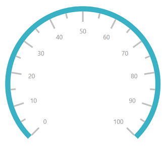
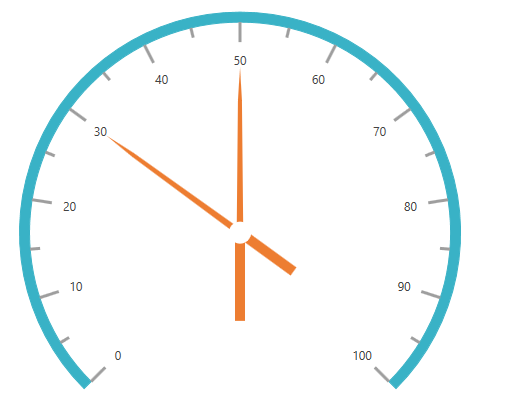
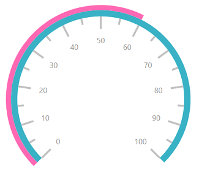
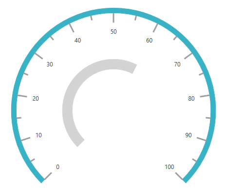
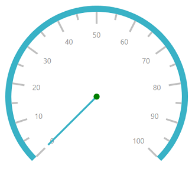
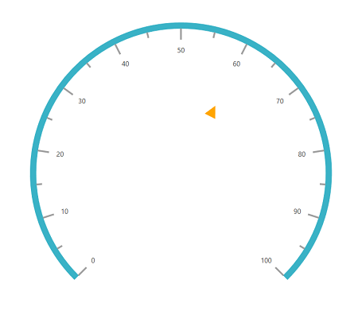
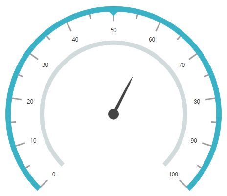

# Pointer support in SfCircularGauge

Pointers are used to indicate values on the scale. Value of the pointer can be modified using the `Value` property.

## Pointer Type

There are three types of pointers. You can choose a pointer using the `PointerType` property. 

## Needle pointer

A needle pointer contains two parts, a needle and a pointer cap, that can be placed on a gauge to mark values. 





    <gauge:SfCircularGauge >

    <gauge:SfCircularGauge.Scales>

    <gauge:CircularScale >

    <gauge:CircularScale.Pointers>

    <gauge:CircularPointer PointerType="NeedlePointer"/>

    </gauge:CircularScale.Pointers>

    </gauge:CircularScale>

    </gauge:SfCircularGauge.Scales>

    </gauge:SfCircularGauge>





SfCircularGauge sfCircularGauge = new SfCircularGauge();

CircularScale mainscale = new CircularScale();

CircularPointer circularPointer = new CircularPointer();

circularPointer.PointerType = PointerType.NeedlePointer;

mainscale.Pointers.Add(circularPointer);

sfCircularGauge.Scales.Add(mainscale);





### NeedlePointerType

The appearance of the needle pointer can be customized using the `NeedlePointerType` property. The default value of this property is Rectangle.
The `NeedlePointerType` is an `enum` property that includes the following options:

1.	Rectangle

2.	Triangle

3.	Tapered

4.	Arrow





    <gauge:SfCircularGauge >

    <gauge:SfCircularGauge.Scales>

    <gauge:CircularScale >

    <gauge:CircularScale.Pointers>

    <gauge:CircularPointer PointerType="NeedlePointer" NeedlePointerType="Triangle"/>

    </gauge:CircularScale.Pointers>

    </gauge:CircularScale>

    </gauge:SfCircularGauge.Scales>

    </gauge:SfCircularGauge>





SfCircularGauge sfCircularGauge = new SfCircularGauge();

CircularScale mainscale = new CircularScale();

CircularPointer circularPointer = new CircularPointer();

circularPointer.PointerType = PointerType.NeedlePointer;

circularPointer.NeedlePointerType = NeedlePointerType.Triangle;

mainscale.Pointers.Add(circularPointer);

sfCircularGauge.Scales.Add(mainscale);





### Needle pointer customization

The length of a needle is controlled using the `NeedleLengthFactor` property. The minimum and maximum bounds of the `NeedleLengthFactor` property are 0 and 1. The needle’s UI is customized using the `NeedlePointerStroke` and `NeedlePointerStrokeThickness` properties. The size of the pointer cap can be modified by changing the `PointerCapDiameter` property, and color can be modified using the `KnobStroke` property.





    <gauge:SfCircularGauge >

    <gauge:SfCircularGauge.Scales>

    <gauge:CircularScale >

    <gauge:CircularScale.Pointers>

    <gauge:CircularPointer PointerType="NeedlePointer" NeedlePointerType="Triangle" NeedlePointerStroke="DeepSkyBlue"     PointerCapDiameter="20" KnobStroke="DeepSkyBlue"
    NeedleLengthFactor="0.5" NeedlePointerStrokeThickness="10"/>

    </gauge:CircularScale.Pointers>

    </gauge:CircularScale>

    </gauge:SfCircularGauge.Scales>

    </gauge:SfCircularGauge>





SfCircularGauge sfCircularGauge = new SfCircularGauge();

CircularScale mainscale = new CircularScale();

CircularPointer circularPointer = new CircularPointer();

circularPointer.PointerType = PointerType.NeedlePointer;

circularPointer.NeedlePointerType = NeedlePointerType.Triangle;

circularPointer.NeedlePointerStroke = new SolidColorBrush(Colors.DeepSkyBlue);

circularPointer.NeedlePointerStrokeThickness =10;

circularPointer.NeedleLengthFactor = 0.5;

circularPointer.PointerCapDiameter = 20;

circularPointer.KnobStroke = new SolidColorBrush(Colors.DeepSkyBlue);

mainscale.Pointers.Add(circularPointer);

sfCircularGauge.Scales.Add(mainscale);





### Setting visibility of needle pointer

The visibility of the needle pointer can be set using the `NeedlePointerVisibility` property.





    <gauge:SfCircularGauge >

    <gauge:SfCircularGauge.Scales>

    <gauge:CircularScale >

    <gauge:CircularScale.Pointers>

    <gauge:CircularPointer NeedlePointerVisibility="Hidden"/>

    </gauge:CircularScale.Pointers>

    </gauge:CircularScale>

    </gauge:SfCircularGauge.Scales>

    </gauge:SfCircularGauge>





SfCircularGauge sfCircularGauge = new SfCircularGauge();

CircularScale mainscale = new CircularScale();

CircularPointer circularPointer = new CircularPointer();

circularPointer.NeedlePointerVisibility = Visibility.Hidden;

mainscale.Pointers.Add(circularPointer);

sfCircularGauge.Scales.Add(mainscale);





### Setting tail for needle pointer

Tail of the needle pointer can be customized by using the `TailFill`, `TailLengthFactor`, `TailStroke`, and `TailStrokeThickness` properties.

* `TailFill` - Fill color to needle pointer’s tail.

* `TailLengthFactor` - Length factor of needle pointer’s tail. It’s range is 0 to 1.

* `TailStroke` - Stroke to needle pointer’s tail.

* `TailStrokeThickness` - Set the stroke thickness to needle pointer’s tail.





    <gauge:SfCircularGauge >
    <gauge:SfCircularGauge.Scales>
    <gauge:CircularScale >
      <gauge:CircularScale.Pointers>
            <gauge:CircularPointer 
			Value="30" 
			PointerType="NeedlePointer"
            TailLengthFactor="0.3"
			TailStroke="#ed7d31"
			TailFill="#ed7d31"
			NeedlePointerStrokeThickness="3"
			NeedlePointerType="Tapered" 
			KnobFill="White"     
			NeedlePointerVisibility="Visible"
			NeedlePointerStroke="#ed7d31" />
      <gauge:CircularPointer
           Value="50"
	       PointerType="NeedlePointer"
		   TailLengthFactor="0.4"
	       TailStroke="#ed7d31"
           TailFill="#ed7d31"
           KnobFill="White"
           NeedlePointerStrokeThickness="3"
           NeedlePointerType="Tapered" 
           NeedlePointerVisibility="Visible"
           NeedlePointerStroke="#ed7d31"  />
    </gauge:CircularScale.Pointers>
    </gauge:CircularScale>
    </gauge:SfCircularGauge.Scales>
    </gauge:SfCircularGauge>





    SfCircularGauge sfCircularGauge = new SfCircularGauge();
            CircularScale mainscale = new CircularScale();
            CircularPointer circularPointer = new CircularPointer();
            circularPointer.PointerType = PointerType.NeedlePointer;
            circularPointer.Value = 30;
            circularPointer.TailLengthFactor = 0.3;
            circularPointer.TailStroke = new SolidColorBrush(Color.FromRgb(237,125,49));
            circularPointer.TailFill = new SolidColorBrush(Color.FromRgb(237, 125, 49));
            circularPointer.NeedlePointerStrokeThickness = 3;
            circularPointer.NeedlePointerType = NeedlePointerType.Tapered;
            circularPointer.KnobFill = new SolidColorBrush(Colors.White);
            circularPointer.NeedlePointerVisibility = Visibility.Visible;
            circularPointer.NeedlePointerStroke = new SolidColorBrush(Color.FromRgb(237, 125, 49));
            mainscale.Pointers.Add(circularPointer);
            CircularPointer circularPointer2 = new CircularPointer();
            circularPointer2.PointerType = PointerType.NeedlePointer;
            circularPointer2.Value = 50;
            circularPointer2.TailLengthFactor = 0.3;
            circularPointer2.TailStroke = new SolidColorBrush(Color.FromRgb(237, 125, 49));
            circularPointer2.TailFill = new SolidColorBrush(Color.FromRgb(237, 125, 49));
            circularPointer2.NeedlePointerStrokeThickness = 3;
            circularPointer2.NeedlePointerType = NeedlePointerType.Tapered;
            circularPointer2.KnobFill = new SolidColorBrush(Colors.White);
            circularPointer2.NeedlePointerVisibility = Visibility.Visible;
            circularPointer2.NeedlePointerStroke = new SolidColorBrush(Color.FromRgb(237, 125, 49));
            mainscale.Pointers.Add(circularPointer2);
            sfCircularGauge.Scales.Add(mainscale);





## Range pointer

The range pointer is an accenting line or shaded background range that can be placed on a gauge to mark values. 





    <gauge:SfCircularGauge >

    <gauge:SfCircularGauge.Scales>

    <gauge:CircularScale >

    <gauge:CircularScale.Pointers>

    <gauge:CircularPointer PointerType="RangePointer" Value="50" />

    </gauge:CircularScale.Pointers>

    </gauge:CircularScale>

    </gauge:SfCircularGauge.Scales>

    </gauge:SfCircularGauge>





SfCircularGauge sfCircularGauge = new SfCircularGauge();

CircularScale mainscale = new CircularScale();

CircularPointer circularPointer = new CircularPointer();

circularPointer.PointerType = PointerType.RangePointer;

circularPointer.Value = 50;

mainscale.Pointers.Add(circularPointer);

sfCircularGauge.Scales.Add(mainscale);





### Range pointer customization

The range pointer’s UI is customized using the `RangePointerStroke` and `RangePointerStrokeThickness` properties.  





    <gauge:SfCircularGauge >

    <gauge:SfCircularGauge.Scales>

    <gauge:CircularScale >

    <gauge:CircularScale.Pointers>

    <gauge:CircularPointer PointerType="RangePointer" Value="50" RangePointerStroke="DarkCyan" RangePointerStrokeThickness="20"/>

    </gauge:CircularScale.Pointers>

    </gauge:CircularScale>

    </gauge:SfCircularGauge.Scales>

    </gauge:SfCircularGauge>





SfCircularGauge sfCircularGauge = new SfCircularGauge();

CircularScale mainscale = new CircularScale();

CircularPointer circularPointer = new CircularPointer();

circularPointer.PointerType = PointerType.RangePointer;

circularPointer.Value = 50;

circularPointer.RangePointerStroke = new SolidColorBrush(Colors.DarkCyan);

circularPointer.RangePointerStrokeThickness = 20;

mainscale.Pointers.Add(circularPointer);

sfCircularGauge.Scales.Add(mainscale);





### Setting visibility for range pointer

The `RangePointerVisibility` property is used to set the visibility of the range pointer.





    <gauge:SfCircularGauge >

    <gauge:SfCircularGauge.Scales>

    <gauge:CircularScale >

    <gauge:CircularScale.Pointers>

    <gauge:CircularPointer RangePointerVisibility="Hidden"/>

    </gauge:CircularScale.Pointers>

    </gauge:CircularScale>
                    
    </gauge:SfCircularGauge.Scales>

    </gauge:SfCircularGauge>





SfCircularGauge sfCircularGauge = new SfCircularGauge();

CircularScale mainscale = new CircularScale();

CircularPointer circularPointer = new CircularPointer();

circularPointer.RangePointerVisibility = Visibility.Hidden;

mainscale.Pointers.Add(circularPointer);

sfCircularGauge.Scales.Add(mainscale);





### Setting position for range pointer

The `RangePointer` can be placed inside or outside the scale by the following two ways:
1.	Using the `RangePointerPosition` property.

You can place the range pointer by selecting one of the options available in the `RangePointerPosition` property. They are:
1.	Inside (Default)

2.	Outside

3.	Cross

4.	Custom





    <gauge:SfCircularGauge >

    <gauge:SfCircularGauge.Scales>

    <gauge:CircularScale RangePointerPosition="Outside">

    <gauge:CircularScale.Pointers>

    <gauge:CircularPointer PointerType="RangePointer" RangePointerStroke="HotPink" Value="60"/>

    </gauge:CircularScale.Pointers>

    </gauge:CircularScale>

    </gauge:SfCircularGauge.Scales>

    </gauge:SfCircularGauge>





SfCircularGauge sfCircularGauge = new SfCircularGauge();

CircularScale mainscale = new CircularScale();

mainscale.RangePointerPosition = RangePointerPosition.Outside;

CircularPointer circularPointer = new CircularPointer();

circularPointer.PointerType = PointerType.RangePointer;

circularPointer.RangePointerStroke = new SolidColorBrush(Colors.HotPink);

circularPointer.Value = 60;

mainscale.Pointers.Add(circularPointer);

sfCircularGauge.Scales.Add(mainscale);





2.	Using the `Offset` property. First, set the `RangePointerPosition` to custom, and then set the `Offset` property.





    <gauge:SfCircularGauge >
        <gauge:SfCircularGauge.Scales >
            <gauge:CircularScale  x:Name="scale" RangePointerPosition="Custom">
                <gauge:CircularScale.Pointers>
                       gauge:CircularPointer PointerType="RangePointer" Offset="0.5" RangePointerStroke="LightGray" Value="60"/>
                </gauge:CircularScale.Pointers>
           </gauge:CircularScale>
        </gauge:SfCircularGauge.Scales>	
   </gauge:SfCircularGauge>





SfCircularGauge sfCircularGauge = new SfCircularGauge();

CircularScale mainscale = new CircularScale();

mainscale.RangePointerPosition = RangePointerPosition.Custom;

CircularPointer circularPointer = new CircularPointer();

circularPointer.PointerType = PointerType.RangePointer;

circularPointer.Offset = 0.5;

circularPointer.RangePointerStroke = new SolidColorBrush(Colors.LightGray);

circularPointer.Value = 90;

mainscale.Pointers.Add(circularPointer);

sfCircularGauge.Scales.Add(mainscale);





### Setting range cap for range pointer

The `RangeCap` property provides options to position the range cap of the RangePointer, which contains the start, end, both, and none options. The RangeCap property is an enum property.





    <gauge:SfCircularGauge >
        <gauge:SfCircularGauge.Scales>
              <gauge:CircularScale x:Name="scale" SweepAngle="360" RimStroke="LightGray"  RimStrokeThickness="30" RangePointerPosition="Custom">
                   <gauge:CircularScale.Pointers>
                        <gauge:CircularPointer PointerType="RangePointer" RangePointerStrokeThickness="30" RangeCap="Both" RangePointerStroke="LightSkyBlue" Value="75"/>
                    </gauge:CircularScale.Pointers>
              </gauge:CircularScale>
         </gauge:SfCircularGauge.Scales>
    </gauge:SfCircularGauge>





            SfCircularGauge sfCircularGauge = new SfCircularGauge();
            CircularScale mainscale = new CircularScale();
            mainscale.RangePointerPosition = RangePointerPosition.Custom;
            mainscale.SweepAngle = 360;
            mainscale.RimStroke = new SolidColorBrush(Colors.LightGray);
            mainscale.RimStrokeThickness = 30;
            CircularPointer circularPointer = new CircularPointer();
            circularPointer.PointerType = PointerType.RangePointer;
            circularPointer.RangePointerStrokeThickness = 30;
            circularPointer.RangeCap = RangeCap.Both;
            circularPointer.RangePointerStroke = new SolidColorBrush(Colors.LightSkyBlue);
            circularPointer.Value = 75;
            mainscale.Pointers.Add(circularPointer);
            sfCircularGauge.Scales.Add(mainscale);





## Symbol pointer

In symbol pointer, the value is pointed out using a symbol on the scale. The symbol is an enum property that provides symbol options for the symbol pointer, which contains several shapes such as rectangle, ellipse, and triangle.





    <gauge:SfCircularGauge >

    <gauge:SfCircularGauge.Scales>

    <gauge:CircularScale>

    <gauge:CircularScale.Pointers>

    <gauge:CircularPointer PointerType="SymbolPointer"  Value="60"/>

    </gauge:CircularScale.Pointers>

    </gauge:CircularScale>

    </gauge:SfCircularGauge.Scales>

    </gauge:SfCircularGauge>





SfCircularGauge sfCircularGauge = new SfCircularGauge();

CircularScale mainscale = new CircularScale();

CircularPointer circularPointer = new CircularPointer();

circularPointer.PointerType = PointerType.SymbolPointer;

circularPointer.Value = 60;

mainscale.Pointers.Add(circularPointer);

sfCircularGauge.Scales.Add(mainscale);





### Symbol pointer customization

You can modify the stroke of the symbol by changing the `SymbolPointerStroke` property. The `SymbolPointerHeight` property is used to set the height of the symbol pointer. The value should be given as a double value. The `SymbolPointerWidth` property is used to set the width of the symbol pointer.





    <gauge:SfCircularGauge >

    <gauge:SfCircularGauge.Scales>

    <gauge:CircularScale>

    <gauge:CircularScale.Pointers>

    <gauge:CircularPointer PointerType="SymbolPointer"  Value="60" SymbolPointerStroke="Red"
     SymbolPointerHeight="20" SymbolPointerWidth="20"/>

    </gauge:CircularScale.Pointers>

    </gauge:CircularScale>

    </gauge:SfCircularGauge.Scales>
            
    </gauge:SfCircularGauge>





SfCircularGauge sfCircularGauge = new SfCircularGauge();

CircularScale mainscale = new CircularScale();

CircularPointer circularPointer = new CircularPointer();

circularPointer.PointerType = PointerType.SymbolPointer;

circularPointer.Value = 60;

circularPointer.SymbolPointerStroke = new SolidColorBrush(Colors.Red);

circularPointer.SymbolPointerHeight = 20;

circularPointer.SymbolPointerWidth = 20;

mainscale.Pointers.Add(circularPointer);

sfCircularGauge.Scales.Add(mainscale);





### Setting visibility of symbol pointer

The visibility of the symbol pointer can be set using the `SymbolPointerVisibility` Property.





    <gauge:SfCircularGauge >

    <gauge:SfCircularGauge.Scales>

    <gauge:CircularScale>

    <gauge:CircularScale.Pointers>

    <gauge:CircularPointer SymbolPointerVisibility="Hidden"/>

    </gauge:CircularScale.Pointers>

    </gauge:CircularScale>

    </gauge:SfCircularGauge.Scales>

    </gauge:SfCircularGauge>





SfCircularGauge sfCircularGauge = new SfCircularGauge();

CircularScale mainscale = new CircularScale();

CircularPointer circularPointer = new CircularPointer();

circularPointer.SymbolPointerVisibility = Visibility.Hidden;

mainscale.Pointers.Add(circularPointer);

sfCircularGauge.Scales.Add(mainscale);





### Setting offset for SymbolPointers

The `Offset` property in the CircularPointer can be placed SymbolPointer in desired position of rim.





       <gauge:SfCircularGauge >
            <gauge:SfCircularGauge.Scales>
                <gauge:CircularScale>
                    <gauge:CircularScale.Pointers>
                        <gauge:CircularPointer PointerType="SymbolPointer" Offset="0.5" Symbol="Triangle"  Value="60"/>
                    </gauge:CircularScale.Pointers>
                </gauge:CircularScale>
            </gauge:SfCircularGauge.Scales>
        </gauge:SfCircularGauge>
		




            SfCircularGauge sfCircularGauge = new SfCircularGauge();
            CircularScale mainscale = new CircularScale();
            CircularPointer circularPointer = new CircularPointer();
            circularPointer.PointerType = PointerType.SymbolPointer;
            circularPointer.Value = 60;
            circularPointer.Symbol = Symbol.Triangle;
            circularPointer.Offset = 0.5;
            mainscale.Pointers.Add(circularPointer);
            sfCircularGauge.Scales.Add(mainscale);
            CircularPointer circularPointer1 = new CircularPointer();
            circularPointer1.NeedlePointerVisibility = Visibility.Hidden;
            circularPointer1.PointerType = PointerType.NeedlePointer;
            mainscale.Pointers.Add(circularPointer1);





### Setting multiple pointers

In addition to the default pointer, you can add n number of pointers to a scale using the `Pointer` property.





    <gauge:SfCircularGauge>

    <gauge:SfCircularGauge.Scales>

    <gauge:CircularScale >

    <gauge:CircularScale.Pointers>

    <gauge:CircularPointer PointerType="NeedlePointer" NeedleLengthFactor="0.4" Value="60"
     NeedlePointerType="Tapered" KnobStroke="#39B2C6" />

    <gauge:CircularPointer PointerType="RangePointer"  Value="100"/>

    <gauge:CircularPointer PointerType="SymbolPointer"  Value="50" Symbol="Pentagon"
     SymbolPointerHeight="20" SymbolPointerWidth="20" SymbolPointerStroke="#39B2C6"/>

    </gauge:CircularScale.Pointers>

    </gauge:CircularScale>

    </gauge:SfCircularGauge.Scales>

    </gauge:SfCircularGauge>





SfCircularGauge sfCircularGauge = new SfCircularGauge();

CircularScale mainscale = new CircularScale();

CircularPointer circularPointer = new CircularPointer();

circularPointer.PointerType = PointerType.NeedlePointer;

circularPointer.NeedleLengthFactor = 0.4;

circularPointer.Value = 60;

circularPointer.NeedlePointerType = NeedlePointerType.Tapered;

circularPointer.KnobStroke = new SolidColorBrush(Color.FromArgb(0xff, 0x39, 0xb2, 0xc6));

mainscale.Pointers.Add(circularPointer);

CircularPointer circularPointer1 = new CircularPointer();

circularPointer1.PointerType = PointerType.RangePointer;

circularPointer1.Value = 100;

mainscale.Pointers.Add(circularPointer1);

CircularPointer circularPointer2 = new CircularPointer();

circularPointer2.PointerType = PointerType.SymbolPointer;

circularPointer2.Value = 50;

circularPointer2.Symbol = Symbol.Pentagon;

circularPointer2.SymbolPointerHeight = 20;

circularPointer2.SymbolPointerWidth = 20;

circularPointer2.SymbolPointerStroke = new SolidColorBrush(Color.FromArgb(0xff, 0x39, 0xb2, 0xc6));

mainscale.Pointers.Add(circularPointer2);

mainscale.Pointers.Add(circularPointer);

sfCircularGauge.Scales.Add(mainscale);





## Setting animation for pointer

The `EnableAnimation` property is a Boolean property that enables or disables the animation of the pointers in circular gauge.





    <gauge:SfCircularGauge>

    <gauge:SfCircularGauge.Scales>

    <gauge:CircularScale Radius="150" >

    <gauge:CircularScale.Pointers>

    <gauge:CircularPointer PointerType="NeedlePointer" NeedleLengthFactor="0.4" Value="60"
    NeedlePointerType="Triangle" KnobStroke="#39B2C6" PointerCapDiameter="20"/>

    <gauge:CircularPointer PointerType="RangePointer"  Value="100" RangePointerStroke="#39B2C6"/>

    </gauge:CircularScale.Pointers>

    </gauge:CircularScale>

    </gauge:SfCircularGauge.Scales>

    </gauge:SfCircularGauge>





            SfCircularGauge sfCircularGauge = new SfCircularGauge();

            CircularScale mainscale = new CircularScale();

            mainscale.Radius = 150;

            CircularPointer circularPointer = new CircularPointer();

            circularPointer.PointerType = PointerType.NeedlePointer;

            circularPointer.EnableAnimation = true;

            circularPointer.NeedleLengthFactor = 0.4;

            circularPointer.Value = 60;

            circularPointer.NeedlePointerType = NeedlePointerType.Triangle;

            circularPointer.PointerCapDiameter = 20;

            circularPointer.KnobStroke = new SolidColorBrush(Color.FromArgb(0xff, 0x39, 0xb2, 0xc6));

            mainscale.Pointers.Add(circularPointer);

            CircularPointer circularPointer1 = new CircularPointer();

            circularPointer1.PointerType = PointerType.RangePointer;

            circularPointer1.RangePointerStroke = new SolidColorBrush(Color.FromArgb(0xff, 0x39, 0xb2, 0xc6));

            circularPointer1.EnableAnimation = true;

            circularPointer1.Value = 100;

            mainscale.Pointers.Add(circularPointer1);

            mainscale.Pointers.Add(circularPointer);

            sfCircularGauge.Scales.Add(mainscale);





## Pointer dragging

Symbol pointer and needle pointer can be dragged over the scale value by setting the `EnableDragging` property as true. Pointers can be moved to the respective position.




        <gauge:SfCircularGauge>
            <gauge:SfCircularGauge.Scales>
                <gauge:CircularScale RimStroke ="DeepSkyBlue" RimStrokeThickness ="20" RadiusFactor="1" ShowTicks="False"
                               StartValue="0" EndValue="100" Interval="10" LabelOffset="0.75" LabelStroke ="Gray" FontSize  ="15">
                    <gauge:CircularScale.Pointers>
                        <gauge:CircularPointer PointerType="SymbolPointer" Symbol="InvertedTriangle" SymbolPointerHeight="18" SymbolPointerWidth="18"
                               SymbolPointerStroke="DarkBlue" Value="30" EnableAnimation="False" EnableDragging="True"/>
                    </gauge:CircularScale.Pointers>
                </gauge:CircularScale>
            </gauge:SfCircularGauge.Scales>
        </gauge:SfCircularGauge>




            SfCircularGauge circularGauge = new SfCircularGauge();
            CircularScale scale = new CircularScale();
            scale.RimStroke = new SolidColorBrush(Colors.DeepSkyBlue);
            scale.RimStrokeThickness = 20;
            scale.RadiusFactor = 1;
            scale.ShowTicks = false;
            scale.StartValue = 0;
            scale.EndValue = 100;
            scale.Interval = 10;
            scale.LabelOffset = 0.75;
            scale.LabelStroke = new SolidColorBrush(Colors.Gray);
            scale.FontSize = 15;
            CircularPointer circularPointer = new CircularPointer();
            circularPointer.PointerType = PointerType.SymbolPointer;
            circularPointer.Symbol = Symbol.InvertedTriangle;
            circularPointer.Value = 30;
            circularPointer.SymbolPointerStroke = new SolidColorBrush(Colors.DarkBlue);
            circularPointer.SymbolPointerHeight = 18;
            circularPointer.EnableAnimation = false;
            circularPointer.EnableDragging = true;
            circularPointer.SymbolPointerWidth = 18;
            scale.Pointers.Add(circularPointer);
            circularGauge.Scales.Add(scale);
            this.Content = circularGauge;




## Events

### Value changing event

Pointer value changing can be examined using `ValueChanging` event. The `ValueChanging` event contains `OldValue`, `NewValue`, and `Cancel` properties.
OldValue: Contains pointer old value.
NewValue : Contains pointer new value.
Cancel : You can control the pointer value changing functionality using the `Cancel` argument when set the cancel value to true.




        <gauge:SfCircularGauge>
            <gauge:SfCircularGauge.Scales>
                <gauge:CircularScale>
                    <gauge:CircularScale.Pointers>
                        <gauge:CircularPointer ValueChanging="CircularPointer_ValueChanging" />
                    </gauge:CircularScale.Pointers>
                </gauge:CircularScale>
            </gauge:SfCircularGauge.Scales>
        </gauge:SfCircularGauge>




    public partial class PointerDragging : Window
    {
        public PointerDragging()
        {
            InitializeComponent();
            SfCircularGauge circularGauge = new SfCircularGauge();
            CircularScale scale = new CircularScale();
            CircularPointer circularPointer = new CircularPointer();
            circularPointer.ValueChanging += CircularPointer_ValueChanging;
            scale.Pointers.Add(circularPointer);
            circularGauge.Scales.Add(scale);
            this.Content = circularGauge;
        }

        private void CircularPointer_ValueChanging(object sender, ValueChangingEventArgs e)
        {
            var oldValue = e.OldValue;
            var newValue = e.NewValue;
            bool cancel = e.Cancel;
        }
    }




### Value changed event

Pointer value changed can be examined using `ValueChanged` event. The `ValueChanged` event contains `Value` property.
Value : Contains pointer value.




        <gauge:SfCircularGauge>
            <gauge:SfCircularGauge.Scales>
                <gauge:CircularScale>
                    <gauge:CircularScale.Pointers>
                        <gauge:CircularPointer ValueChanged="CircularPointer_ValueChanged" />
                    </gauge:CircularScale.Pointers>
                </gauge:CircularScale>
            </gauge:SfCircularGauge.Scales>
        </gauge:SfCircularGauge>




    public partial class PointerDragging : Window
    {
        public PointerDragging()
        {
            InitializeComponent();
            SfCircularGauge circularGauge = new SfCircularGauge();
            CircularScale scale = new CircularScale();
            CircularPointer circularPointer = new CircularPointer();
            circularPointer.ValueChanged += CircularPointer_ValueChanged;
            scale.Pointers.Add(circularPointer);
            circularGauge.Scales.Add(scale);
            this.Content = circularGauge;
        }

        private void CircularPointer_ValueChanged(object sender, ValueChangedEventArgs e)
        {
            var value = e.Value;
        }
    }


