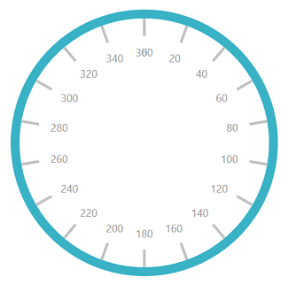
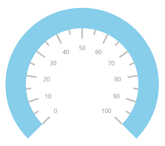

# Rim 

Scale determines the structure of a circular gauge by using a circular rim. By setting the `StartAngle` and `SweepAngle` properties, you can change the shape of the circular gauge to a full-circular gauge, half-circular gauge, or quarter-circular gauge.

The `StartValue` and `EndValue` properties determine the overall range of the circular rim.





    <gauge:SfCircularGauge  HeaderAlignment="Bottom">

    <gauge:SfCircularGauge.Scales>

    <gauge:CircularScale StartAngle="270" SweepAngle="360" StartValue="0" EndValue="360"
                                     Interval="20" MinorTicksPerInterval="0" >

    <gauge:CircularScale.Pointers>

    <gauge:CircularPointer NeedlePointerVisibility="Hidden"/>

    </gauge:CircularScale.Pointers>

    </gauge:CircularScale>

    </gauge:SfCircularGauge.Scales>

    </gauge:SfCircularGauge>





SfCircularGauge sfCircularGauge = new SfCircularGauge();

CircularScale circularScale = new CircularScale();

circularScale.StartAngle = 270;

circularScale.SweepAngle = 360;

circularScale.StartValue = 0;

circularScale.EndValue = 360;

circularScale.Interval = 20;

circularScale.MinorTicksPerInterval = 0;

CircularPointer circularPointer = new CircularPointer();

circularPointer.NeedlePointerVisibility = Visibility.Hidden;

circularScale.Pointers.Add(circularPointer);

sfCircularGauge.Scales.Add(circularScale);





## Rim customization

The color and thickness of the rim can be set by using the `RimStroke` and `RimStrokeThickness` properties.





    <gauge:SfCircularGauge>

    <gauge:SfCircularGauge.Scales>

    <gauge:CircularScale RadiusFactor="1" RimStrokeThickness="40" RimStroke="SkyBlue" >

    <gauge:CircularScale.Pointers>

    <gauge:CircularPointer NeedlePointerVisibility="Hidden"/>

    </gauge:CircularScale.Pointers>

    </gauge:CircularScale>

    </gauge:SfCircularGauge.Scales>

    </gauge:SfCircularGauge>





 SfCircularGauge sfCircularGauge = new SfCircularGauge();

CircularScale circularScale = new CircularScale();

circularScale.RadiusFactor = 1;

circularScale.RimStrokeThickness = 40;

circularScale.RimStroke = new SolidColorBrush(Colors.SkyBlue);

CircularPointer circularPointer = new CircularPointer();

circularPointer.NeedlePointerVisibility = Visibility.Hidden;

circularScale.Pointers.Add(circularPointer);

sfCircularGauge.Scales.Add(circularScale);





## Setting position for rim

You can customize the position of [`Scales`](https://help.syncfusion.com/cr/cref_files/wpf/gauge/Syncfusion.Gauge.WPF~Syncfusion.Windows.Gauge.CircularGauge~Scales.html) in the following two ways:
1.	 `RadiusFactor` property.
2.	 `Radius` property.

### Setting radius factor for rim

The value for `RadiusFactor` should be specified in offset value. 





    <gauge:SfCircularGauge>

    <gauge:SfCircularGauge.Scales>

    <gauge:CircularScale RadiusFactor="0.7" RimStrokeThickness="30" >

    <gauge:CircularScale.Pointers>

    <gauge:CircularPointer NeedlePointerVisibility="Hidden"/>

    </gauge:CircularScale.Pointers>

    </gauge:CircularScale>
                
    </gauge:SfCircularGauge.Scales>

    </gauge:SfCircularGauge>





SfCircularGauge sfCircularGauge = new SfCircularGauge();

CircularScale circularScale = new CircularScale();

circularScale.RadiusFactor = 0.7;

circularScale.RimStrokeThickness = 30;

CircularPointer circularPointer = new CircularPointer();

circularPointer.NeedlePointerVisibility = Visibility.Hidden;

circularScale.Pointers.Add(circularPointer);

sfCircularGauge.Scales.Add(circularScale);





### Setting radius for rim

You can set the `Radius` of rim in pixel value.





    <gauge:SfCircularGauge  HeaderAlignment="Bottom">

    <gauge:SfCircularGauge.Scales>

    <gauge:CircularScale Radius ="100" >

    <gauge:CircularScale.Pointers>

    <gauge:CircularPointer NeedlePointerVisibility="Hidden"/>

    </gauge:CircularScale.Pointers>

    </gauge:CircularScale>

    </gauge:SfCircularGauge.Scales>

    </gauge:SfCircularGauge>





SfCircularGauge sfCircularGauge = new SfCircularGauge();

CircularScale circularScale = new CircularScale();

circularScale.Radius = 100;

CircularPointer circularPointer = new CircularPointer();

circularPointer.NeedlePointerVisibility = Visibility.Hidden;

circularScale.Pointers.Add(circularPointer);

sfCircularGauge.Scales.Add(circularScale);





