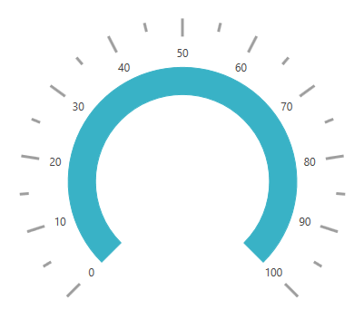

# Rim in WPF Radial Gauge (SfCircularGauge)

Scale determines the structure of a circular gauge by using a circular rim. By setting the `StartAngle` and `SweepAngle` properties, you can change the shape of the circular gauge to a full-circular gauge, half-circular gauge, or quarter-circular gauge.

The `StartValue` and `EndValue` properties, determine the overall range of the circular rim.





    <gauge:SfCircularGauge  HeaderAlignment="Bottom">

    <gauge:SfCircularGauge.Scales>

    <gauge:CircularScale StartAngle="270" SweepAngle="360" StartValue="0" EndValue="360"
                                     Interval="20" MinorTicksPerInterval="0" >

    <gauge:CircularScale.Pointers>

    <gauge:CircularPointer NeedlePointerVisibility="Hidden"/>

    </gauge:CircularScale.Pointers>

    </gauge:CircularScale>

    </gauge:SfCircularGauge.Scales>

    </gauge:SfCircularGauge>





SfCircularGauge sfCircularGauge = new SfCircularGauge();

CircularScale circularScale = new CircularScale();

circularScale.StartAngle = 270;

circularScale.SweepAngle = 360;

circularScale.StartValue = 0;

circularScale.EndValue = 360;

circularScale.Interval = 20;

circularScale.MinorTicksPerInterval = 0;

CircularPointer circularPointer = new CircularPointer();

circularPointer.NeedlePointerVisibility = Visibility.Hidden;

circularScale.Pointers.Add(circularPointer);

sfCircularGauge.Scales.Add(circularScale);





## Rim customization

The color and thickness of the rim can be set by using the [`RimStroke`](https://help.syncfusion.com/cr/wpf/Syncfusion.UI.Xaml.Gauges.CircularScale.html#Syncfusion_UI_Xaml_Gauges_CircularScale_RimStroke) and [`RimStrokeThickness`](https://help.syncfusion.com/cr/wpf/Syncfusion.UI.Xaml.Gauges.CircularScale.html#Syncfusion_UI_Xaml_Gauges_CircularScale_RimStrokeThickness) properties.





    <gauge:SfCircularGauge>

    <gauge:SfCircularGauge.Scales>

    <gauge:CircularScale RadiusFactor="1" RimStrokeThickness="40" RimStroke="SkyBlue" >

    <gauge:CircularScale.Pointers>

    <gauge:CircularPointer NeedlePointerVisibility="Hidden"/>

    </gauge:CircularScale.Pointers>

    </gauge:CircularScale>

    </gauge:SfCircularGauge.Scales>

    </gauge:SfCircularGauge>





 SfCircularGauge sfCircularGauge = new SfCircularGauge();

CircularScale circularScale = new CircularScale();

circularScale.RadiusFactor = 1;

circularScale.RimStrokeThickness = 40;

circularScale.RimStroke = new SolidColorBrush(Colors.SkyBlue);

CircularPointer circularPointer = new CircularPointer();

circularPointer.NeedlePointerVisibility = Visibility.Hidden;

circularScale.Pointers.Add(circularPointer);

sfCircularGauge.Scales.Add(circularScale);





## Setting a position for rim

You can customize the position of [`Scales`](https://help.syncfusion.com/cr/wpf/Syncfusion.Windows.Gauge.CircularGauge.html#Syncfusion_Windows_Gauge_CircularGauge_Scales) in the following two ways:
1.	 [`RadiusFactor`](https://help.syncfusion.com/cr/wpf/Syncfusion.UI.Xaml.Gauges.CircularScale.html#Syncfusion_UI_Xaml_Gauges_CircularScale_RadiusFactor) property.
2.	 [`Radius`](https://help.syncfusion.com/cr/wpf/Syncfusion.UI.Xaml.Gauges.CircularScale.html#Syncfusion_UI_Xaml_Gauges_CircularScale_Radius) property.

### Setting a radius factor for rim

The value for `RadiusFactor` should be specified in offset value. It value should be 0 to 1.  `RadiusFactor` sets the scale responsive with the window. 





    <gauge:SfCircularGauge>

    <gauge:SfCircularGauge.Scales>

    <gauge:CircularScale RadiusFactor="0.6" RimStrokeThickness="30" >

    <gauge:CircularScale.Pointers>

    <gauge:CircularPointer NeedlePointerVisibility="Hidden"/>

    </gauge:CircularScale.Pointers>

    </gauge:CircularScale>
                
    </gauge:SfCircularGauge.Scales>

    </gauge:SfCircularGauge>





SfCircularGauge sfCircularGauge = new SfCircularGauge();

CircularScale circularScale = new CircularScale();

circularScale.RadiusFactor = 0.6;

circularScale.RimStrokeThickness = 30;

CircularPointer circularPointer = new CircularPointer();

circularPointer.NeedlePointerVisibility = Visibility.Hidden;

circularScale.Pointers.Add(circularPointer);

sfCircularGauge.Scales.Add(circularScale);





### Setting a radius for rim

You can set the `Radius` of rim in pixel value. `Radius` sets the scale fixed with the given pixel value. 





    <gauge:SfCircularGauge  HeaderAlignment="Bottom">

    <gauge:SfCircularGauge.Scales>

    <gauge:CircularScale Radius ="100" >

    <gauge:CircularScale.Pointers>

    <gauge:CircularPointer NeedlePointerVisibility="Hidden"/>

    </gauge:CircularScale.Pointers>

    </gauge:CircularScale>

    </gauge:SfCircularGauge.Scales>

    </gauge:SfCircularGauge>





SfCircularGauge sfCircularGauge = new SfCircularGauge();

CircularScale circularScale = new CircularScale();

circularScale.Radius = 100;

CircularPointer circularPointer = new CircularPointer();

circularPointer.NeedlePointerVisibility = Visibility.Hidden;

circularScale.Pointers.Add(circularPointer);

sfCircularGauge.Scales.Add(circularScale);





### Setting rim visibility

The [`ShowRim`](https://help.syncfusion.com/cr/wpf/Syncfusion.UI.Xaml.Gauges.CircularScale.html#Syncfusion_UI_Xaml_Gauges_CircularScale_ShowRim) property is a Boolean property, which is used to enable or disable the rim in circular gauge.

N> Default value of the ShowRim property is true.





       <gauge:SfCircularGauge  HeaderAlignment="Bottom">
           <gauge:SfCircularGauge.Scales >
                 <gauge:CircularScale ShowRim="False" x:Name="scale" >
                        <gauge:CircularScale.Pointers>
                            <gauge:CircularPointer NeedlePointerVisibility="Hidden"/>
                        </gauge:CircularScale.Pointers>
                    </gauge:CircularScale>
                </gauge:SfCircularGauge.Scales>
		</gauge:SfCircularGauge>





            SfCircularGauge sfCircularGauge = new SfCircularGauge();
            CircularScale mainscale = new CircularScale();
            mainscale.ShowRim = false;
            CircularPointer circularPointer = new CircularPointer();
            circularPointer.NeedlePointerVisibility = Visibility.Hidden;
            mainscale.Pointers.Add(circularPointer);
            sfCircularGauge.Scales.Add(mainscale);





### Set offset value for a responsive size in rim

* [`RimStartOffset`](https://help.syncfusion.com/cr/wpf/Syncfusion.UI.Xaml.Gauges.CircularScale.html#Syncfusion_UI_Xaml_Gauges_CircularScale_RimStartOffset) - Sets the rim start offset position. Its range is from 0 to 1.
* [`RimEndOffset`](https://help.syncfusion.com/cr/wpf/Syncfusion.UI.Xaml.Gauges.CircularScale.html#Syncfusion_UI_Xaml_Gauges_CircularScale_RimEndOffset) - Sets the rim end offset position. Its range is from 0 to 1.





        <gauge:SfCircularGauge x:Name="gauge">
             <gauge:SfCircularGauge.Scales >
                  <gauge:CircularScale  x:Name="scale" RimStartOffset="0.6" RimEndOffset="0.7" RimStroke="LightGray"  >
                        <gauge:CircularScale.Pointers>
                            <gauge:CircularPointer NeedlePointerVisibility="Hidden"/>
                        </gauge:CircularScale.Pointers>
                  </gauge:CircularScale>
             </gauge:SfCircularGauge.Scales>
         </gauge:SfCircularGauge>





            SfCircularGauge sfCircularGauge = new SfCircularGauge();
            CircularScale mainscale = new CircularScale();
            mainscale.RimStroke = new SolidColorBrush(Colors.LightGray);
            mainscale.RimStartOffset = 0.6;
            mainscale.RimEndOffset = 0.7;
            CircularPointer circularPointer = new CircularPointer();
            circularPointer.NeedlePointerVisibility = Visibility.Hidden;
            mainscale.Pointers.Add(circularPointer);
            sfCircularGauge.Scales.Add(mainscale);
			




