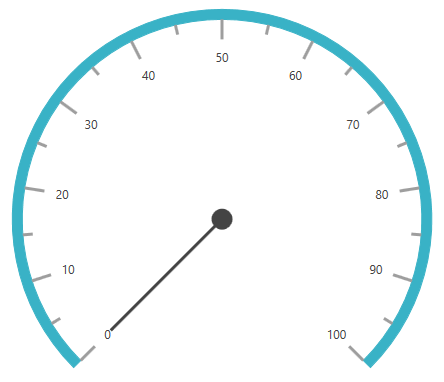
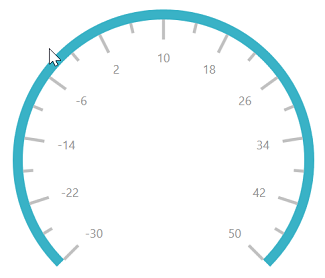
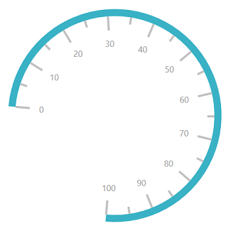
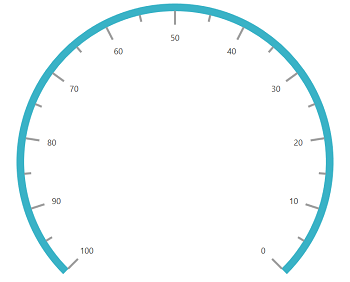
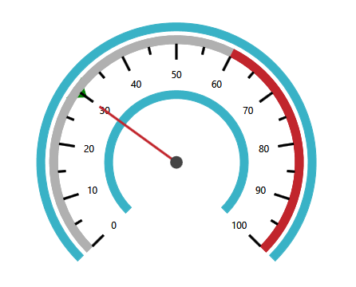

# Scales 

Scales contain a collection of [`CircularScale`](https://help.syncfusion.com/cr/cref_files/wpf/Syncfusion.Gauge.WPF~Syncfusion.Windows.Gauge.CircularScale.html) elements, which integrate labels, tick marks, and a rim to customize the basic look and feel of the circular gauge.

## Scale

The [`CircularScale`](https://help.syncfusion.com/cr/cref_files/wpf/Syncfusion.Gauge.WPF~Syncfusion.Windows.Gauge.CircularScale.html) contains sub elements such as rim, ticks, labels, ranges, and pointers. They define the radius, start angle, sweep direction, sweep angle, overall minimum and maximum values, frequency of labels, and tick marks. A scale will have multiple ranges.
A range is a visual element, which begins and ends at the specified values within a [`CircularScale`](https://help.syncfusion.com/cr/cref_files/wpf/Syncfusion.Gauge.WPF~Syncfusion.Windows.Gauge.CircularScale.html). A range will have one or more pointers to point out the values in a scale.





    <gauge:SfCircularGauge>

    <gauge:SfCircularGauge.Scales>

    <gauge:CircularScale />

    </gauge:SfCircularGauge.Scales>

    </gauge:SfCircularGauge>





  SfCircularGauge sfCircularGauge = new SfCircularGauge();

  CircularScale circularScale = new CircularScale();

  sfCircularGauge.Scales.Add(circularScale);





## Setting start and end values for scale

The `StartValue` and `EndValue` properties allow you to set the start and end values for a scale.





    <gauge:SfCircularGauge>

    <gauge:SfCircularGauge.Scales>

    <gauge:CircularScale StartValue="-30" EndValue="50">

    <gauge:CircularScale.Pointers>

    <gauge:CircularPointer NeedlePointerVisibility="Hidden"/>

     </gauge:CircularScale.Pointers>

    </gauge:CircularScale>

    </gauge:SfCircularGauge.Scales>

    </gauge:SfCircularGauge>





  SfCircularGauge sfCircularGauge = new SfCircularGauge();

  CircularScale circularScale = new CircularScale();

  circularScale.StartValue = -30;

  circularScale.EndValue = 50;

  CircularPointer circularPointer = new CircularPointer();

  circularPointer.NeedlePointerVisibility = Visibility.Hidden;

  circularScale.Pointers.Add(circularPointer);

  sfCircularGauge.Scales.Add(circularScale);





## Setting start and sweep angles for scale

The [`StartAngle`](https://help.syncfusion.com/cr/cref_files/wpf/Syncfusion.Gauge.WPF~Syncfusion.Windows.Gauge.CircularScale~StartAngle.html)  and `SweepAngle` properties allow you to set the start and end angles for a scale.





    <gauge:SfCircularGauge>

    <gauge:SfCircularGauge.Scales>

    <gauge:CircularScale StartAngle="185" SweepAngle="270">

    <gauge:CircularScale.Pointers>

    <gauge:CircularPointer NeedlePointerVisibility="Hidden"/>

    </gauge:CircularScale.Pointers>

    </gauge:CircularScale>

    </gauge:SfCircularGauge.Scales>

    </gauge:SfCircularGauge>





  SfCircularGauge sfCircularGauge = new SfCircularGauge();

  CircularScale circularScale = new CircularScale();

  circularScale.StartAngle = 185;

  circularScale.SweepAngle = 270;

  CircularPointer circularPointer = new CircularPointer();

  circularPointer.NeedlePointerVisibility = Visibility.Hidden;

  circularScale.Pointers.Add(circularPointer);

  sfCircularGauge.Scales.Add(circularScale);





## Setting interval for scale

The `Interval` property allows you to set the interval for a scale.





    <gauge:SfCircularGauge>

    <gauge:SfCircularGauge.Scales>

    <gauge:CircularScale StartValue="0" EndValue="500" Interval="100">

    <gauge:CircularScale.Pointers>

    <gauge:CircularPointer NeedlePointerVisibility="Hidden"/>

    </gauge:CircularScale.Pointers>

    </gauge:CircularScale>

    </gauge:SfCircularGauge.Scales>

    </gauge:SfCircularGauge>





   SfCircularGauge sfCircularGauge = new SfCircularGauge();

   CircularScale circularScale = new CircularScale();

   circularScale.StartValue = 0;

   circularScale.EndValue = 500;

   circularScale.Interval = 100;

   CircularPointer circularPointer = new CircularPointer();

   circularPointer.NeedlePointerVisibility = Visibility.Hidden;

   circularScale.Pointers.Add(circularPointer);

   sfCircularGauge.Scales.Add(circularScale);





N> You can specify the interval value upto 5 decimal places while showing the labels of linear scale.

## Setting scale direction for scale

The `SweepDirection` property allows you to render the gauge scale in either clockwise or counterclockwise direction.





    <gauge:SfCircularGauge>

    <gauge:SfCircularGauge.Scales>

    <gauge:CircularScale SweepDirection="Counterclockwise">

    <gauge:CircularScale.Pointers>

    <gauge:CircularPointer NeedlePointerVisibility="Hidden"/>
                        
    </gauge:CircularScale.Pointers>
                 
    </gauge:CircularScale>

    </gauge:SfCircularGauge.Scales>

    </gauge:SfCircularGauge>





   SfCircularGauge sfCircularGauge = new SfCircularGauge();

   CircularScale circularScale = new CircularScale();

   circularScale.SweepDirection = SweepDirection.Counterclockwise;

   CircularPointer circularPointer = new CircularPointer();

   circularPointer.NeedlePointerVisibility = Visibility.Hidden;

   circularScale.Pointers.Add(circularPointer);

  sfCircularGauge.Scales.Add(circularScale);





## Setting multiple scales for circular gauge

You can add multiple scales to the same circular gauge and customize all the scales in a [`Scales`](https://help.syncfusion.com/cr/cref_files/wpf/gauge/Syncfusion.Gauge.WPF~Syncfusion.Windows.Gauge.CircularGauge~Scales.html) collection.





    <Grid Background="Black">

    <gauge:SfCircularGauge SpacingMargin="0.7">

    <gauge:SfCircularGauge.Scales>

    <gauge:CircularScale Radius="175" TickStroke="White" SmallTickStroke="White" LabelStroke="White">

    <gauge:CircularScale.Ranges>

    <gauge:CircularRange  StartValue="0"  EndValue="60" 
    Stroke="#B0B0B0" StrokeThickness="5" />

    <gauge:CircularRange  StartValue="60" EndValue="100" Stroke="#C1252C" StrokeThickness="5"/>

    </gauge:CircularScale.Ranges>

    <gauge:CircularScale.Pointers>

    <gauge:CircularPointer Value="30"    PointerType="SymbolPointer" Symbol="InvertedArrow"  
    SymbolPointerWidth="30"  SymbolPointerHeight="20"  SymbolPointerStroke="Green"/>

    </gauge:CircularScale.Pointers>

    </gauge:CircularScale>

    <gauge:CircularScale Radius="90" TickStroke="White" SmallTickStroke="White" LabelStroke="White">

    <gauge:CircularScale.Ranges>

    <gauge:CircularRange  StartValue="0" EndValue="60"  Stroke="#B0B0B0" StrokeThickness="5" />

    <gauge:CircularRange  StartValue="60"   EndValue="100" Stroke="#C1252C" StrokeThickness="5"/>

    </gauge:CircularScale.Ranges>

    <gauge:CircularScale.Pointers>

    <gauge:CircularPointer Value="30"  PointerType="NeedlePointer" NeedlePointerStroke="#C1252C"/>

    </gauge:CircularScale.Pointers>

    </gauge:CircularScale>

    </gauge:SfCircularGauge.Scales>

    </gauge:SfCircularGauge>
        
    </Grid>





   this.Background = new SolidColorBrush(Colors.Black);

   SfCircularGauge circularGauge = new SfCircularGauge();

   CircularScale scale1 = new CircularScale();

   scale1.TickStroke = new SolidColorBrush(Colors.White);

   scale1.LabelStroke = new SolidColorBrush(Colors.White);

   scale1.SmallTickStroke = new SolidColorBrush(Colors.White);

   scale1.Radius = 175;

   CircularScale scale2 = new CircularScale();

   scale2.TickStroke = new SolidColorBrush(Colors.White);

   scale2.LabelStroke = new SolidColorBrush(Colors.White);

   scale2.SmallTickStroke = new SolidColorBrush(Colors.White);

   scale2.Radius = 90;

   CircularRange circularRange = new CircularRange();

   circularRange.StartValue = 0;

   circularRange.EndValue = 60;

   circularRange.Stroke = new SolidColorBrush(Color.FromRgb(176, 176, 176));

   circularRange.StrokeThickness = 5;

   scale1.Ranges.Add(circularRange);

   CircularRange circularRange1 = new CircularRange();

   circularRange1.StartValue = 60;

   circularRange1.EndValue = 100;

   circularRange1.Stroke = new SolidColorBrush(Color.FromArgb(0xFF, 0xC1, 0x25, 0x2C));

   circularRange1.StrokeThickness = 5;

   scale1.Ranges.Add(circularRange1);

   CircularPointer circularPointer = new CircularPointer();

   circularPointer.Value = 30;

   circularPointer.PointerType = PointerType.SymbolPointer;

   circularPointer.Symbol = Syncfusion.UI.Xaml.Gauges.Symbol.InvertedArrow;

   circularPointer.SymbolPointerWidth = 30;

   circularPointer.SymbolPointerHeight = 20;

   circularPointer.SymbolPointerStroke = new SolidColorBrush(Colors.Green);

   scale1.Pointers.Add(circularPointer);

   CircularRange circularRange2 = new CircularRange();

   circularRange2.StartValue = 0;

   circularRange2.EndValue = 60;

   circularRange2.Stroke = new SolidColorBrush(Color.FromRgb(176, 176, 176));

   circularRange2.StrokeThickness = 5;

   scale2.Ranges.Add(circularRange2);

   CircularRange circularRange3 = new CircularRange();

   circularRange3.StartValue = 60;

   circularRange3.EndValue = 100;

   circularRange3.Stroke = new SolidColorBrush(Color.FromArgb(0xFF, 0xC1, 0x25, 0x2C));

   circularRange3.StrokeThickness = 5;

   scale2.Ranges.Add(circularRange3);

   CircularPointer circularPointer2 = new CircularPointer();

   circularPointer2.Value = 30;

   circularPointer2.PointerType = PointerType.NeedlePointer;

   circularPointer2.NeedlePointerStroke = new SolidColorBrush(Color.FromArgb(0xFF, 0xC1, 0x25, 0x2C));

   scale2.Pointers.Add(circularPointer2);

   circularGauge.Scales.Add(scale1);
   
   circularGauge.Scales.Add(scale2);





