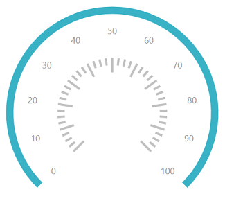

# Ticks

Ticks help you identify the gauge’s data value by marking the gauge scale in regular increments.

## Tick customization

The Interval property is used to calculate the tick count for a scale. Similar ticks, small ticks are calculated using the `MinorTicksPerInterval` property.

The length, stroke, and stroke thickness of a tick are set using the `TickLength`, `TickStroke`, and `TickStrokeThickness` UI properties, respectively. Similar ticks, the length, stroke, and stroke thickness of a small tick are set using the `SmallTickLength`, `SmallTickStroke`, and `SmallTickStrokeThickness` UI properties, respectively.

### Customize major ticks for scale





    <gauge:SfCircularGauge >

    <gauge:SfCircularGauge.Scales>
            
    <gauge:CircularScale     MinorTicksPerInterval="3"     TickLength="20" TickStroke="Brown"  
     TickStrokeThickness="2"  SmallTickStroke="White">

    <gauge:CircularScale.Pointers>

    <gauge:CircularPointer NeedlePointerVisibility="Hidden"/>

    </gauge:CircularScale.Pointers>

    </gauge:CircularScale>

    </gauge:SfCircularGauge.Scales>

    </gauge:SfCircularGauge>





SfCircularGauge sfCircularGauge = new SfCircularGauge();

CircularScale mainscale = new CircularScale();

mainscale.MinorTicksPerInterval = 3;

mainscale.TickLength = 20;

mainscale.TickStroke = new SolidColorBrush(Colors.Brown);

mainscale.SmallTickStroke = new SolidColorBrush(Colors.White);

mainscale.TickStrokeThickness = 2;

CircularPointer circularPointer = new CircularPointer();

circularPointer.NeedlePointerVisibility = Visibility.Hidden;

mainscale.Pointers.Add(circularPointer);





### Customize minor ticks for scale





    <gauge:SfCircularGauge >

    <gauge:SfCircularGauge.Scales>

    <gauge:CircularScale     MinorTicksPerInterval="3"      SmallTickLength="10" SmallTickStroke="Blue"   SmallTickStrokeThickness="2"  >

    <gauge:CircularScale.Pointers>

    <gauge:CircularPointer NeedlePointerVisibility="Hidden"/>

    </gauge:CircularScale.Pointers>

    </gauge:CircularScale>

    </gauge:SfCircularGauge.Scales>

    </gauge:SfCircularGauge>





SfCircularGauge sfCircularGauge = new SfCircularGauge();

CircularScale mainscale = new CircularScale();

mainscale.MinorTicksPerInterval = 3;

mainscale.SmallTickLength = 10;

mainscale.SmallTickStroke = new SolidColorBrush(Colors.Blue);

mainscale.SmallTickStrokeThickness = 2;

CircularPointer circularPointer = new CircularPointer();

circularPointer.NeedlePointerVisibility = Visibility.Hidden;

mainscale.Pointers.Add(circularPointer);

sfCircularGauge.Scales.Add(mainscale);





## Setting shape for tick

The `TickShape` is an enum property that provides an option to select shape of the circular mark ticks, which contains several shapes such as rectangle, ellipse, and triangle.





     <gauge:SfCircularGauge >

     <gauge:SfCircularGauge.Scales>

    <gauge:CircularScale  TickShape="Triangle" MinorTicksPerInterval="3" TickStroke="Blue" SmallTickStroke="Blue">

    <gauge:CircularScale.Pointers>

    <gauge:CircularPointer NeedlePointerVisibility="Hidden"/>

    </gauge:CircularScale.Pointers>

    </gauge:CircularScale>

    </gauge:SfCircularGauge.Scales>

    </gauge:SfCircularGauge>





SfCircularGauge sfCircularGauge = new SfCircularGauge();

CircularScale mainscale = new CircularScale();

mainscale.TickShape = TickShape.Triangle;

mainscale.MinorTicksPerInterval = 3;

mainscale.TickStroke = new SolidColorBrush(Colors.Blue);

mainscale.SmallTickStroke = new SolidColorBrush(Colors.Blue);

CircularPointer circularPointer = new CircularPointer();

circularPointer.NeedlePointerVisibility = Visibility.Hidden;

mainscale.Pointers.Add(circularPointer);

sfCircularGauge.Scales.Add(mainscale);





## Setting position for tick

The major and minor ticks can be positioned far away from the rim using the following two ways:
 
    1. Using the `MajorTickOffset` and `MinorTickOffset` properties. First, set the `TickPosition` property to custom, and then set the offset of the tick.





    <gauge:SfCircularGauge >

    <gauge:SfCircularGauge.Scales>

    <gauge:CircularScale  TickPosition="Custom"   MinorTicksPerInterval="3" MinorTickOffset="0.5"
     MajorTickOffset="0.5">

    <gauge:CircularScale.Pointers>

    <gauge:CircularPointer NeedlePointerVisibility="Hidden"/>

    </gauge:CircularScale.Pointers>

    </gauge:CircularScale>

    </gauge:SfCircularGauge.Scales>
            
    </gauge:SfCircularGauge>





SfCircularGauge sfCircularGauge = new SfCircularGauge();

CircularScale mainscale = new CircularScale();

mainscale.TickPosition = TickPosition.Custom;

mainscale.MajorTickOffset = 0.5;

mainscale.MinorTickOffset = 0.5;

mainscale.MinorTicksPerInterval = 3;

CircularPointer circularPointer = new CircularPointer();

circularPointer.NeedlePointerVisibility = Visibility.Hidden;

mainscale.Pointers.Add(circularPointer);

sfCircularGauge.Scales.Add(mainscale);





    2. Placing the ticks inside the scale, outside the scale, or across the scale by selecting one of the options available in the `TickPosition` property. They are:

1.	Inside (Default)

2.	Outside

3.	Cross

4.	Custom





    <gauge:SfCircularGauge >

    <gauge:SfCircularGauge.Scales>

    <gauge:CircularScale  TickPosition="Outside"  MinorTicksPerInterval="3" Radius="200">

    <gauge:CircularScale.Pointers>

    <gauge:CircularPointer NeedlePointerVisibility="Hidden"/>

    </gauge:CircularScale.Pointers>

    </gauge:CircularScale>

    </gauge:SfCircularGauge.Scales>

    /gauge:SfCircularGauge>





SfCircularGauge sfCircularGauge = new SfCircularGauge();

CircularScale mainscale = new CircularScale();

mainscale.Radius = 200;

mainscale.TickPosition = TickPosition.Outside;

mainscale.MinorTicksPerInterval = 3;

CircularPointer circularPointer = new CircularPointer();

circularPointer.NeedlePointerVisibility = Visibility.Hidden;

mainscale.Pointers.Add(circularPointer);

sfCircularGauge.Scales.Add(mainscale);





### Show ticks

The `ShowTicks` property allows you to enable or disable the ticks of circular gauge.

N> Default value of the ShowTicks property is true.





    <gauge:SfCircularGauge >
         <gauge:SfCircularGauge.Scales >
               <gauge:CircularScale ShowTicks="False" x:Name="scale" RimStroke="LightGray" >
                    <gauge:CircularScale.Pointers>
                         <gauge:CircularPointer NeedlePointerVisibility="Hidden"/>
                     </gauge:CircularScale.Pointers>
               </gauge:CircularScale>
         </gauge:SfCircularGauge.Scales> 
	</gauge:SfCircularGauge>





            SfCircularGauge sfCircularGauge = new SfCircularGauge();
            CircularScale mainscale = new CircularScale();
            mainscale.RimStroke = new SolidColorBrush(Colors.LightGray);
            mainscale.ShowTicks = false;
            CircularPointer circularPointer = new CircularPointer();
            circularPointer.NeedlePointerVisibility = Visibility.Hidden;
            mainscale.Pointers.Add(circularPointer);
            sfCircularGauge.Scales.Add(mainscale);





