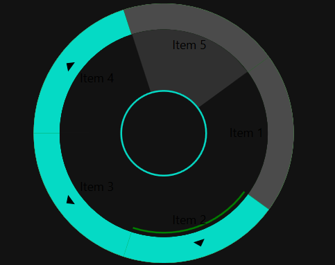

# Getting Started with WPF Radial Menu (SfRadialMenu)

Namespace : Syncfusion.Windows.Controls.Navigation 

Assembly : Syncfusion.SfRadialMenu.WPF (in Syncfusion.SfRadialMenu.WPF.dll) 

The following code sample shows how to create the RadialMenu from code-behind and XAML. 




<Page xmlns:navigation="clr-namespace:Syncfusion.Windows.Controls.Navigation;assembly=Syncfusion.SfRadialMenu.Wpf"> 

     <Grid>

<navigation:SfRadialMenu> 

<navigation:SfRadialMenuItem Header="Bold"/>

<navigation:SfRadialMenuItem Header="Cut"/> 

<navigation:SfRadialMenuItem Header="Copy"/> 

<navigation:SfRadialMenuItem Header="Paste"/> 

</navigation:SfRadialMenu> 

     </Grid> 

</Page> 





SfRadialMenu radialMenu = new SfRadialMenu(); 

SfRadialMenuItem bold = new SfRadialMenuItem() { Header = "Bold" };               SfRadialMenuItem cut = new SfRadialMenuItem() { Header = "Cut" }; 

SfRadialMenuItem copy = new SfRadialMenuItem() { Header = "Copy" }; 

SfRadialMenuItem paste = new SfRadialMenuItem() { Header = "Paste" }; radialMenu.Items.Add(bold);

radialMenu.Items.Add(cut);

radialMenu.Items.Add(copy);

radialMenu.Items.Add(paste); 




## Theme

Radial Menu supports various built-in themes. Refer to the below links to apply themes for the Radial Menu,

  * [Apply theme using SfSkinManager](https://help.syncfusion.com/wpf/themes/skin-manager)
	
  * [Create a custom theme using ThemeStudio](https://help.syncfusion.com/wpf/themes/theme-studio#creating-custom-theme)

