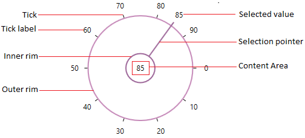
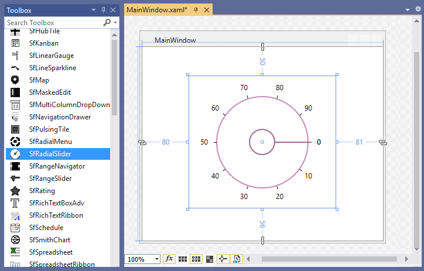
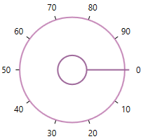
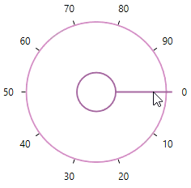
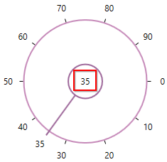
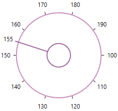
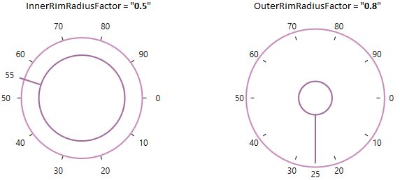
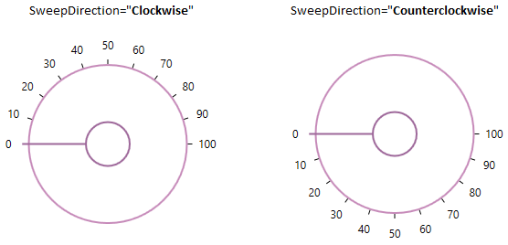

# Getting Started with WPF SfRadialSlider

This section explains how to create a WPF [SfRadialSlider](https://help.syncfusion.com/cr/wpf/Syncfusion.Windows.Controls.Navigation.SfRadialSlider.html) and explains about its structure.

## Structure of SfRadialSlider

## Assembly deployment

Refer to the [Control Dependencies](https://help.syncfusion.com/wpf/control-dependencies#sfradialslider) section to get the list of assemblies or NuGet package that needs to be added as a reference to use the control in any application.

Refer to this [documentation](https://help.syncfusion.com/wpf/visual-studio-integration/nuget-packages) to find more details about installing nuget packages in a WPF application.

## Adding WPF SfRadialSlider via designer

1) The `SfRadialSlider` can be added to an application by dragging it from the toolbox to a designer view. The following dependent assemblies will be added automatically:

* Syncfusion.SfRadialMenu.WPF 
* Syncfusion.SfShared.WPF

2) Set the properties for `SfRadialSlider` in design mode using the SmartTag feature.

## Adding WPF SfRadialSlider via XAML

To add the `SfRadialSlider` manually in XAML, follow these steps:

1) Create a new WPF project in Visual Studio.

2) Add the following required assembly references to the project:

* Syncfusion.SfRadialMenu.WPF 
* Syncfusion.SfShared.WPF

3) Import Syncfusion WPF schema **http://schemas.syncfusion.com/wpf**, and declare the SfRadialSlider in XAML page.





<Window x:Class="SfRadialSlider_sample.MainWindow"
        xmlns="http://schemas.microsoft.com/winfx/2006/xaml/presentation"
        xmlns:x="http://schemas.microsoft.com/winfx/2006/xaml"
        xmlns:d="http://schemas.microsoft.com/expression/blend/2008"
        xmlns:mc="http://schemas.openxmlformats.org/markup-compatibility/2006"
        xmlns:local="clr-namespace:SfRadialSlider_sample"
        xmlns:syncfusion="http://schemas.syncfusion.com/wpf"
        mc:Ignorable="d"
        Title="MainWindow" Height="450" Width="800">

    <Grid>
        <syncfusion:SfRadialSlider Name="radialSlider"
                                   Height="200"
                                   Width="200"/>
    </Grid>
</Window>




## Adding WPF SfRadialSlider via C#

To add the `SfRadialSlider` manually in C#, follow these steps:

1) Create a new WPF application via Visual Studio.

2) Add the following required assembly references to the project:

* Syncfusion.Shared.WPF

3) Include the required namespace.




using Syncfusion.Windows.Shared;




4) Create an instance of `SfRadialSlider`, and add it to the window.




// Creating an instance of the SfRadialSlider
SfRadialSlider radialSlider = new SfRadialSlider();

// Setting height and width to SfRadialSlider
radialSlider.Height = 200;
radialSlider.Width = 200;




N> [View Sample in GitHub](https://github.com/SyncfusionExamples/syncfusion-wpf-radial-slider-examples/tree/master/Samples/Getting-Started)

## Select tick value

You can select any tick value by dragging the pointer along the circular track or clicking on the corresponding track value. You can get the selected value by using the `Value` property. The default value of `Value` property is `0`.

### Select tick value programmatically

You can select a tick value programmatically by assigning the tick value to the `Value` property.




<syncfusion:SfRadialSlider Value="34"
                           Name="radialSlider" />




radialSlider.Value = 34;




N> [View Sample in GitHub](https://github.com/SyncfusionExamples/syncfusion-wpf-radial-slider-examples/tree/master/Samples/RadialSlider-Features)

## Display selected value

You can display the selected value in the content area of the `SfRadialSlider` by setting the selected value to the [Content](https://help.syncfusion.com/cr/wpf/Syncfusion.Windows.Controls.Navigation.SfRadialSlider.html#Syncfusion_Windows_Controls_Navigation_SfRadialSlider_Content) property. The default value of `Content` property is `null`.




public class ViewModel
{
    private double selectedValue;

    public double SelectedValue {
        get {
            return selectedValue;
        }
        set {
            selectedValue= value;
        }
    }
}







<syncfusion:SfRadialSlider Content="{Binding SelectedValue,Mode=TwoWay}"
                           Value="{Binding SelectedValue,Mode=TwoWay}" 
                           Name="radialSlider">
    <syncfusion:SfRadialSlider.DataContext>
        <local:ViewModel/>
    </syncfusion:SfRadialSlider.DataContext>
</syncfusion:SfRadialSlider>




N> [View Sample in GitHub](https://github.com/SyncfusionExamples/syncfusion-wpf-radial-slider-examples/tree/master/Samples/RadialSlider-Features)

## Change min-max tick value

You can change the minimum and maximum ticks value of the `SfRadialSlider` by using the `Minimum` and `Maximum` properties. The default value of `Minimum` property is `0` and `Maximum` property is `100`.




<syncfusion:SfRadialSlider Minimum="100"
                           Maximum="200"
                           Name="radialSlider" />




radialSlider.Minimum = 100;
radialSlider.Maximum = 200;




N> [View Sample in GitHub](https://github.com/SyncfusionExamples/syncfusion-wpf-radial-slider-examples/tree/master/Samples/RadialSlider-Features)

## Change start and end position

You can change starting and ending position for generating the ticks in the circular track by using the [StartAngle](https://help.syncfusion.com/cr/wpf/Syncfusion.Windows.Controls.Navigation.SfRadialSlider.html#Syncfusion_Windows_Controls_Navigation_SfRadialSlider_StartAngle) and [EndAngle](https://help.syncfusion.com/cr/wpf/Syncfusion.Windows.Controls.Navigation.SfRadialSlider.html#Syncfusion_Windows_Controls_Navigation_SfRadialSlider_EndAngle) properties. The default value of `EndAngle` property is `0` and `StartAngle` property is `360`.




<syncfusion:SfRadialSlider StartAngle="90"
                           EndAngle="330"
                           Name="radialSlider" />




radialSlider.StartAngle = 90;
radialSlider.EndAngle = 300;




N> [View Sample in GitHub](https://github.com/SyncfusionExamples/syncfusion-wpf-radial-slider-examples/tree/master/Samples/RadialSlider-Features)

## Change tick display interval

You can change the tick display interval from the `Minimum` to `Maximum` values by using the [TickFrequency](https://help.syncfusion.com/cr/wpf/Syncfusion.Windows.Controls.Navigation.SfRadialSlider.html#Syncfusion_Windows_Controls_Navigation_SfRadialSlider_TickFrequency) property. Based on `TickFrequency`'s multiples, the display interval is set from `Minimum` to `Maximum` value.




<syncfusion:SfRadialSlider TickFrequency="20"
                           Name="radialSlider" />




radialSlider.TickFrequency = 20;




N> [View Sample in GitHub](https://github.com/SyncfusionExamples/syncfusion-wpf-radial-slider-examples/tree/master/Samples/RadialSlider-Features)

## Step interval

If you want to control the smallest possible range of value to be selected in `SfRadialSlider`, use the `SmallChange` property. The default value of `SmallChange` property is `0.1`. For example, if `SmallChange` is set to `5`, then it is only possible to select values that are multiples of `5`.




<syncfusion:SfRadialSlider SmallChange="5"
                           Name="radialSlider" />




radialSlider.SmallChange = 5;




N> [View Sample in GitHub](https://github.com/SyncfusionExamples/syncfusion-wpf-radial-slider-examples/tree/master/Samples/RadialSlider-Features)

## Change inner and outer rim radius

You can change inner and outer rim radius of the `SfRadialSlider` by using the [InnerRimRadiusFactor](https://help.syncfusion.com/cr/wpf/Syncfusion.Windows.Controls.Navigation.SfRadialSlider.html#Syncfusion_Windows_Controls_Navigation_SfRadialSlider_InnerRimRadiusFactor) and [OuterRimRadiusFactor](https://help.syncfusion.com/cr/wpf/Syncfusion.Windows.Controls.Navigation.SfRadialSlider.html#Syncfusion_Windows_Controls_Navigation_SfRadialSlider_OuterRimRadiusFactor) properties. The default value of `InnerRimRadiusFactor` property is `0.2` and `OuterRimRadiusFactor` property is `0.7`.




<syncfusion:SfRadialSlider InnerRimRadiusFactor="0.5" 
                           OuterRimRadiusFactor="0.8"
                           Name="radialSlider" />




radialSlider.InnerRimRadiusFactor = 0.5;
radialSlider.OuterRimRadiusFactor = 0.8;




N> [View Sample in GitHub](https://github.com/SyncfusionExamples/syncfusion-wpf-radial-slider-examples/tree/master/Samples/RadialSlider-Features)

## Change tick direction

You can change the ticks direction either clockwise or counter-clockwise direction by using the [SweepDirection](https://help.syncfusion.com/cr/wpf/Syncfusion.Windows.Controls.Navigation.SfRadialSlider.html#Syncfusion_Windows_Controls_Navigation_SfRadialSlider_SweepDirection) property. The default value of `SweepDirection` property is `Clockwise`.




<syncfusion:SfRadialSlider SweepDirection="Counterclockwise" 
                           StartAngle="180" 
                           EndAngle="360" 
                           Name="radialSlider" />




radialSlider.SweepDirection = SweepDirection.Counterclockwise;




N> [View Sample in GitHub](https://github.com/SyncfusionExamples/syncfusion-wpf-radial-slider-examples/tree/master/Samples/RadialSlider-Features)

## Text formatting

You can customize the text format for the specific or all tick labels by handling the [DrawLabel](https://help.syncfusion.com/cr/wpf/Syncfusion.Windows.Controls.Navigation.SfRadialSlider.html) event and setting the [DrawLabelEventArgs.Handled](https://help.syncfusion.com/cr/wpf/Syncfusion.Windows.Controls.Navigation.DrawLabelEventArgs.html#Syncfusion_Windows_Controls_Navigation_DrawLabelEventArgs_Handled) property value as `true`. You can change the content and foreground of the tick labels by using the [DrawLabelEventArgs.Text](https://help.syncfusion.com/cr/wpf/Syncfusion.Windows.Controls.Navigation.DrawLabelEventArgs.html#Syncfusion_Windows_Controls_Navigation_DrawLabelEventArgs_Text) and [DrawLabelEventArgs.Foreground](https://help.syncfusion.com/cr/wpf/Syncfusion.Windows.Controls.Navigation.DrawLabelEventArgs.html#Syncfusion_Windows_Controls_Navigation_DrawLabelEventArgs_Foreground) properties. You can also change the font family and font size of the tick labels by using the [DrawLabelEventArgs.FontFamily](https://help.syncfusion.com/cr/wpf/Syncfusion.Windows.Controls.Navigation.DrawLabelEventArgs.html#Syncfusion_Windows_Controls_Navigation_DrawLabelEventArgs__ctor_System_Double_System_Windows_Media_Brush_System_Windows_Media_FontFamily_System_Double_System_String_System_Boolean_) and [DrawLabelEventArgs.FontSize](https://help.syncfusion.com/cr/wpf/Syncfusion.Windows.Controls.Navigation.DrawLabelEventArgs.html#Syncfusion_Windows_Controls_Navigation_DrawLabelEventArgs_FontSize) properties.




<syncfusion:SfRadialSlider DrawLabel="sfRadialSlider_DrawLabel"  
                           Name="sfRadialSlider">           
    <TextBlock Text="{Binding ElementName=sfRadialSlider, Path=Value}" 
               FontSize="15"
               HorizontalAlignment="Center"
               VerticalAlignment="Center"/>
</syncfusion:SfRadialSlider>




sfRadialSlider.DrawLabel += sfRadialSlider_DrawLabel;




You can handle the event as follows,




private void sfRadialSlider_DrawLabel(object sender, DrawLabelEventArgs e) {            
    e.Handled = true;
    e.Text += "°C";
    if (e.Value <= 33) {
        e.FontSize = 8;
        e.FontFamily = new FontFamily("Arial");
        e.Foreground = Brushes.Green;
    }
    else if (e.Value > 33 && e.Value <= 66) {
        e.FontSize = 10;
        e.FontFamily = new FontFamily("Courier");
        e.Foreground = Brushes.Gold;
    }
    else {
        e.FontSize = 12;
        e.FontFamily = new FontFamily("Georgia");
        e.Foreground = Brushes.Red;
    }
}




N> [View Sample in GitHub](https://github.com/SyncfusionExamples/syncfusion-wpf-radial-slider-examples/tree/master/Samples/Label-Formatting)

## Value changed notification

The selected value changed in `SfRadialSlider` can be examined using `ValueChanged` event. The `ValueChanged` event contains the old and newly selected tick value in the `OldValue` and `NewValue` properties.




 <syncfusion:SfRadialSlider ValueChanged="RadialSlider_ValueChanged" 
                      Name="radialSlider"/>




SfRadialSlider radialSlider = new SfRadialSlider();
radialSlider.ValueChanged += RadialSlider_ValueChanged;




You can handle the event as follows,




private void RadialSlider_ValueChanged(object sender, RoutedPropertyChangedEventArgs<double> e){
    //Get old and new selected tick value
    var oldValue = e.OldValue;
    var newValue = e.NewValue;
}




## Theme

SfRadialSlider supports various built-in themes. Refer to the below links to apply themes for the SfRadialSlider,

  * [Apply theme using SfSkinManager](https://help.syncfusion.com/wpf/themes/skin-manager)
	
  * [Create a custom theme using ThemeStudio](https://help.syncfusion.com/wpf/themes/theme-studio#creating-custom-theme)