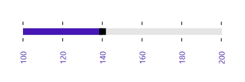

# Label Support

This feature allows you to display labels for custom values given in the CustomLabels collection when the ShowCustomLabels property is set to true. It also displays labels for all of the tick values when ShowValueLabels is set to true.

Property Table

<table>
<tr>
<th>
{{ '**Property**' | markdownify }}</th><th>
{{ '**Description**' | markdownify }}</th></tr>
<tr>
<td>
CustomLabels</td><td>
It describes an observable collection of items that contains the custom labels and the values for that the labels should be displayed.</td></tr>
<tr>
<td>
ShowCustomLabels</td><td>
This property allows you to display custom labels for particular values based on CustomLabels collection.</td></tr>
<tr>
<td>
ShowValueLabels</td><td>
This property allows you to display labels for the ticks.</td></tr>
<tr>
<td>
LabelPlacement</td><td>
This property specifies the position of the custom label placement.</td></tr>
<tr>
<td>
ValuePlacement</td><td>
This property specifies the position of the label for all of the ticks.</td></tr>
<tr>
<td>
LabelOrientation</td><td>
LabelOrientation specifies the orientation of the labels as either horizontal or vertical.</td></tr>
</table>

## CustomLabels

CustomLabels is an observable collection of items that contains the Label and Value properties. Create an observable collection of items by specifying the custom labels for corresponding values as illustrated in the following code example.



this.customCollection.Add(new Items(){label = "Min", value= 100});

this.customCollection.Add(new Items() { label = "Max", value = 200 });

private ObservableCollection<Items> customCollection = new ObservableCollection<Items>();

public ObservableCollection<Items> CustomCollection

{

get { return customCollection; }

set { customCollection = value; }

}



In the following code example, the CustomCollection property is bound to CustomLabels property in the SfRangeSlider control that populates the custom labels collection.



<editors:SfRangeSlider Width="200" Minimum="100" Maximum="200" TickFrequency="20" TickPlacement="Outside" ShowCustomLabels="True" CustomLabels="{Binding CustomCollection}" />



RangeSlider with CustomLabels

## ShowCustomLabels

The default value of ShowCustomLabels is false. When set to true, it displays the custom labels for particular values based on the CustomLabels collection.



<editors:SfRangeSlider Width="200" Minimum="100" Maximum="200" TickFrequency="20" TickPlacement="Outside" ShowCustomLabels="True" CustomLabels="{Binding CustomCollection}" />



RangeSlider with ShowCustomLabels

## LabelPlacement

LabelPlacement property describes the position of the custom labels for particular values mentioned in the CustomLabels collection. Available options for this property are:

1. BottomRight
2. TopLeft

The following code example illustrates the usage of the LabelPlacement property. The output is displayed in the corresponding images.



<editors:SfRangeSlider Width="200" Minimum="100" Maximum="200" TickFrequency="20" TickPlacement="Outside" ShowCustomLabels="True" CustomLabels="{Binding CustomCollection}" LabelPlacement="BottomRight"/>



LabelPlacement in BottomRight



<editors:SfRangeSlider Width="200" Minimum="100" Maximum="200" TickFrequency="20" TickPlacement="Outside" ShowCustomLabels="True" 



CustomLabels="{Binding CustomCollection}" LabelPlacement="TopLeft"/>

LabelPlacement in TopLeft

## ShowValueLabels

The default value of the ShowValueLabels property is false. When set to true, it displays the label for all the ticks based on the ValuePlacement property.



<editors:SfRangeSlider Width="200" Minimum="100"   Maximum="200" TickFrequency="20" TickPlacement="BottomRight" ShowValueLabels="True"/>



ShowValueLabels property

## ValuePlacement

The ValuePlacement property describes the position of the labels for all the ticks. Available options for this property are:

1. BottomRight
2. TopLeft

The following code example illustrates the usage of ValuePlacement property. The output is displayed in the corresponding images.



<editors:SfRangeSlider Width="200" Minimum="100" Maximum="200" TickFrequency="20" TickPlacement="Outside" ShowValueLabels="True" ValuePlacement="TopLeft"/>



ValuePlacement in Bottom Right



<editors:SfRangeSlider Width="200" Minimum="100" Maximum="200" TickFrequency="20" TickPlacement="Outside" ShowValueLabels="True" ValuePlacement="BottomRight"/>



ValuePlacement in TopLeft

## LabelOrientation

The LabelOrientation property describes the orientation of the labels for both ticks and custom labels. Available options for this property are:

1. Horizontal
2. Vertical

The following code example illustrates the usage of LabelOrientation property. The output is displayed in the corresponding images.



<editors:SfRangeSlider Width="200" Minimum="100" Maximum="200" TickFrequency="20" TickPlacement="Outside" ShowValueLabels="True" LabelOrientation="Horizontal"/>



LabelOrientation as Horizontal



<editors:SfRangeSlider Width="200" Minimum="100" Maximum="200" TickFrequency="20" TickPlacement="Outside" ShowValueLabels="True" LabelOrientation="Vertical"/>



LabelOrientation as Vertical

