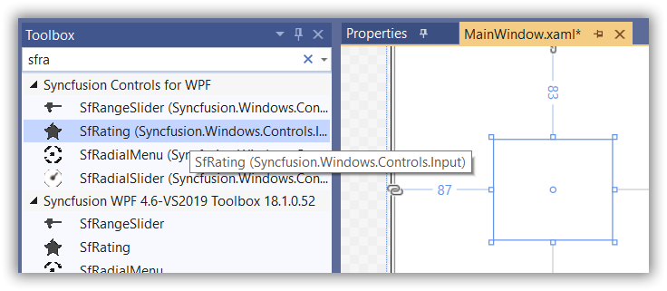

# Getting Started with WPF Rating (SfRating)

This section explains how to configure the [SfRating](https://help.syncfusion.com/cr/wpf/Syncfusion.Windows.Controls.Input.SfRating.html) control in a real-time scenario and also provides a walk-through on some of the customization features available in the SfRating control.

## Assembly deployment

Refer to the [control dependencies](https://help.syncfusion.com/wpf/control-dependencies#sfrating) section to get the list of assemblies or NuGet package that needs to be added as a reference to use the [SfRating](https://help.syncfusion.com/cr/wpf/Syncfusion.Windows.Controls.Input.SfRating.html) control in any application.

You can find more details about installing the NuGet package in a WPF application in the following link:
[How to install nuget packages](https://help.syncfusion.com/wpf/visual-studio-integration/nuget-packages)

## Creating Application with SfRating control
In this walk through, user will create a WPF application that contains [SfRating](https://help.syncfusion.com/cr/wpf/Syncfusion.Windows.Controls.Input.SfRating.html) control.
1. [Creating project](#creating-project)
2. [Adding control via designer](#adding-control-via-designer)
3. [Adding control manually in XAML](#adding-control-manually-in-xaml)
4. [Adding control manually in C#](#add-control-manually-in-c)

## Creating project

Below section provides detailed information to create new project in Visual Studio to display [SfRating](https://help.syncfusion.com/cr/wpf/Syncfusion.Windows.Controls.Input.SfRating.html) control.

## Adding control via designer
The [SfRating](https://help.syncfusion.com/cr/wpf/Syncfusion.Windows.Controls.Input.SfRating.html) control can be added to the application by dragging it from Toolbox and dropping it in designer. The required assembly will be added automatically.

## Adding control manually in XAML

In order to add [SfRating](https://help.syncfusion.com/cr/wpf/Syncfusion.Windows.Controls.Input.SfRating.html) control manually in XAML, do the below steps,

1. Add the below required assembly references to the project,

   * Syncfusion.SfShared.WPF
   * Syncfusion.SfInput.WPF

2. Import Syncfusion WPF schema **http://schemas.syncfusion.com/wpf** in XAML page.

3. Declare [SfRating](https://help.syncfusion.com/cr/wpf/Syncfusion.Windows.Controls.Input.SfRating.html) in XAML page.




<Window x:Class="SfRating_GettingStarted.MainWindow"
        xmlns="http://schemas.microsoft.com/winfx/2006/xaml/presentation"
        xmlns:x="http://schemas.microsoft.com/winfx/2006/xaml"
        xmlns:d="http://schemas.microsoft.com/expression/blend/2008"
        xmlns:mc="http://schemas.openxmlformats.org/markup-compatibility/2006"
        xmlns:local="clr-namespace:SfRating_GettingStarted"
        mc:Ignorable="d"
        Title="SfRating Application" Height="450" Width="800"
        xmlns:syncfusion="http://schemas.syncfusion.com/wpf">

    <Grid>
        <syncfusion:SfRating ItemsCount="5" Width="150"/>
    </Grid>
</Window>




## Add control manually in C#

In order to add [SfRating](https://help.syncfusion.com/cr/wpf/Syncfusion.Windows.Controls.Input.SfRating.html) control manually in C#, do the below steps,

1. Add the below required assembly references to the project,

    * Syncfusion.SfShared.WPF
    * Syncfusion.SfInput.WPF

2. Import SfRating namespace **Syncfusion.Windows.Controls.Input**.

3. Create SfRating control instance and add it to window.




using Syncfusion.Windows.Controls.Input;

namespace SfRating_GettingStarted
{
    /// 

    /// Interaction logic for MainWindow.xaml
    /// 

    public partial class MainWindow : Window
    {
        
        public MainWindow()
        {
            InitializeComponent();
            //Creating an instance of SfRating control. 
            SfRating newrating = new SfRating()
            {
                ItemsCount = 5,
                Width = 150
            };
            //Adding SfRating as window content.
            this.Content = rating;
        }
    }
}




## Customize number of rating items

The number of rating items to be displayed can be customized using [ItemCounts](https://help.syncfusion.com/cr/wpf/Syncfusion.Windows.Controls.Input.SfRating.html#Syncfusion_Windows_Controls_Input_SfRating_ItemsCount) property in [SfRating](https://help.syncfusion.com/cr/wpf/Syncfusion.Windows.Controls.Input.SfRating.html) control.

N> The default value of ItemsCount is 0.





<syncfusion:SfRating ItemsCount="5" Width="150"/>
	




SfRating rating = new SfRating()
{
    ItemsCount = 5,
    Width = 150
};





## Set value

The display value to be selected among the rating items can be set in the [SfRating](https://help.syncfusion.com/cr/wpf/Syncfusion.Windows.Controls.Input.SfRating.html) control using [Value](https://help.syncfusion.com/cr/wpf/Syncfusion.Windows.Controls.Input.SfRating.html#Syncfusion_Windows_Controls_Input_SfRating_Value) property.

N> By default, value of this property is 0.





<syncfusion:SfRating ItemsCount="5" Value="3" Width="150"/>
	




SfRating rating = new SfRating()
{
    ItemsCount = 5,
    Width = 150,
    Value = 3
};





## Precision of selection

The [SfRating](https://help.syncfusion.com/cr/wpf/Syncfusion.Windows.Controls.Input.SfRating.html) control provides option to rate the items in full, half, and exact value using the [Precision](https://help.syncfusion.com/cr/wpf/Syncfusion.Windows.Controls.Input.SfRating.html#Syncfusion_Windows_Controls_Input_SfRating_Precision) property. 

N> By default, the value of Precision property is `Standard`.





<syncfusion:SfRating ItemsCount="5" Precision="Exact" Width="150"/>
	




SfRating rating = new SfRating()
{
    ItemsCount = 5,
    Width = 150,
    Precision = Syncfusion.Windows.Primitives.Precision.Standard
};





[View Sample in GitHub](https://github.com/SyncfusionExamples/SfRating-getting-started)

## Theme

SfRating supports various built-in themes. Refer to the below links to apply themes for the SfRating,

  * [Apply theme using SfSkinManager](https://help.syncfusion.com/wpf/themes/skin-manager)
	
  * [Create a custom theme using ThemeStudio](https://help.syncfusion.com/wpf/themes/theme-studio#creating-custom-theme)

  