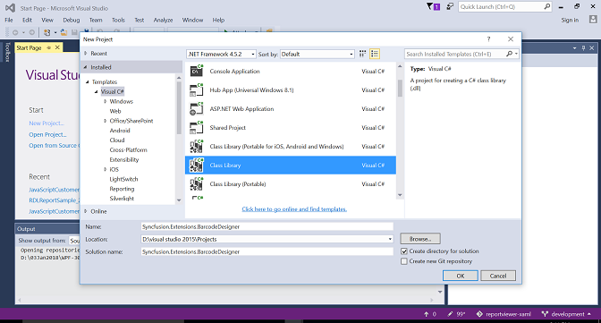
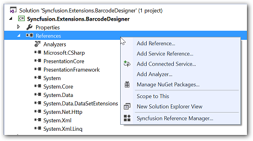
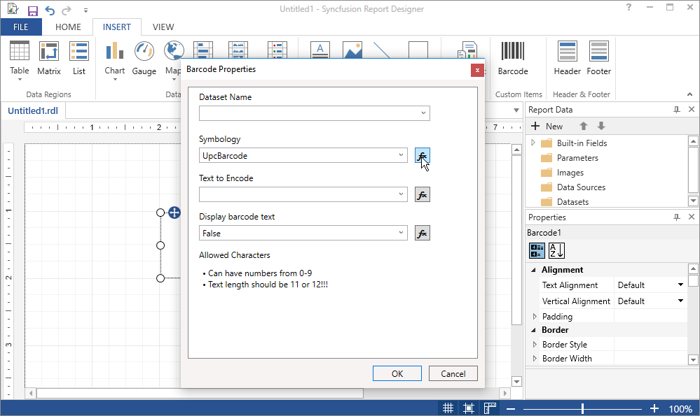

A custom report item allows you to add the functionality that is not natively supported in the RDL or extend the functionality of existing controls in the RDL standard. The design-time component allows the custom report item to be defined and manipulated in the design surface of the report designer.

## Creating a custom report item design-time component
The design-time component is a control that can be used in the Syncfusion Report Designer like other built-in report items such as Textbox, Tablix, Rectangle, and so on. The following section provides guideline to create a **Barcode** custom report item.

### Create a report item assembly
1.	Open the Visual Studio and select the class library project type, then name the project as "Syncfusion.Extensions.BarcodeDesigner" for the design-time component. 
    
2.	Add the Syncfusion references "Syncfusion.ReportControls.Wpf", "Syncfusion.ReportDesigner.WPF", "Syncfusion.SfBarcode.WPF" and "Syncfusion.Shared.WPF" to an application.
    
    
    N> Refer the above assemblies from the below installed location.For Essential Studio: C:\Program Files (x86)\Syncfusion\Essential Studio{{ site.releaseversion }}\Assemblies 
3.	Add a new class file "BarcodeCRIDesigner" by inheriting the `CustomReportItemDesigner` class.

The following attributes must be set to BarcodeCRIDesigner class.

Attribute	|Description
----------|------------
Localized name	|This is the attribute used to specify the display name for the custom report item.
Custom editor	|This is used for the invoke property editor of the custom report item.
CustomReportItem	|This is the attribute used to identify the type of the custom report item. The name must match with the value of the `<Name>` attribute of the ReportItem element in the ReportExtension.config file.
ToolboxBitmap|	Icon that represents the custom report item in the user interface.


namespace Syncfusion.Extensions.BarcodeDesigner
{
    [LocalizedName("Barcode")]
    [Editor(typeof(CustomEditor), typeof(ComponentEditor))]
    [ToolboxBitmap(typeof(BarcodeCRIDesigner), "Barcode.ico")]
    [CustomReportItem("Barcode")]

    public class BarcodeCRIDesigner : CustomReportItemDesigner
    {
        ...
        ...
    }
}


### Create the component class
The following sections guide you to initialize the design-time component of the custom report item and add new properties or access existing properties.

#### Initializing the component
The implementation of BarcodeCRIDesigner class should override the `InitializeNewComponent` method to create a new instance of your component's `CustomData` class and set it to default values.


public override void InitializeNewComponent()
{
    //Initialize UI elements required for the barcode item.
    SfBarcode barcodeControl = new SfBarcode();
    CustomData CustomData = new CustomData();
    //Initialize other required properties (SortExpressions, DataRow, Filters etc.) in CustomData
}


The `Draw` method is invoked when run-time editing or user interaction is performed on the custom report item. The panel type argument is used to add the new/edit UIElement to the control when the edit action like resize and drag-drop is performed. Also, the `ReportItemDrawParams` flag is used to identify the current action and the value is default for new control initialization.


public override void Draw(Panel panel, ReportItemDrawParams dp)
{
    try
    {
        //Assign required properties to custom control like alignment, size etc..
        barcodeControl.HorizontalAlignment = System.Windows.HorizontalAlignment.Stretch;
        barcodeControl.VerticalAlignment = System.Windows.VerticalAlignment.Stretch;
        barcodeControl.Width = Width; //Width and height value is variant.
        barcodeControl.Height = Height;
        barcodeControl.Margin = new System.Windows.Thickness(5);
        
         if (dp.Flags == Windows.Reports.Designer.ReportItemDrawFlags.Default)
         {
             //Add the custom control to panel of designer
             panel.Children.Clear();
             panel.Children.Add(barcodeControl);
         }
     }
     catch { }
}


#### Add custom properties to component

New custom properties can be added to the component to include additional features that are not natively supported in the RDL or to process the current control specific features. The newly created properties need to be added to the `CustomProperties` collection of the report item to serialize within RDL definition. The following code sample describes adding a custom property "BarcodeValue" to set the barcode custom report item value property. 


[Browsable(true)]
public string BarcodeValue
{
    get
    {
        //Gets the value of a custom property from custom property collection
        return GetCustomProperty("BarcodeValue");
    }
    set
    {
        //Sets the value of a custom property to custom property collection
        SetCustomProperty("BarcodeValue", value);

         if (!isInternalChange)
         {
             //Updates the value of a barcode custom report item.
             UpdateBarcodeValue();
         }
     }
}

public string GetCustomProperty(string propertyname)
{
     if (CustomProperties != null)
     {
         foreach (KeyValuePair<string, string> property in CustomProperties)
         {
             if (property.Key == propertyname)
                 return (string)property.Value;
         }
     }
     return null;
}

public void SetCustomProperty(string propertyname, string value)
{
     if (!this.CustomProperties.ContainsKey(propertyname))
         this.CustomProperties.Add(propertyname, value);
     else
         this.CustomProperties[propertyname] = value;
}


#### Modifying component properties

You can modify the properties that are exposed by the design-time component by adding the custom properties dialog or property editors.
The following code creates a local property to modify the design-time component DataSetName property of the `CustomData` class.


[Browsable(true)]
public string DataSetName
{
    get
    {
        return CustomData.DataSetName;
    }
    set
    {
        CustomData.DataSetName = value;
    }
}


You can right-click the control in the design environment and select the properties in the shortcut menu to display a custom properties window.

### Custom property editor

The `ComponentEditor` is used to create a custom properties editor dialog box to the design-time component. The custom property editor implementation should be inherited from the ComponentEditor class, and it should create an instance of a dialog box that is used for property editing.
The following example shows an implementation of the class that is inherited from the ComponentEditor to display the custom property editor dialog box.


internal sealed class CustomEditor: ComponentEditor
{
     public override bool EditComponent(ITypeDescriptorContext context, object component)
    {
        BarcodeCRIDesigner designer = (BarcodeCRIDesigner)component;
        BarcodeProperties dialog = new BarcodeProperties();  //Custom property dialog
        dialog.DesignerComponent = designer;

         if ((bool)dialog.ShowDialog()) //Which allows you to edit value of custom properties in property dialog.
         {
             designer.Invalidate();
             return true;
         }
         else
         {
             return false;
         }
     }
}


The custom property editor dialog box invokes the report designer `ExpressionEditor` to edit any property as an expression.


private void Expression_Click(object sender, RoutedEventArgs e)
{
    //Displays expression editor dialog box when expression is clicked in custom property dialog.
    ExpressionEditor editor = new ExpressionEditor();
    object newValue = editor.EditValue(this, null, this.oldCombovalue);
}


### Modifying the custom component style

The design-time component related style property changes can be handled and applied to the UIElement by overriding style related methods in the below table.

Methods	|Description
----------|------------
OnFontChanged()|	Invokes when the font value of the custom report item is changed.
OnTextAlignChanged()|	Invokes when the text alignment of the custom report item is changed.
OnBackgroundColorChanged()|	Invokes when the background color of the custom report item is changed.

In the following example, the change of font family property is handled in the custom component and the style is applied to the barcode custom report item.


public override void OnFontChanged()
{
     if (!string.IsNullOrEmpty(this.Style.FontFamily) && !this.Style.FontFamily.StartsWith("="))
     {
         barcodeControl.FontFamily = (new System.Windows.Media.FontFamilyConverter().ConvertFromInvariantString(this.Style.FontFamily) as System.Windows.Media.FontFamily);
     }
}


### Build project

You can clean and build the extension project, it will generate the design-time component assembly "Syncfusion.Extensions.BarcodeDesigner.dll" in the bin folder of the project.

N> You can create a standalone report designer application with the help of given [Getting Started Documentation](/wpf/reportdesigner/getting-started). 

You can download the custom report item extension project of sample barcode for report designer by clicking here  [Download sample](http://www.syncfusion.com/downloads/support/directtrac/general/ze/Syncfusion.Extensions.BarcodeDesigner647552659).

## Deploy a custom report item

To deploy a custom report item, you must modify the application configuration files or create "ReportExtensions.config" file and copy the design-time(Syncfusion.Extensions.BarcodeDesigner) assembly into the appropriate application folder for created standalone report designer application. The deployment requires configuration to process the extensions. The following "configSections" section is mandatory to process the extension inside the control, so add it as shown in the following code.


<configSections>
    <section name="ReportingExtensions" type="Syncfusion.Reporting.Extensions,  Syncfusion.ReportControls.WPF" allowLocation="true" allowDefinition="Everywhere" />
</configSections>


You must add the `ReportItem` tag for all newly added custom report item with the following attributes.

Attribute	|Description
--------------|------------------
Name|	Name of your report item that is going to be displayed in the list.
Assembly|	Name of the newly created report item assembly.
Type	|Report item class name with the namespace.

For report designer, you need to replace the newly created assemblies and its dependent assemblies in appropriate application folders.


    <configuration>
        <configSections>
            <section name="ReportingExtensions" type="Syncfusion.Reporting.Extensions,  Syncfusion.ReportControls.WPF" allowLocation="true" allowDefinition="Everywhere" />
        </configSections>

        <ReportingExtensions>
            <ReportItemDesigner>
                <ReportItem Name="Barcode" Assembly="Syncfusion.Extensions.BarcodeDesigner" Type="Syncfusion.Extensions.BarcodeDesigner.BarcodeCRIDesigner" />
            </ReportItemDesigner>
        </ReportingExtensions>
    </configuration>


Also, you need to add the created/modified "ReportExtensions.config" file in standalone application. Run the application, output with bar code custom report item is rendered as below.

Shows bar code custom report item that is added to built-in report item collections of the report designer.
   {:.caption}

Custom property dialog of the bar code custom report item.
   {:.caption}

## Creating a custom report item run-time component

To preview the report with custom report item in the report designer, need to create a run-time component.

The following steps explains how to create custom report item run-time components.

[Create a run-time component for WPF](/wpf/ReportViewer/how-to/Add-Custom-Report-Item)
Describes how to create a custom report item run-time component, to render in the WPF report viewer.

[Create a run-time component for Web](/js/ReportViewer/how-to/Add-Custom-Report-Item)
Describes how to create a custom report item run-time component, to render in the Web report viewer.