# Add Parameter

You can add parameter to the Report Designer using the following steps.

1. In the Report Data, Click New, and then click the DataSet.

   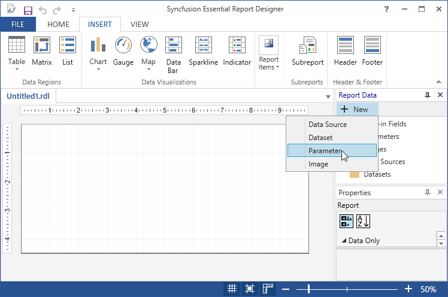

2. Right click on the Parameters and click Add Parameter.

   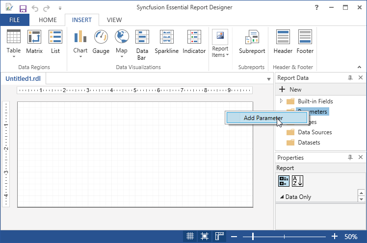

3. Then Report Parameter Properties dialog opens.

4. In Report Parameter Properties, select any of the following in General tab.

   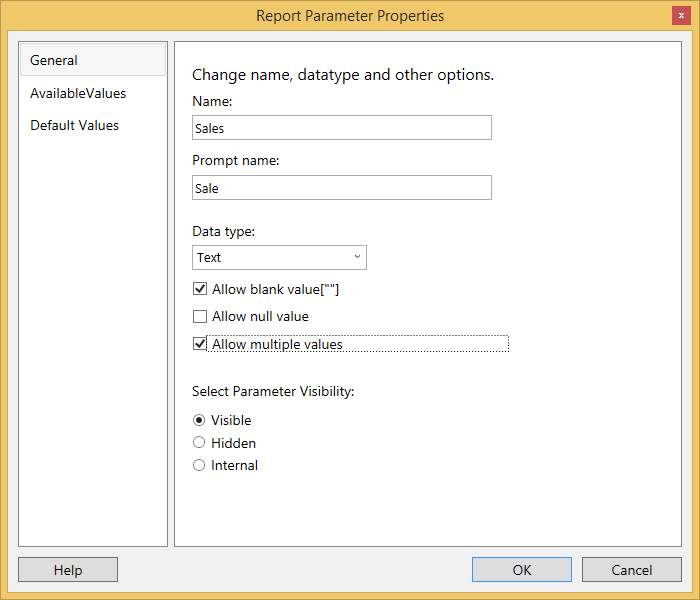

   * Name - Type the name of the parameter or accept the default name. 
   
   * Prompt -  Type the text that appears next to the parameter text box when the user runs the report.
   
   * Data type - Select the data type for the parameter value.
   
   * Allow blank value - To allow a user to select blank value for the parameter.
   
   * Allow null value - To allow a user to select null value for the parameter.
   
   * Allow multiple values - To allow a user to select more than one value for the parameter. 
   
   * Visible - To show the parameter on the toolbar at the top of the report.
   
   * Hidden - To hide the parameter so that it does not display on the toolbar. 
   
   * Internal - To hide the parameter and protect it from being modified on the Report Server after the report is published. 

5. In Report Parameter Properties, select any of the following in Available Values tab. 

   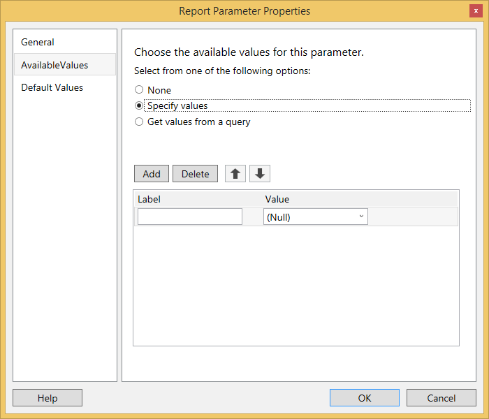

   * Default values - Select an option to display default values from a query or from a static value.

   * Specify Values - Select this option to enter a static list of parameter values from which the user can choose. If you select this option, a list in which you can type values and labels appears.

   * Label - Appears only when Specify Values is selected. Type a label that is displayed to the user. When the user clicks the label in the list, the value specified in Value is retained for the parameter.

   * Value - Appears only when Specify Values is selected. Type a value that will be retained for the parameter.
   
   * Get Values from a query - Select Get Values from a query to provide a dynamic list of parameter values from which the user can choose. This list is obtained from a data source. If you select From query, three fields appear in which you can define query information.

   * Dataset - Appears only when Get Values from a query is selected. Select a dataset from which to retrieve the list of parameters. You define datasets using the Data view. For more information, see Defining Report Datasets.

   * Value field - Appears only when Get Values from a query is selected. Select a field from which to obtain a list of available values, for example, EmployeeID. The available fields are retrieved from a list of column or field names in the dataset.

   * Label field - Appears only when Get Values from a query is selected. Select a field from which to obtain a list of labels to display to the user for the values, for example, EmployeeName. The available fields are retrieved from a list of column or field names in the dataset.

   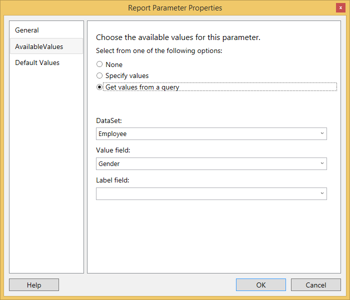
   
6. In Report Parameter Properties, select any of the following in Default Values tab. 

   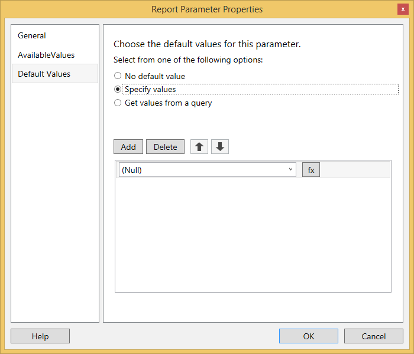

   * No Default values - Select No default values, if you do not want to provide a default value for the parameter.

   * Specify Values - Select Specify Values to enter a static default value or a set of default values for the parameter. If you select Specify Values, a text box appears in which you type a value or set of values. Click the expression button to edit the expression

   * Get Values from a query - Select Get Values from a query to retrieve the default value or set of default values from a data source. If you select Get Values from a query, two fields appear in which you define query information.

   * Dataset - Appears only when Get Values from a query is selected. Select a dataset from which to retrieve a default value or a set of default values for the parameter. You define datasets using the Data view. For more information, see Defining Report Datasets.

   * Value field - Appears only when Get Values from a query is selected. Select a field from which to obtain the default value or set of default values. The available fields are retrieved from a list of column or field names in the dataset. The value from the first row in the dataset is used for the default value.

   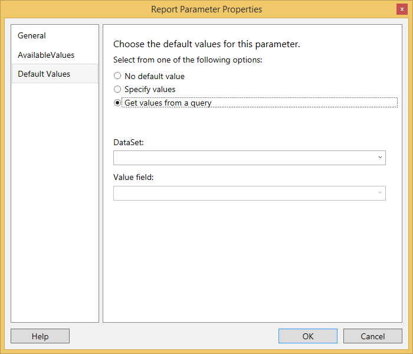
   
7. Click OK.

8. To delete a report parameter, Right-click the report parameter and click Delete. 

   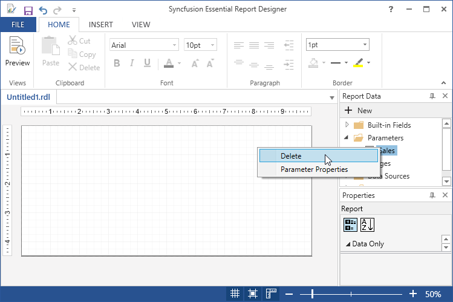

# Add a Dataset Query Parameter

ReportDesigner automatically creates a report parameter with default properties for Name, Prompt, and DataType when you add a query parameter in dataset query. 

[How to add dataset](/wpf/ReportDesigner/Add-DataSet)
Describes how to add dataset in WPF report designer.

1. In the Report Data pane, right click on the Datasets folder and click Add DataSet.

	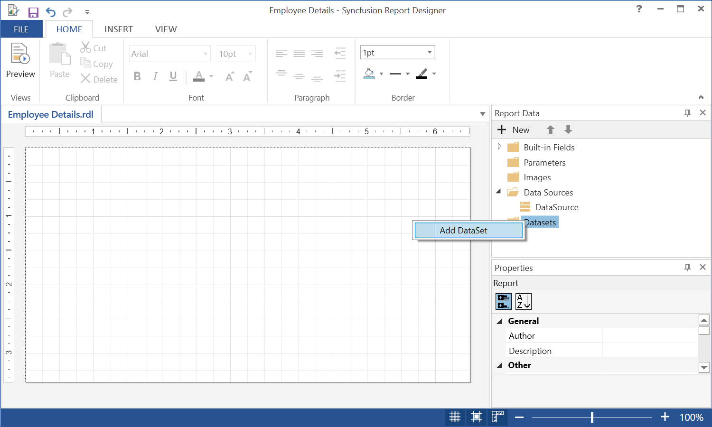

2. In Dataset properties wizard, enter a name for the dataset in the Name field and to select the fields manually from the database, click the Query Designer.

	
	
3. Choose the query in the database view and select the corresponding fields(Employee database) in that query and test the query by clicking Run Query.

	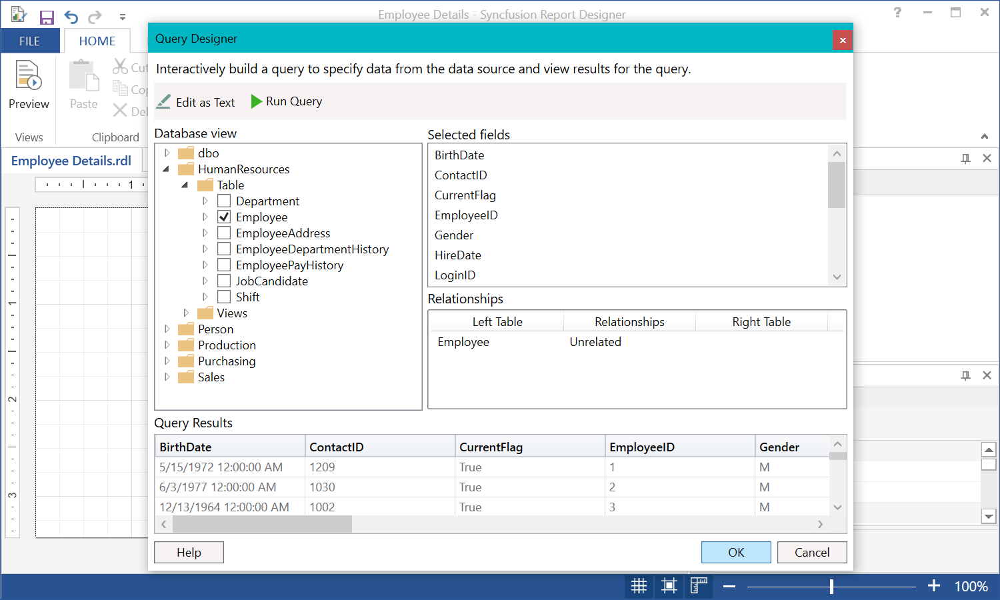
	
4. Click OK. Then the added fields will display on the query field in Dataset Properties wizard.

	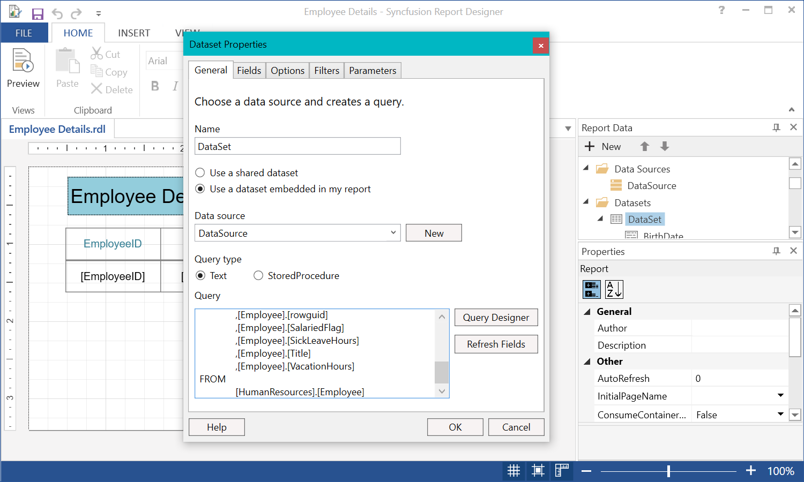

5. Click OK to add the dataset in the report data pane. Now drag and drop the table and add the dataset field values to the table.

      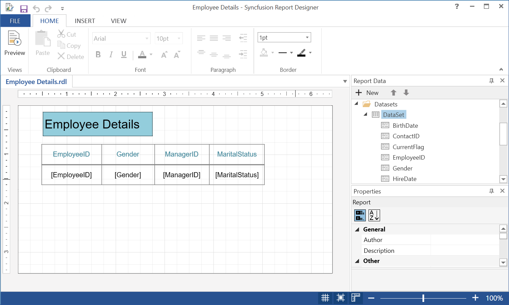

6. Right click the dataset and open the dataset(Employee) properties. Add the Transact-SQL WHERE clause as the last line in the query text area and Click OK.

	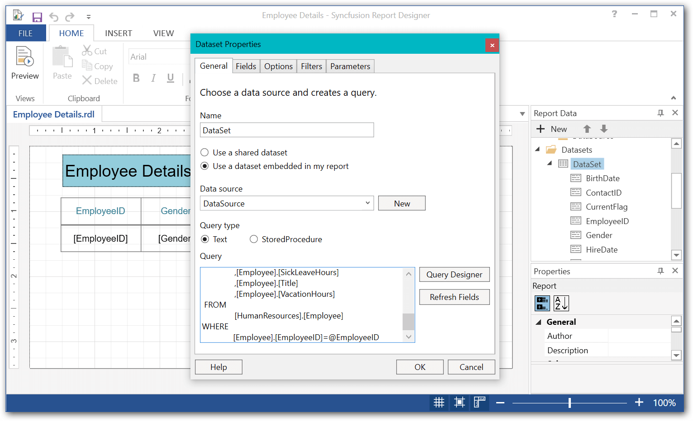
	
	The WHERE clause limits the retrieved data to the Employee that is specified by the query parameter @EmployeeID.

		SELECT 
		[Employee].[BirthDate]
		,[Employee].[ContactID]
		,[Employee].[CurrentFlag]
		,[Employee].[EmployeeID]
		,[Employee].[Gender]
		,[Employee].[HireDate]
		,[Employee].[LoginID]
		,[Employee].[ManagerID]
		,[Employee].[MaritalStatus]
		,[Employee].[ModifiedDate]
		,[Employee].[NationalIDNumber]
		,[Employee].[rowguid]
		,[Employee].[SalariedFlag]
		,[Employee].[SickLeaveHours]
		,[Employee].[Title]
		,[Employee].[VacationHours]
		FROM 
		[HumanResources].[Employee]
		WHERE
            [Employee].[EmployeeID] = @EmployeeID
	
7. The Define Query Parameters dialog box opens and prompts for a value for the query parameter @EmployeeID when we click Run(!) in query designer toolbar. Resultant table data will be displayed based on value provided for parameter in ParameterValue.

	
	
8. Click OK. Now, parameters in dataset query is added in Parameters folder.

	