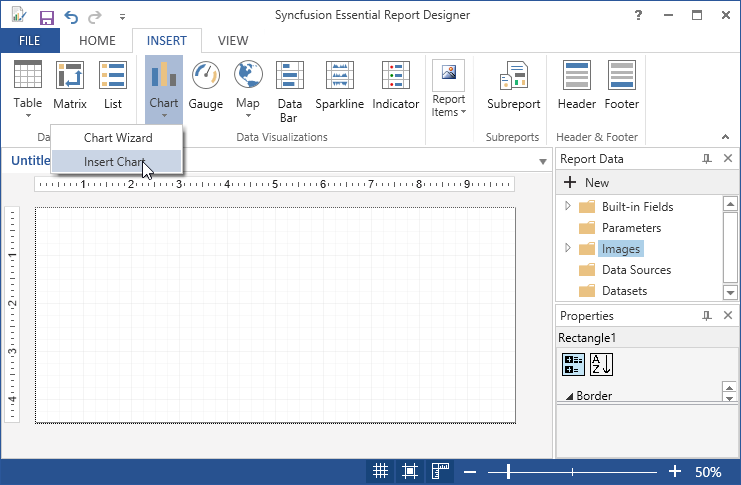
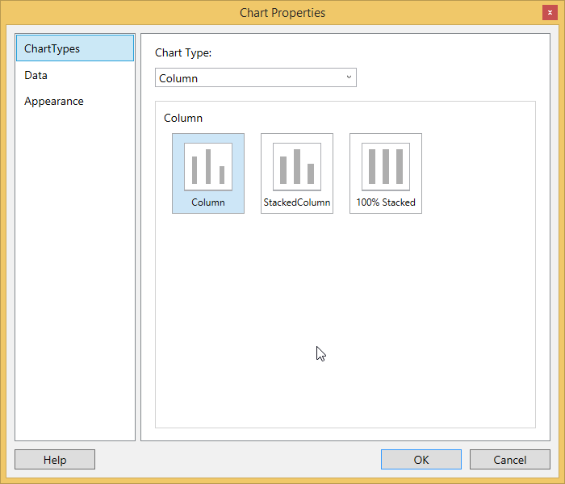
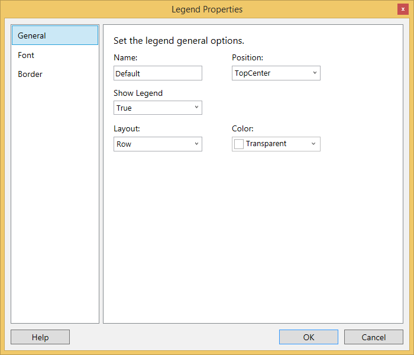
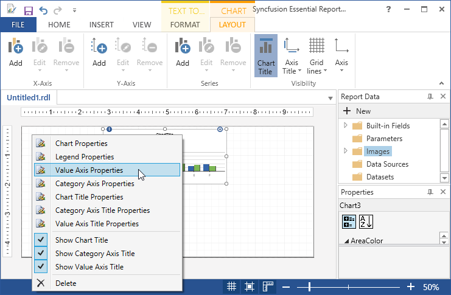
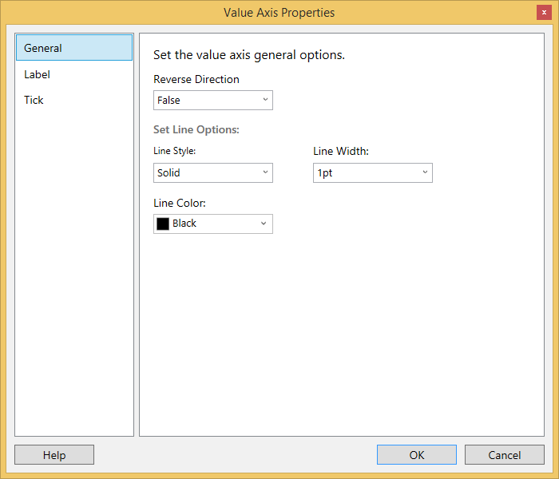
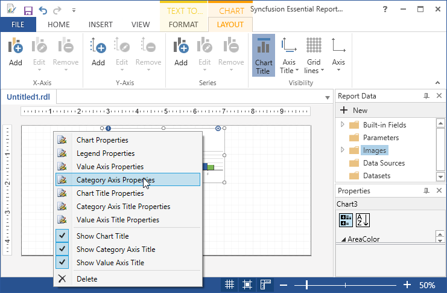
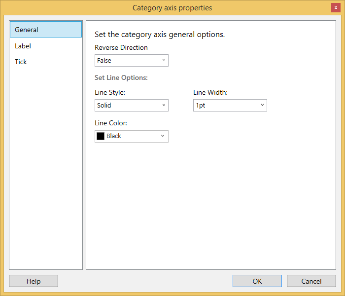
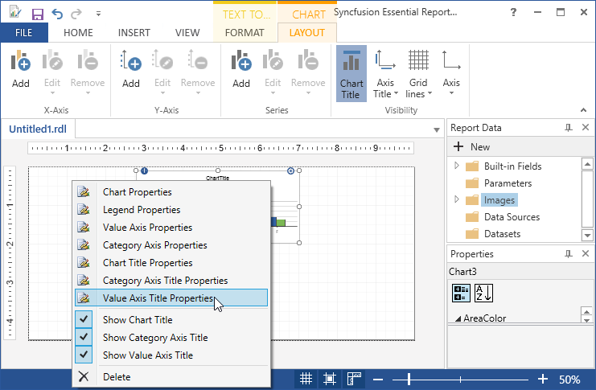

# Draw Chart Report item

You can add a chart to the Syncfusion Report Designer by using the following steps.

1. Add a dataset to the Report Designer.

2. In the Insert tab, click Chart, and click and drag Insert Chart to the Report Designer.

   

3. A chart appears in the Report Designer window.

   

4. To view the value axis, category axis, and series axis panels double click the chart area.

5. Drag a data field to the category axis panel and the value axis panel. After setting the data field, it looks like the following illustration.

   

## Applying Styles to the Chart

To apply styles to the chart:

1. Right click the chart and select the Chart Properties from the context menu.

   

2. In the Chart Properties dialog, select any of the following:

   I. General to change the chart type and ToolTip of the chart.
   
   II. Border to change the border style and border width of the chart.
   
   III.Fill to set background color of the chart.
   
   IV. AreaColor to set color of the chart area color.

   

3. Click OK.

4. To apply legend styles to the chart, right click the chart and choose Legend Properties.

   

5. The Legend Properties dialog opens. Select any of the following:

   I. General to change the position, color, or visibility of the legend when the chart is initially run.
   
   II . Font to set the font color, font family, font size, and font style of the legend.

   III. Border to set the border color and border width of the legend.

   

6. Click OK.

7. To apply styles to the value axis of the chart, right click the chart and choose Value Axis Properties.

   

8. The Value Axis Properties dialog opens. Select any of the following:

   I. General to change the direction, line style, line width, and line color of the value axis.
   
   II. Label to set the font family, font size, font angle, font style, font color, and visibility of the value axis label.
   
   III . Tick to set the style, width, color, and length of the value axis tick, and set the visibility of the major and minor tick marks.

   

9.  Click OK.

10. To apply category axis styles to the chart, right click the chart and select Category Axis Properties.

    

11. The Category Axis Properties dialog opens. Select any of the following options:

    I. General to change the direction, line style, line width, and line color of the category axis.
	
	II. Label to set the font family, font size, font angle, font style, font color, and visibility of the category axis label.
	
	III . Tick to set style, width, color, and length of the ticks in the category axis, and set the visibility of the major and minor tick marks.

    

12. Click OK.

13. To apply title styles to the chart, right click the chart and select the Chart Title Properties.

    

14. In the Chart Title Properties dialog, select General and set title, font family, font size, font color, font style, and background color for the chart as needed.

    

15. Click OK.

16. To apply styles to the category axis title, right click the chart and select the Category Axis Title Properties.

    

17. In the Category Axis Title Properties dialog, select General and set the title, font family, font size, font color, font style, and alignment for the category axis title as needed.

    

18. Click OK.

19. To apply styles to the value axis title, right click the chart and select the Value Axis Title Properties.

    

20. In the Value Axis Title Properties dialog, click General and set the title, font family, font size, font color, font style, and alignment for the value axis title.

    

21. Click OK.
 
    N> You can also change the Chart Properties via the Properties grid by clicking the chart. It displays the Properties grid at the right of the Report Designer.

    

    The following screenshot is a sample output for the pyramid chart type. You can get this by setting the chart type as Pyramid through the Properties grid.

    