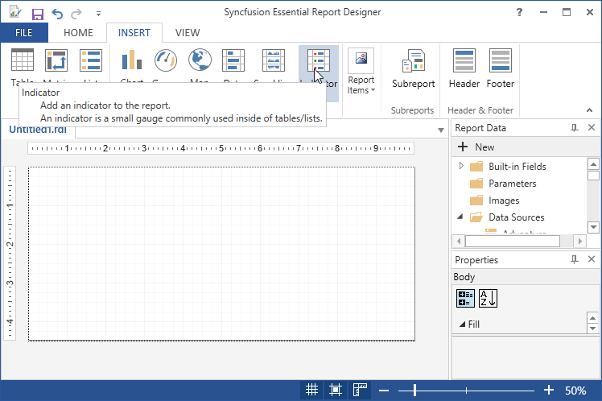
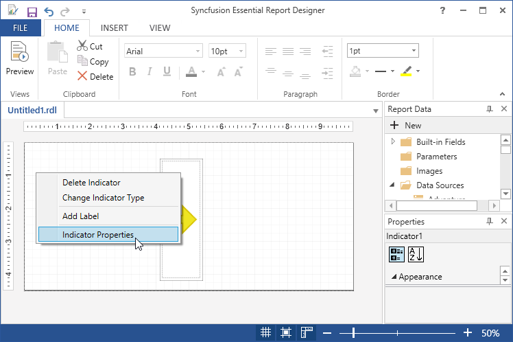
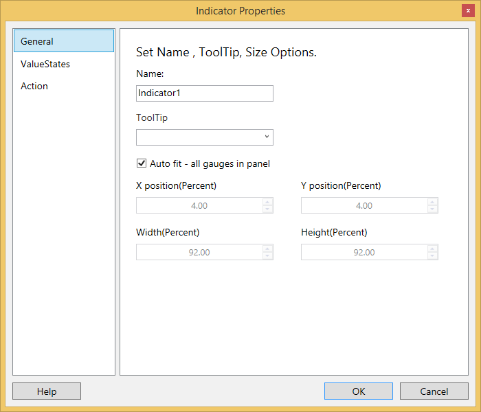
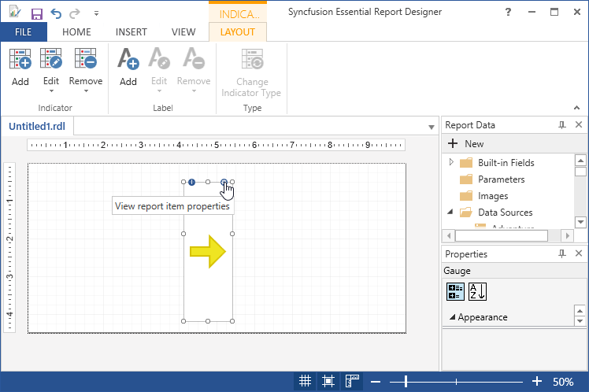
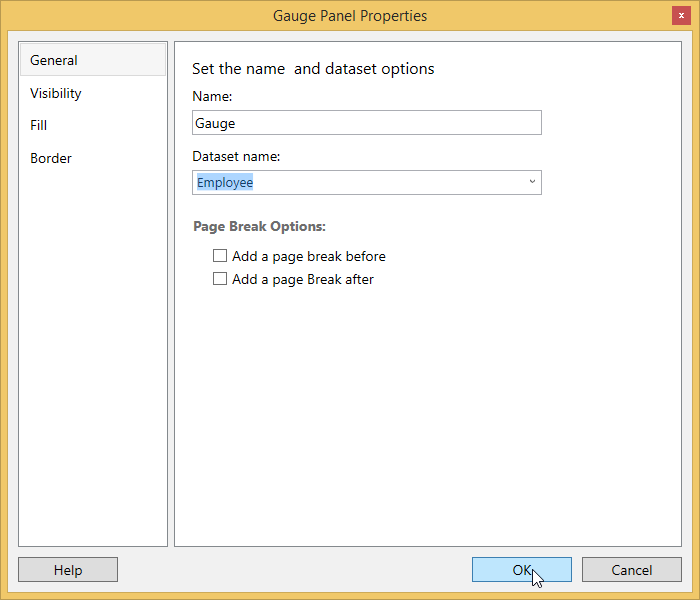
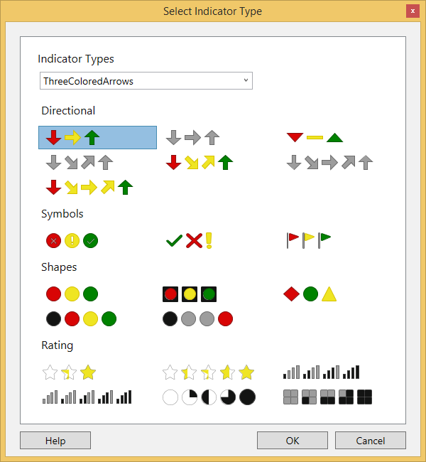
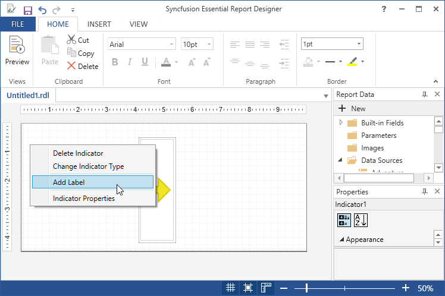
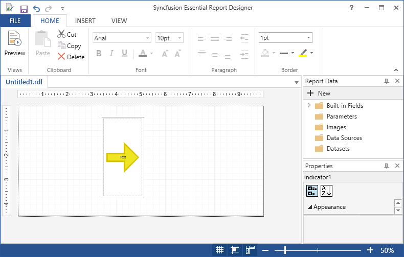
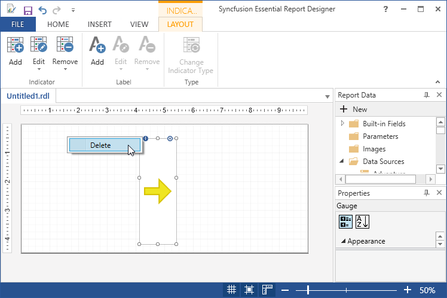
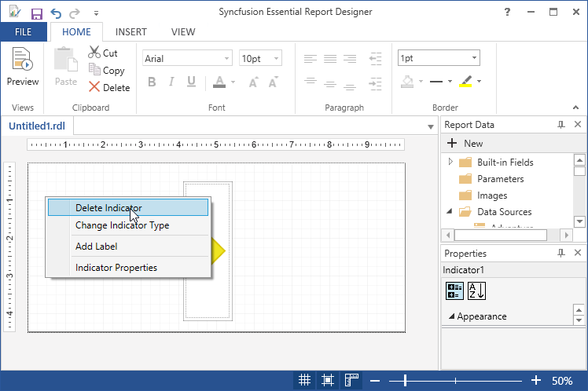

# Draw Indicator Report Item

You can add a Indicator to the Report Designer using the following steps.

1. Click indicator in the Insert Tab and drag it to the Report designer.

   

2. A Gauge Panel properties wizard opens, Click Ok.Then indicator will be added with its default properties.

   

3. To Add the Report Items such as text boxes, lines, and images and rectangle to the indicator, click and drag the selected report items to the databar.

   

4. To Apply Styles to the indicator, Right Click on the indicator and select the Indicator Properties from the context menu.

   

5. In the Indicator Properties dialog, select any of the following.

   
   
   * General - To set name, size and tooltip options.
   
   * ValueStates - To change indicator value.
   
   * Action - To change hyperlink options.

6. Click Ok. Then the values are updated in the indicator.

7. Select properties like add indicator, edit indicator, remove indicator, add label and change indicator type.

   

8. To change gauge properties, select indicator and click on the view report item properties.

   

9. In the Gauge Panel dialog, select any of the following.

   
   
   * General - To set name, dataset options and page break options.
   
   * Visibility - To Change display options when report is initially run.
   
   * Fill - To set the background color of the gauge panel.
   
   * Border - To change border color, style and width options.

10. Click Ok. Then the values are updated in the gauge panel.

11. To change indicator type, Select indicator and right click and select Change Indicator Type or select Change Indicator Type in the Layout Tab.

    

12. In the Select Indicator Type Properties dialog, select any of the following.

    

13. Click Ok. Then the values are updated in the indicator type.

14. To Add label to the indicator, right click the indicator and select Add Label.

    

15. Then label will be added to the indicator.

    

14. To Delete the indicator, right click and select Delete Indicator from the list.

    
	
	

