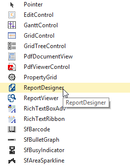
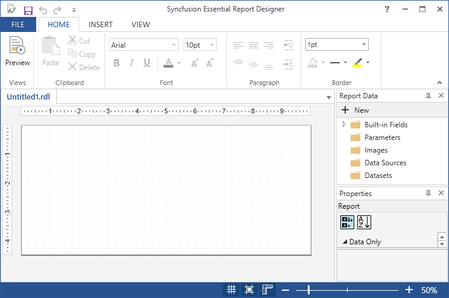
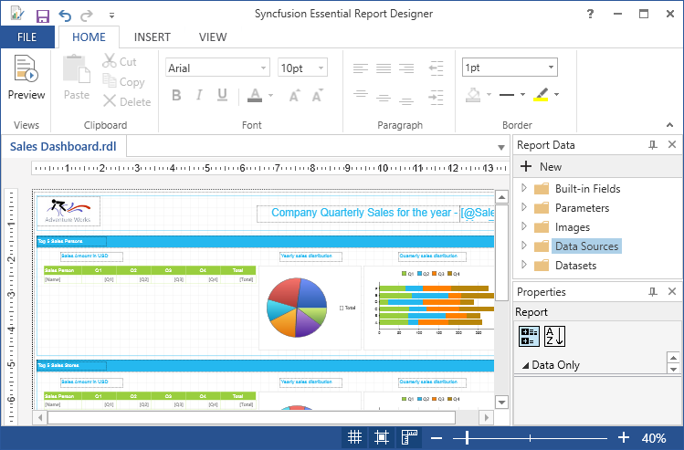

# Getting Started

## Creating Report Designer through Designer

You can create a simple application through the Visual Studio Designer with the Syncfusion WPF Report Designer control by using the following steps.

1.Create a new WPF application in VS2008 or VS2010, and then add the following XAML code.



<syncfusion:RibbonWindow 

x:Class="Report_Designer_Utility_2008.MainWindow"        

xmlns:syncfusion="clr-namespace:Syncfusion.Windows.Tools.Controls;assembly=Syncfusion.Tools.WPF"    
xmlns:Reporting="clr-namespace:Syncfusion.Windows.Reports.Designer;assembly=Syncfusion.ReportDesigner.WPF"       

WindowStartupLocation="CenterScreen" xmlns="http://schemas.microsoft.com/winfx/2006/xaml/presentation"

xmlns:x="http://schemas.microsoft.com/winfx/2006/xaml"

Title="MainWindow" Height="600" Width="1000" Icon="App.ico">    

<syncfusion:RibbonWindow.StatusBar>

    <syncfusion:RibbonStatusBar>           

        </syncfusion:RibbonStatusBar>

    </syncfusion:RibbonWindow.StatusBar>    

    <Grid>

        <Grid.RowDefinitions>


2.Drag the Report Designer control from the Toolbox to the Report Designer window. The Report Designer window is modified.

Note: The following code is automatically generated in the XAML window.



<Reporting:ReportDesigner ApplicationMenuVisibility="Collapsed"                 

ToolboxVisibility="Visible"  

ReportDataVisibility="Visible"                                       

x:Name="ReportDesignerControl" Margin="0,6,0,-6" />



2.Check whether the following highlighted references are added to the References folder.

Note: After building and debugging the application, the appearance of the Report Designer is modified as shown in the following illustration.

3.To view the Properties grid, click the View tab and select the Properties check box. 

