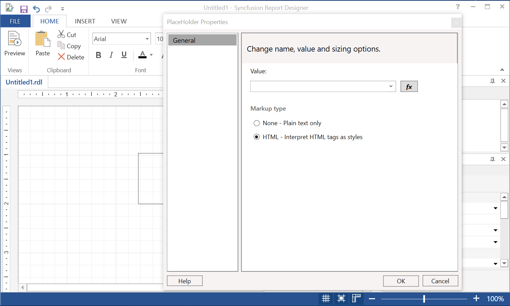
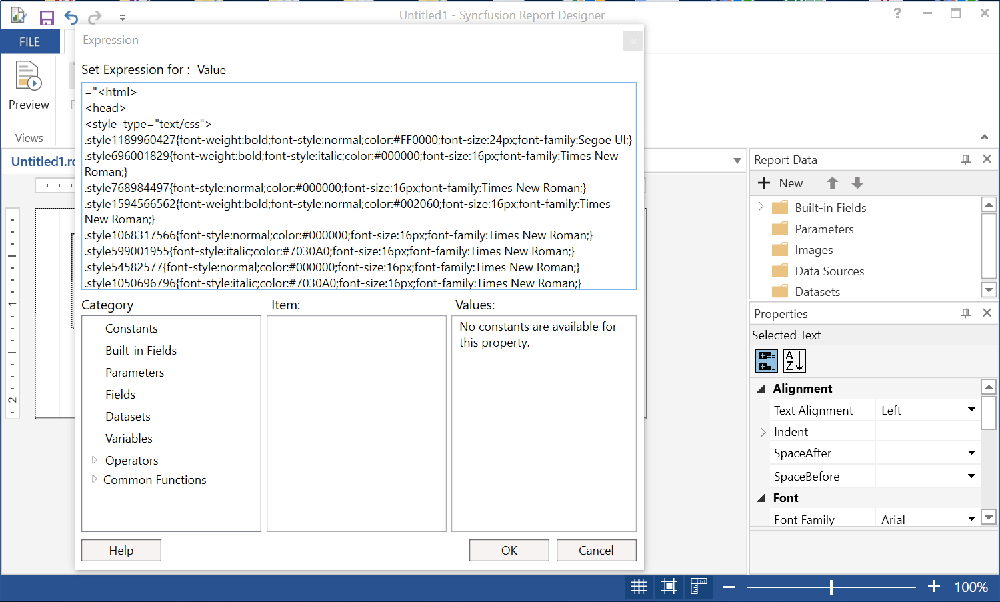
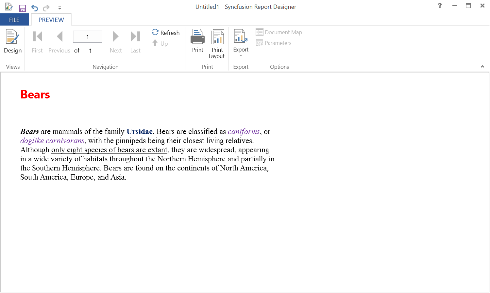

## HTML Formatted Data with Report

Text box can be used to show the HTML formatted data with the report viewer that is retrieved from the data source. HTML text can be in form of simple or complex expressions. You have to create the placeholder in textbox and show the HTML formatted data from the dataset. The following steps are used to import the HTML text in the report:

1. Draw a textbox report item. Right-click the text box and select “Create Placeholder”.
    
    

2.	Select the markup type as “HTML – Interpret HTML tags as styles” from the “Placeholder Properties” dialog box.
    
    

3.	Now, select the dataset field which contains the HTML text or you can provide the HTML text as expression.
    
    

4.	Then, click ok. The HTML formatted data will be shown as below in the report designer preview and report viewer.
    
    

## Supported HTML Tags

* Hyperlinks: `<A HREF>`
* Fonts: ``
* Header, style and block elements: `<H{n}>, 
, , 
, 
, <LI>, <HN>`
* Text format: `<B>, <I>, <U>, <S>`

## Limitations of Cascading Style Sheet Attributes

The following is a list of attributes that are supported:

* text-align, text-indent
* font-family
* font-size
* Only valid RDL size values are supported in absolute CSS length units. Supported units are: in, cm, mm, pt, pc, px, ex, and em.
* Relative CSS length units are ignored and are not supported. Unsupported units include percentage (%), and rem.
* color
* padding, padding-bottom, padding-top, padding-right, and padding-left
* font-weight
