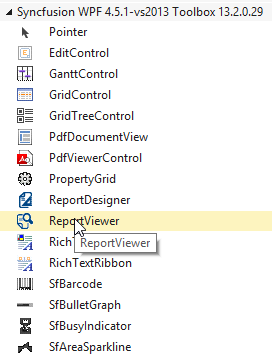

# Getting Started

## Create Report Viewer through Designer

The section illustrates how to add the Report Viewer to the WPF application. It includes the following steps:

1. Create a new WPF application in VS2008 or VS2010.

   

2. To add the Report Viewer control through designer, drag the Report Viewer control from Toolbox to Report Viewer window. The Report Viewer window is modified as shown.

   

   _Note: The following code is auto generated in XAML window._

   ~~~xml

   
   <Window x:Class="WpfApplication6.Window1"    xmlns="http://schemas.microsoft.com/winfx/2006/xaml/presentation" xmlns:x="http://schemas.microsoft.com/winfx/2006/xaml"

   Title="Window1" Height="371" Width="559" xmlns:syncfusion="http://schemas.syncfusion.com/wpf">

   <Grid>

   <syncfusion:ReportViewer Name="reportViewer1" />

   </Grid>

   </Window> 

   ~~~
   {:.prettyprint}

3. Set the ReportPath to load the report in Report Viewer from a local machine.

   ~~~xml
	
	
   <Window x:Class="WpfApplication6.Window1"    xmlns="http://schemas.microsoft.com/winfx/2006/xaml/presentation" xmlns:x="http://schemas.microsoft.com/winfx/2006/xaml"
    
   Title="Window1" Height="371" Width="559" xmlns:syncfusion="http://schemas.syncfusion.com/wpf">
    
   <Grid>
    
   <syncfusion:ReportViewer Name="reportViewer1" ReportPath="D:\ReportTemplate\Invoice.rdl"/>
   
   </Grid>

   </Window> 
   
   ~~~
  {:.prettyprint}

4. To render the provided report in Report Viewer, call the RefreshReport method in window or parent control loaded event.
   
   ~~~ js
   
  this.Loaded += (sender, arg) =>
   
  {
   
  // To Render the Report in ReportViewer.
   
  this.reportViewer1.RefreshReport();
   
  };
   
  ~~~
 {:.prettyprint}
   
5.Run the application. The following output displays.

   

6.Click export drop-down button in Report Viewer toolbar and select PDF or XPS as needed. The report is exported into PDF or XPS formats, respectively.

   

The following output is the exported PDF report.

 

