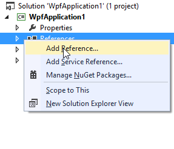
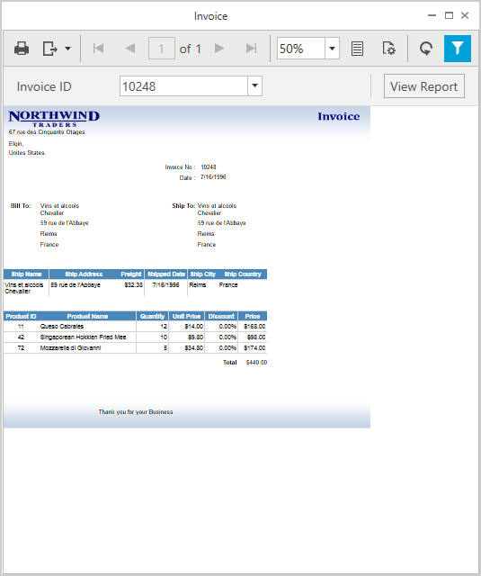
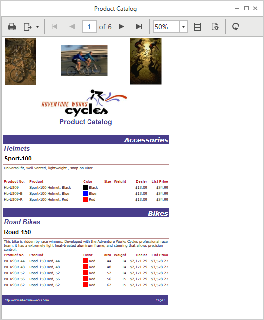
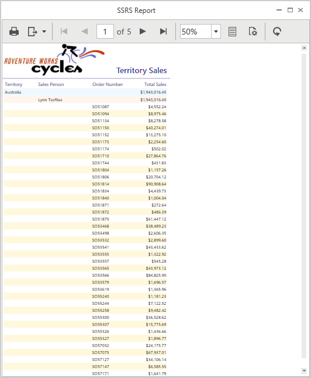

# Getting Started

## Creating ReportViewer through Visual Studio

You can create a simple application through the Visual Studio Designer with the Syncfusion WPF ReportViewer control by using the following steps.

1. Create new WPF application in Visual Studio.

2. Add the ReportViewer from the Toolbox.

   Drag and drop the ReportViewer control from the Toolbox to the XAML Page.
   
   
   
3. To add references, Right-click on References and select Add Reference.

   
   
4. Add the following assemblies.

   * Syncfusion.Chart.Wpf
   * Syncfusion.Compression.Base
   * Syncfusion.DocIO.Base
   * Syncfusion.Gauge.Wpf
   * Syncfusion.Grid.Wpf
   * Syncfusion.Linq.Base
   * Syncfusion.Pdf.Base
   * Syncfusion.PropertyGrid.Wpf
   * Syncfusion.ReportControls.Wpf
   * Syncfusion.ReportDesigner.Wpf
   * Syncfusion.ReportViewer.Wpf
   * Syncfusion.SfMaps.Wpf
   * Syncfusion.SfSkinManager.Wpf
   * Syncfusion.Shared.Wpf
   * Syncfusion.Tools.Wpf
   * Syncfusion.XlsIO.Base
   
   N> Refer the above assemblies from the installed location, C:\Program Files (x86)\Syncfusion\Essential Studio\{{ site.releaseversion }}\Assemblies
   
5. Add the following code for creating ReportViewer using code.

   ~~~ xml
   <sync:ChromelessWindow x:Class="Syncfusion.Samples.ReportView"
   xmlns="http://schemas.microsoft.com/winfx/2006/xaml/presentation"
   xmlns:x="http://schemas.microsoft.com/winfx/2006/xaml"
   xmlns:sync="http://schemas.syncfusion.com/wpf"
   xmlns:local="clr-namespace:Syncfusion.Samples.ViewModel"
   xmlns:localUtil="clr-namespace:Syncfusion.Samples.Util"
   Title="Product Catalog" WindowStartupLocation="CenterScreen" SnapsToDevicePixels="True" WindowState="Maximized" TitleTextAlignment="Center" ShowIcon="False" UseNativeChrome="True" Icon="App.ico">
   <Grid Name="gridSkeleton" localUtil:EventAttachUtil.AddWindowLoaded="True">
       <Border Name="groupBoxReportViewer" BorderThickness="0" >            
           <Grid>
               <sync:ReportViewer Name="viewer" /> 
           </Grid>
       </Border>
   </Grid>
   </sync:ChromelessWindow> 
   ~~~
   
6. Set `ReportPath` and `ProcessingMode` to the ReportViewer.

   ~~~ xml
   <sync:ReportViewer Name="viewer" ReportPath="..\ReportTemplate\InvoiceTemplate.rdl" ProcessingMode="Remote" />
   ~~~

7. Set Visual Style to the ReportViewer.  

   ~~~ csharp
   SkinStorage.SetVisualStyle(this, "Metro");
   ~~~
   
8. Run the sample application and you can see the ReportViewer as displayed in the following screenshot.

   
   
## Show RDLC Reports

1. Assign `ReportPath` and `ProcessingMode` to ReportViewer.

   ~~~ csharp
   Syncfusion.Windows.Reports.Viewer.ReportViewer viewer= new Syncfusion.Windows.Reports.Viewer.ReportViewer;
   viewer.ReportPath=@"../ReportTemplate/RDLC/ProductCatalog.rdlc";
   viewer.ProcessingMode = ProcessingMode.Local;
   ~~~
   
2. Set Datasource to the RDLC Report and invoke `RefreshReport` to render the report.

   ~~~ csharp
   viewer.DataSources.Clear();
   viewer.DataSources.Add(new ReportDataSource { Name = "ProductCatalog", Value = ProductCatalog.GetData() });
   viewer.RefreshReport();
   ~~~
   
3. Assign values for the datasource in RDLC.

   ~~~ csharp
   #region Product details

   public class ProductCatalog
   {
       public string ProdSubCat { get; set; }
       public string ProdModel { get; set; }
       public string ProdCat { get; set; }
       public string Description { get; set; }
       public string ProdName { get; set; }
       public string ProductNumber { get; set; }
       public string Color { get; set; }
       public string Size { get; set; }
       public double? Weight { get; set; }
       public double? StandardCost { get; set; }
       public string Style { get; set; }
       public string Class { get; set; }
       public double? ListPrice { get; set; }
       public static IList GetData()
       {
           List<ProductCatalog> datas = new List<ProductCatalog>();
           ProductCatalog data = null;
           data = new ProductCatalog()
           {
               ProdSubCat = "Road Frames",
               ProdModel = "HL Road Frame",
               ProdCat = "Components",
               Description = "Our lightest and best quality aluminum frame made from the newest alloy; it is welded and heat-treated for strength. Our innovative design results in maximum comfort and performance.",
               ProdName = "HL Road Frame - Black, 58",
               ProductNumber = "FR-R92B-58",
               Color = "Black",
               Size = "58",
               Weight = 2.24,
               StandardCost = 1059.3100,
               Style = "U ",
               Class = "H ",
               ListPrice = 1431.5000
           };
           datas.Add(data);
           data = new ProductCatalog()
           {
               ProdSubCat = "Road Frames",
               ProdModel = "HL Road Frame",
               ProdCat = "Components",
               Description = "Our lightest and best quality aluminum frame made from the newest alloy; it is welded and heat-treated for strength. Our innovative design results in maximum comfort and performance.",
               ProdName = "HL Road Frame - Red, 58",
               ProductNumber = "FR-R92R-58",
               Color = "Red",
               Size = "58",
               Weight = 2.24,
               StandardCost = 1059.3100,
               Style = "U ",
               Class = "H ",
               ListPrice = 1431.5000
           };
           datas.Add(data);
           data = new ProductCatalog()
           {
               ProdSubCat = "Helmets",
               ProdModel = "Sport-100",
               ProdCat = "Accessories",
               Description = "Universal fit, well-vented, lightweight , snap-on visor.",
               ProdName = "Sport-100 Helmet, Red",
               ProductNumber = "HL-U509-R",
               Color = "Red",
               Size = "",
               Weight = null,
               StandardCost = 13.0863,
               Style = "",
               Class = "",
               ListPrice = 34.9900
           };
		   datas.Add(data);
           return datas;
       }
   }
   #endregion
   ~~~
   
4. Run the application. The following output is displayed.

    

## Load SSRS Reports

1. To load SSRS reports, initialize ReportViewer control and set the `ReportPath`, `ProcessingMode` and `ReportServerUrl`.

   ~~~ csharp
   Syncfusion.Windows.Reports.Viewer.ReportViewer viewer = new Syncfusion.Windows.Reports.Viewer.ReportViewer();
   viewer.ReportPath = @"/SSRSSamples/Territory Sales";
   viewer.ReportServerUrl = @"http://mvc.syncfusion.com/reportserver";
   viewer.ProcessingMode = ProcessingMode.Remote;
   viewer.ReportServerCredential = new System.Net.NetworkCredential("ssrs", "RDLReport1");
   ~~~
   
2. Add the credential information to the datasource.

   ~~~ csharp
   List<DataSourceCredentials> crdentials = new List<DataSourceCredentials>();

   foreach (var dataSource in viewer.GetDataSources())
   {
       DataSourceCredentials credn = new DataSourceCredentials();
       credn.Name = dataSource.Name;
       credn.UserId = "ssrs1";
       credn.Password = "RDLReport1";
       crdentials.Add(credn);
   }
   viewer.SetDataSourceCredentials(crdentials);
   viewer.RefreshReport();
   ~~~
   
3. Run the application. The following output displays.

   