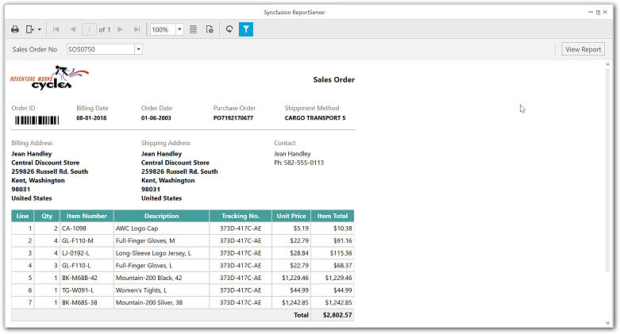

## Overview

A custom report item allows users to add functionality that's not natively supported in RDL or extend the functionality of existing controls in RDL standard. The run-time component allows to render custom report item in ReportViewer.

## Creating a custom report item run-time component

The custom report item run-time component is implemented using any CLS-compliant language, and is called by the report processor at run
time. The below section provides detail to create run time component for Barcode custom report item for Report Viewer or Report Server rendering.

### Create report item assembly

1.	Open the Visual Studio and select class library project type, name the project as "Syncfusion.Extensions.BarcodeCRI" for run-time component.
2.	Add the reference "Syncfusion.ReportControls.Wpf" for the extension project.
3.  Add a class "BarcodeCustomReportItem" by inheriting the `ICustomReportItem` interface.

>Note: Refer the above assemblies from the below installed location.
For report platform: %localappdata%\Syncfusion\ReportsSDK\Samples\Common\Assemblies and
For Essential Studio: C:\Program Files (x86)\Syncfusion\Essential Studio{{ site.releaseversion }}\Assemblies 

### Implementing the ICustomReportItem Interface

To create a CustomReportItem run-time component need to implement the `ICustomReportItem` interface, it generates following two method stubs.

Interface methods	|Definition
----------|----------
GenerateReportItemDefinition	|Called first and is used for setting definition properties and creating the Image object that will contain both the definition and instance properties that are used for rendering the item.
EvaluateReportItemInstance	|Called after the definition objects have been evaluated, and it provides the instance objects that will be used for rendering the item.


namespace Syncfusion.Extensions.BarcodeCRI
{
    public class BarcodeCustomReportItem : RDL.Data.ICustomReportItem
    {
        #region ICustomReportItem Members

        public void GenerateReportItemDefinition(CustomReportItem cri)
        {
            //It will create the Image object
            cri.CreateCriImageDefinition();
        }

        public void EvaluateReportItemInstance(CustomReportItem cri)
        {
            Thread thread = new Thread(delegate ()
            {
                RDL.Data.Image imageReportItem = (RDL.Data.Image)cri.GeneratedReportItem;
                imageReportItem.ImageData = DrawImage(cri);
            }, (1024 * 1024 * 64));

            thread.SetApartmentState(ApartmentState.STA);
            thread.Start();
            thread.Join();
        }

        #endregion

        //To create image from custom report item control
        private byte[] DrawImage(CustomReportItem customReportItem)
        {
            try
            {
                byte[] imageData = null;
                SfBarcode barcodeControl = new SfBarcode();
                barcodeControl.Background = new SolidColorBrush(Colors.Transparent);
                barcodeControl.Height = customReportItem.Height.ToPixels();
                barcodeControl.Width = customReportItem.Width.ToPixels();
                barcodeControl.Text = barcodeValue;
                barcodeControl.InvalidateArrange();
                barcodeControl.UpdateLayout();
                MemoryStream stream = new ImageConversion().CovertToImage(barcodeControl);
                imageData = new byte[(int)stream.Length];
                stream.Seek(0, SeekOrigin.Begin);
                stream.Read(imageData, 0, (int)stream.Length);
                return imageData;
            } 
            catch
            {
                return null;
            }
        }
    }
}


### Convert custom report item as image

The custom report item is rendered as image in report viewer, so that the run-time component need to be converted as an image. The following converter is used to generate the image for rendering.



internal partial class ImageConversion : UserControl
{
    Canvas InnerCanvas;

    public MemoryStream CovertToImage(Control innerControl)
    {
        try
        {
            this.InnerCanvas = new Canvas();
            this.Content = this.InnerCanvas;

            innerControl.Margin = new Thickness(0);
            InnerCanvas.Children.Add(innerControl);

            InnerCanvas.Width = innerControl.Width;
            InnerCanvas.Height = innerControl.Height;

            Canvas canvas = this.InnerCanvas;
            canvas.Measure(new Size((int)canvas.Width, (int)canvas.Height));
            canvas.Arrange(new Rect(new Size((int)canvas.Width, (int)canvas.Height)));

            int Height = ((int)(InnerCanvas.ActualHeight));
            int Width = ((int)(InnerCanvas.ActualWidth));

            this.Height = InnerCanvas.Height;
            this.Width = InnerCanvas.Width;
            InnerCanvas.LayoutTransform = null;

            Size size = new Size(InnerCanvas.ActualWidth, InnerCanvas.ActualHeight);

            InnerCanvas.Background = Brushes.White;
            InnerCanvas.Arrange(new Rect(size));
            InnerCanvas.UpdateLayout();

            RenderTargetBitmap rtb = new RenderTargetBitmap(Width, Height, 300, 300, PixelFormats.Default);
            rtb.Render(InnerCanvas);

            var Source = new MemoryStream();
            BitmapEncoder encoder = new BmpBitmapEncoder();
            encoder.Frames.Add(BitmapFrame.Create(rtb));
            encoder.Save(Source);
            return Source;
        }
        catch
        {
            return null;
        }
    }
}


#### Build project

You can clean and build the extension project, it will generate the run-time component assembly "Syncfusion.Extensions.BarcodeCRI.dll" in bin folder of the project. Copy the generated assembly to the installation location.

**For ReportDesigner:** (C:\Program Files (x86)\Syncfusion\Report Designer\ReportDesigner)

**For ReportServer:**  C:\Program Files (x86)\Syncfusion\Report Server\ReportServer.Web\bin

>Note: The installation path refers to the location where Syncfusion ReportDesigner, ReportServer were installed.

## Deploy a custom report item 

To deploy a custom report item, you must modify the application configuration files or create "ReportExtensions.config" file and copy the run-time component assembly (Syncfusion.Extensions.BarcodeCRI) and its dependent assemblies to the bin folder of your application. The deployment requires configuration to process the extensions, following describes about configuration settings.

We need to replace the newly created assembly and its dependent assemblies in the application bin folder. 

1.	Create "ReportExtensions.config" file in your application.
2.	The following "configSections" section is mandatory to process the extension inside the control, so add it as same as given in the below.


<configSections>
    <section name="ReportingExtensions" type="Syncfusion.Reporting.Extensions,  Syncfusion.ReportControls.WPF" allowLocation="true" allowDefinition="Everywhere" />
</configSections>


3.	We must add the tag `ReportItem` for all the newly added report item types. It has following attributes.

Attribute Name |	Description
---------|----------
Name	|Name of your report Item that going to display in list.
Assembly	|Name of the newly created report Item assembly.
Type	|Report Item class name with the namespace.


 <ReportingExtensions>
    <ReportItems>
      <ReportItem Name="Barcode" Assembly="Syncfusion.Extensions.BarcodeCRI" Type="Syncfusion.Extensions.BarcodeCRI.BarcodeCustomReportItem" />
    </ReportItems>
  </ReportingExtensions>
</configuration>


Once config file is created, add it to report viewer application. 

The following steps describes how to create standalone report viewer application. 

[Create Standalone ReportViewer application in WPF Platform](/wpf/reportviewer/getting-started)

Run the application, output with barcode custom report item is rendered as below. 

Shows invoice report rendered with barcode custom report item
   {:.caption}	

